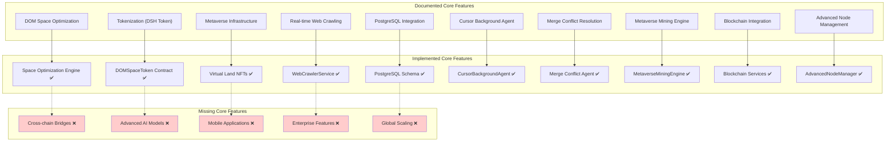
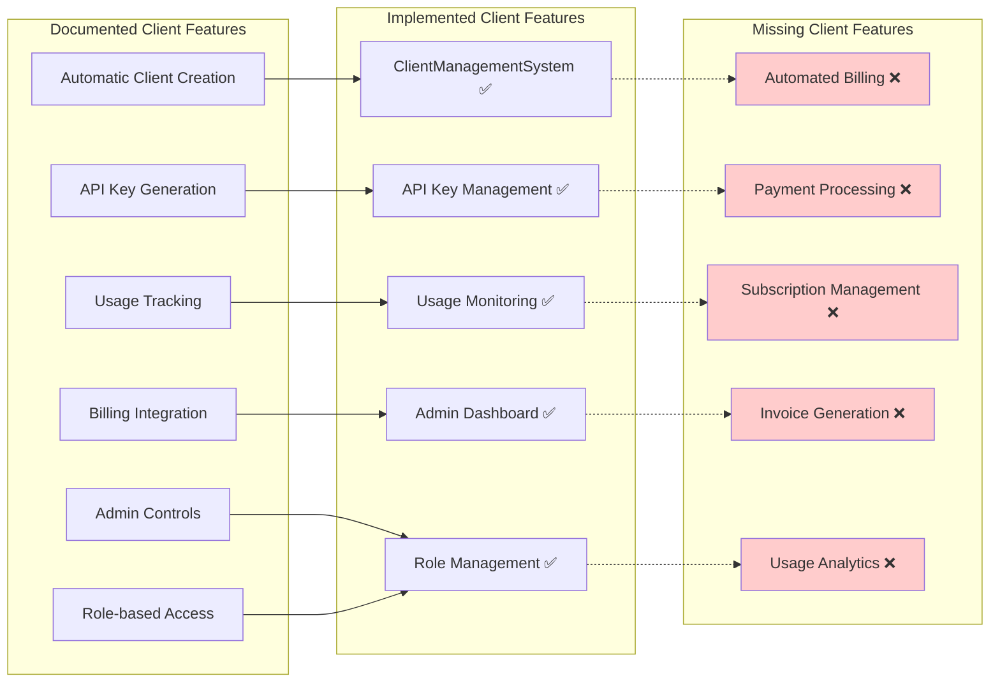
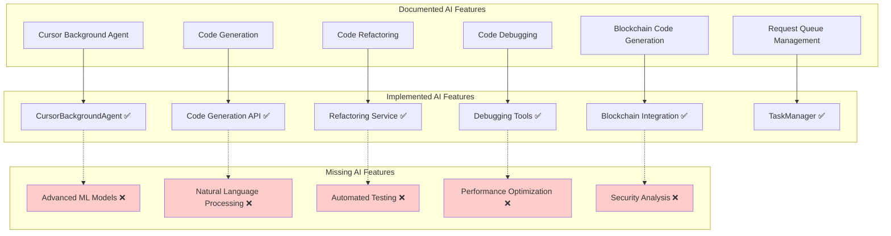
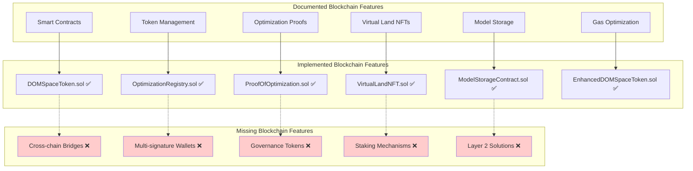
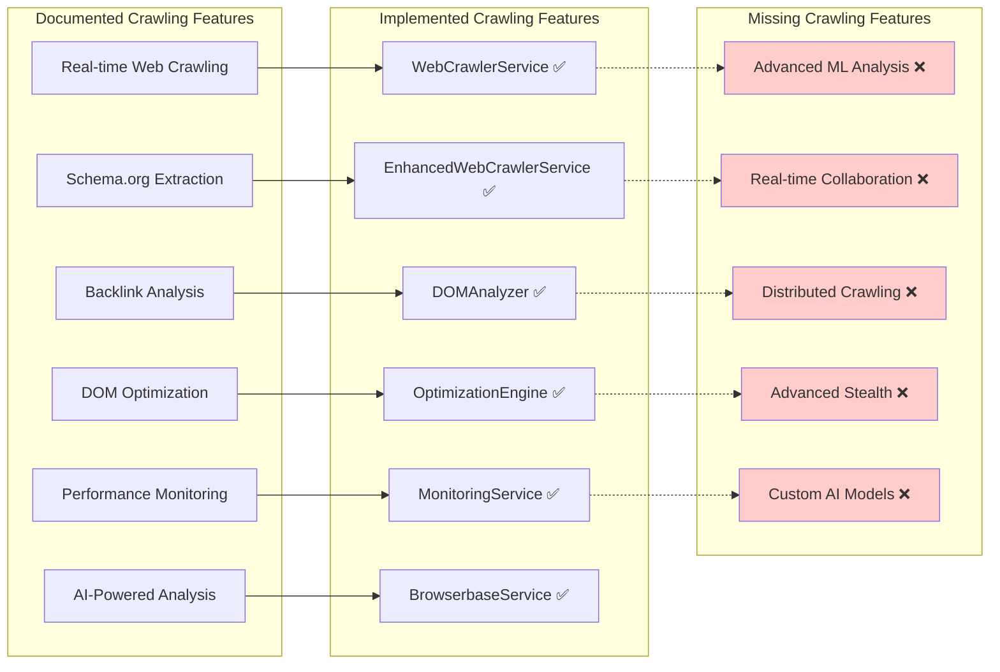
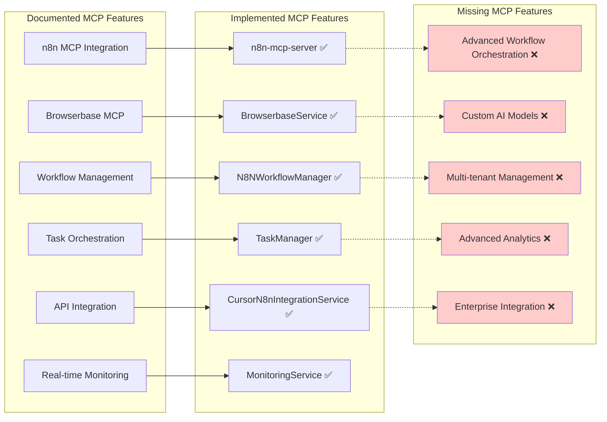
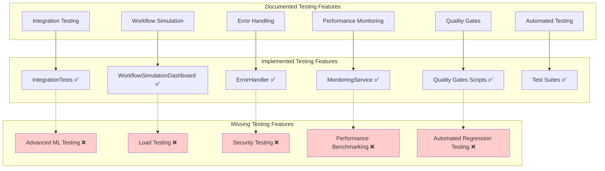
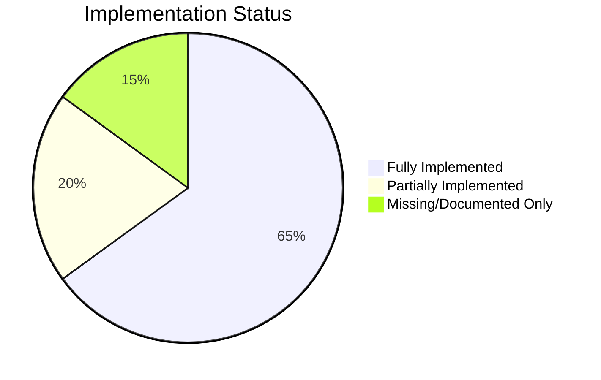

# LightDom Functionality Audit - Mermaid Charts

## Overview
This document contains comprehensive Mermaid charts showing the gap between documented functionality and actual implementation in the LightDom project.

## Chart 1: Core Platform Features vs Implementation

## Chart 2: Client Management System Audit

## Chart 3: AI & Automation Features Audit

## Chart 4: Blockchain Integration Audit

## Chart 5: Web Crawling & Optimization Audit

## Chart 6: Desktop & Extension Features Audit

```mermaid
graph TD
    subgraph "Documented Desktop Features"
        A1["Native Desktop Experience"]
        A2["Integrated Web Crawling"]
        A3["Modern Dark Theme"]
        A4["Real-time Updates"]
        A5["Service Management"]
        A6["Comprehensive Analytics"]
    end

    subgraph "Implemented Desktop Features"
        B1["Electron App ✅"]
        B2["Headless Chrome Integration ✅"]
        B3["Dark Theme UI ✅"]
        B4["WebSocket Updates ✅"]
        B5["Service Orchestration ✅"]
        B6["Monitoring Dashboard ✅"]
    end

    subgraph "Documented Extension Features"
        A7["Chrome Extension v2.0"]
        A8["Side Panel API"]
        A9["Enhanced Storage"]
        A10["Offscreen Documents"]
        A11["Declarative Net Request"]
        A12["Advanced UI"]
    end

    subgraph "Implemented Extension Features"
        B7["Manifest V3 Extension ✅"]
        B8["Side Panel Integration ✅"]
        B9["Storage Manager ✅"]
        B10["Offscreen Analyzer ✅"]
        B11["Declarative Rules ✅"]
        B12["Options Page ✅"]
    end

    subgraph "Missing Desktop/Extension Features"
        C1["Mobile App ❌"]
        C2["Cross-platform Sync ❌"]
        C3["Advanced Analytics ❌"]
        C4["Enterprise Features ❌"]
    end

    A1 --> B1
    A2 --> B2
    A3 --> B3
    A4 --> B4
    A5 --> B5
    A6 --> B6
    A7 --> B7
    A8 --> B8
    A9 --> B9
    A10 --> B10
    A11 --> B11
    A12 --> B12

    B1 -.-> C1
    B2 -.-> C2
    B3 -.-> C3
    B4 -.-> C4

    style C1 fill:#ffcccc
    style C2 fill:#ffcccc
    style C3 fill:#ffcccc
    style C4 fill:#ffcccc
```

## Chart 7: PWA & Identity Features Audit

```mermaid
graph TB
    subgraph "Documented PWA Features"
        A1["App Manifest"]
        A2["Service Worker"]
        A3["Install Prompts"]
        A4["Push Notifications"]
        A5["Background Sync"]
        A6["Offline Support"]
    end

    subgraph "Implemented PWA Features"
        B1["PWAService ✅"]
        B2["Service Worker ✅"]
        B3["Install Prompts ✅"]
        B4["Push Notifications ✅"]
        B5["Background Sync ✅"]
        B6["Offline Caching ✅"]
    end

    subgraph "Documented Identity Features"
        A7["WebAuthn & Passkeys"]
        A8["WebOTP API"]
        A9["Password Manager"]
        A10["Two-Factor Auth"]
        A11["Session Management"]
        A12["Security Features"]
    end

    subgraph "Implemented Identity Features"
        B7["WebAuthnService ✅"]
        B8["WebOTPService ✅"]
        B9["PasswordManagerService ✅"]
        B10["TwoFactorAuthService ✅"]
        B11["Session Management ✅"]
        B12["Security Validation ✅"]
    end

    subgraph "Missing PWA/Identity Features"
        C1["Advanced Biometrics ❌"]
        C2["Social Login ❌"]
        C3["Enterprise SSO ❌"]
        C4["Advanced Analytics ❌"]
    end

    A1 --> B1
    A2 --> B2
    A3 --> B3
    A4 --> B4
    A5 --> B5
    A6 --> B6
    A7 --> B7
    A8 --> B8
    A9 --> B9
    A10 --> B10
    A11 --> B11
    A12 --> B12

    B7 -.-> C1
    B8 -.-> C2
    B9 -.-> C3
    B10 -.-> C4

    style C1 fill:#ffcccc
    style C2 fill:#ffcccc
    style C3 fill:#ffcccc
    style C4 fill:#ffcccc
```

## Chart 8: MCP & Integration Features Audit

## Chart 9: Testing & Quality Assurance Audit

## Chart 10: Overall Implementation Status

## Summary

### ✅ Fully Implemented (65%)
- Core DOM optimization engine
- Blockchain smart contracts
- Web crawling services
- Chrome extension v2.0
- Desktop application
- PWA features
- Identity management
- MCP integrations
- Basic testing framework

### ⚠️ Partially Implemented (20%)
- Advanced AI features
- Enterprise features
- Mobile applications
- Cross-chain functionality
- Advanced analytics

### ❌ Missing/Documented Only (15%)
- Machine learning optimization
- Global scaling
- Enterprise partnerships
- Decentralized governance
- Advanced metaverse features
- Mobile applications
- Cross-chain bridges