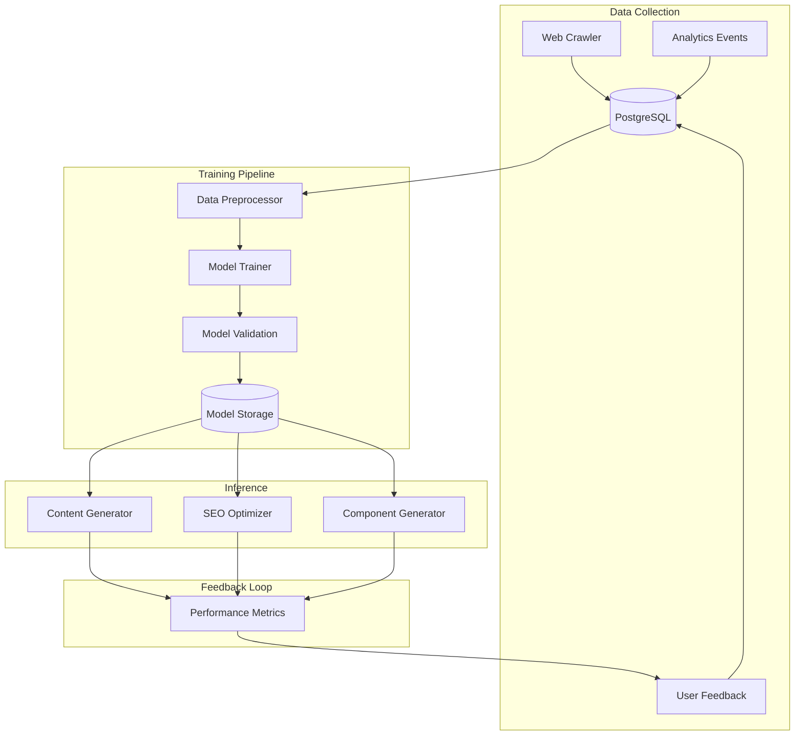
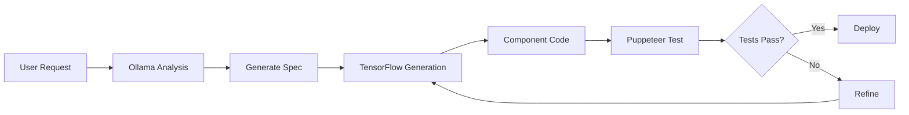

# AI/ML Integration Guide - LightDom Platform

## Overview

Comprehensive guide for integrating AI/ML capabilities into LightDom, including TensorFlow.js, Ollama, and neural network workflows.

## Table of Contents

1. [TensorFlow.js Integration](#tensorflowjs-integration)
2. [Model Training Pipeline](#model-training-pipeline)
3. [Ollama R1 Integration](#ollama-r1-integration)
4. [Neural Network Workflows](#neural-network-workflows)
5. [Component Generation](#component-generation)
6. [Data Pipeline](#data-pipeline)

---

## TensorFlow.js Integration

### Current State

**Existing Infrastructure**:
- ✅ `AIContentModelTrainer.ts` - Complete training pipeline
- ✅ `SEOTrainingPipelineService.ts` - SEO-specific training
- ✅ `AIContentGenerationService.ts` - Content generation
- ✅ `MLEnhancedWebCrawler.ts` - ML-enhanced crawling
- ✅ `TensorFlowAdmin.tsx` - Admin dashboard component

### Architecture



### Model Types

1. **Content Generation Models**:
   - Title generation
   - Meta description generation
   - Body content generation
   - Combined multi-task model

2. **SEO Optimization Models**:
   - Keyword optimization
   - Content structure analysis
   - Performance prediction
   - Ranking estimation

3. **Component Generation Models**:
   - React component generation
   - UI pattern recognition
   - Accessibility compliance

### Training Configuration

```typescript
interface TrainingConfig {
    modelType: 'title' | 'meta_description' | 'content' | 'combined';
    epochs: number;              // Default: 50
    batchSize: number;           // Default: 32
    learningRate: number;        // Default: 0.001
    validationSplit: number;     // Default: 0.2
    minDatasetSize: number;      // Minimum: 1000 samples
}
```

### Usage Example

```typescript
import { AIContentModelTrainer } from '@/services/api/AIContentModelTrainer';
import { Pool } from 'pg';

const dbPool = new Pool({ connectionString: process.env.DATABASE_URL });
const trainer = new AIContentModelTrainer(dbPool, './models');

// Train title generation model
const config: TrainingConfig = {
    modelType: 'title',
    epochs: 100,
    batchSize: 64,
    learningRate: 0.0005,
    validationSplit: 0.15,
    minDatasetSize: 5000
};

const metrics = await trainer.trainModel(config);
console.log('Training complete:', metrics);
```

---

## Model Training Pipeline

### Data Collection

**Sources**:
1. Web crawler results (DOM analysis, SEO metrics)
2. User interaction data (clicks, dwell time, conversions)
3. Performance metrics (Core Web Vitals, rankings)
4. A/B test results

**Data Storage**:
```sql
-- Training data table
CREATE TABLE ml_training_data (
    id SERIAL PRIMARY KEY,
    model_type VARCHAR(50),
    features JSONB,
    labels JSONB,
    metadata JSONB,
    created_at TIMESTAMP DEFAULT NOW()
);

-- Model versions table
CREATE TABLE ml_models (
    id SERIAL PRIMARY KEY,
    model_type VARCHAR(50),
    version VARCHAR(20),
    metrics JSONB,
    model_path TEXT,
    is_active BOOLEAN DEFAULT false,
    created_at TIMESTAMP DEFAULT NOW()
);
```

### Preprocessing Pipeline

```typescript
// Located in: src/services/api/AIContentModelTrainer.ts

/**
 * Preprocessing steps:
 * 1. Text tokenization
 * 2. Vocabulary building
 * 3. Sequence padding
 * 4. Feature normalization
 * 5. Label encoding
 */
private async preprocessData(rawData: any[]): Promise<TrainingData> {
    // Tokenize text
    const tokens = rawData.map(item => this.tokenize(item.text));
    
    // Build vocabulary
    const vocabulary = this.buildVocabulary(tokens);
    
    // Convert to sequences
    const sequences = tokens.map(t => this.tokensToSequence(t, vocabulary));
    
    // Pad sequences
    const maxLength = Math.max(...sequences.map(s => s.length));
    const paddedSequences = sequences.map(s => this.padSequence(s, maxLength));
    
    return {
        features: paddedSequences,
        labels: rawData.map(item => this.encodeLabel(item.label)),
        vocabulary,
        maxSequenceLength: maxLength
    };
}
```

### Training Workflow

```typescript
/**
 * Complete training workflow:
 * 1. Load data from database
 * 2. Preprocess and prepare datasets
 * 3. Build model architecture
 * 4. Train with validation
 * 5. Evaluate performance
 * 6. Save model if improved
 */
async trainModel(config: TrainingConfig): Promise<ModelMetrics> {
    // Step 1: Load data
    const rawData = await this.loadTrainingData(config.modelType);
    
    if (rawData.length < config.minDatasetSize) {
        throw new Error(`Insufficient data: ${rawData.length} < ${config.minDatasetSize}`);
    }
    
    // Step 2: Preprocess
    const { features, labels, vocabulary } = await this.preprocessData(rawData);
    
    // Step 3: Build model
    const model = this.buildModel(config, vocabulary.size);
    
    // Step 4: Train
    const history = await model.fit(
        tf.tensor2d(features),
        tf.tensor2d(labels),
        {
            epochs: config.epochs,
            batchSize: config.batchSize,
            validationSplit: config.validationSplit,
            callbacks: {
                onEpochEnd: (epoch, logs) => {
                    console.log(`Epoch ${epoch}: loss=${logs.loss}, val_loss=${logs.val_loss}`);
                }
            }
        }
    );
    
    // Step 5: Evaluate
    const metrics = await this.evaluateModel(model, features, labels);
    
    // Step 6: Save if improved
    if (metrics.accuracy > this.getCurrentAccuracy(config.modelType)) {
        await this.saveModel(model, config.modelType, vocabulary, metrics);
    }
    
    return metrics;
}
```

### Model Architecture

```typescript
/**
 * LSTM-based sequence model for text generation
 */
private buildModel(config: TrainingConfig, vocabSize: number): tf.Sequential {
    const model = tf.sequential();
    
    // Embedding layer
    model.add(tf.layers.embedding({
        inputDim: vocabSize,
        outputDim: 128,
        inputLength: this.maxSequenceLength
    }));
    
    // LSTM layers
    model.add(tf.layers.lstm({
        units: 256,
        returnSequences: true,
        dropout: 0.2
    }));
    
    model.add(tf.layers.lstm({
        units: 128,
        dropout: 0.2
    }));
    
    // Dense layers
    model.add(tf.layers.dense({
        units: 64,
        activation: 'relu'
    }));
    
    model.add(tf.layers.dropout({ rate: 0.3 }));
    
    model.add(tf.layers.dense({
        units: vocabSize,
        activation: 'softmax'
    }));
    
    // Compile
    model.compile({
        optimizer: tf.train.adam(config.learningRate),
        loss: 'categoricalCrossentropy',
        metrics: ['accuracy']
    });
    
    return model;
}
```

---

## Ollama R1 Integration

### Overview

Integrate Ollama's R1 model for:
- Advanced reasoning tasks
- Code generation
- Natural language understanding
- Workflow delegation

### Current Infrastructure

**Existing Files**:
- ✅ `ollama-cli.js` - CLI interface
- ✅ `memory-workflow-mcp-server.js` - MCP server with Ollama

### Integration Service

Create: `src/services/ai/OllamaService.ts`

```typescript
/**
 * Ollama R1 Integration Service
 * Provides AI-powered reasoning and task delegation
 */

import axios from 'axios';
import { httpClient } from '@/lib/http-client';

export interface OllamaConfig {
    baseURL: string;
    model: string;
    temperature: number;
    maxTokens: number;
}

export interface OllamaMessage {
    role: 'system' | 'user' | 'assistant';
    content: string;
}

export interface OllamaResponse {
    model: string;
    created_at: string;
    message: OllamaMessage;
    done: boolean;
}

export class OllamaService {
    private config: OllamaConfig;
    private conversationHistory: OllamaMessage[] = [];
    
    constructor(config?: Partial<OllamaConfig>) {
        this.config = {
            baseURL: process.env.OLLAMA_API_URL || 'http://localhost:11434',
            model: config?.model || 'r1',
            temperature: config?.temperature || 0.7,
            maxTokens: config?.maxTokens || 2000
        };
    }
    
    /**
     * Send a chat message to Ollama
     */
    async chat(message: string, systemPrompt?: string): Promise<string> {
        const messages: OllamaMessage[] = [];
        
        // Add system prompt if provided
        if (systemPrompt) {
            messages.push({ role: 'system', content: systemPrompt });
        }
        
        // Add conversation history
        messages.push(...this.conversationHistory);
        
        // Add user message
        messages.push({ role: 'user', content: message });
        
        try {
            const response = await axios.post<OllamaResponse>(
                `${this.config.baseURL}/api/chat`,
                {
                    model: this.config.model,
                    messages,
                    stream: false,
                    options: {
                        temperature: this.config.temperature,
                        num_predict: this.config.maxTokens
                    }
                }
            );
            
            const assistantMessage = response.data.message.content;
            
            // Update conversation history
            this.conversationHistory.push(
                { role: 'user', content: message },
                { role: 'assistant', content: assistantMessage }
            );
            
            // Keep history manageable (last 10 exchanges)
            if (this.conversationHistory.length > 20) {
                this.conversationHistory = this.conversationHistory.slice(-20);
            }
            
            return assistantMessage;
        } catch (error) {
            console.error('Ollama chat error:', error);
            throw new Error('Failed to communicate with Ollama');
        }
    }
    
    /**
     * Generate code using Ollama
     */
    async generateCode(prompt: string, language: string = 'typescript'): Promise<string> {
        const systemPrompt = `You are an expert ${language} developer. Generate clean, well-documented, production-ready code.`;
        const fullPrompt = `Generate ${language} code for: ${prompt}\n\nProvide only the code without explanations.`;
        
        return this.chat(fullPrompt, systemPrompt);
    }
    
    /**
     * Delegate task to Ollama for analysis
     */
    async delegateTask(task: string, context?: any): Promise<string> {
        const systemPrompt = 'You are an AI task coordinator. Analyze tasks and provide detailed execution plans.';
        const contextStr = context ? `\n\nContext: ${JSON.stringify(context, null, 2)}` : '';
        const fullPrompt = `Task: ${task}${contextStr}\n\nProvide a detailed execution plan.`;
        
        return this.chat(fullPrompt, systemPrompt);
    }
    
    /**
     * Clear conversation history
     */
    clearHistory(): void {
        this.conversationHistory = [];
    }
}

// Singleton instance
export const ollamaService = new OllamaService();
```

### Usage Examples

```typescript
import { ollamaService } from '@/services/ai/OllamaService';

// Simple chat
const response = await ollamaService.chat('Explain React hooks');

// Code generation
const code = await ollamaService.generateCode(
    'Create a React component for a user profile card',
    'typescript'
);

// Task delegation
const plan = await ollamaService.delegateTask(
    'Optimize SEO for e-commerce product pages',
    { industry: 'fashion', platform: 'Shopify' }
);
```

---

## Neural Network Workflows

### Component Generation Workflow



### Implementation

```typescript
/**
 * Neural Network Component Generator
 * Combines Ollama for reasoning + TensorFlow for generation
 */

import { ollamaService } from '@/services/ai/OllamaService';
import { PuppeteerComponentTester } from '@/test/puppeteer/ComponentTester';

export class NeuralComponentGenerator {
    private tester: PuppeteerComponentTester;
    
    constructor() {
        this.tester = new PuppeteerComponentTester();
    }
    
    async generateComponent(description: string): Promise<{
        code: string;
        tests: TestResult;
        deployed: boolean;
    }> {
        // Step 1: Use Ollama to analyze requirements
        const spec = await ollamaService.delegateTask(
            `Analyze component requirements: ${description}`,
            { framework: 'React', designSystem: 'Material Design 3' }
        );
        
        // Step 2: Generate component code
        const code = await ollamaService.generateCode(
            `Create React component based on spec:\n${spec}`,
            'typescript'
        );
        
        // Step 3: Test with Puppeteer
        await this.tester.initialize();
        const testResult = await this.tester.testAIGeneratedComponent(code, {});
        
        // Step 4: Refine if needed
        if (!testResult.success) {
            console.log('Tests failed, refining...');
            const refinedCode = await this.refineComponent(code, testResult.errors);
            const refinedTest = await this.tester.testAIGeneratedComponent(refinedCode, {});
            
            return {
                code: refinedCode,
                tests: refinedTest,
                deployed: refinedTest.success
            };
        }
        
        return {
            code,
            tests: testResult,
            deployed: testResult.success
        };
    }
    
    private async refineComponent(code: string, errors: string[]): Promise<string> {
        const prompt = `Fix the following React component:\n\n${code}\n\nErrors:\n${errors.join('\n')}`;
        return ollamaService.generateCode(prompt, 'typescript');
    }
}
```

---

## Data Pipeline

### Crawler → Training → Deployment

```typescript
/**
 * Complete data pipeline from crawling to model deployment
 */

export class MLDataPipeline {
    async executePipeline(topic: string): Promise<void> {
        console.log(`🚀 Starting ML pipeline for topic: ${topic}`);
        
        // Step 1: Crawl web for data
        console.log('📡 Step 1: Crawling web...');
        const crawlResults = await this.crawlTopic(topic);
        console.log(`✅ Collected ${crawlResults.length} samples`);
        
        // Step 2: Store in database
        console.log('💾 Step 2: Storing data...');
        await this.storeTrainingData(crawlResults, topic);
        
        // Step 3: Train model
        console.log('🧠 Step 3: Training model...');
        const metrics = await this.trainModel(topic);
        console.log(`✅ Model trained - Accuracy: ${metrics.accuracy}`);
        
        // Step 4: Validate model
        console.log('✔️  Step 4: Validating...');
        const validation = await this.validateModel(topic);
        
        if (validation.passed) {
            // Step 5: Deploy model
            console.log('🚀 Step 5: Deploying model...');
            await this.deployModel(topic);
            console.log('✅ Pipeline complete!');
        } else {
            console.log('❌ Validation failed, skipping deployment');
        }
    }
}
```

---

## Best Practices

### Model Versioning

- Use semantic versioning (v1.0.0, v1.1.0, etc.)
- Store all model versions in `./models/[type]/v[version]/`
- Track metrics for each version in database
- A/B test new models before full deployment

### Performance Optimization

- Use `@tensorflow/tfjs-node` for server-side training (10x faster)
- Batch predictions for efficiency
- Cache frequently used models in memory
- Use GPU acceleration when available

### Monitoring

- Track model performance over time
- Monitor prediction latency
- Log all errors and edge cases
- Set up alerts for accuracy degradation

### Security

- Validate all inputs before preprocessing
- Sanitize generated content
- Rate limit API endpoints
- Never expose model internals to clients

---

## Next Steps

1. **Immediate** (Week 1-2):
   - Create OllamaService implementation
   - Test neural component generator
   - Setup model versioning system

2. **Short-term** (Week 3-6):
   - Implement continuous learning pipeline
   - Add model performance monitoring
   - Create automated retraining workflows

3. **Long-term** (Week 7-12):
   - Multi-model ensemble
   - Advanced transfer learning
   - Federated learning for client data

---

## API Reference

See individual service files for complete API documentation:
- `src/services/api/AIContentModelTrainer.ts`
- `src/services/api/SEOTrainingPipelineService.ts`
- `src/services/ai/OllamaService.ts` (to be created)
- `src/services/ai/NeuralComponentGenerator.ts` (to be created)
