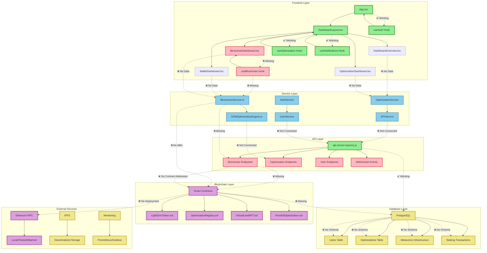

# LightDom Blockchain Application - Architecture & Integration Status

## Current Architecture Overview

## Integration Status

### ✅ **Working Components**
- Basic authentication system
- Dashboard layout and navigation
- API server structure
- Database connection

### ❌ **Missing Connections**

#### 1. **Blockchain Integration**
- `BlockchainDashboard.tsx` not connected to `BlockchainService.ts`
- `useBlockchain` hook not implemented
- Contract ABIs not loaded
- Contract addresses not configured

#### 2. **API Endpoints**
- Blockchain endpoints not implemented in API server
- Optimization endpoints not connected
- User endpoints not connected to blockchain data

#### 3. **Database Schema**
- Blockchain schema not applied
- User table not connected to wallet addresses
- Optimization tracking not implemented

#### 4. **Service Layer**
- `BlockchainService.ts` not initialized in app
- `DOMOptimizationEngine.ts` not connected to UI
- Missing service providers

## Implementation Plan

### Phase 1: Core Blockchain Integration
1. Create `useBlockchain` hook
2. Initialize `BlockchainService` in app
3. Connect `BlockchainDashboard` to service
4. Add blockchain routes to App.tsx

### Phase 2: API Integration
1. Implement blockchain endpoints in API server
2. Connect frontend to API endpoints
3. Add WebSocket events for real-time updates

### Phase 3: Database Integration
1. Apply blockchain schema
2. Connect user authentication to wallet addresses
3. Implement optimization tracking

### Phase 4: Smart Contract Integration
1. Deploy contracts
2. Load contract ABIs
3. Connect service to deployed contracts

## Next Steps

1. **Create useBlockchain hook**
2. **Initialize BlockchainService in App.tsx**
3. **Add blockchain route to App.tsx**
4. **Implement API endpoints**
5. **Connect database schema**
6. **Deploy and connect smart contracts**