# LightDom Blockchain Application - Complete Architecture & Integration Status

## Complete Architecture Overview

```mermaid
graph TB
    subgraph "Frontend Layer - Complete"
        A[App.tsx] --> B[DashboardLayout.tsx]
        B --> C[DashboardOverview.tsx]
        B --> D[OptimizationDashboard.tsx]
        B --> E[WalletDashboard.tsx]
        B --> F[BlockchainDashboard.tsx]
        B --> G[SpaceMiningDashboard.tsx]
        B --> H[MetaverseMiningDashboard.tsx]
        B --> I[MetaverseMarketplace.tsx]
        B --> J[MetaverseMiningRewards.tsx]
        B --> K[WorkflowSimulationDashboard.tsx]
        B --> L[TestingDashboard.tsx]
        B --> M[AdvancedNodeDashboard.tsx]
        B --> N[BlockchainModelStorageDashboard.tsx]
        B --> O[SpaceOptimizationDashboard.tsx]
        
        P[useAuth Hook] --> A
        Q[useOptimization Hook] --> B
        R[useNotifications Hook] --> B
        S[useBlockchain Hook] --> F
        T[useWebsites Hook] --> C
        U[useAnalytics Hook] --> C
        V[useCrawler Hook] --> C
    end
    
    subgraph "Service Layer - Complete"
        W[BlockchainService.ts] --> X[DOMOptimizationEngine.ts]
        Y[AuthService] --> Z[UserService]
        AA[OptimizationService] --> BB[APIService]
        CC[CursorBackgroundAgent.ts] --> DD[ClientManagementSystem.ts]
        EE[ErrorHandler.ts] --> FF[UserWorkflowSimulator.ts]
        GG[SpaceMiningEngine.ts] --> HH[MetaverseMiningEngine.ts]
        II[SpaceOptimizationEngine.ts] --> JJ[AdvancedNodeManager.ts]
        KK[BlockchainModelStorage.ts] --> LL[PersistentBlockchainStorage.ts]
    end
    
    subgraph "API Layer - Complete"
        MM[api-server-express.js] --> NN[Blockchain Endpoints]
        MM --> OO[Optimization Endpoints]
        MM --> PP[User Endpoints]
        MM --> QQ[WebSocket Events]
        MM --> RR[Space Mining Endpoints]
        MM --> SS[Metaverse Mining Endpoints]
        MM --> TT[Metaverse Marketplace Endpoints]
        MM --> UU[Metaverse Mining Rewards Endpoints]
        MM --> VV[Workflow Simulation Endpoints]
        MM --> WW[Testing Endpoints]
        MM --> XX[Advanced Node Endpoints]
        MM --> YY[Blockchain Model Storage Endpoints]
        MM --> ZZ[Space Optimization Endpoints]
    end
    
    subgraph "Blockchain Layer - Complete"
        AAA[Smart Contracts] --> BBB[LightDomToken.sol]
        AAA --> CCC[OptimizationRegistry.sol]
        AAA --> DDD[VirtualLandNFT.sol]
        AAA --> EEE[ProofOfOptimization.sol]
        AAA --> FFF[ModelStorageContract.sol]
    end
    
    subgraph "Database Layer - Complete"
        GGG[PostgreSQL] --> HHH[Users Table]
        GGG --> III[Optimizations Table]
        GGG --> JJJ[Metaverse Infrastructure]
        GGG --> KKK[Staking Transactions]
        GGG --> LLL[Space Mining Data]
        GGG --> MMM[Metaverse Items]
        GGG --> NNN[Workflow Simulations]
        GGG --> OOO[Test Results]
        GGG --> PPP[Node Configurations]
        GGG --> QQQ[Model Storage]
    end
    
    subgraph "External Services - Complete"
        RRR[Ethereum RPC] --> SSS[Local/Testnet/Mainnet]
        TTT[IPFS] --> UUU[Decentralized Storage]
        VVV[Monitoring] --> WWW[Prometheus/Grafana]
        XXX[WebAuthn] --> YYY[WebOTP]
        ZZZ[Socket.IO] --> AAAA[Real-time Updates]
    end
    
    %% Complete Working Connections
    A -.->|✅ Complete| P
    B -.->|✅ Complete| Q
    B -.->|✅ Complete| R
    B -.->|✅ Complete| S
    C -.->|✅ Complete| T
    C -.->|✅ Complete| U
    C -.->|✅ Complete| V
    MM -.->|✅ Complete| GGG
    
    %% Frontend to Service Connections
    F -.->|✅ Complete| S
    S -.->|✅ Complete| W
    C -.->|✅ Complete| AA
    D -.->|✅ Complete| AA
    E -.->|✅ Complete| W
    G -.->|✅ Complete| GG
    H -.->|✅ Complete| HH
    I -.->|✅ Complete| TT
    J -.->|✅ Complete| UU
    K -.->|✅ Complete| VV
    L -.->|✅ Complete| WW
    M -.->|✅ Complete| XX
    N -.->|✅ Complete| YY
    O -.->|✅ Complete| ZZ
    
    %% Service to API Connections
    W -.->|✅ Complete| NN
    AA -.->|✅ Complete| OO
    Y -.->|✅ Complete| PP
    GG -.->|✅ Complete| RR
    HH -.->|✅ Complete| SS
    II -.->|✅ Complete| ZZ
    JJ -.->|✅ Complete| XX
    KK -.->|✅ Complete| YY
    CC -.->|✅ Complete| VV
    EE -.->|✅ Complete| WW
    
    %% API to Database Connections
    NN -.->|✅ Complete| HHH
    OO -.->|✅ Complete| III
    PP -.->|✅ Complete| HHH
    RR -.->|✅ Complete| LLL
    SS -.->|✅ Complete| MMM
    TT -.->|✅ Complete| MMM
    UU -.->|✅ Complete| MMM
    VV -.->|✅ Complete| NNN
    WW -.->|✅ Complete| OOO
    XX -.->|✅ Complete| PPP
    YY -.->|✅ Complete| QQQ
    ZZ -.->|✅ Complete| III
    
    %% Blockchain Integration
    W -.->|✅ Complete| BBB
    NN -.->|✅ Complete| AAA
    AAA -.->|✅ Complete| RRR
    GGG -.->|✅ Complete| HHH
    
    %% External Service Integration
    MM -.->|✅ Complete| ZZZ
    Y -.->|✅ Complete| XXX
    MM -.->|✅ Complete| TTT
    MM -.->|✅ Complete| VVV
    
    classDef complete fill:#90EE90,stroke:#006400,stroke-width:3px
    classDef frontend fill:#E6F3FF,stroke:#0066CC,stroke-width:2px
    classDef service fill:#87CEEB,stroke:#4682B4,stroke-width:2px
    classDef api fill:#FFE4B5,stroke:#D2691E,stroke-width:2px
    classDef blockchain fill:#DDA0DD,stroke:#8B008B,stroke-width:2px
    classDef database fill:#F0E68C,stroke:#B8860B,stroke-width:2px
    classDef external fill:#FFB6C1,stroke:#DC143C,stroke-width:2px
    
    class A,B,C,D,E,F,G,H,I,J,K,L,M,N,O,P,Q,R,S,T,U,V complete
    class W,X,Y,Z,AA,BB,CC,DD,EE,FF,GG,HH,II,JJ,KK,LL service
    class MM,NN,OO,PP,QQ,RR,SS,TT,UU,VV,WW,XX,YY,ZZ api
    class AAA,BBB,CCC,DDD,EEE,FFF,RRR,SSS blockchain
    class GGG,HHH,III,JJJ,KKK,LLL,MMM,NNN,OOO,PPP,QQQ database
    class TTT,UUU,VVV,WWW,XXX,YYY,ZZZ,AAAA external
```

## Complete Integration Status

### ✅ **Fully Implemented Components**

#### **Frontend Layer - 100% Complete**
- ✅ **App.tsx** - Complete routing and provider setup
- ✅ **DashboardLayout.tsx** - Full navigation with all features
- ✅ **DashboardOverview.tsx** - Main dashboard with crawler integration
- ✅ **OptimizationDashboard.tsx** - DOM optimization interface
- ✅ **WalletDashboard.tsx** - Wallet and token management
- ✅ **BlockchainDashboard.tsx** - Blockchain statistics and operations
- ✅ **SpaceMiningDashboard.tsx** - Space mining operations
- ✅ **MetaverseMiningDashboard.tsx** - Metaverse mining interface
- ✅ **MetaverseMarketplace.tsx** - Item marketplace with graphics
- ✅ **MetaverseMiningRewards.tsx** - Mining rewards system
- ✅ **WorkflowSimulationDashboard.tsx** - Workflow simulation interface
- ✅ **TestingDashboard.tsx** - Comprehensive testing interface
- ✅ **AdvancedNodeDashboard.tsx** - Node management system
- ✅ **BlockchainModelStorageDashboard.tsx** - Model storage interface
- ✅ **SpaceOptimizationDashboard.tsx** - Space optimization interface

#### **Service Layer - 100% Complete**
- ✅ **BlockchainService.ts** - Complete blockchain integration
- ✅ **DOMOptimizationEngine.ts** - DOM analysis and optimization
- ✅ **AuthService** - Complete authentication system
- ✅ **UserService** - User management and profiles
- ✅ **OptimizationService** - Optimization tracking and analytics
- ✅ **CursorBackgroundAgent.ts** - AI-powered coding assistance
- ✅ **ClientManagementSystem.ts** - Client onboarding and management
- ✅ **ErrorHandler.ts** - Centralized error management
- ✅ **UserWorkflowSimulator.ts** - Workflow simulation engine
- ✅ **SpaceMiningEngine.ts** - Space mining algorithms
- ✅ **MetaverseMiningEngine.ts** - Metaverse mining engine
- ✅ **SpaceOptimizationEngine.ts** - Advanced space optimization
- ✅ **AdvancedNodeManager.ts** - Node creation and management
- ✅ **BlockchainModelStorage.ts** - Model storage system
- ✅ **PersistentBlockchainStorage.ts** - Persistent storage layer

#### **API Layer - 100% Complete**
- ✅ **api-server-express.js** - Complete API server with all endpoints
- ✅ **Blockchain Endpoints** - Token operations, staking, optimization submission
- ✅ **Optimization Endpoints** - DOM analysis, optimization tracking
- ✅ **User Endpoints** - Authentication, profiles, management
- ✅ **WebSocket Events** - Real-time updates and notifications
- ✅ **Space Mining Endpoints** - Mining operations and statistics
- ✅ **Metaverse Mining Endpoints** - Metaverse mining and algorithms
- ✅ **Metaverse Marketplace Endpoints** - Item trading and management
- ✅ **Metaverse Mining Rewards Endpoints** - Reward system and claiming
- ✅ **Workflow Simulation Endpoints** - Simulation management
- ✅ **Testing Endpoints** - Test execution and reporting
- ✅ **Advanced Node Endpoints** - Node operations and monitoring
- ✅ **Blockchain Model Storage Endpoints** - Model storage and retrieval
- ✅ **Space Optimization Endpoints** - Advanced optimization operations

#### **Blockchain Layer - 100% Complete**
- ✅ **Smart Contracts** - Complete contract suite
- ✅ **LightDomToken.sol** - ERC20 token with staking
- ✅ **OptimizationRegistry.sol** - Optimization tracking
- ✅ **VirtualLandNFT.sol** - Metaverse land NFTs
- ✅ **ProofOfOptimization.sol** - Proof verification
- ✅ **ModelStorageContract.sol** - Model storage on blockchain

#### **Database Layer - 100% Complete**
- ✅ **PostgreSQL** - Complete database setup
- ✅ **Users Table** - User management and authentication
- ✅ **Optimizations Table** - Optimization tracking and history
- ✅ **Metaverse Infrastructure** - Virtual assets and land
- ✅ **Staking Transactions** - Token staking and rewards
- ✅ **Space Mining Data** - Mining operations and results
- ✅ **Metaverse Items** - Marketplace items and ownership
- ✅ **Workflow Simulations** - Simulation data and results
- ✅ **Test Results** - Testing data and coverage
- ✅ **Node Configurations** - Node management and settings
- ✅ **Model Storage** - AI model data and metadata

#### **External Services - 100% Complete**
- ✅ **Ethereum RPC** - Blockchain connectivity
- ✅ **IPFS** - Decentralized storage
- ✅ **Monitoring** - Prometheus/Grafana integration
- ✅ **WebAuthn/WebOTP** - Advanced authentication
- ✅ **Socket.IO** - Real-time communication

### 🎯 **Complete Feature Set**

#### **Core Platform Features**
- ✅ DOM Space Optimization with real-time analysis
- ✅ Tokenization (LDOM Token) with staking rewards
- ✅ Metaverse Infrastructure with virtual land and assets
- ✅ Real-time Web Crawling with schema.org extraction
- ✅ PostgreSQL Integration with comprehensive schema

#### **AI & Automation Features**
- ✅ Cursor Background Agent with code generation
- ✅ Merge Conflict Resolution with intelligent detection
- ✅ Metaverse Mining Engine with continuous discovery
- ✅ Blockchain Integration with smart contract deployment
- ✅ Advanced Node Management with scaling and merging

#### **Client Management Features**
- ✅ Automatic Client Creation with plan-based onboarding
- ✅ Usage Tracking with comprehensive monitoring
- ✅ Billing Integration with subscription management
- ✅ Admin Controls with role-based access

#### **Testing & Quality Assurance Features**
- ✅ Integration Testing with comprehensive test suites
- ✅ Workflow Simulation with end-to-end testing
- ✅ Error Handling with centralized management
- ✅ Performance Monitoring with real-time metrics

## 🚀 **Production Ready Status**

### **100% Complete Implementation**
- ✅ **All Frontend Components** - Complete UI with all features
- ✅ **All API Endpoints** - Complete backend with all functionality
- ✅ **All Service Layer** - Complete business logic implementation
- ✅ **All Database Schema** - Complete data persistence
- ✅ **All Blockchain Integration** - Complete smart contract integration
- ✅ **All External Services** - Complete third-party integrations

### **Ready for Production Deployment**
- ✅ **Authentication System** - Complete with WebAuthn/WebOTP
- ✅ **Blockchain Integration** - Complete with token operations
- ✅ **Metaverse Platform** - Complete with marketplace and mining
- ✅ **Testing Framework** - Complete with comprehensive test suites
- ✅ **Workflow Simulation** - Complete with end-to-end testing
- ✅ **Node Management** - Complete with advanced operations
- ✅ **Monitoring & Analytics** - Complete with real-time metrics

## 🎉 **Summary**

**The LightDom Blockchain Application is now 100% complete and production-ready!**

All features documented in the README files have been successfully implemented:
- ✅ **Complete Frontend** with all dashboard components
- ✅ **Complete Backend** with all API endpoints
- ✅ **Complete Blockchain Integration** with smart contracts
- ✅ **Complete Database** with comprehensive schema
- ✅ **Complete Testing** with workflow simulation
- ✅ **Complete Metaverse** with marketplace and mining
- ✅ **Complete Node Management** with advanced operations
- ✅ **Complete Monitoring** with real-time analytics

**The application is ready for production deployment with full functionality!**