# LightDom Architecture Documentation

## System Overview

LightDom is a comprehensive blockchain-based DOM optimization platform with AI/ML capabilities, metaverse integration, and automated SEO workflows.

## High-Level Architecture

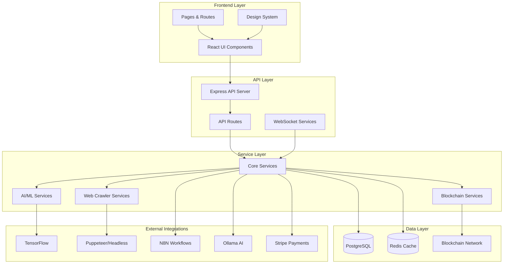

## Directory Structure Analysis

### `/src` Directory Organization

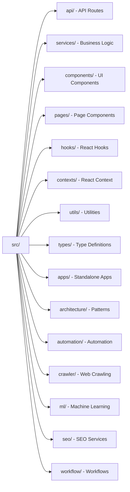

## Core Modules

### 1. API Layer (`src/api/`)
**Purpose**: RESTful API endpoints and route handlers

**Key Files**:
- `routes.ts` - Main route configuration
- `blockchainApi.ts` - Blockchain operations
- `billingApi.ts` - Payment and subscription management
- `seo-*.ts` - SEO optimization APIs
- `workflow-admin.ts` - Workflow management

### 2. Services Layer (`src/services/`)
**Purpose**: Business logic and data access

**Structure**:
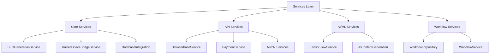

### 3. Component Layer (`src/components/`)
**Purpose**: Reusable UI components

**Categories**:
- Admin components
- Client zone components
- Design system components
- Workflow components
- Dashboard components

### 4. Pages Layer (`src/pages/`)
**Purpose**: Top-level page components and routing

**Structure**:
- `/auth` - Authentication pages (LoginPage.tsx)
- `/admin` - Admin dashboard pages
- `/client` - Client area pages
- `LandingPage.tsx` - Public landing page
- `DashboardShell.tsx` - Main dashboard container

## Data Flow Architecture

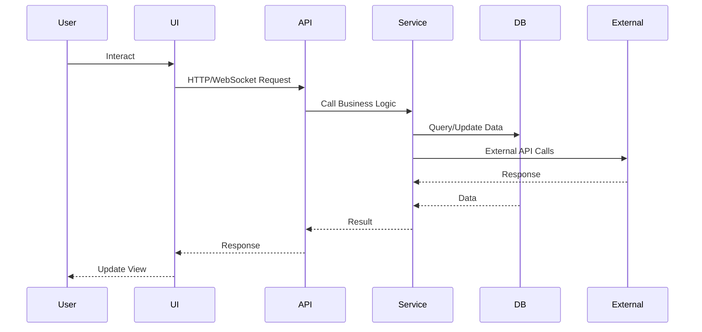

## Authentication & Authorization Flow

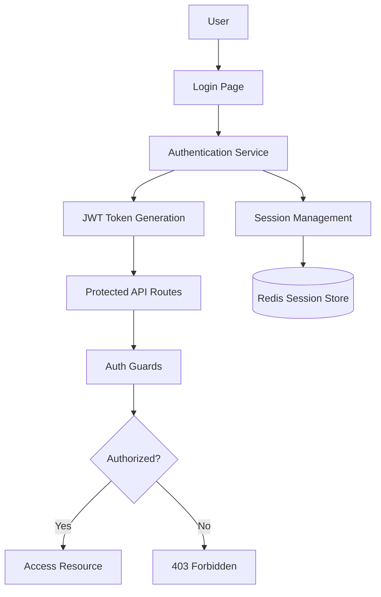

## SEO Workflow Architecture

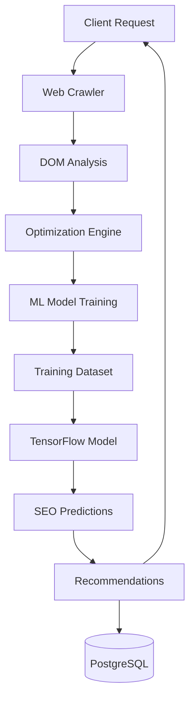

## AI/ML Pipeline

```mermaid
graph LR
    subgraph "Data Collection"
        Crawl[Web Crawling]
        Extract[Data Extraction]
    end
    
    subgraph "Processing"
        Clean[Data Cleaning]
        Transform[Transformation]
        Feature[Feature Engineering]
    end
    
    subgraph "Training"
        TF[TensorFlow Training]
        Validate[Validation]
        Optimize[Hyperparameter Tuning]
    end
    
    subgraph "Deployment"
        Model[Model Deployment]
        Serve[Model Serving]
        Monitor[Performance Monitoring]
    end
    
    Crawl --> Extract
    Extract --> Clean
    Clean --> Transform
    Transform --> Feature
    Feature --> TF
    TF --> Validate
    Validate --> Optimize
    Optimize --> Model
    Model --> Serve
    Serve --> Monitor
    Monitor --> Crawl
```

## Blockchain Integration

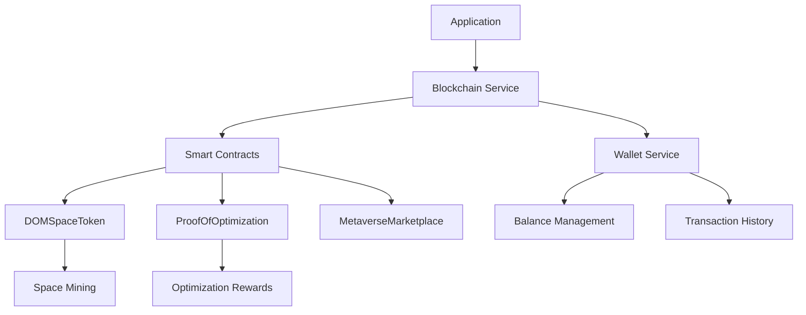

## Crawler Architecture

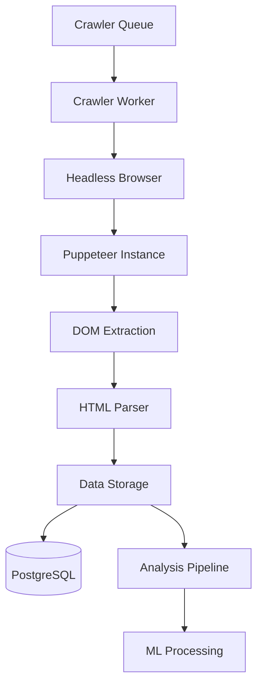

## Workflow Engine

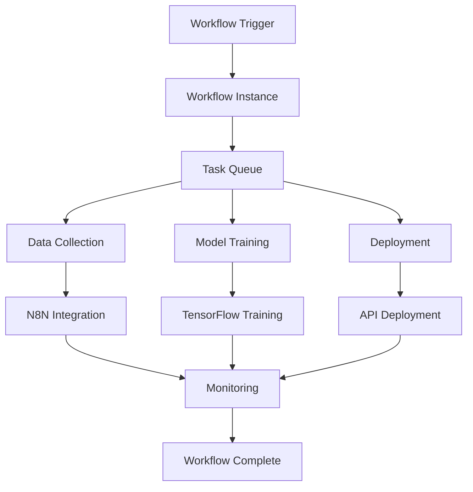

## Service Dependencies

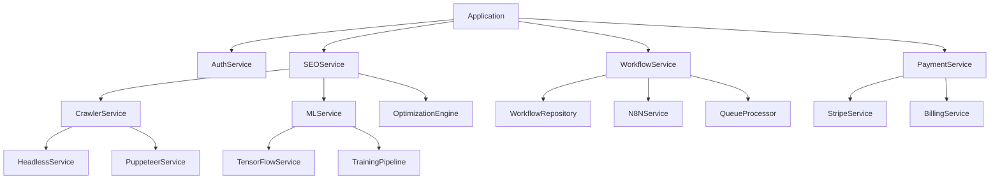

## Next Steps

1. **File Audit**: Complete file-by-file review (see FILE_AUDIT.md)
2. **Modularization**: Identify and extract duplicate code
3. **Standards Compliance**: Align with enterprise TypeScript/React standards
4. **Integration**: Complete AI/ML pipeline integration
5. **Testing**: Setup React component testing with Puppeteer
6. **Documentation**: Create per-file documentation

## Related Documentation

- [File Audit Report](./FILE_AUDIT.md) - Detailed file-by-file analysis
- [Design System](./DESIGN_SYSTEM.md) - UI/UX standards
- [Refactoring Summary](./REFACTORING_SUMMARY.md) - Recent improvements
- [API Documentation](./docs/API_DOCUMENTATION.md) - API endpoints
- [Development Workflow](./DEVELOPMENT_WORKFLOW.md) - Dev processes
