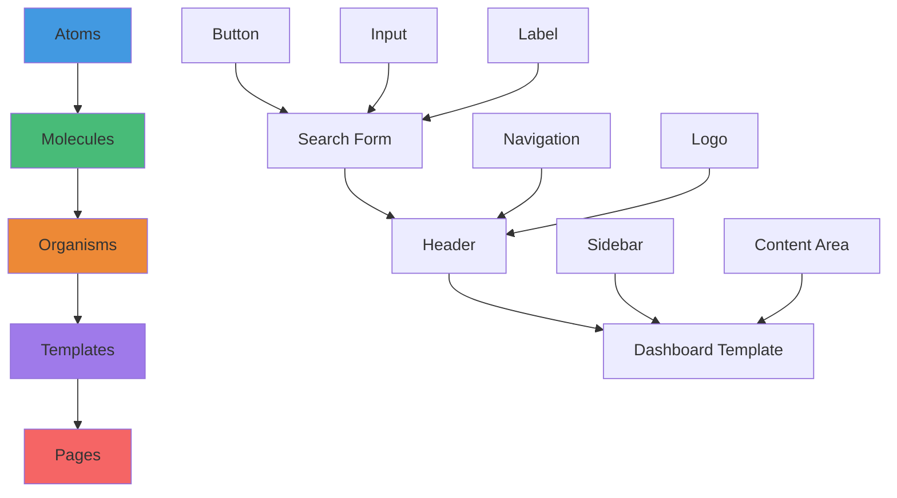
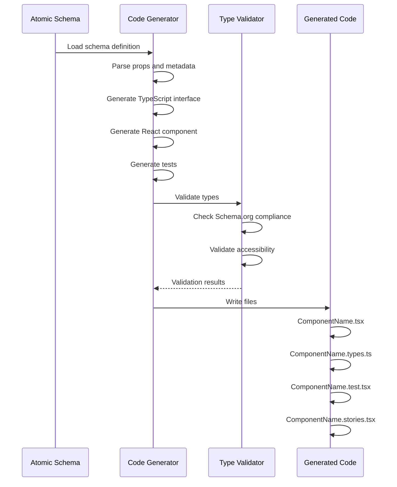

# Atomic Component Schemas - Design System Foundation
## Building Blocks for AI-Powered Component Generation

**Date:** November 2, 2024  
**Version:** 1.0  
**Related:** COMPREHENSIVE_SCHEMA_RESEARCH.md, SCHEMA_IMPLEMENTATION_EXAMPLES.md

---

## Table of Contents

1. [Introduction](#introduction)
2. [Atomic Design Principles](#atomic-design-principles)
3. [LightDom Schema Format](#lightdom-schema-format)
4. [Core Atomic Components](#core-atomic-components)
5. [Component Generation Pipeline](#component-generation-pipeline)
6. [AI/ML Integration](#aiml-integration)
7. [Implementation Guide](#implementation-guide)
8. [Best Practices](#best-practices)

---

## Introduction

Atomic component schemas provide machine-readable blueprints for the fundamental building blocks of user interfaces. By defining atomic components (atoms) with rich semantic metadata, we enable:

- **AI-powered component generation** - LLMs can compose complex UIs from atomic building blocks
- **Type-safe development** - Automatic TypeScript type generation from schemas
- **Consistency** - Shared design language across the entire application
- **Reusability** - Components defined once, used everywhere
- **Discoverability** - Semantic search and recommendation of components

### Why Atomic Components?

Atomic Design, introduced by Brad Frost, breaks interfaces into hierarchical levels:

```
Atoms → Molecules → Organisms → Templates → Pages
```

**Atoms** are the foundational UI elements:
- Buttons
- Input fields
- Labels
- Icons
- Typography elements

By creating schemas for these atoms, we provide a foundation for:
1. Automatic generation of higher-level components
2. AI understanding of UI composition
3. Validation of design system compliance
4. Automated documentation generation

---

## Atomic Design Principles

### The Atomic Design Hierarchy



### Atomic Component Characteristics

**Atoms must be:**
1. **Indivisible** - Cannot be broken down further without losing meaning
2. **Reusable** - Used across multiple contexts
3. **Composable** - Can combine to form molecules
4. **Self-contained** - No dependencies on other atoms
5. **Well-defined** - Clear purpose and behavior

**Examples:**

✅ **Good Atoms:**
- Button
- Input field
- Checkbox
- Icon
- Text label
- Avatar image

❌ **Not Atoms (Molecules):**
- Search bar (Input + Button + Icon)
- Form group (Label + Input + Error message)
- Card header (Title + Subtitle + Icon)

---

## LightDom Schema Format

### Extended JSON-LD Schema

LightDom uses an extended JSON-LD format that combines Schema.org with custom properties for UI components.

**Base Structure:**

```json
{
  "@context": "https://schema.org",
  "@type": "WebComponent",
  "@id": "lightdom:component-name",
  "name": "ComponentName",
  "description": "Component description",
  
  "lightdom:componentType": "atom",
  "lightdom:reactComponent": "ComponentName",
  "lightdom:category": "input|button|display|feedback|layout",
  "lightdom:priority": 1-5,
  
  "lightdom:props": [...],
  "lightdom:linkedSchemas": [...],
  "lightdom:useCase": [...],
  "lightdom:semanticMeaning": "...",
  "lightdom:accessibility": {...}
}
```

### Property Definitions

#### Core Properties

| Property | Type | Description |
|----------|------|-------------|
| `@context` | URI | JSON-LD context (Schema.org) |
| `@type` | String | Schema.org type (WebComponent, Button, etc.) |
| `@id` | URI | Unique identifier for this schema |
| `name` | String | Human-readable component name |
| `description` | String | Component description |

#### LightDom Extensions

| Property | Type | Description |
|----------|------|-------------|
| `lightdom:componentType` | Enum | `atom`, `molecule`, `organism`, `template`, `page` |
| `lightdom:reactComponent` | String | React component name to generate |
| `lightdom:category` | String | Functional category (input, button, display, etc.) |
| `lightdom:priority` | Number | Generation priority (1=highest, 5=lowest) |
| `lightdom:props` | Array | Component properties/props definition |
| `lightdom:linkedSchemas` | Array | Related Schema.org types |
| `lightdom:useCase` | Array | Keywords for search/discovery |
| `lightdom:semanticMeaning` | String | Semantic description for AI |
| `lightdom:accessibility` | Object | ARIA and accessibility metadata |

### Props Schema

Each prop is defined with:

```json
{
  "name": "propName",
  "type": "string|number|boolean|function|object|array",
  "required": true|false,
  "description": "Property description",
  "default": "default value",
  "enum": ["option1", "option2"],
  "validation": {
    "min": 0,
    "max": 100,
    "pattern": "regex",
    "custom": "validation function name"
  }
}
```

---

## Core Atomic Components

### 1. Button Schema

**File:** `schemas/components/button.json`

```json
{
  "@context": "https://schema.org",
  "@type": "Button",
  "@id": "lightdom:button",
  "name": "Button",
  "description": "Clickable button for user actions",
  
  "lightdom:componentType": "atom",
  "lightdom:reactComponent": "Button",
  "lightdom:category": "button",
  "lightdom:priority": 1,
  
  "lightdom:props": [
    {
      "name": "label",
      "type": "string",
      "required": true,
      "description": "Button label text"
    },
    {
      "name": "variant",
      "type": "string",
      "required": false,
      "description": "Visual style variant",
      "enum": ["primary", "secondary", "danger", "success", "warning", "info"],
      "default": "primary"
    },
    {
      "name": "size",
      "type": "string",
      "required": false,
      "description": "Button size",
      "enum": ["small", "medium", "large"],
      "default": "medium"
    },
    {
      "name": "disabled",
      "type": "boolean",
      "required": false,
      "description": "Disabled state",
      "default": false
    },
    {
      "name": "loading",
      "type": "boolean",
      "required": false,
      "description": "Loading state with spinner",
      "default": false
    },
    {
      "name": "icon",
      "type": "string",
      "required": false,
      "description": "Icon name (optional)"
    },
    {
      "name": "iconPosition",
      "type": "string",
      "required": false,
      "description": "Icon position",
      "enum": ["left", "right"],
      "default": "left"
    },
    {
      "name": "onClick",
      "type": "function",
      "required": false,
      "description": "Click event handler"
    }
  ],
  
  "lightdom:linkedSchemas": [
    "https://schema.org/Action",
    "https://schema.org/WebPageElement"
  ],
  
  "lightdom:useCase": [
    "action", "submit", "form", "cta", "navigation", "interaction"
  ],
  
  "lightdom:semanticMeaning": "Initiates an action when clicked",
  
  "lightdom:accessibility": {
    "role": "button",
    "ariaLabel": "required if no label",
    "keyboard": {
      "enter": "activate",
      "space": "activate"
    },
    "focusable": true
  },
  
  "lightdom:examples": [
    {
      "name": "Primary CTA",
      "props": {
        "label": "Get Started",
        "variant": "primary",
        "size": "large"
      }
    },
    {
      "name": "Icon Button",
      "props": {
        "label": "Download",
        "variant": "secondary",
        "icon": "download",
        "iconPosition": "left"
      }
    }
  ]
}
```

### 2. Input Schema

**File:** `schemas/components/input.json`

```json
{
  "@context": "https://schema.org",
  "@type": "TextField",
  "@id": "lightdom:input",
  "name": "Input",
  "description": "Single-line text input field",
  
  "lightdom:componentType": "atom",
  "lightdom:reactComponent": "Input",
  "lightdom:category": "input",
  "lightdom:priority": 1,
  
  "lightdom:props": [
    {
      "name": "type",
      "type": "string",
      "required": false,
      "description": "Input type",
      "enum": ["text", "email", "password", "number", "tel", "url", "search"],
      "default": "text"
    },
    {
      "name": "value",
      "type": "string",
      "required": false,
      "description": "Input value"
    },
    {
      "name": "placeholder",
      "type": "string",
      "required": false,
      "description": "Placeholder text"
    },
    {
      "name": "label",
      "type": "string",
      "required": false,
      "description": "Associated label text"
    },
    {
      "name": "disabled",
      "type": "boolean",
      "required": false,
      "description": "Disabled state",
      "default": false
    },
    {
      "name": "error",
      "type": "string",
      "required": false,
      "description": "Error message"
    },
    {
      "name": "onChange",
      "type": "function",
      "required": false,
      "description": "Change event handler"
    }
  ],
  
  "lightdom:linkedSchemas": [
    "https://schema.org/PropertyValue",
    "https://schema.org/WebPageElement"
  ],
  
  "lightdom:useCase": [
    "form", "input", "text", "data-entry", "search", "filter"
  ],
  
  "lightdom:semanticMeaning": "Accepts user text input",
  
  "lightdom:accessibility": {
    "role": "textbox",
    "ariaLabel": "derived from label prop",
    "ariaInvalid": "true when error present",
    "ariaDescribedBy": "error message id"
  }
}
```

### 3. Complete Atomic Library

**Recommended atomic components:**

#### Input Components
- `Input` - Single-line text input
- `TextArea` - Multi-line text input
- `Checkbox` - Binary choice
- `Radio` - Single choice from group
- `Select` - Dropdown selection
- `Switch` - Toggle switch
- `Slider` - Range slider

#### Button Components
- `Button` - Standard button
- `IconButton` - Button with only icon
- `LinkButton` - Button styled as link
- `FloatingActionButton` - Circular FAB

#### Display Components
- `Text` - Typography element
- `Heading` - Heading (h1-h6)
- `Label` - Form label
- `Badge` - Status indicator
- `Tag` - Categorization tag
- `Avatar` - User avatar
- `Icon` - SVG icon

#### Feedback Components
- `Alert` - Alert message
- `Toast` - Toast notification
- `Spinner` - Loading indicator
- `ProgressBar` - Progress indicator
- `Skeleton` - Loading skeleton

#### Layout Components
- `Container` - Content container
- `Divider` - Visual separator
- `Spacer` - Spacing element

---

## Component Generation Pipeline

### From Schema to Code



### TypeScript Generation

```typescript
// From button.json schema, generate:

// Button.types.ts
export interface ButtonProps {
  label: string;
  variant?: 'primary' | 'secondary' | 'danger' | 'success' | 'warning' | 'info';
  size?: 'small' | 'medium' | 'large';
  disabled?: boolean;
  loading?: boolean;
  icon?: string;
  iconPosition?: 'left' | 'right';
  onClick?: () => void;
}

// Button.tsx
import React from 'react';
import type { ButtonProps } from './Button.types';

export const Button: React.FC<ButtonProps> = ({
  label,
  variant = 'primary',
  size = 'medium',
  disabled = false,
  loading = false,
  icon,
  iconPosition = 'left',
  onClick
}) => {
  return (
    <button
      className={`btn btn-${variant} btn-${size}`}
      disabled={disabled || loading}
      onClick={onClick}
      aria-label={label}
      aria-busy={loading}
    >
      {loading && <Spinner size="small" />}
      {icon && iconPosition === 'left' && <Icon name={icon} />}
      {label}
      {icon && iconPosition === 'right' && <Icon name={icon} />}
    </button>
  );
};
```

### Zod Validation Schema Generation

```typescript
// Button.schema.ts
import { z } from 'zod';

export const ButtonPropsSchema = z.object({
  label: z.string(),
  variant: z.enum(['primary', 'secondary', 'danger', 'success', 'warning', 'info']).optional(),
  size: z.enum(['small', 'medium', 'large']).optional(),
  disabled: z.boolean().optional(),
  loading: z.boolean().optional(),
  icon: z.string().optional(),
  iconPosition: z.enum(['left', 'right']).optional(),
  onClick: z.function().optional()
});
```

---

## AI/ML Integration

### Training Data for Component Generation

Atomic schemas provide excellent training data for LLMs:

```python
# Training example structure
training_example = {
    "input": {
        "schema": button_schema,  # The atomic schema
        "context": "Create a submit button for a login form",
        "requirements": ["primary variant", "medium size", "loading state support"]
    },
    "output": {
        "code": generated_button_component,
        "tests": generated_tests,
        "usage_example": usage_code
    },
    "metadata": {
        "quality_score": 0.95,
        "accessibility_score": 1.0,
        "type_safety": true
    }
}
```

### Prompt Engineering for Atomic Components

```python
ATOMIC_COMPONENT_PROMPT = """
You are an expert React developer. Generate a component using this atomic schema:

Schema:
{schema_json}

Requirements:
- Follow the schema exactly
- Use TypeScript with strict types
- Include all accessibility features from schema
- Add prop validation
- Follow React best practices

Generate:
1. ComponentName.tsx (React component)
2. ComponentName.types.ts (TypeScript types)
3. ComponentName.test.tsx (Jest tests)
"""

# Usage
from openai import OpenAI
client = OpenAI()

response = client.chat.completions.create(
    model="gpt-4",
    messages=[
        {"role": "system", "content": "You are a React component generator"},
        {"role": "user", "content": ATOMIC_COMPONENT_PROMPT.format(
            schema_json=json.dumps(button_schema, indent=2)
        )}
    ]
)

generated_code = response.choices[0].message.content
```

### Component Discovery with Embeddings

```typescript
import { embed } from 'sentence-transformers';

// Generate embeddings for atomic schemas
async function indexAtomicComponents() {
  const schemas = await loadAllAtomicSchemas();
  
  for (const schema of schemas) {
    // Create searchable text from schema
    const searchText = `
      ${schema.name}
      ${schema.description}
      ${schema['lightdom:semanticMeaning']}
      ${schema['lightdom:useCase'].join(' ')}
    `;
    
    // Generate embedding
    const embedding = await embed(searchText);
    
    // Store in vector database
    await vectorDB.insert({
      id: schema['@id'],
      embedding,
      schema
    });
  }
}

// Search for components
async function findComponent(query: string) {
  const queryEmbedding = await embed(query);
  const results = await vectorDB.search(queryEmbedding, limit: 5);
  
  return results.map(r => r.schema);
}

// Usage
const components = await findComponent("I need a button for submitting a form");
// Returns: [button schema, submit button variant, icon button, etc.]
```

---

## Implementation Guide

### Setting Up Atomic Component Library

**1. Directory Structure:**

```
src/
├── schema/
│   ├── atomic-library/
│   │   ├── button.json
│   │   ├── input.json
│   │   ├── checkbox.json
│   │   └── ...
│   ├── molecules/
│   ├── organisms/
│   └── templates/
├── components/
│   ├── atoms/
│   │   ├── Button/
│   │   │   ├── Button.tsx
│   │   │   ├── Button.types.ts
│   │   │   ├── Button.test.tsx
│   │   │   └── Button.stories.tsx
│   │   └── ...
│   └── ...
└── generators/
    ├── atomic-generator.ts
    ├── type-generator.ts
    └── test-generator.ts
```

**2. Schema Generator Service:**

```typescript
// src/services/AtomicSchemaService.ts
import fs from 'fs/promises';
import path from 'path';
import { z } from 'zod';

// Schema validation
const AtomicSchemaValidator = z.object({
  '@context': z.string(),
  '@type': z.string(),
  '@id': z.string(),
  name: z.string(),
  description: z.string(),
  'lightdom:componentType': z.enum(['atom', 'molecule', 'organism', 'template', 'page']),
  'lightdom:reactComponent': z.string(),
  'lightdom:props': z.array(z.object({
    name: z.string(),
    type: z.string(),
    required: z.boolean(),
    description: z.string()
  }))
});

export class AtomicSchemaService {
  private schemaDir: string;

  constructor(schemaDir = './src/schema/atomic-library') {
    this.schemaDir = schemaDir;
  }

  async loadSchema(componentName: string) {
    const schemaPath = path.join(this.schemaDir, `${componentName}.json`);
    const schemaData = await fs.readFile(schemaPath, 'utf-8');
    const schema = JSON.parse(schemaData);
    
    // Validate schema
    return AtomicSchemaValidator.parse(schema);
  }

  async loadAllSchemas() {
    const files = await fs.readdir(this.schemaDir);
    const jsonFiles = files.filter(f => f.endsWith('.json'));
    
    const schemas = await Promise.all(
      jsonFiles.map(f => this.loadSchema(f.replace('.json', '')))
    );
    
    return schemas;
  }

  async generateComponent(schema: any) {
    // Generate TypeScript types
    const types = this.generateTypes(schema);
    
    // Generate React component
    const component = this.generateReactComponent(schema);
    
    // Generate tests
    const tests = this.generateTests(schema);
    
    // Generate Storybook stories
    const stories = this.generateStories(schema);
    
    return { types, component, tests, stories };
  }

  private generateTypes(schema: any): string {
    const componentName = schema['lightdom:reactComponent'];
    const props = schema['lightdom:props'];
    
    let typeDef = `export interface ${componentName}Props {\n`;
    
    for (const prop of props) {
      const optional = prop.required ? '' : '?';
      const propType = this.mapToTypeScript(prop);
      typeDef += `  ${prop.name}${optional}: ${propType};\n`;
    }
    
    typeDef += '}\n';
    
    return typeDef;
  }

  private mapToTypeScript(prop: any): string {
    const { type, enum: enumValues } = prop;
    
    if (enumValues) {
      return enumValues.map((v: string) => `'${v}'`).join(' | ');
    }
    
    const typeMap: Record<string, string> = {
      'string': 'string',
      'number': 'number',
      'boolean': 'boolean',
      'function': '() => void',
      'object': 'Record<string, any>',
      'array': 'any[]'
    };
    
    return typeMap[type] || 'any';
  }

  private generateReactComponent(schema: any): string {
    const componentName = schema['lightdom:reactComponent'];
    const props = schema['lightdom:props'];
    
    // Get default values
    const defaults = props
      .filter((p: any) => p.default !== undefined)
      .map((p: any) => `${p.name} = ${JSON.stringify(p.default)}`)
      .join(',\n  ');
    
    return `
import React from 'react';
import type { ${componentName}Props } from './${componentName}.types';

export const ${componentName}: React.FC<${componentName}Props> = ({
  ${defaults}
}) => {
  // Component implementation
  return (
    <div>
      {/* Generated ${componentName} */}
    </div>
  );
};
`.trim();
  }

  private generateTests(schema: any): string {
    const componentName = schema['lightdom:reactComponent'];
    
    return `
import { render, screen } from '@testing-library/react';
import { ${componentName} } from './${componentName}';

describe('${componentName}', () => {
  it('renders correctly', () => {
    render(<${componentName} />);
    // Add assertions
  });
});
`.trim();
  }

  private generateStories(schema: any): string {
    const componentName = schema['lightdom:reactComponent'];
    const examples = schema['lightdom:examples'] || [];
    
    let stories = `
import type { Meta, StoryObj } from '@storybook/react';
import { ${componentName} } from './${componentName}';

const meta: Meta<typeof ${componentName}> = {
  title: 'Atoms/${componentName}',
  component: ${componentName},
};

export default meta;
type Story = StoryObj<typeof ${componentName}>;
`;

    for (const example of examples) {
      const storyName = example.name.replace(/\s+/g, '');
      stories += `
export const ${storyName}: Story = {
  args: ${JSON.stringify(example.props, null, 2)}
};
`;
    }
    
    return stories.trim();
  }
}
```

**3. CLI Tool for Generation:**

```typescript
// scripts/generate-atomic-component.ts
import { AtomicSchemaService } from '../src/services/AtomicSchemaService';
import fs from 'fs/promises';
import path from 'path';

async function generateComponentFromSchema(schemaName: string) {
  const service = new AtomicSchemaService();
  
  console.log(`📦 Loading schema: ${schemaName}`);
  const schema = await service.loadSchema(schemaName);
  
  console.log(`🔨 Generating component: ${schema['lightdom:reactComponent']}`);
  const { types, component, tests, stories } = await service.generateComponent(schema);
  
  // Write files
  const componentDir = path.join(
    process.cwd(),
    'src/components/atoms',
    schema['lightdom:reactComponent']
  );
  
  await fs.mkdir(componentDir, { recursive: true });
  
  const componentName = schema['lightdom:reactComponent'];
  await fs.writeFile(path.join(componentDir, `${componentName}.types.ts`), types);
  await fs.writeFile(path.join(componentDir, `${componentName}.tsx`), component);
  await fs.writeFile(path.join(componentDir, `${componentName}.test.tsx`), tests);
  await fs.writeFile(path.join(componentDir, `${componentName}.stories.tsx`), stories);
  
  console.log(`✅ Generated component in ${componentDir}`);
}

// Usage: npm run generate:atom button
const schemaName = process.argv[2];
if (!schemaName) {
  console.error('Usage: npm run generate:atom <schema-name>');
  process.exit(1);
}

generateComponentFromSchema(schemaName);
```

---

## Best Practices

### 1. Schema Design

✅ **DO:**
- Keep atoms truly atomic (single responsibility)
- Include comprehensive accessibility metadata
- Provide clear examples in the schema
- Use semantic naming
- Document all props thoroughly
- Include validation rules

❌ **DON'T:**
- Create atoms that depend on other atoms
- Mix multiple responsibilities
- Skip accessibility information
- Use ambiguous prop names
- Omit default values

### 2. Versioning

Use semantic versioning in schema:

```json
{
  "@id": "lightdom:button@v1.0.0",
  "lightdom:version": "1.0.0",
  "lightdom:changelog": [
    {
      "version": "1.0.0",
      "date": "2024-11-02",
      "changes": ["Initial release"]
    }
  ]
}
```

### 3. Testing

Generate comprehensive tests from schema:

```typescript
// Auto-generate prop tests
for (const prop of schema['lightdom:props']) {
  if (prop.enum) {
    describe(`${prop.name} variants`, () => {
      for (const value of prop.enum) {
        it(`renders with ${prop.name}="${value}"`, () => {
          render(<Component {...{ [prop.name]: value }} />);
          // Assertions
        });
      }
    });
  }
}
```

### 4. Documentation

Auto-generate documentation from schemas:

```markdown
# Button

${schema.description}

## Props

| Prop | Type | Required | Default | Description |
|------|------|----------|---------|-------------|
${schema['lightdom:props'].map(p => 
  `| ${p.name} | ${p.type} | ${p.required} | ${p.default || '-'} | ${p.description} |`
).join('\n')}

## Accessibility

- **Role:** ${schema['lightdom:accessibility'].role}
- **Keyboard:** ${Object.entries(schema['lightdom:accessibility'].keyboard).map(([key, action]) => `${key} → ${action}`).join(', ')}

## Examples

${schema['lightdom:examples'].map(ex => `
### ${ex.name}
\`\`\`jsx
<Button ${Object.entries(ex.props).map(([key, val]) => `${key}="${val}"`).join(' ')} />
\`\`\`
`).join('\n')}
```

---

## Conclusion

Atomic component schemas provide a powerful foundation for:

1. **AI-powered development** - LLMs can generate entire component libraries
2. **Type safety** - Automatic TypeScript generation
3. **Consistency** - Shared design language
4. **Productivity** - Generate components, tests, docs, and stories automatically
5. **Quality** - Built-in validation and accessibility

By defining atomic components with rich semantic metadata, we enable a new paradigm of development where complex UIs are composed from well-defined, machine-readable building blocks.

---

**Related Documentation:**
- [COMPREHENSIVE_SCHEMA_RESEARCH.md](./COMPREHENSIVE_SCHEMA_RESEARCH.md) - Complete schema research
- [SCHEMA_IMPLEMENTATION_EXAMPLES.md](./SCHEMA_IMPLEMENTATION_EXAMPLES.md) - Implementation guide
- [SCHEMA_QUICK_REFERENCE.md](./SCHEMA_QUICK_REFERENCE.md) - Quick reference

**External Resources:**
- [Atomic Design by Brad Frost](https://atomicdesign.bradfrost.com/)
- [Schema.org WebComponent](https://schema.org/WebPageElement)
- [JSON-LD Specification](https://www.w3.org/TR/json-ld11/)

---

**Version:** 1.0  
**Last Updated:** November 2, 2024  
**Maintained by:** LightDom Research Team
