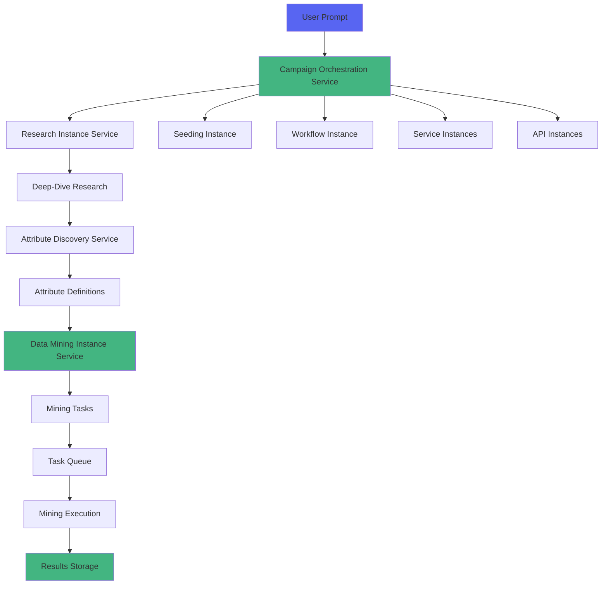

# Campaign Orchestration System - Complete Guide

## Overview

The Campaign Orchestration System provides a comprehensive, prompt-driven approach to creating data mining campaigns with automatic research, attribute discovery, and workflow orchestration.

## Architecture



## Core Components

### 1. Research Instance Service

**Purpose**: Conducts deep-dive research on topics to discover schemas, wiki links, and build knowledge graphs.

**Key Features**:
- AI-powered topic analysis using DeepSeek
- Schema.org mapping
- Wikipedia and MDN linking
- Knowledge graph construction
- Automatic schema discovery

**Example Usage**:
```javascript
import researchInstanceService from './services/research-instance-service.js';

const research = await researchInstanceService.kickoffResearch(
  'E-commerce Product Pages',
  'Research SEO optimization techniques for product pages',
  { depth: 'deep' }
);
```

### 2. Attribute Discovery Service

**Purpose**: Analyzes research to extract data mining attributes with mining algorithms and configuration options.

**Key Features**:
- Automatic attribute extraction from research
- Mining algorithm assignment
- Selector strategy generation
- Configurable options for each attribute
- Validation rule creation
- Priority-based attribute ranking

**Attribute Categories**:
- `content` - Page content and text
- `metadata` - Meta tags and structured data
- `seo` - SEO-specific attributes
- `structure` - Page structure and links
- `media` - Images and videos
- `behavior` - User interactions
- `performance` - Performance metrics

**Mining Algorithms**:
- `dom_extraction` - Extract from DOM using CSS selectors
- `meta_extraction` - Extract from meta tags
- `link_extraction` - Extract links (internal/external)
- `image_extraction` - Extract images
- `seo_extraction` - Extract SEO data
- `performance_measurement` - Measure performance metrics
- `event_tracking` - Track user events
- `computed_metric` - Calculate derived metrics

**Example Usage**:
```javascript
import attributeDiscoveryService from './services/attribute-discovery-service.js';

const attributes = await attributeDiscoveryService.discoverAttributes(researchId);

// Example attribute structure:
{
  attribute_id: "attr_1234567890_abcdef",
  name: "page_title",
  category: "seo",
  data_type: "string",
  mining_algorithm: "seo_extraction",
  selector_strategy: {
    type: "css_selector",
    selectors: ["title", "h1", "meta[property='og:title']"]
  },
  configurable_options: [
    {
      name: "enabled",
      type: "boolean",
      default: true
    },
    {
      name: "max_length",
      type: "number",
      default: 200
    }
  ],
  validation_rules: {
    required: true,
    minLength: 1,
    maxLength: 200
  },
  priority: 10
}
```

### 3. Data Mining Instance Service

**Purpose**: Manages data mining operations with configurable attributes.

**Key Features**:
- Create mining instances from research
- Configure attribute-based extraction
- Queue and execute mining tasks
- Track results and metrics
- Link to workflows and services

**Example Usage**:
```javascript
import dataMiningInstanceService from './services/data-mining-instance-service.js';

// Create from research
const mining = await dataMiningInstanceService.createFromResearch(researchId, {
  targetUrls: ['https://example.com'],
  maxDepth: 3,
  maxUrls: 100
});

// Add more attributes
await dataMiningInstanceService.addAttributes(mining.mining_id, [
  'attr_123', 'attr_456'
], {
  'attr_123': {
    enabled: true,
    options: { max_length: 500 }
  }
});

// Queue and start
await dataMiningInstanceService.queueMiningInstance(mining.mining_id);
await dataMiningInstanceService.startMiningInstance(mining.mining_id);
```

### 4. Campaign Orchestration Service

**Purpose**: Coordinates complete campaign creation from prompts, managing all instances.

**Key Features**:
- One-prompt campaign creation
- Automatic pipeline orchestration
- Research → Attributes → Mining → Workflow
- Service and API instance creation
- Progress tracking
- Execution logging

**Campaign Phases**:
1. **Initializing** - Creating campaign structure
2. **Researching** - Deep-dive research on topic
3. **Configuring** - Setting up mining and attributes
4. **Ready** - All instances configured
5. **Running** - Active mining execution
6. **Completed** - Finished successfully
7. **Failed** - Encountered errors

**Example Usage**:
```javascript
import campaignOrchestrationService from './services/campaign-orchestration-service.js';

const campaign = await campaignOrchestrationService.createCampaignFromPrompt(
  'Research and mine SEO data for e-commerce product pages including titles, descriptions, prices, and reviews',
  {
    name: 'E-commerce SEO Campaign',
    autoStart: false,
    mining: {
      targetUrls: ['https://shop.example.com'],
      maxDepth: 2,
      maxUrls: 500
    },
    services: {
      types: ['crawler', 'storage', 'analytics'],
      endpoints: {
        storage: 'https://api.storage.com'
      }
    },
    apis: {
      apis: [
        {
          name: 'Product API',
          type: 'rest',
          baseUrl: 'https://api.products.com',
          auth: { type: 'bearer', token: 'xxx' }
        }
      ]
    }
  }
);

// Monitor progress
const updated = await campaignOrchestrationService.getCampaign(campaign.campaign_id);
console.log('Progress:', updated.progress);
console.log('Status:', updated.status);

// Start when ready
if (updated.status === 'ready') {
  await campaignOrchestrationService.startCampaign(campaign.campaign_id);
}
```

## Database Schema

### Research Instances

Tracks deep-dive research campaigns:

```sql
CREATE TABLE research_instances (
    id SERIAL PRIMARY KEY,
    research_id VARCHAR(255) UNIQUE NOT NULL,
    topic TEXT NOT NULL,
    prompt TEXT NOT NULL,
    status VARCHAR(50) DEFAULT 'initializing',
    research_depth VARCHAR(50) DEFAULT 'deep',
    discovered_schemas JSONB DEFAULT '[]',
    wiki_links JSONB DEFAULT '[]',
    knowledge_graph JSONB DEFAULT '{}',
    metadata JSONB DEFAULT '{}',
    created_at TIMESTAMP DEFAULT CURRENT_TIMESTAMP,
    updated_at TIMESTAMP DEFAULT CURRENT_TIMESTAMP,
    completed_at TIMESTAMP
);
```

### Attribute Definitions

Stores discovered attributes with mining algorithms:

```sql
CREATE TABLE attribute_definitions (
    id SERIAL PRIMARY KEY,
    attribute_id VARCHAR(255) UNIQUE NOT NULL,
    research_id VARCHAR(255) REFERENCES research_instances(research_id),
    name VARCHAR(255) NOT NULL,
    category VARCHAR(100) NOT NULL,
    description TEXT,
    data_type VARCHAR(50) DEFAULT 'string',
    selector_strategy JSONB DEFAULT '{}',
    mining_algorithm VARCHAR(100) DEFAULT 'dom_extraction',
    validation_rules JSONB DEFAULT '{}',
    transformation_function TEXT,
    priority INTEGER DEFAULT 5,
    is_required BOOLEAN DEFAULT FALSE,
    configurable_options JSONB DEFAULT '[]',
    metadata JSONB DEFAULT '{}',
    created_at TIMESTAMP DEFAULT CURRENT_TIMESTAMP
);
```

### Data Mining Instances

Manages mining operations with configurable attributes:

```sql
CREATE TABLE data_mining_instances (
    id SERIAL PRIMARY KEY,
    mining_id VARCHAR(255) UNIQUE NOT NULL,
    name VARCHAR(255) NOT NULL,
    description TEXT,
    research_id VARCHAR(255) REFERENCES research_instances(research_id),
    status VARCHAR(50) DEFAULT 'configuring',
    target_urls JSONB DEFAULT '[]',
    enabled_attributes JSONB DEFAULT '[]',
    attribute_config JSONB DEFAULT '{}',
    schedule JSONB DEFAULT '{}',
    priority INTEGER DEFAULT 5,
    max_depth INTEGER DEFAULT 3,
    max_urls INTEGER DEFAULT 100,
    rate_limit_ms INTEGER DEFAULT 1000,
    results_count INTEGER DEFAULT 0,
    error_count INTEGER DEFAULT 0,
    metadata JSONB DEFAULT '{}',
    created_at TIMESTAMP DEFAULT CURRENT_TIMESTAMP,
    updated_at TIMESTAMP DEFAULT CURRENT_TIMESTAMP
);
```

### Campaigns

Coordinates all instances in a complete campaign:

```sql
CREATE TABLE campaigns (
    id SERIAL PRIMARY KEY,
    campaign_id VARCHAR(255) UNIQUE NOT NULL,
    name VARCHAR(255) NOT NULL,
    description TEXT,
    prompt TEXT NOT NULL,
    status VARCHAR(50) DEFAULT 'initializing',
    research_id VARCHAR(255) REFERENCES research_instances(research_id),
    mining_id VARCHAR(255) REFERENCES data_mining_instances(mining_id),
    seeding_id VARCHAR(255) REFERENCES seeding_instances(seeding_id),
    workflow_instance_id VARCHAR(255),
    linked_services JSONB DEFAULT '[]',
    linked_apis JSONB DEFAULT '[]',
    configuration JSONB DEFAULT '{}',
    progress JSONB DEFAULT '{}',
    metrics JSONB DEFAULT '{}',
    metadata JSONB DEFAULT '{}',
    created_at TIMESTAMP DEFAULT CURRENT_TIMESTAMP,
    updated_at TIMESTAMP DEFAULT CURRENT_TIMESTAMP
);
```

## REST API Endpoints

All endpoints are prefixed with `/api/campaigns`

### Campaign Management

#### Create Campaign from Prompt
```http
POST /api/campaigns/from-prompt
Content-Type: application/json

{
  "prompt": "Research and mine SEO data for product pages",
  "name": "Product SEO Campaign",
  "description": "Optional description",
  "options": {
    "autoStart": false,
    "mining": {
      "targetUrls": ["https://example.com"],
      "maxDepth": 2
    }
  }
}
```

#### List Campaigns
```http
GET /api/campaigns?status=ready&limit=10
```

#### Get Campaign
```http
GET /api/campaigns/{campaignId}
```

#### Start Campaign
```http
POST /api/campaigns/{campaignId}/start
```

### Research Management

#### Kickoff Research
```http
POST /api/campaigns/research/kickoff
Content-Type: application/json

{
  "topic": "E-commerce SEO",
  "prompt": "Research best practices for e-commerce SEO",
  "options": {
    "depth": "deep"
  }
}
```

#### Get Research
```http
GET /api/campaigns/research/{researchId}
```

#### List Research
```http
GET /api/campaigns/research?status=completed&limit=10
```

### Attribute Management

#### Discover Attributes
```http
POST /api/campaigns/attributes/discover/{researchId}
Content-Type: application/json

{
  "options": {}
}
```

#### Get Attributes by Research
```http
GET /api/campaigns/attributes/research/{researchId}
```

### Mining Management

#### Create Mining Instance
```http
POST /api/campaigns/mining/create-with-attributes
Content-Type: application/json

{
  "name": "Product Mining",
  "researchId": "research_123",
  "options": {
    "targetUrls": ["https://example.com"],
    "maxDepth": 3
  }
}
```

#### Add Attributes to Mining Instance
```http
POST /api/campaigns/mining/{miningId}/attributes
Content-Type: application/json

{
  "attributeIds": ["attr_123", "attr_456"],
  "config": {
    "attr_123": {
      "enabled": true,
      "options": { "max_length": 500 }
    }
  }
}
```

#### Get Mining Instance
```http
GET /api/campaigns/mining/{miningId}
```

#### Queue Mining Instance
```http
POST /api/campaigns/mining/{miningId}/queue
```

#### Start Mining Instance
```http
POST /api/campaigns/mining/{miningId}/start
```

#### List Mining Instances
```http
GET /api/campaigns/mining?status=running&limit=10
```

## Usage Examples

### Example 1: Simple Campaign

```javascript
// Create campaign from prompt
const response = await fetch('/api/campaigns/from-prompt', {
  method: 'POST',
  headers: { 'Content-Type': 'application/json' },
  body: JSON.stringify({
    prompt: 'Mine blog article titles and publication dates from tech blogs'
  })
});

const { campaign } = await response.json();
console.log('Campaign created:', campaign.campaign_id);

// Monitor until ready
let status = 'initializing';
while (status !== 'ready' && status !== 'failed') {
  await new Promise(resolve => setTimeout(resolve, 2000));
  
  const resp = await fetch(`/api/campaigns/${campaign.campaign_id}`);
  const { campaign: updated } = await resp.json();
  status = updated.status;
  console.log('Status:', status, 'Progress:', updated.progress);
}

// Start campaign
await fetch(`/api/campaigns/${campaign.campaign_id}/start`, {
  method: 'POST'
});
```

### Example 2: Manual Research and Mining

```javascript
// 1. Kickoff research
const researchResp = await fetch('/api/campaigns/research/kickoff', {
  method: 'POST',
  headers: { 'Content-Type': 'application/json' },
  body: JSON.stringify({
    topic: 'Product Reviews',
    prompt: 'Research product review data extraction patterns'
  })
});

const { research } = await researchResp.json();

// 2. Wait for research completion
// ... polling logic ...

// 3. Discover attributes
const attrResp = await fetch(`/api/campaigns/attributes/discover/${research.research_id}`, {
  method: 'POST',
  headers: { 'Content-Type': 'application/json' },
  body: JSON.stringify({ options: {} })
});

const { attributes } = await attrResp.json();
console.log(`Discovered ${attributes.length} attributes`);

// 4. Create mining instance
const miningResp = await fetch('/api/campaigns/mining/create-with-attributes', {
  method: 'POST',
  headers: { 'Content-Type': 'application/json' },
  body: JSON.stringify({
    name: 'Review Mining',
    researchId: research.research_id,
    options: {
      targetUrls: ['https://reviews.example.com'],
      maxUrls: 100
    }
  })
});

const { mining } = await miningResp.json();

// 5. Start mining
await fetch(`/api/campaigns/mining/${mining.mining_id}/queue`, { method: 'POST' });
await fetch(`/api/campaigns/mining/${mining.mining_id}/start`, { method: 'POST' });
```

## Configuration

### Environment Variables

```bash
# Database (required for persistence)
DB_HOST=localhost
DB_PORT=5432
DB_NAME=dom_space_harvester
DB_USER=postgres
DB_PASSWORD=your_password

# DeepSeek AI (optional, falls back to mock mode)
DEEPSEEK_API_KEY=your_key
DEEPSEEK_API_URL=https://api.deepseek.com/v1
DEEPSEEK_MODEL=deepseek-chat
```

### Service Configuration

```javascript
// Configure services when initializing
const campaignService = new CampaignOrchestrationService({
  autoStartCampaigns: true,  // Auto-start after orchestration
  db: postgresPool           // Database connection
});

const researchService = new ResearchInstanceService({
  defaultDepth: 'deep',
  maxConcurrentResearch: 3,
  db: postgresPool
});

const attributeService = new AttributeDiscoveryService({
  maxAttributesPerResearch: 50,
  minConfidenceScore: 0.5,
  db: postgresPool
});

const miningService = new DataMiningInstanceService({
  defaultMaxDepth: 3,
  defaultMaxUrls: 100,
  defaultRateLimit: 1000,
  db: postgresPool
});
```

## Monitoring and Logging

### Campaign Execution Log

All campaign events are logged to `campaign_execution_log` table:

```sql
SELECT 
  event_type,
  severity,
  message,
  created_at
FROM campaign_execution_log
WHERE campaign_id = 'campaign_123'
ORDER BY created_at DESC;
```

### Progress Tracking

Campaign progress is tracked in the `progress` JSONB field:

```javascript
{
  research: 'completed',
  attributes: 'completed',
  mining: 'in_progress',
  seeding: 'completed',
  workflow: 'pending',
  services: 'pending',
  apis: 'pending'
}
```

### Metrics

Campaign metrics are tracked in the `metrics` JSONB field:

```javascript
{
  total_tasks: 150,
  completed_tasks: 75,
  failed_tasks: 5,
  data_points_collected: 1250
}
```

## Best Practices

1. **Prompt Writing**
   - Be specific about what data to extract
   - Include target URLs when possible
   - Mention data fields explicitly
   - Specify frequency for recurring tasks

2. **Attribute Configuration**
   - Review discovered attributes before mining
   - Adjust priorities based on importance
   - Configure validation rules for data quality
   - Test selectors on sample pages

3. **Mining Execution**
   - Start with small URL sets for testing
   - Monitor error rates and adjust
   - Use appropriate rate limiting
   - Enable seeding for discovery

4. **Campaign Management**
   - Monitor progress regularly
   - Check execution logs for issues
   - Link appropriate services
   - Set up proper error handling

## Troubleshooting

### Campaign Stuck in "Researching"

Check research instance status:
```javascript
const research = await researchInstanceService.getResearch(campaign.research_id);
console.log('Research status:', research.status);
```

### No Attributes Discovered

Ensure research completed successfully:
```javascript
const attributes = await attributeDiscoveryService.getAttributesByResearch(researchId);
console.log('Attributes:', attributes.length);
```

### Mining Tasks Failing

Check attribute configuration:
```javascript
const mining = await dataMiningInstanceService.getMiningInstance(miningId);
console.log('Enabled attributes:', mining.enabled_attributes);
console.log('Config:', mining.attribute_config);
```

## Future Enhancements

- [ ] Real-time mining execution (currently simulated)
- [ ] UI components for campaign management
- [ ] Workflow builder integration
- [ ] Advanced selector generation using ML
- [ ] Automatic competitor discovery
- [ ] Data quality scoring
- [ ] Result visualization
- [ ] Export to various formats
- [ ] Scheduled campaign execution
- [ ] Multi-tenant support

## License

Part of the LightDom platform - All rights reserved.
