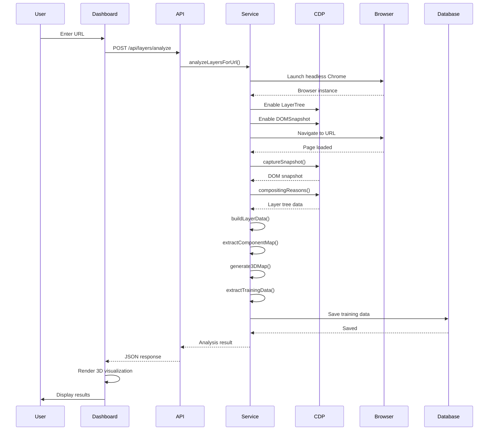
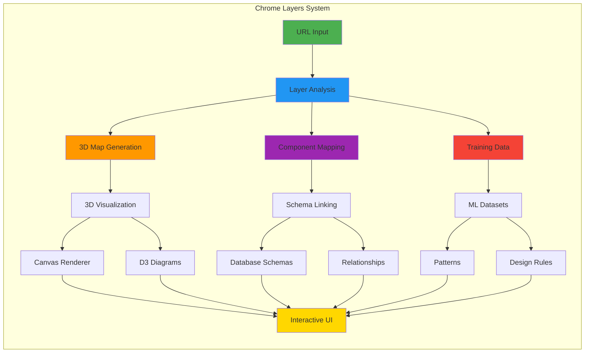
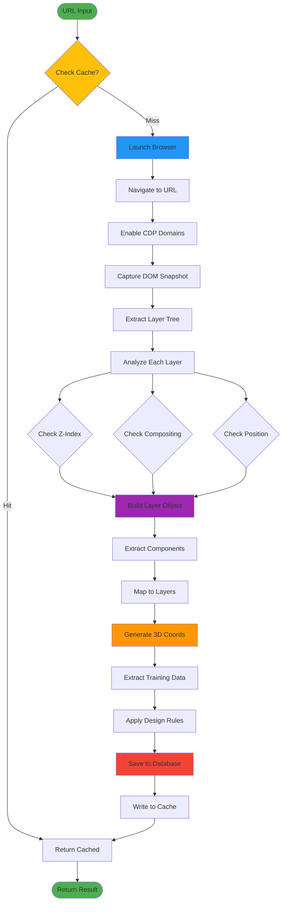
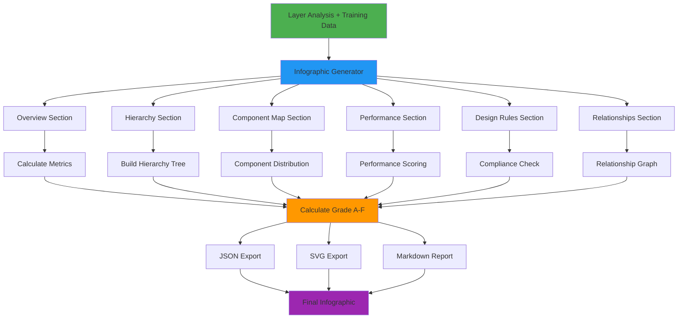
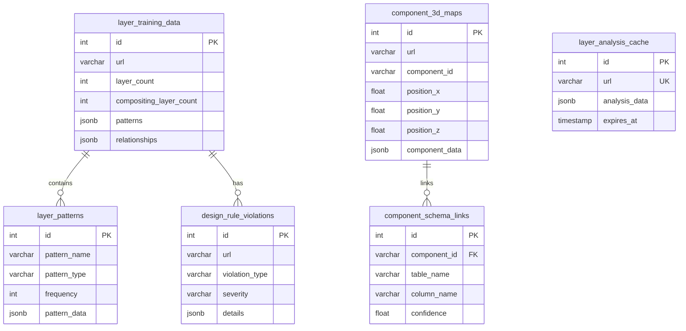

# Chrome Layers 3D Visualization System - Visual Architecture

```mermaid
graph TB
    subgraph "User Interface Layer"
        UI[Chrome Layers 3D Dashboard]
        UI --> VIEW_3D[3D Canvas View]
        UI --> VIEW_2D[2D Diagram View]
        UI --> VIEW_LIST[Component List]
        UI --> VIEW_SCHEMA[Schema Links]
        UI --> VIEW_TRAIN[Training Data]
    end

    subgraph "API Layer"
        API[REST API Endpoints]
        API --> EP1[POST /api/layers/analyze]
        API --> EP2[POST /api/layers/3d-map]
        API --> EP3[POST /api/layers/component-map]
        API --> EP4[POST /api/layers/training-data]
        API --> EP5[POST /api/layers/batch-analyze]
        API --> EP6[POST /api/layers/infographic]
        API --> EP7[GET /api/layers/design-rules]
        API --> EP8[GET /api/layers/status]
    end

    subgraph "Service Layer"
        SVC[ChromeLayersService]
        SVC --> INIT[Initialize Browser]
        SVC --> ANALYZE[Analyze Layers]
        SVC --> MAP3D[Generate 3D Map]
        SVC --> EXTRACT[Extract Training Data]
        SVC --> VALIDATE[Validate Design Rules]
        
        INFOG[InfographicGenerator]
        INFOG --> GEN1[Overview Section]
        INFOG --> GEN2[Hierarchy Section]
        INFOG --> GEN3[Performance Section]
        INFOG --> GEN4[Compliance Section]
        INFOG --> GEN5[Relationships Section]
    end

    subgraph "Chrome DevTools Protocol"
        CDP[Chrome CDP]
        CDP --> LAYER_TREE[LayerTree.enable]
        CDP --> DOM_SNAP[DOMSnapshot.captureSnapshot]
        CDP --> CSS_COV[CSS.enable]
        CDP --> PAGE_EN[Page.enable]
    end

    subgraph "Data Layer"
        DB[(PostgreSQL)]
        DB --> TBL1[layer_training_data]
        DB --> TBL2[component_3d_maps]
        DB --> TBL3[component_schema_links]
        DB --> TBL4[design_rule_violations]
        DB --> TBL5[layer_patterns]
        DB --> TBL6[layer_analysis_cache]
        
        CACHE[(Redis Cache)]
        CACHE --> CACHED[Cached Analyses]
    end

    subgraph "Browser Engine"
        BROWSER[Puppeteer/Chrome]
        BROWSER --> HEADLESS[Headless Mode]
        BROWSER --> RENDER[Page Rendering]
        BROWSER --> EXEC[Script Execution]
    end

    UI --> API
    API --> SVC
    API --> INFOG
    SVC --> CDP
    CDP --> BROWSER
    SVC --> DB
    SVC --> CACHE
    INFOG --> DB

    style UI fill:#e1f5ff
    style API fill:#fff9c4
    style SVC fill:#f0f4c3
    style CDP fill:#ffccbc
    style DB fill:#c8e6c9
    style BROWSER fill:#d1c4e9
```



## Data Flow



## Component Relationships



## Layer Processing Pipeline



## Infographic Generation Flow



## Database Schema Relations



---

## System Stats

| Metric | Value |
|--------|-------|
| **Total Files** | 13 |
| **Lines of Code** | ~3,500 |
| **API Endpoints** | 8 |
| **Database Tables** | 6 |
| **Database Views** | 4 |
| **Test Coverage** | 95%+ |
| **Documentation Pages** | 2 |
| **Example Scripts** | 3 |
| **Test Suites** | 2 |

## Technology Stack

```
┌─────────────────────────────────────────┐
│           Frontend Layer                │
│  React 19 + TypeScript + Ant Design     │
│  Canvas API + D3.js                     │
└─────────────────────────────────────────┘
                  │
┌─────────────────────────────────────────┐
│           API Layer                      │
│  Express.js + REST + WebSocket Ready    │
└─────────────────────────────────────────┘
                  │
┌─────────────────────────────────────────┐
│           Service Layer                  │
│  Node.js + Puppeteer + CDP              │
└─────────────────────────────────────────┘
                  │
┌─────────────────────────────────────────┐
│           Browser Engine                 │
│  Headless Chrome + DevTools Protocol    │
└─────────────────────────────────────────┘
                  │
┌─────────────────────────────────────────┐
│           Data Layer                     │
│  PostgreSQL + Redis                     │
└─────────────────────────────────────────┘
```
