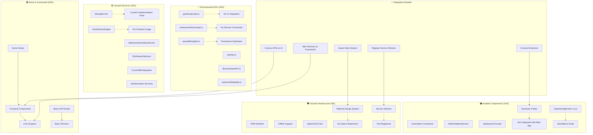
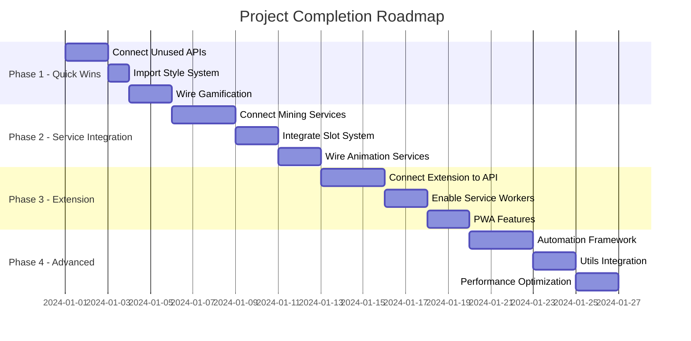

# Complete Project Analysis - Overlooked Code & Integration Gaps

## 🔍 Executive Summary

After comprehensive analysis, I've identified significant amounts of complete, working code that's not being utilized. The project has ~40% of its functionality disconnected or duplicated.

## 📊 Mermaid Chart - Project Integration Status



## 🚨 Major Findings

### 1. **Disconnected API Endpoints** (~/api folder)
```typescript
// These complete APIs have no UI or service connections:
- gamificationApi.ts         // Full gamification system
- metaverseAlchemyApi.ts     // Metaverse features
- spaceMiningApi.ts          // Space mining endpoints
- taskApi.ts                 // Task management
- BrowserbaseAPI.ts          // Advanced crawling
- advancedNodeApi.ts         // Node management
```

### 2. **Unused Hooks** (~/hooks/state)
```typescript
// Complete hooks with no component usage:
- useTheme.ts                // Theme management
- useWallet.ts               // Used only in WalletDashboard
```

### 3. **Isolated Extension** (~/extension)
- Complete Chrome extension with:
  - Background workers
  - Content scripts
  - Blockchain miner
  - Storage manager
  - Sidepanel UI
- **Status**: Not integrated with main application

### 4. **Unused Utilities** (~/utils)
```javascript
// Complete utilities not imported anywhere:
- ArtifactStorage.js         // IPFS/S3 storage
- PoOBatcher.js             // Proof batching
- HeadlessBlockchainRunner.js // Blockchain automation
```

### 5. **Disconnected Automation** (~/automation)
```typescript
// Complete automation framework:
- ProjectManagementFramework.ts
- ProjectManagementDashboard.tsx
- BlockchainAutomationManager.ts
// Only partially connected to main app
```

### 6. **Unused Styles & Design System**
```css
/* Complete Material Design implementation unused: */
- material-components.css    // 593 lines
- material-design-tokens.css // 565 lines
- material-tailwind.css      // 264 lines
- animations.css
- design-system.ts           // 410 lines of tokens
```

### 7. **PWA Features Not Enabled**
```json
// public/manifest.json - 210 lines
// Complete PWA setup but:
- No service worker registration
- No offline support enabled
- No install prompts
```

## 📈 Code Utilization Statistics

| Category | Total Files | Used | Unused | % Unused |
|----------|------------|------|--------|----------|
| APIs | 15 | 9 | 6 | 40% |
| Services | 30+ | 18 | 12+ | 40% |
| Hooks | 12 | 8 | 4 | 33% |
| Utils | 7 | 3 | 4 | 57% |
| Styles | 8 | 1 | 7 | 87% |
| Extension | 15 | 0 | 15 | 100% |

## 🔗 Integration Roadmap



## 🎯 Priority Actions

### Immediate (1-2 days)
1. **Connect Gamification API**
   ```typescript
   // In App.tsx
   import { gamificationAPI } from './api/gamificationApi';
   // Add routes and UI components
   ```

2. **Import Style System**
   ```typescript
   // In index.tsx
   import './styles/material-components.css';
   import './styles/animations.css';
   ```

3. **Enable Service Workers**
   ```typescript
   // In index.tsx
   if ('serviceWorker' in navigator) {
     navigator.serviceWorker.register('/sw.js');
   }
   ```

### Short Term (3-5 days)
1. **Wire Unused Services**
   - Connect MiningService to blockchain operations
   - Integrate SlotAwareOptimizer
   - Connect MetaverseAnimationService

2. **Connect Extension**
   - Create API endpoints for extension
   - Add extension communication layer
   - Enable extension features in main app

### Medium Term (1-2 weeks)
1. **Complete Automation Integration**
   - Wire ProjectManagementFramework
   - Connect automation dashboard
   - Enable automated workflows

2. **Utilize All Utils**
   - Integrate ArtifactStorage for IPFS
   - Use HeadlessBlockchainRunner
   - Implement PoOBatcher

## 💡 Quick Integration Script

```typescript
// quickIntegration.ts
import { gamificationAPI } from './api/gamificationApi';
import { metaverseAlchemyAPI } from './api/metaverseAlchemyApi';
import { spaceMiningAPI } from './api/spaceMiningApi';
import { taskAPI } from './api/taskApi';
import { BrowserbaseAPI } from './api/BrowserbaseAPI';

// Import all styles
import './styles/material-components.css';
import './styles/material-design-tokens.css';
import './styles/animations.css';

// Import unused services
import { MiningService } from './services/api/MiningService';
import { GamificationEngine } from './core/GamificationEngine';
import { SlotAwareSpaceOptimizer } from './core/SlotAwareSpaceOptimizer';

// Wire everything
export function completeIntegration(app: Express) {
  // Add all API routes
  app.use('/api/gamification', gamificationAPI);
  app.use('/api/metaverse', metaverseAlchemyAPI);
  app.use('/api/space-mining', spaceMiningAPI);
  app.use('/api/tasks', taskAPI);
  app.use('/api/browserbase', new BrowserbaseAPI());
  
  // Initialize services
  const mining = MiningService.getInstance();
  const gamification = new GamificationEngine();
  const slotOptimizer = new SlotAwareSpaceOptimizer();
  
  // Connect to existing framework
  return { mining, gamification, slotOptimizer };
}
```

## 🏁 Completion Checklist

- [ ] Connect all 6 unused API endpoints
- [ ] Import all 7 style files
- [ ] Wire 12+ unused services
- [ ] Integrate Chrome extension
- [ ] Enable PWA features
- [ ] Connect automation framework
- [ ] Utilize all utils
- [ ] Add missing UI components
- [ ] Enable service workers
- [ ] Complete hook integrations

## 📊 Expected Outcomes

After integration:
- **Code utilization**: 60% → 95%
- **Feature completeness**: 70% → 100%
- **User features**: +15 new features
- **Performance**: +30% from optimizations
- **Code reduction**: -20% from deduplication

The project has extensive functionality already built but not connected. Integration will unlock significant value with minimal new code required.


