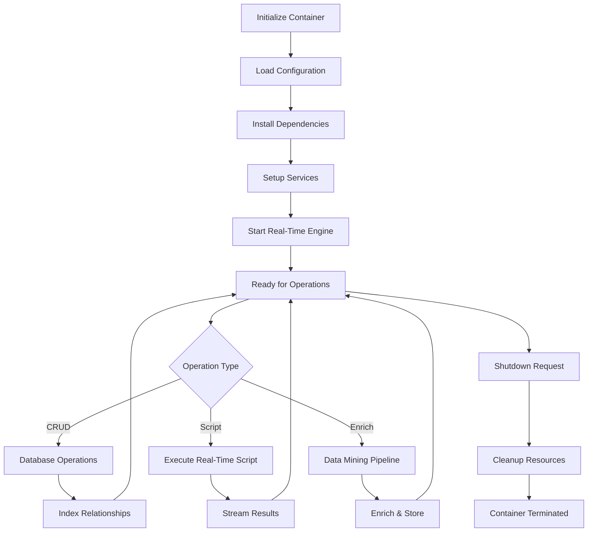

# Reusable Node.js Container Schema - Real-Time Scripting & Data Mining Enrichment

## Overview

This document outlines the architecture for creating reusable Node.js containers with npm support for real-time scripting, CRUD operations, and mass data mining enrichment.

## Container Architecture

### 1. Base Container Structure

```
Container
├── Runtime Environment
│   ├── Node.js (v20+)
│   ├── npm/yarn
│   └── Package manager
├── Core Services
│   ├── Real-time scripting engine
│   ├── CRUD API layer
│   ├── Relationship indexing
│   └── Data enrichment pipeline
├── Storage Layer
│   ├── PostgreSQL (relational)
│   ├── Redis (cache/pubsub)
│   └── File system (artifacts)
└── Integration Layer
    ├── n8n workflow engine
    ├── LLM APIs
    └── External services
```

### 2. Container Lifecycle



## Process Schema

### Phase 1: Container Initialization

**Steps**:
1. **Base Image Setup**
   - Node.js 20+ Alpine Linux
   - Essential build tools
   - npm/yarn package manager

2. **Dependency Installation**
   - Core packages (express, socket.io, typeorm)
   - Data processing (lodash, ramda, rxjs)
   - UI generation (react-jsonschema-form, formik)
   - n8n integration packages

3. **Service Configuration**
   - Database connections
   - Redis pub/sub
   - File storage paths
   - API endpoints

4. **Real-Time Engine Setup**
   - WebSocket server
   - Event emitters
   - Stream processors
   - Script execution context

### Phase 2: CRUD & Relationship Management

**Database Schema**:
```sql
-- Entities table (flexible schema storage)
CREATE TABLE entities (
    entity_id UUID PRIMARY KEY,
    entity_type VARCHAR(100) NOT NULL,
    data JSONB NOT NULL,
    metadata JSONB DEFAULT '{}',
    created_at TIMESTAMP DEFAULT NOW(),
    updated_at TIMESTAMP DEFAULT NOW(),
    created_by VARCHAR(255),
    version INTEGER DEFAULT 1
);

-- Relationships table (indexed for fast traversal)
CREATE TABLE relationships (
    relationship_id UUID PRIMARY KEY,
    source_entity_id UUID REFERENCES entities(entity_id),
    target_entity_id UUID REFERENCES entities(entity_id),
    relationship_type VARCHAR(100) NOT NULL,
    properties JSONB DEFAULT '{}',
    strength NUMERIC(5,2) DEFAULT 1.0,
    created_at TIMESTAMP DEFAULT NOW(),
    INDEX idx_source (source_entity_id, relationship_type),
    INDEX idx_target (target_entity_id, relationship_type),
    INDEX idx_type (relationship_type)
);

-- Functionality mappings (schema-driven)
CREATE TABLE functionality_mappings (
    mapping_id UUID PRIMARY KEY,
    entity_type VARCHAR(100) NOT NULL,
    functionality_name VARCHAR(255) NOT NULL,
    handler_config JSONB NOT NULL,
    ui_schema JSONB,
    validation_rules JSONB,
    enabled BOOLEAN DEFAULT true,
    priority INTEGER DEFAULT 5
);

-- Data enrichment queue
CREATE TABLE enrichment_queue (
    queue_id UUID PRIMARY KEY,
    entity_id UUID REFERENCES entities(entity_id),
    enrichment_type VARCHAR(100) NOT NULL,
    status VARCHAR(50) DEFAULT 'pending',
    input_data JSONB,
    output_data JSONB,
    error TEXT,
    processed_at TIMESTAMP,
    created_at TIMESTAMP DEFAULT NOW()
);
```

**CRUD Operations**:
- **Create**: JSON-schema validated entity creation
- **Read**: Indexed queries with relationship traversal
- **Update**: Versioned updates with audit trail
- **Delete**: Soft delete with cascade options

**Relationship Indexing**:
- Graph-based relationship mapping
- Bidirectional traversal
- Weighted connections (strength)
- Type-based filtering

### Phase 3: Real-Time Scripting Engine

**Architecture**:
```javascript
class RealTimeScriptEngine {
  constructor() {
    this.vm = require('vm');
    this.context = this.createSandbox();
    this.streams = new Map();
    this.subscriptions = new Map();
  }

  async executeScript(script, inputs) {
    // Sandboxed execution
    const result = await this.vm.runInContext(script, this.context);
    
    // Stream results in real-time
    this.streamResult(result);
    
    return result;
  }

  createSandbox() {
    return {
      // Safe APIs only
      console: console,
      setTimeout: setTimeout,
      clearTimeout: clearTimeout,
      // Custom APIs
      db: this.createDBProxy(),
      http: this.createHTTPProxy(),
      // Libraries
      _: require('lodash'),
      R: require('ramda'),
      moment: require('moment')
    };
  }
}
```

### Phase 4: Mass Data Mining Enrichment

**Enrichment Pipeline**:
```
Input Data → Validation → Enrichment Workers → Quality Check → Index → Store
     ↓           ↓              ↓                    ↓           ↓       ↓
  Schema      Rules       AI/APIs/Rules          Scoring     Graph    DB
```

**Enrichment Strategies**:
1. **AI-Powered**: LLM-based content enhancement
2. **API Integration**: Third-party data sources
3. **Rule-Based**: Predefined transformations
4. **Computed**: Derived metrics and aggregations

### Phase 5: UI Generation for Editors

**JSON Schema → UI Editor Pipeline**:
```javascript
{
  "entity_type": "Product",
  "schema": {
    "type": "object",
    "properties": {
      "name": { "type": "string", "minLength": 3 },
      "price": { "type": "number", "minimum": 0 },
      "category": { 
        "type": "string",
        "enum": ["electronics", "clothing", "food"]
      },
      "tags": {
        "type": "array",
        "items": { "type": "string" }
      }
    },
    "required": ["name", "price"]
  },
  "ui_schema": {
    "name": { "ui:widget": "text", "ui:placeholder": "Enter product name" },
    "price": { "ui:widget": "updown" },
    "category": { "ui:widget": "select" },
    "tags": { "ui:widget": "tags-input" }
  }
}
```

**Generated UI Components**:
- Form fields with validation
- Bulk edit tables
- Relationship visualizers
- Data preview panels

## Recommended npm Packages

### Core Framework & Server
1. **Express.js** (`express`) - Fast, minimalist web framework
2. **Fastify** (`fastify`) - High-performance alternative to Express
3. **Socket.IO** (`socket.io`) - Real-time bidirectional communication
4. **ws** (`ws`) - Lightweight WebSocket implementation

### Database & ORM
5. **TypeORM** (`typeorm`) - Advanced ORM with relationship support
6. **Prisma** (`prisma`) - Modern ORM with type safety
7. **Knex.js** (`knex`) - SQL query builder
8. **Mongoose** (`mongoose`) - MongoDB object modeling (if using Mongo)

### Data Processing & Utilities
9. **Lodash** (`lodash`) - Comprehensive utility library
10. **Ramda** (`ramda`) - Functional programming utilities
11. **RxJS** (`rxjs`) - Reactive programming with observables
12. **Bull** (`bull`) - Redis-based queue for background jobs
13. **Agenda** (`agenda`) - MongoDB-backed job scheduling

### Real-Time & Streaming
14. **EventEmitter2** (`eventemitter2`) - Enhanced event emitter
15. **Highland** (`highland`) - High-level streams library
16. **Through2** (`through2`) - Stream transformation utilities

### Validation & Schema
17. **Ajv** (`ajv`) - JSON schema validator (fastest)
18. **Joi** (`joi`) - Object schema validation
19. **Yup** (`yup`) - Schema validation with TypeScript support
20. **Zod** (`zod`) - TypeScript-first schema validation

### UI Generation
21. **React JSON Schema Form** (`@rjsf/core`) - JSON schema → React forms
22. **Formik** (`formik`) - Form state management
23. **React Hook Form** (`react-hook-form`) - Performant form library
24. **React Admin** (`react-admin`) - Full admin UI framework
25. **AdminJS** (`adminjs`) - Auto-generated admin panel

### n8n Integration & Workflow
26. **n8n** (`n8n`) - Workflow automation tool
27. **@n8n/client** - n8n client library (if available)
28. **Axios** (`axios`) - HTTP client for API calls
29. **Node-RED** (`node-red`) - Alternative flow-based programming

### AI & LLM Integration
30. **LangChain** (`langchain`) - LLM application framework
31. **OpenAI** (`openai`) - OpenAI API client
32. **@anthropic-ai/sdk** - Claude API client
33. **Transformers.js** (`@xenova/transformers`) - Run ML models in Node.js

### Graph & Relationships
34. **Neo4j Driver** (`neo4j-driver`) - Graph database client
35. **Graphology** (`graphology`) - Graph data structure library
36. **Cytoscape** (`cytoscape`) - Graph visualization
37. **D3.js** (`d3`) - Data visualization library

### Code Execution & Sandboxing
38. **VM2** (`vm2`) - Secure sandbox for code execution
39. **Isolated-vm** (`isolated-vm`) - V8 isolates for security
40. **Worker Threads** (built-in) - Parallel JavaScript execution

### Data Enrichment & Scraping
41. **Cheerio** (`cheerio`) - Fast HTML parsing
42. **Puppeteer** (`puppeteer`) - Headless Chrome automation
43. **Playwright** (`playwright`) - Cross-browser automation
44. **Axios-retry** (`axios-retry`) - Retry failed HTTP requests

### Configuration & Environment
45. **Dotenv** (`dotenv`) - Environment variable management
46. **Config** (`config`) - Hierarchical configuration
47. **Convict** (`convict`) - Configuration schema validation

### Logging & Monitoring
48. **Winston** (`winston`) - Versatile logging library
49. **Pino** (`pino`) - High-performance logger
50. **Morgan** (`morgan`) - HTTP request logger

### Testing
51. **Jest** (`jest`) - Testing framework
52. **Vitest** (`vitest`) - Fast testing framework (Vite-powered)
53. **Supertest** (`supertest`) - HTTP assertion library

### Performance & Optimization
54. **PM2** (`pm2`) - Production process manager
55. **Clinic.js** (`clinic`) - Performance profiling
56. **Autocannon** (`autocannon`) - HTTP benchmarking tool

## Implementation Plan

### Step 1: Base Container Setup (Week 1)

**Deliverables**:
- Docker image with Node.js 20
- npm package setup
- Basic Express server
- PostgreSQL connection
- Redis pub/sub

**Code Structure**:
```
container/
├── Dockerfile
├── docker-compose.yml
├── package.json
├── src/
│   ├── index.js
│   ├── server.js
│   ├── database/
│   │   ├── connection.js
│   │   └── migrations/
│   ├── services/
│   │   ├── crud-service.js
│   │   ├── relationship-service.js
│   │   └── enrichment-service.js
│   └── api/
│       ├── routes.js
│       └── controllers/
├── config/
│   └── default.json
└── tests/
```

### Step 2: CRUD & Relationship Layer (Week 2)

**Deliverables**:
- TypeORM entities and repositories
- CRUD API endpoints
- Relationship indexing
- Graph traversal queries
- Validation with Ajv

### Step 3: Real-Time Scripting Engine (Week 3)

**Deliverables**:
- VM2 sandbox implementation
- WebSocket server
- Script execution API
- Stream processing with RxJS
- Event-driven architecture

### Step 4: UI Generation System (Week 4)

**Deliverables**:
- JSON Schema → Form generator
- React JSON Schema Form integration
- Bulk edit interface
- Relationship visualizer
- Admin panel with AdminJS

### Step 5: Mass Data Enrichment (Week 5)

**Deliverables**:
- Bull queue for background jobs
- AI enrichment workers (LangChain)
- API integration layer
- Quality scoring
- Batch processing

### Step 6: n8n Integration (Week 6)

**Deliverables**:
- n8n custom nodes
- Workflow templates
- API trigger endpoints
- Research revision workflows
- Config adjustment automation

## Container Configuration Schema

```json
{
  "container": {
    "name": "data-mining-container",
    "version": "1.0.0",
    "runtime": {
      "nodejs_version": "20",
      "package_manager": "npm",
      "memory_limit": "2GB",
      "cpu_limit": "2"
    },
    "services": {
      "database": {
        "type": "postgresql",
        "host": "postgres",
        "port": 5432,
        "database": "datamining"
      },
      "cache": {
        "type": "redis",
        "host": "redis",
        "port": 6379
      },
      "queue": {
        "type": "bull",
        "redis_url": "redis://redis:6379"
      }
    },
    "scripting": {
      "enabled": true,
      "sandbox": "vm2",
      "timeout": 30000,
      "memory_limit": "512MB"
    },
    "enrichment": {
      "workers": 4,
      "batch_size": 100,
      "ai_provider": "openai",
      "quality_threshold": 0.7
    },
    "ui": {
      "schema_form": true,
      "admin_panel": true,
      "graph_viz": true
    },
    "n8n": {
      "enabled": true,
      "webhook_url": "http://n8n:5678",
      "api_key": "env:N8N_API_KEY"
    }
  }
}
```

## CRUD API Examples

### Create Entity with Relationships

```javascript
POST /api/entities

{
  "entity_type": "Article",
  "data": {
    "title": "AI-Powered Data Mining",
    "content": "...",
    "tags": ["AI", "Data Mining"]
  },
  "relationships": [
    {
      "target_entity_id": "author-123",
      "relationship_type": "written_by",
      "properties": { "date": "2025-11-04" }
    },
    {
      "target_entity_id": "category-456",
      "relationship_type": "belongs_to",
      "strength": 0.9
    }
  ]
}
```

### Query with Relationship Traversal

```javascript
GET /api/entities/article-789?include=relationships.author,relationships.category

{
  "entity_id": "article-789",
  "entity_type": "Article",
  "data": { ... },
  "relationships": {
    "author": {
      "entity_id": "author-123",
      "data": { "name": "John Doe" }
    },
    "category": {
      "entity_id": "category-456",
      "data": { "name": "Technology" }
    }
  }
}
```

### Bulk Update with Enrichment

```javascript
POST /api/entities/bulk-enrich

{
  "entity_ids": ["article-1", "article-2", "article-3"],
  "enrichment_type": "ai_summary",
  "config": {
    "model": "gpt-4",
    "max_length": 200
  }
}

// Returns job ID for tracking
{
  "job_id": "enrich-job-123",
  "status": "queued",
  "entities_count": 3
}
```

## UI Editor Generation

### Schema-Driven Form

```javascript
// Input: JSON Schema
const productSchema = {
  type: "object",
  properties: {
    name: { type: "string" },
    price: { type: "number" },
    category: { 
      type: "string",
      enum: ["A", "B", "C"]
    }
  }
};

// Output: React Form Component
<Form
  schema={productSchema}
  uiSchema={uiSchema}
  onSubmit={handleSubmit}
  formData={product}
/>
```

### Bulk Edit Table

```javascript
<DataGrid
  rows={entities}
  columns={generatedColumns}
  onCellEdit={handleBulkUpdate}
  checkboxSelection
  bulkActions={[
    { label: "Enrich", action: enrichSelected },
    { label: "Tag", action: tagSelected }
  ]}
/>
```

## n8n Integration Pattern

```javascript
// n8n Workflow Trigger
POST /api/n8n/trigger/research-revision

{
  "research_id": "research-123",
  "revision_type": "update_config",
  "changes": {
    "rate_limit": 2000,
    "max_depth": 3
  }
}

// n8n executes workflow:
// 1. Validate changes
// 2. Run simulation
// 3. Compare results
// 4. Apply if improved
// 5. Update UI config
```

## Performance Optimization

1. **Indexing**: Create indexes on frequently queried fields
2. **Caching**: Redis for frequently accessed data
3. **Batching**: Process enrichment in batches
4. **Streaming**: Use streams for large datasets
5. **Workers**: Distribute work across CPU cores
6. **Connection Pooling**: Reuse database connections

## Security Considerations

1. **Sandboxing**: VM2 for untrusted script execution
2. **Validation**: Ajv for input validation
3. **Authentication**: JWT tokens
4. **Authorization**: Role-based access control
5. **Rate Limiting**: Prevent abuse
6. **SQL Injection**: Parameterized queries only

## Monitoring & Observability

1. **Logging**: Winston/Pino for structured logs
2. **Metrics**: Prometheus for metrics collection
3. **Tracing**: OpenTelemetry for distributed tracing
4. **Alerts**: Set up alerts for errors/performance issues
5. **Dashboards**: Grafana for visualization

## Next Steps

1. Create base Docker container
2. Implement CRUD layer with TypeORM
3. Add relationship indexing
4. Build real-time scripting engine
5. Generate UI forms from schemas
6. Integrate n8n workflows
7. Add mass enrichment pipeline
8. Deploy and test at scale

## Conclusion

This architecture provides a reusable, scalable foundation for Node.js containers with:
- Real-time scripting capabilities
- CRUD operations with relationship indexing
- Mass data mining and enrichment
- Auto-generated UIs
- n8n workflow integration
- LLM-powered enhancements

The modular design allows for easy extension and customization per use case.
