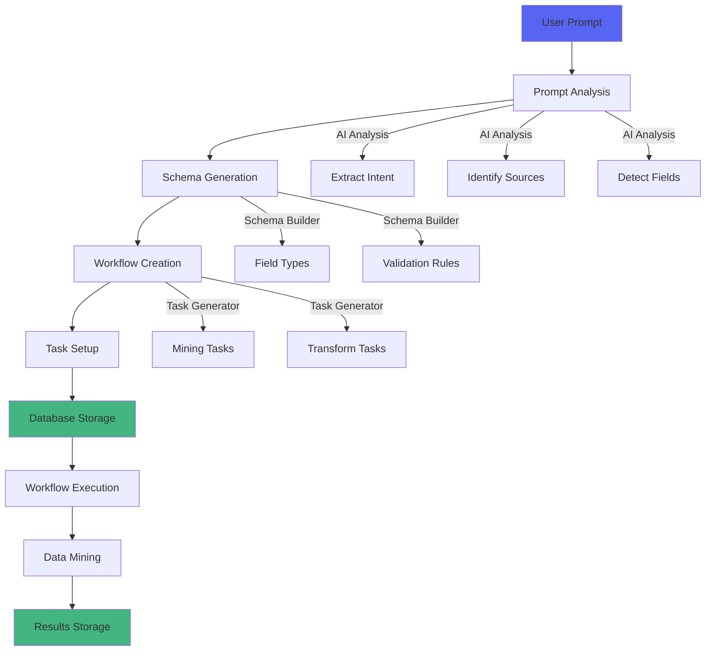

# DataMining Workflow System - AI-Powered Schema Generation

## Overview

The DataMining Workflow System enables users to create sophisticated datamining workflows from natural language prompts. The system automatically analyzes the prompt, generates appropriate schemas, creates workflow tasks, and tracks execution stages in real-time.

## Architecture



## Features

### 1. Natural Language Prompt Processing

Users can describe datamining needs in plain English:

**Example Prompts:**
- "Scrape product prices from https://example.com/products daily"
- "Extract job titles, companies, and locations from https://jobs.example.com"
- "Mine article titles and publication dates from tech blogs every hour"
- "Get user reviews and ratings from https://reviews.site.com"

### 2. Workflow Stage Tracking

The system tracks 9 distinct stages:

1. **INITIALIZING** - Setting up workflow infrastructure
2. **PROMPT_ANALYSIS** - AI analyzes user intent and requirements
3. **SCHEMA_GENERATION** - Generates data schemas based on analysis
4. **WORKFLOW_CREATION** - Creates workflow structure and tasks
5. **DATAMINING_SETUP** - Configures datamining parameters
6. **EXECUTING** - Workflow is running
7. **PROCESSING** - Processing mined data
8. **COMPLETED** - Successfully finished
9. **FAILED** - Encountered errors

### 3. Automatic Schema Generation

The system generates JSON-LD schemas including:

```typescript
{
  "@context": "https://schema.org",
  "@type": "DataSchema",
  "@id": "lightdom:schema:datamining-1234567890",
  "name": "DataMiningSchema",
  "fields": [
    {
      "@type": "SchemaField",
      "name": "product_title",
      "displayName": "Product Title",
      "type": "string",
      "required": true,
      "description": "Extracted Product Title from data source"
    },
    {
      "@type": "SchemaField",
      "name": "price",
      "displayName": "Price",
      "type": "number",
      "required": true,
      "description": "Extracted Price from data source"
    }
  ]
}
```

### 4. Task Generation

Creates appropriate datamining tasks:

```typescript
{
  "@type": "DataMiningTask",
  "@id": "task-mining-1",
  "name": "Extract data from example.com",
  "source": {
    "type": "web",
    "url": "https://example.com/products",
    "selectors": [
      "[data-product-title]",
      ".product-title",
      "[data-price]",
      ".price"
    ]
  },
  "extraction": {
    "fields": [
      {
        "name": "product_title",
        "selector": "[data-product-title], .product-title",
        "type": "string"
      },
      {
        "name": "price",
        "selector": "[data-price], .price",
        "type": "number"
      }
    ],
    "pagination": {
      "enabled": true,
      "selector": "a.next, button.next",
      "maxPages": 10
    }
  },
  "storage": {
    "type": "database",
    "table": "datamining_results",
    "format": "json"
  }
}
```

## Components

### DataMiningWorkflowService

**Location:** `src/services/DataMiningWorkflowService.ts`

**Key Methods:**

#### `createFromPrompt(prompt: string): Promise<DataMiningWorkflow>`
Creates a complete datamining workflow from a natural language prompt.

**Process:**
1. Analyzes prompt to extract intent, sources, and data fields
2. Generates appropriate data schema
3. Creates datamining tasks
4. Saves workflow to database
5. Returns complete workflow object

#### `analyzePrompt(prompt: string): Promise<PromptAnalysis>`
Uses pattern matching and AI to analyze the user's prompt.

**Detects:**
- Intent (web scraping, API extraction, database mining)
- Data sources (URLs, domains, API endpoints)
- Data fields to extract
- Output format (JSON, CSV, JSONL)
- Execution frequency (hourly, daily, weekly)

#### `generateSchemaFromAnalysis(analysis: PromptAnalysis): Promise<Schema>`
Generates a JSON-LD schema with appropriate field types.

**Field Type Inference:**
- Date/time fields → `date`
- Price/amount/count → `number`
- Boolean indicators → `boolean`
- Lists/tags/categories → `array`
- Default → `string`

#### `executeWorkflow(workflowId: string): Promise<void>`
Executes the datamining workflow and updates stages.

### DataMiningWorkflowCreator Component

**Location:** `src/components/workflow/DataMiningWorkflowCreator.tsx`

**Features:**
- Modal interface for prompt input
- Real-time stage progression display
- Schema visualization
- Task details viewer
- Generated workflow preview
- Error handling and display

**UI Elements:**
- **Prompt TextArea** - Multi-line input for natural language description
- **Stage Progress** - Step indicator showing current stage
- **Workflow Details** - Expandable sections showing:
  - Generated name and description
  - Workflow ID
  - Current stage
  - Number of tasks
  - Monitoring configuration
- **Task Panels** - Collapsible panels for each task showing:
  - Source type and URL
  - Fields to extract
  - Storage configuration
- **Schema Preview** - JSON-LD formatted schema display

## Integration with Workflow Dashboard

The DataMining creator is integrated into the main workflow dashboard:

**Access:** Click "AI DataMining" button in the header

**Flow:**
1. User clicks "AI DataMining" button
2. Modal opens with prompt input
3. User enters natural language description
4. System generates workflow with real-time stage updates
5. User reviews generated workflow and schema
6. Workflow is automatically saved to database
7. Modal closes and dashboard refreshes
8. New workflow appears in the list

## Database Schema

### workflow_process_definitions Table

```sql
CREATE TABLE workflow_process_definitions (
  id SERIAL PRIMARY KEY,
  process_type VARCHAR(100),           -- 'datamining'
  process_definition_name VARCHAR(255), -- Generated name
  description TEXT,                     -- Generated description
  schema JSONB,                        -- Complete workflow schema
  input_schema JSONB,                  -- Task input schemas
  output_schema JSONB,                 -- Expected output schema
  is_active BOOLEAN DEFAULT true,
  tags TEXT[],                         -- ['datamining', 'auto-generated']
  metadata JSONB,                      -- { prompt, stage, ... }
  task_count INTEGER,                  -- Number of tasks
  instance_count INTEGER,              -- Execution count
  success_rate NUMERIC(5,2),           -- Success percentage
  avg_duration_ms INTEGER,             -- Average execution time
  created_at TIMESTAMP DEFAULT NOW(),
  updated_at TIMESTAMP DEFAULT NOW()
);
```

**Indexed Fields:**
- `process_type` - For filtering by type
- `is_active` - For filtering active workflows
- `tags` - For tag-based search
- `created_at` - For sorting by date

## API Endpoints

### POST /api/workflow-processes
Create a new workflow process.

**Request:**
```json
{
  "process_type": "datamining",
  "process_definition_name": "Web Scraping: Product Prices",
  "description": "Datamining workflow generated from: \"Scrape product prices from example.com\"",
  "schema": { /* DataMiningWorkflow object */ },
  "is_active": true,
  "tags": ["datamining", "auto-generated"],
  "metadata": {
    "prompt": "Scrape product prices from example.com",
    "stage": "datamining_setup"
  }
}
```

### POST /api/workflow-processes/{id}/execute
Execute a datamining workflow.

**Response:**
```json
{
  "instance_id": "inst-123",
  "status": "running",
  "started_at": "2025-11-03T13:00:00Z"
}
```

### PATCH /api/workflow-processes/{id}
Update workflow stage and metadata.

**Request:**
```json
{
  "metadata": {
    "stage": "executing"
  }
}
```

## Usage Examples

### Example 1: Product Price Monitoring

**Prompt:**
```
"Scrape product names, prices, and availability from https://shop.example.com/products daily"
```

**Generated Workflow:**
- **Name:** Web Scraping: Product Names And Prices
- **Tasks:** 1 datamining task
- **Fields:** product_names (string), prices (number), availability (string)
- **Schedule:** Daily (0 0 * * *)
- **Storage:** Database table `datamining_results`

### Example 2: Job Listings Aggregation

**Prompt:**
```
"Extract job titles, companies, locations, and salaries from https://jobs.example.com every hour"
```

**Generated Workflow:**
- **Name:** Web Scraping: Job Titles And Companies And Locations And Salaries
- **Tasks:** 1 datamining task
- **Fields:** job_titles (string), companies (string), locations (string), salaries (number)
- **Schedule:** Hourly (0 * * * *)
- **Storage:** Database table `datamining_results`

### Example 3: Multi-Source News Aggregation

**Prompt:**
```
"Mine article headlines and publication dates from https://news1.com and https://news2.com"
```

**Generated Workflow:**
- **Name:** Web Scraping: Article Headlines And Publication Dates
- **Tasks:** 2 datamining tasks (one per source)
- **Fields:** article_headlines (string), publication_dates (date)
- **Storage:** Database table `datamining_results`

## Best Practices

### Writing Effective Prompts

**Do:**
✅ Include specific URLs to scrape
✅ List exact data fields you want
✅ Mention frequency if recurring
✅ Specify output format if needed

**Examples of Good Prompts:**
- "Extract product titles and prices from https://shop.com daily"
- "Scrape job postings (title, company, salary) from https://jobs.com hourly"
- "Mine article metadata (title, author, date) from https://blog.com weekly"

**Don't:**
❌ Be too vague: "Get some data from websites"
❌ Skip the URL: "Scrape product information"
❌ Omit fields: "Extract data from example.com"

### Monitoring Workflows

**Check These Metrics:**
- **Stage** - Current execution stage
- **Task Count** - Number of datamining tasks
- **Instance Count** - Times executed
- **Success Rate** - Percentage of successful runs
- **Avg Duration** - Average execution time

### Handling Errors

**Common Issues:**
- **Failed Stage** - Check error message in workflow details
- **No Data Extracted** - Verify selectors match target website
- **Timeout** - Reduce `maxPages` in pagination config
- **Invalid Schema** - Review generated schema for field types

## Advanced Features

### Custom Field Transformations

Add transformation functions to fields:

```typescript
{
  name: "price",
  type: "number",
  transform: "parseFloat(value.replace('$', ''))"
}
```

### Pagination Support

Automatic pagination with configurable limits:

```typescript
{
  pagination: {
    enabled: true,
    selector: "a.next-page",
    maxPages: 20
  }
}
```

### Multiple Storage Targets

Store results in different formats:

```typescript
{
  storage: [
    { type: "database", table: "products" },
    { type: "file", path: "/exports/products.csv", format: "csv" }
  ]
}
```

## Roadmap

**Planned Features:**
- [ ] AI-powered selector generation using screenshot analysis
- [ ] Automatic schema evolution based on extracted data
- [ ] Built-in data quality validation
- [ ] Real-time data preview during execution
- [ ] Template library for common datamining scenarios
- [ ] Export workflows as standalone scripts
- [ ] Collaborative workflow editing
- [ ] Marketplace for sharing workflows

## Troubleshooting

### Workflow Not Creating

**Check:**
1. Prompt contains at least one URL
2. Prompt specifies what data to extract
3. Network connection to API server
4. Database is accessible

### No Data Being Mined

**Verify:**
1. Target website is accessible
2. CSS selectors match page structure
3. Pagination configuration is correct
4. Storage table exists in database

### Slow Execution

**Optimize:**
1. Reduce `maxPages` in pagination
2. Limit number of concurrent tasks
3. Add caching for repeated requests
4. Use specific selectors instead of broad matches

## Support

For issues or questions:
- Check workflow logs in dashboard
- Review generated schema for accuracy
- Verify target website structure hasn't changed
- Contact support with workflow ID

## License

Part of the LightDom platform - All rights reserved.
