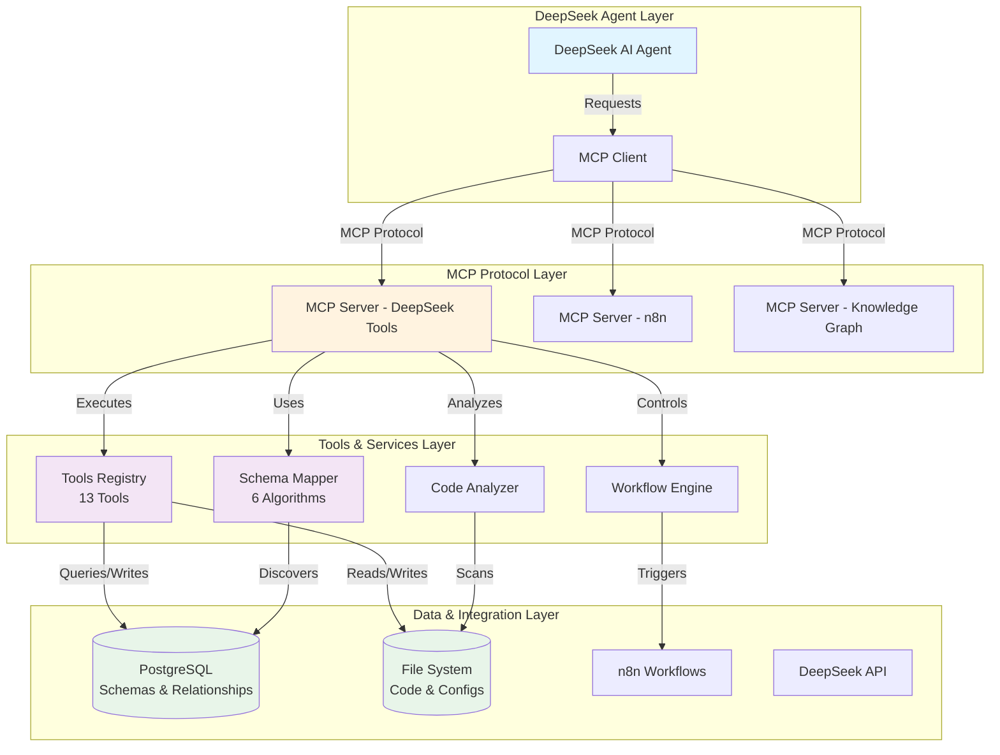
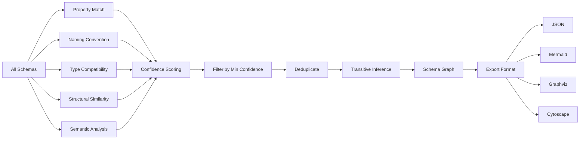

# DeepSeek MCP Tools Architecture

## Component Overview

### 1. DeepSeek Agent Layer
- **DeepSeek AI Agent**: The AI that makes intelligent decisions
- **MCP Client**: Interfaces with MCP servers using Model Context Protocol

### 2. MCP Protocol Layer
Three specialized MCP servers:
- **DeepSeek Tools Server**: Primary server with 13 tools for codebase interaction
- **n8n Server**: Workflow automation integration
- **Knowledge Graph Server**: Memory and relationship management

### 3. Tools & Services Layer

#### Tools Registry (13 Tools)
1. **Schema Tools** (4)
   - `query_schema`: Query schema definitions and relationships
   - `create_schema`: Create new schemas with auto-linking
   - `find_schema_relationships`: Discover relationships using algorithms
   - `generate_schema_map`: Generate visual schema maps

2. **Workflow Tools** (2)
   - `create_workflow`: Create workflows with schema binding
   - `execute_workflow`: Execute workflows with validation

3. **Code Analysis Tools** (2)
   - `analyze_codebase`: Analyze code structure
   - `generate_schema_from_code`: Auto-generate schemas from code

4. **Database Tools** (1)
   - `query_database`: Safe database queries

5. **File System Tools** (2)
   - `read_file`: Read files with schema parsing
   - `write_file`: Write files with validation

6. **Configuration Tools** (2)
   - `get_deepseek_config`: Retrieve configuration
   - `update_deepseek_config`: Update settings

#### Schema Mapper (6 Algorithms)
1. **Property Match**: Finds common properties between schemas
2. **Naming Convention**: Detects references (userId → User)
3. **Type Compatibility**: Matches compatible types
4. **Structural Similarity**: Compares schema structures
5. **Semantic Analysis**: Analyzes name similarities
6. **Transitive Inference**: Discovers indirect relationships

### 4. Data & Integration Layer
- **PostgreSQL**: Stores schemas, relationships, workflows
- **File System**: Code files, configurations, generated schemas
- **n8n**: Workflow automation platform
- **DeepSeek API**: AI language model

## Data Flow

### Example: Creating a Schema with Auto-Discovery

```
1. DeepSeek Agent → "Create a User schema"
2. MCP Client → Sends request to DeepSeek Tools Server
3. Tools Registry → Executes create_schema tool
4. Schema Mapper → Runs relationship algorithms
   - Property Match: Finds userId references
   - Naming Convention: Detects User references
   - Type Compatibility: Matches compatible schemas
5. PostgreSQL → Stores schema + relationships
6. Response → Returns schema with discovered relationships
```

## Configuration Flow

```
deepseek-config.json
    ↓
DeepSeek Config Loader
    ↓
┌─────────────────────────────────────┐
│ API Settings                         │
│ - apiKey, model, temperature        │
├─────────────────────────────────────┤
│ Memory Settings                      │
│ - contextWindow, persistence        │
├─────────────────────────────────────┤
│ Reasoning Patterns                   │
│ - chain-of-thought, self-reflection │
├─────────────────────────────────────┤
│ Naming Conventions                   │
│ - schemaNamePattern, etc            │
├─────────────────────────────────────┤
│ Behavior Settings                    │
│ - autoGenerate, safetyMode          │
└─────────────────────────────────────┘
    ↓
Applied to all tool executions
```

## Schema Relationship Discovery Process



## Permission Model

```
Tool Execution Request
    ↓
Permission Check
    ↓
┌─────────────────────────────────────┐
│ Tool Categories                      │
├─────────────────────────────────────┤
│ schema:      read, write, analyze   │
│ workflow:    read, write, execute   │
│ codeAnalysis: read, analyze         │
│ database:    read                   │
│ filesystem:  read, write            │
│ configuration: read, write          │
└─────────────────────────────────────┘
    ↓
Safety Checks
    ↓
┌─────────────────────────────────────┐
│ Safeguards                           │
├─────────────────────────────────────┤
│ • Require approval for writes       │
│ • Validate schemas before execution │
│ • Max concurrent operations: 10     │
│ • Timeout: 300 seconds              │
└─────────────────────────────────────┘
    ↓
Execute Tool
```

## Integration Points

### With n8n
```
DeepSeek Tools → create_workflow
    ↓
Workflow Definition
    ↓
n8n MCP Server
    ↓
n8n API
    ↓
Workflow Execution
```

### With Knowledge Graph
```
Schema Relationships
    ↓
Knowledge Graph MCP Server
    ↓
Graph Database
    ↓
Semantic Search & Memory
```

## Deployment Architecture

```
┌─────────────────────────────────────────────────┐
│ Development Environment                          │
│                                                  │
│ ┌─────────────┐  ┌─────────────┐               │
│ │   Cursor    │  │  VS Code    │               │
│ │     IDE     │  │     IDE     │               │
│ └──────┬──────┘  └──────┬──────┘               │
│        │                 │                       │
│        └────────┬────────┘                       │
│                 ↓                                │
│       ┌──────────────────┐                      │
│       │ MCP Client       │                      │
│       │ (Built-in)       │                      │
│       └──────────────────┘                      │
└──────────────┬──────────────────────────────────┘
               │
               ↓ stdio
┌──────────────────────────────────────────────────┐
│ LightDom Server                                   │
│                                                   │
│ ┌────────────────────────────────────┐           │
│ │ DeepSeek MCP Server                │           │
│ │ (Node.js + TypeScript)             │           │
│ └────────────────────────────────────┘           │
│                                                   │
│ ┌────────────┐  ┌────────────┐  ┌─────────────┐│
│ │PostgreSQL  │  │File System │  │n8n Instance ││
│ │Database    │  │            │  │             ││
│ └────────────┘  └────────────┘  └─────────────┘│
└──────────────────────────────────────────────────┘
```

## Quick Reference

### Start MCP Server
```bash
npm run mcp:deepseek:start
```

### Run Examples
```bash
npm run mcp:deepseek:examples
```

### Generate Schema Map
```bash
npm run mcp:schema:map
```

### List Tools
```bash
npm run mcp:tools:list
```

## Next Steps

1. **Setup**: Run `npm run mcp:deepseek:setup`
2. **Configure**: Edit `deepseek-config.json`
3. **Test**: Run `npm run mcp:deepseek:examples`
4. **Use**: Configure MCP client with `mcp-config.json`
5. **Learn**: Read `DEEPSEEK_MCP_TOOLS_GUIDE.md`
