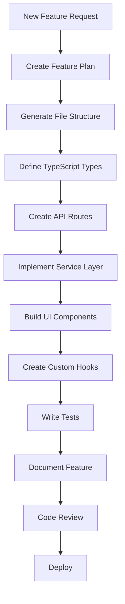

# Development Workflow Guide

## Purpose

This document defines the automated development workflow for creating new features in the LightDom platform, ensuring consistency, quality, and enterprise standards.

## Feature Development Workflow



## Automated Scaffolding

### 1. Feature Initialization Script

**Location**: `scripts/create-feature.js`

**Usage**:
```bash
npm run create:feature -- --name=user-management --type=full-stack
```

**Generates**:
```
src/
├── api/
│   └── user-management.ts          # API routes
├── services/
│   └── api/
│       └── UserManagementService.ts # Business logic
├── types/
│   └── user-management.ts          # Type definitions
├── components/
│   └── user-management/
│       ├── UserList.tsx
│       ├── UserForm.tsx
│       └── index.ts
├── hooks/
│   └── useUserManagement.ts        # Custom hooks
├── pages/
│   └── admin/
│       └── UserManagementPage.tsx  # Page component
└── __tests__/
    └── user-management.test.ts     # Tests
```

### 2. Component Generator

**Usage**:
```bash
npm run create:component -- --name=PaymentButton --category=payments
```

**Template**:
```typescript
import React from 'react';
import { Button } from '@/components/ui/Button';
import type { PaymentButtonProps } from '@/types/payments';

export const PaymentButton: React.FC<PaymentButtonProps> = ({ 
  amount, 
  onSuccess, 
  onError 
}) => {
  // Component implementation
  return (
    <Button onClick={handlePayment}>
      Pay ${amount}
    </Button>
  );
};
```

### 3. Service Generator

**Usage**:
```bash
npm run create:service -- --name=StripePayment --layer=api
```

**Template**:
```typescript
import { EventEmitter } from 'events';
import { Logger } from '@/utils/Logger';
import type { PaymentConfig } from '@/types/payments';

export class StripePaymentService extends EventEmitter {
  private logger: Logger;
  private config: PaymentConfig;

  constructor(config: PaymentConfig) {
    super();
    this.logger = new Logger('StripePaymentService');
    this.config = config;
  }

  async initialize(): Promise<void> {
    this.logger.info('Initializing Stripe service...');
    // Implementation
  }

  async createPayment(amount: number): Promise<PaymentResult> {
    // Implementation
  }
}

export const stripePaymentService = new StripePaymentService(config);
```

### 4. API Route Generator

**Usage**:
```bash
npm run create:api -- --name=payments --methods=get,post,put,delete
```

**Template**:
```typescript
import { Router } from 'express';
import { stripePaymentService } from '@/services/api/StripePaymentService';
import { authMiddleware } from '@/middleware/auth';
import type { Request, Response } from 'express';

const router = Router();

// GET /api/payments
router.get('/', authMiddleware, async (req: Request, res: Response) => {
  try {
    const payments = await stripePaymentService.listPayments();
    res.json({ success: true, data: payments });
  } catch (error) {
    res.status(500).json({ success: false, error: error.message });
  }
});

// POST /api/payments
router.post('/', authMiddleware, async (req: Request, res: Response) => {
  try {
    const payment = await stripePaymentService.createPayment(req.body);
    res.json({ success: true, data: payment });
  } catch (error) {
    res.status(500).json({ success: false, error: error.message });
  }
});

export default router;
```

## Standard File Structure

### Feature Module Structure

```
feature-name/
├── types/                    # Type definitions
│   ├── index.ts
│   ├── requests.ts
│   ├── responses.ts
│   └── models.ts
├── api/                      # API routes
│   └── feature-name.ts
├── services/                 # Business logic
│   ├── FeatureService.ts
│   └── FeatureRepository.ts
├── components/               # UI components
│   ├── FeatureList.tsx
│   ├── FeatureDetail.tsx
│   ├── FeatureForm.tsx
│   └── index.ts
├── hooks/                    # Custom hooks
│   ├── useFeature.ts
│   └── useFeatureForm.ts
├── pages/                    # Page components
│   └── FeaturePage.tsx
├── utils/                    # Utilities
│   └── feature-helpers.ts
└── __tests__/               # Tests
    ├── FeatureService.test.ts
    ├── FeatureComponent.test.tsx
    └── integration.test.ts
```

## Code Standards

### TypeScript Standards

**1. Type Definitions**
```typescript
// ✅ Good - Specific types
export interface User {
  id: string;
  email: string;
  name: string;
  role: 'admin' | 'user' | 'client';
  createdAt: Date;
}

// ❌ Bad - Using any
export interface User {
  id: string;
  data: any; // Don't do this
}
```

**2. Service Implementation**
```typescript
// ✅ Good - Class-based service with dependency injection
export class UserService {
  constructor(
    private repository: UserRepository,
    private logger: Logger
  ) {}

  async getUser(id: string): Promise<User> {
    this.logger.info(`Fetching user ${id}`);
    return this.repository.findById(id);
  }
}

// ❌ Bad - Global state, no DI
let currentUser: User | null = null;
export function getUser() {
  return currentUser;
}
```

### React Standards

**1. Component Structure**
```typescript
// ✅ Good - Functional component with TypeScript
import React, { useState, useEffect } from 'react';
import type { ComponentProps } from './types';

export const MyComponent: React.FC<ComponentProps> = ({ 
  title, 
  onAction 
}) => {
  const [state, setState] = useState<StateType>(initialState);

  useEffect(() => {
    // Side effects
  }, [dependencies]);

  return (
    <div className="my-component">
      <h1>{title}</h1>
    </div>
  );
};

// ❌ Bad - Class component, no types
export class MyComponent extends React.Component {
  render() {
    return <div>{this.props.title}</div>;
  }
}
```

**2. Hooks Pattern**
```typescript
// ✅ Good - Custom hook with TypeScript
export const useUser = (userId: string) => {
  const [user, setUser] = useState<User | null>(null);
  const [loading, setLoading] = useState(true);
  const [error, setError] = useState<Error | null>(null);

  useEffect(() => {
    const fetchUser = async () => {
      try {
        setLoading(true);
        const data = await userService.getUser(userId);
        setUser(data);
      } catch (err) {
        setError(err as Error);
      } finally {
        setLoading(false);
      }
    };
    fetchUser();
  }, [userId]);

  return { user, loading, error };
};
```

### Design System Integration

**1. Use Design Tokens**
```typescript
// ✅ Good - Using design tokens
import { colors, spacing } from '@/design-system/tokens';

const styles = {
  backgroundColor: colors.primary[500],
  padding: spacing.md,
};

// ❌ Bad - Magic numbers and hard-coded colors
const styles = {
  backgroundColor: '#3B82F6',
  padding: '16px',
};
```

**2. Use Design System Components**
```typescript
// ✅ Good - Using design system components
import { Button, Card, Input } from '@/design-system/components';

export const MyForm = () => (
  <Card>
    <Input label="Email" type="email" />
    <Button variant="primary">Submit</Button>
  </Card>
);

// ❌ Bad - Creating custom styled components
const MyButton = styled.button`
  background: blue;
  padding: 10px;
`;
```

## Testing Standards

### 1. Unit Tests
```typescript
// services/__tests__/UserService.test.ts
import { describe, it, expect, beforeEach } from 'vitest';
import { UserService } from '../UserService';

describe('UserService', () => {
  let service: UserService;

  beforeEach(() => {
    service = new UserService(mockRepository, mockLogger);
  });

  it('should fetch user by id', async () => {
    const user = await service.getUser('123');
    expect(user.id).toBe('123');
  });
});
```

### 2. Component Tests
```typescript
// components/__tests__/UserList.test.tsx
import { render, screen } from '@testing-library/react';
import { UserList } from '../UserList';

describe('UserList', () => {
  it('should render user list', () => {
    render(<UserList users={mockUsers} />);
    expect(screen.getByText('John Doe')).toBeInTheDocument();
  });
});
```

### 3. Integration Tests
```typescript
// __tests__/integration/user-flow.test.ts
import { setupTestServer } from '@/test-utils';

describe('User Management Flow', () => {
  it('should create and fetch user', async () => {
    const response = await fetch('/api/users', {
      method: 'POST',
      body: JSON.stringify({ email: 'test@example.com' })
    });
    expect(response.ok).toBe(true);
  });
});
```

## Documentation Standards

### 1. Inline Documentation
```typescript
/**
 * Creates a new payment transaction
 * 
 * @param amount - Amount in cents
 * @param currency - ISO currency code (e.g., 'USD')
 * @param customerId - Stripe customer ID
 * @returns Payment intent with client secret
 * @throws {PaymentError} If payment creation fails
 * 
 * @example
 * ```typescript
 * const payment = await createPayment(1000, 'USD', 'cus_123');
 * ```
 */
export async function createPayment(
  amount: number,
  currency: string,
  customerId: string
): Promise<PaymentIntent> {
  // Implementation
}
```

### 2. README Files
Each feature should have a README.md:

```markdown
# Feature Name

## Overview
Brief description of the feature.

## Installation
```bash
npm install
```

## Usage
```typescript
import { FeatureService } from '@/services/api/FeatureService';
const service = new FeatureService();
```

## API
- `GET /api/feature` - List items
- `POST /api/feature` - Create item

## Components
- `FeatureList` - Displays list of items
- `FeatureForm` - Create/edit form

## Testing
```bash
npm run test -- feature
```
```

## Git Workflow

### Branch Naming
```
feature/payment-integration
bugfix/login-error
refactor/service-layer
docs/api-documentation
```

### Commit Messages
```
feat: add Stripe payment integration
fix: resolve login redirect issue
refactor: extract payment service
docs: update API documentation
test: add user service tests
```

### Pull Request Template
```markdown
## Description
Brief description of changes

## Type of Change
- [ ] Feature
- [ ] Bug fix
- [ ] Refactoring
- [ ] Documentation

## Checklist
- [ ] Tests added/updated
- [ ] Documentation updated
- [ ] Design system compliance checked
- [ ] TypeScript types defined
- [ ] No console.log statements
```

## Automation Scripts

### Available Scripts

```json
{
  "create:feature": "node scripts/create-feature.js",
  "create:component": "node scripts/create-component.js",
  "create:service": "node scripts/create-service.js",
  "create:api": "node scripts/create-api.js",
  "create:hook": "node scripts/create-hook.js",
  "create:types": "node scripts/create-types.js"
}
```

## Quality Gates

### Pre-commit Checks
1. ESLint validation
2. TypeScript compilation
3. Prettier formatting
4. Unit tests pass

### Pre-push Checks
1. All tests pass
2. No TypeScript errors
3. No ESLint errors
4. Test coverage > 80%

### CI/CD Pipeline
1. Lint
2. Type check
3. Unit tests
4. Integration tests
5. Build
6. Deploy

## Next Steps

1. Create scaffolding scripts in `/scripts`
2. Setup testing infrastructure
3. Configure CI/CD pipeline
4. Create component templates
5. Document all existing features

## Related Documents

- [Architecture Documentation](./ARCHITECTURE_DOCUMENTATION.md)
- [File Audit](./FILE_AUDIT.md)
- [Design System](./DESIGN_SYSTEM.md)
