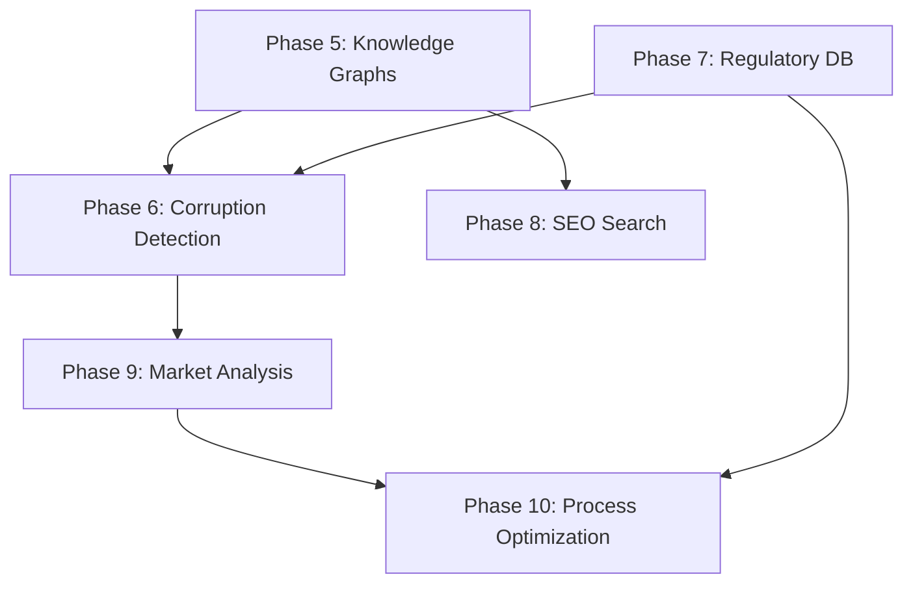

# Future Phases Roadmap: Advanced Medical Insurance Intelligence System

## Executive Summary

This document outlines Phases 5-10 of the medical insurance intelligence platform, building on the foundation established in Phases 1-4. These advanced features include knowledge graph construction, corruption pattern detection, regulatory compliance analysis, SEO-optimized search, market power analysis, and process optimization.

**Current Status:** Phases 1-4 Complete
- ✅ Phase 1: Daily Export System
- ✅ Phase 2: React Dashboard UI
- ✅ Phase 3: Package Intelligence
- ✅ Phase 4: Incident Simulation Engine

**Next Phases:** 5-10 (This Document)

---

## Phase 5: Knowledge Graph Construction

### Overview
Build interconnected relationship graphs linking insurance plans, incidents, companies, reviews, regulations, and claims outcomes to reveal hidden patterns and relationships.

### Database Requirements

#### New Tables

```sql
-- Knowledge graph nodes
CREATE TABLE kg_entities (
  id UUID PRIMARY KEY DEFAULT gen_random_uuid(),
  entity_type VARCHAR(50) NOT NULL, -- 'plan', 'provider', 'incident', 'regulation', 'claim', 'person'
  entity_id VARCHAR(255) NOT NULL,
  label VARCHAR(255) NOT NULL,
  properties JSONB,
  created_at TIMESTAMP DEFAULT NOW(),
  UNIQUE(entity_type, entity_id)
);

-- Knowledge graph relationships
CREATE TABLE kg_relationships (
  id UUID PRIMARY KEY DEFAULT gen_random_uuid(),
  source_entity_id UUID REFERENCES kg_entities(id),
  target_entity_id UUID REFERENCES kg_entities(id),
  relationship_type VARCHAR(100) NOT NULL, -- 'covers', 'excludes', 'owned_by', 'violates', 'relates_to'
  properties JSONB,
  confidence_score DECIMAL(3,2), -- 0.00 to 1.00
  evidence_sources JSONB[], -- array of source documents
  created_at TIMESTAMP DEFAULT NOW()
);

-- Graph query cache
CREATE TABLE kg_query_cache (
  id SERIAL PRIMARY KEY,
  query_hash VARCHAR(64) UNIQUE,
  query_text TEXT,
  result_graph JSONB,
  execution_time_ms INTEGER,
  created_at TIMESTAMP DEFAULT NOW(),
  last_accessed TIMESTAMP DEFAULT NOW()
);
```

### Technology Stack

**Graph Database:**
- **Neo4j** (primary recommendation)
  - Native graph processing
  - Cypher query language
  - Excellent visualization
  - Pattern matching capabilities
  
**Alternative:**
- **PostgreSQL with Apache AGE** (graph extension)
  - Keeps everything in PostgreSQL
  - OpenCypher compatible
  - Lower operational complexity

### Key Features

#### 1. Entity Extraction & Linking
```javascript
// services/knowledge-graph-builder.js

async function extractEntities(text, sourceType) {
  // NLP-based entity extraction
  const entities = {
    providers: extractProviderNames(text),
    plans: extractPlanNames(text),
    procedures: extractMedicalProcedures(text),
    regulations: extractRegulatoryReferences(text),
    people: extractPersonEntities(text)
  };
  
  // Link to existing entities or create new ones
  return await linkOrCreateEntities(entities);
}
```

#### 2. Relationship Discovery
- Automated relationship extraction from:
  - Claims data (plan → covers → procedure)
  - Reviews (person → experienced → incident → with → plan)
  - Regulations (regulation → requires → provider → to → action)
  - News articles (provider → involved_in → incident)

#### 3. Graph Visualization
- Interactive force-directed graph
- Filterable by entity type
- Zoomable and explorable
- Shortest path queries
- Community detection

#### 4. Query Examples

```cypher
// Find all plans that cover a specific procedure
MATCH (plan:Plan)-[r:COVERS]->(proc:Procedure {name: 'Hip Replacement'})
WHERE r.confidence > 0.8
RETURN plan.name, r.coverage_limit, r.exclusions

// Detect denial patterns
MATCH (plan:Plan)-[denied:DENIED_CLAIM]->(proc:Procedure)
WITH plan, COUNT(denied) as denial_count
WHERE denial_count > 50
RETURN plan.name, denial_count
ORDER BY denial_count DESC

// Find regulatory violations
MATCH (provider:Provider)-[violates:VIOLATES]->(regulation:Regulation)
MATCH (regulation)-[requires:REQUIRES]->(action:Action)
WHERE violates.severity = 'high'
RETURN provider.name, regulation.code, action.description, violates.evidence
```

### Implementation Timeline
- Month 1: Database setup, entity extraction pipeline
- Month 2: Relationship discovery, graph population
- Month 3: Visualization UI, query interface
- Month 4: Testing, optimization, documentation

### Success Metrics
- Entity extraction accuracy: >90%
- Relationship confidence: >85%
- Query response time: <2 seconds
- Graph size: 100,000+ nodes, 500,000+ relationships

---

## Phase 6: Corruption Pattern Detection

### Overview
Analyze claims data for anomalies, suspicious patterns, and potential rule violations using ML-powered anomaly detection and pattern recognition.

### Database Requirements

```sql
-- Anomaly detection results
CREATE TABLE anomaly_detections (
  id UUID PRIMARY KEY DEFAULT gen_random_uuid(),
  anomaly_type VARCHAR(100) NOT NULL, -- 'claim_denial_spike', 'price_manipulation', 'selective_coverage'
  severity VARCHAR(20), -- 'low', 'medium', 'high', 'critical'
  entity_id VARCHAR(255),
  entity_type VARCHAR(50),
  detection_date TIMESTAMP DEFAULT NOW(),
  anomaly_score DECIMAL(5,2), -- 0.00 to 100.00
  evidence JSONB,
  false_positive BOOLEAN DEFAULT false,
  investigated BOOLEAN DEFAULT false,
  notes TEXT
);

-- Pattern analysis
CREATE TABLE pattern_analysis (
  id UUID PRIMARY KEY DEFAULT gen_random_uuid(),
  pattern_type VARCHAR(100),
  pattern_description TEXT,
  affected_entities JSONB[],
  frequency_count INTEGER,
  first_detected TIMESTAMP,
  last_detected TIMESTAMP,
  statistical_significance DECIMAL(5,4), -- p-value
  visualizations JSONB -- chart configs
);

-- Regulatory violations
CREATE TABLE regulatory_violations (
  id UUID PRIMARY KEY DEFAULT gen_random_uuid(),
  provider_id VARCHAR(255),
  regulation_code VARCHAR(100),
  violation_type VARCHAR(100),
  description TEXT,
  evidence_sources JSONB[],
  detected_date TIMESTAMP DEFAULT NOW(),
  severity VARCHAR(20),
  reported_to_authority BOOLEAN DEFAULT false,
  report_date TIMESTAMP,
  resolution_status VARCHAR(50)
);
```

### Detection Algorithms

#### 1. Claim Denial Anomalies
```python
# services/anomaly-detection/claim-denial-detector.py

import pandas as pd
from sklearn.ensemble import IsolationForest

def detect_denial_anomalies(claims_data):
    """
    Detect providers with abnormally high claim denial rates
    """
    # Feature engineering
    features = [
        'denial_rate',
        'average_claim_amount',
        'denial_response_time',
        'appeals_success_rate',
        'procedure_complexity_score'
    ]
    
    # Isolation Forest for anomaly detection
    model = IsolationForest(contamination=0.1, random_state=42)
    anomaly_scores = model.fit_predict(claims_data[features])
    
    # Flag anomalies
    anomalies = claims_data[anomaly_scores == -1]
    
    return {
        'anomalies': anomalies,
        'severity': calculate_severity(anomalies),
        'evidence': gather_evidence(anomalies)
    }
```

#### 2. Price Manipulation Detection
- Statistical analysis of price changes over time
- Correlation with competitor pricing
- Sudden unexplained price spikes
- Hidden fee detection

#### 3. Selective Coverage Patterns
- Demographic bias analysis
- Age/gender discrimination detection
- Geographic exclusion patterns
- Pre-existing condition targeting

#### 4. Rule Violation Detection
```javascript
// services/rule-violation-detector.js

async function detectRuleViolations(provider) {
  const violations = [];
  
  // Check mandatory coverage requirements
  const mandatoryProcedures = await getMandatoryProcedures();
  for (const procedure of mandatoryProcedures) {
    if (!provider.covers(procedure)) {
      violations.push({
        type: 'missing_mandatory_coverage',
        regulation: 'Medical Schemes Act Section 67',
        severity: 'high',
        evidence: `Does not cover PMB: ${procedure.name}`
      });
    }
  }
  
  // Check waiting period compliance
  if (provider.waitingPeriod > 90) {
    violations.push({
      type: 'excessive_waiting_period',
      regulation: 'MSA Regulation 15.7',
      severity: 'medium',
      evidence: `Waiting period: ${provider.waitingPeriod} days (max: 90)`
    });
  }
  
  // Check premium increase limits
  const annualIncrease = calculateAnnualIncrease(provider);
  if (annualIncrease > 15) {
    violations.push({
      type: 'excessive_premium_increase',
      regulation: 'CMS Circular 38/2023',
      severity: 'high',
      evidence: `Annual increase: ${annualIncrease}% (guideline: <10%)`
    });
  }
  
  return violations;
}
```

### Visualization Dashboard

#### Corruption Heatmap
- Geographic distribution of violations
- Provider comparison matrix
- Temporal trend analysis
- Severity color-coding

#### Pattern Explorer
- Interactive timeline of detected patterns
- Drill-down to individual cases
- Evidence viewer with source links
- Export investigation reports

### Legal & Ethical Considerations

⚠️ **CRITICAL: Legal Compliance Required**

1. **Defamation Protection:**
   - Label findings as "potential" or "suspected"
   - Require manual review before publishing
   - Provide right of response to implicated parties
   - Document evidence chain meticulously

2. **Data Privacy:**
   - Anonymize individual claim data
   - Aggregate patterns only
   - POPIA compliance mandatory
   - Secure access controls

3. **Whistleblower Protection:**
   - Secure reporting mechanism
   - Confidential source protection
   - Legal consultation before action

4. **Reporting Requirements:**
   - Mandatory reporting to Council for Medical Schemes (CMS)
   - Financial Services Conduct Authority (FSCA) notification
   - Consumer protection reporting

### Implementation Timeline
- Month 1: Detection algorithms, database setup
- Month 2: Pattern analysis, violation detection
- Month 3: Dashboard UI, evidence gathering
- Month 4: Legal review, testing, documentation

---

## Phase 7: Regulatory Compliance Database

### Overview
Index all South African medical insurance regulations and create a searchable, queryable database that can be compared against provider practices.

### Data Sources

#### Primary Sources
1. **Medical Schemes Act 131 of 1998**
2. **CMS Regulations** (Council for Medical Schemes)
3. **FSCA Regulations** (Financial Sector Conduct Authority)
4. **POPIA** (Protection of Personal Information Act)
5. **Consumer Protection Act**
6. **Prescribed Minimum Benefits (PMBs)**

#### Secondary Sources
- CMS Circulars and Guidance Notes
- Case law and precedents
- Industry guidelines
- International best practices (for comparison)

### Database Schema

```sql
-- Regulatory documents
CREATE TABLE regulations (
  id UUID PRIMARY KEY DEFAULT gen_random_uuid(),
  regulation_code VARCHAR(100) UNIQUE NOT NULL,
  title TEXT NOT NULL,
  category VARCHAR(100), -- 'coverage', 'pricing', 'administration', 'conduct'
  authority VARCHAR(100), -- 'CMS', 'FSCA', 'Parliament'
  effective_date DATE,
  superseded_date DATE,
  full_text TEXT,
  summary TEXT,
  document_url TEXT,
  created_at TIMESTAMP DEFAULT NOW()
);

-- Regulatory requirements (parsed rules)
CREATE TABLE regulatory_requirements (
  id UUID PRIMARY KEY DEFAULT gen_random_uuid(),
  regulation_id UUID REFERENCES regulations(id),
  requirement_code VARCHAR(100),
  requirement_text TEXT NOT NULL,
  applies_to VARCHAR(100), -- 'all_schemes', 'open_schemes', 'administrators'
  mandatory BOOLEAN DEFAULT true,
  penalty_for_violation TEXT,
  verification_method TEXT,
  last_verified TIMESTAMP
);

-- Compliance checks
CREATE TABLE compliance_checks (
  id UUID PRIMARY KEY DEFAULT gen_random_uuid(),
  provider_id VARCHAR(255),
  requirement_id UUID REFERENCES regulatory_requirements(id),
  check_date TIMESTAMP DEFAULT NOW(),
  compliant BOOLEAN,
  evidence JSONB,
  auditor_notes TEXT,
  next_check_date DATE
);

-- Regulation citations (for ML training)
CREATE TABLE regulation_citations (
  id UUID PRIMARY KEY DEFAULT gen_random_uuid(),
  regulation_id UUID REFERENCES regulations(id),
  cited_in_document VARCHAR(255), -- case number, article URL
  citation_context TEXT,
  outcome VARCHAR(100), -- 'upheld', 'violation_found', 'dismissed'
  citation_date DATE
);
```

### Document Processing Pipeline

```javascript
// services/regulation-indexer.js

async function indexRegulation(pdfPath) {
  // 1. PDF extraction
  const text = await extractTextFromPDF(pdfPath);
  
  // 2. Structure parsing
  const sections = parseRegulationStructure(text);
  
  // 3. Requirement extraction
  const requirements = extractRequirements(sections);
  
  // 4. Entity recognition
  const entities = {
    obligations: extractObligations(text),
    prohibitions: extractProhibitions(text),
    timeframes: extractTimeframes(text),
    penalties: extractPenalties(text)
  };
  
  // 5. Cross-reference linking
  const references = linkCrossReferences(text, existingRegulations);
  
  // 6. Store in database
  return await storeRegulation({
    text,
    sections,
    requirements,
    entities,
    references
  });
}
```

### Compliance Checker

```javascript
// services/compliance-checker.js

async function checkProviderCompliance(providerId) {
  const provider = await getProvider(providerId);
  const requirements = await getApplicableRequirements(provider.type);
  
  const results = [];
  
  for (const req of requirements) {
    const check = await performComplianceCheck(provider, req);
    results.push({
      requirement: req.requirement_code,
      compliant: check.compliant,
      evidence: check.evidence,
      severity: req.mandatory ? 'critical' : 'advisory'
    });
  }
  
  return generateComplianceReport(results);
}

async function performComplianceCheck(provider, requirement) {
  switch (requirement.verification_method) {
    case 'document_review':
      return await checkDocumentation(provider, requirement);
    
    case 'data_analysis':
      return await analyzeProviderData(provider, requirement);
    
    case 'coverage_verification':
      return await verifyCoverage(provider, requirement);
    
    case 'pricing_review':
      return await reviewPricing(provider, requirement);
    
    default:
      return { compliant: null, evidence: 'Manual review required' };
  }
}
```

### Search & Query Interface

```javascript
// API endpoints

// Search regulations
GET /api/regulations/search?q=waiting+period&category=coverage

// Get compliance status
GET /api/providers/{id}/compliance

// Compare provider to requirements
GET /api/providers/{id}/compliance/gaps

// Get regulation details
GET /api/regulations/{code}

// Get all regulations affecting a provider type
GET /api/regulations/applicable?provider_type=open_scheme
```

### Implementation Timeline
- Month 1: Document acquisition, database design
- Month 2: NLP pipeline, requirement extraction
- Month 3: Compliance checker, verification methods
- Month 4: Search interface, API development
- Month 5: Testing, legal review, documentation

---

## Phase 8: SEO-Optimized Search with Rich Snippets

### Overview
Create an advanced search component with rich snippet injection, structured data markup, and call-to-action optimization for lead conversion.

### Technical Architecture

#### 1. Search Component

```typescript
// src/components/RichSnippetSearch.tsx

import React, { useState, useEffect } from 'react';
import { useDebounce } from '@/hooks/useDebounce';
import { RichSnippetCard } from './RichSnippetCard';

interface SearchResult {
  id: string;
  title: string;
  description: string;
  snippet: RichSnippet;
  cta: CallToAction;
  structuredData: Schema.org;
}

export function RichSnippetSearch() {
  const [query, setQuery] = useState('');
  const [results, setResults] = useState<SearchResult[]>([]);
  const debouncedQuery = useDebounce(query, 300);
  
  useEffect(() => {
    if (debouncedQuery.length >= 3) {
      searchWithRichSnippets(debouncedQuery);
    }
  }, [debouncedQuery]);
  
  async function searchWithRichSnippets(q: string) {
    const response = await fetch(`/api/search/rich?q=${encodeURIComponent(q)}`);
    const data = await response.json();
    setResults(data.results);
  }
  
  return (
    <div className="rich-snippet-search">
      <input
        type="search"
        value={query}
        onChange={(e) => setQuery(e.target.value)}
        placeholder="Search medical aid plans, procedures, reviews..."
        className="search-input"
      />
      
      <div className="results-container">
        {results.map(result => (
          <RichSnippetCard
            key={result.id}
            title={result.title}
            description={result.description}
            snippet={result.snippet}
            cta={result.cta}
            structuredData={result.structuredData}
          />
        ))}
      </div>
    </div>
  );
}
```

#### 2. Rich Snippet Generator

```javascript
// services/rich-snippet-generator.js

function generateRichSnippet(entity, entityType) {
  switch (entityType) {
    case 'insurance_plan':
      return {
        '@context': 'https://schema.org',
        '@type': 'InsuranceAgency',
        'name': entity.name,
        'description': entity.description,
        'priceRange': entity.priceRange,
        'aggregateRating': {
          '@type': 'AggregateRating',
          'ratingValue': entity.rating,
          'reviewCount': entity.reviewCount
        },
        'offers': {
          '@type': 'Offer',
          'price': entity.monthlyPremium,
          'priceCurrency': 'ZAR',
          'availability': 'https://schema.org/InStock'
        }
      };
    
    case 'medical_procedure':
      return {
        '@context': 'https://schema.org',
        '@type': 'MedicalProcedure',
        'name': entity.name,
        'procedureType': entity.type,
        'bodyLocation': entity.bodyPart,
        'preparation': entity.preparation,
        'followup': entity.followup,
        'howPerformed': entity.steps,
        'typical_cost': {
          '@type': 'MonetaryAmount',
          'currency': 'ZAR',
          'value': entity.averageCost
        }
      };
    
    case 'provider':
      return {
        '@context': 'https://schema.org',
        '@type': 'Organization',
        'name': entity.name,
        'logo': entity.logoUrl,
        'url': entity.websiteUrl,
        'contactPoint': {
          '@type': 'ContactPoint',
          'telephone': entity.phone,
          'contactType': 'customer service',
          'areaServed': 'ZA'
        },
        'aggregateRating': {
          '@type': 'AggregateRating',
          'ratingValue': entity.trustScore,
          'bestRating': '100',
          'ratingCount': entity.reviewCount
        }
      };
  }
}
```

#### 3. Header Injection Script

```javascript
// public/rich-snippet-injector.js

(function() {
  'use strict';
  
  // Wait for DOM to load
  if (document.readyState === 'loading') {
    document.addEventListener('DOMContentLoaded', injectRichSnippets);
  } else {
    injectRichSnippets();
  }
  
  async function injectRichSnippets() {
    // Find search component
    const searchComponent = document.querySelector('[data-lightdom-search]');
    if (!searchComponent) return;
    
    // Get page context
    const pageType = searchComponent.dataset.pageType;
    const entityId = searchComponent.dataset.entityId;
    
    // Fetch relevant snippets
    const snippets = await fetchRelevantSnippets(pageType, entityId);
    
    // Inject structured data
    snippets.forEach(snippet => {
      const script = document.createElement('script');
      script.type = 'application/ld+json';
      script.text = JSON.stringify(snippet.structuredData);
      document.head.appendChild(script);
    });
    
    // Enhance search results
    enhanceSearchResults(searchComponent, snippets);
  }
  
  function enhanceSearchResults(container, snippets) {
    // Add rich preview cards
    // Add star ratings
    // Add pricing info
    // Add CTAs
  }
})();
```

#### 4. Call-to-Action Optimizer

```javascript
// services/cta-optimizer.js

function optimizeCTA(user, searchContext, result) {
  // A/B testing variants
  const variants = [
    {
      text: 'Get a Quote',
      style: 'primary',
      urgency: 'low',
      conversion_rate: 0.08
    },
    {
      text: 'Compare Plans Now',
      style: 'secondary',
      urgency: 'medium',
      conversion_rate: 0.12
    },
    {
      text: 'Save R500/month - Limited Time',
      style: 'urgent',
      urgency: 'high',
      conversion_rate: 0.18
    }
  ];
  
  // ML-based selection
  const selectedVariant = selectBestVariant(
    variants,
    user.profile,
    searchContext,
    result.type
  );
  
  return {
    ...selectedVariant,
    href: generateTrackingURL(result.id, selectedVariant.text),
    analytics: {
      event: 'cta_click',
      variant: selectedVariant.text,
      context: searchContext.query
    }
  };
}
```

### SEO Enhancements

#### 1. Meta Tags Generation
```javascript
function generateSEOMetaTags(page) {
  return {
    title: `${page.title} | LightDom Medical Insurance`,
    description: page.metaDescription,
    keywords: page.keywords.join(', '),
    'og:title': page.title,
    'og:description': page.metaDescription,
    'og:image': page.featuredImage,
    'og:type': 'website',
    'twitter:card': 'summary_large_image',
    'twitter:title': page.title,
    'twitter:description': page.metaDescription,
    canonical: page.canonicalUrl
  };
}
```

#### 2. Sitemap Generation
```xml
<!-- Auto-generated sitemap -->
<urlset xmlns="http://www.sitemaps.org/schemas/sitemap/0.9">
  <url>
    <loc>https://lightdom.io/plans/discovery-health-coastal-saver</loc>
    <lastmod>2025-11-18</lastmod>
    <changefreq>weekly</changefreq>
    <priority>0.8</priority>
  </url>
  <!-- Auto-populated from database -->
</urlset>
```

### Implementation Timeline
- Month 1: Search component, snippet generator
- Month 2: Header injection, structured data
- Month 3: CTA optimization, A/B testing
- Month 4: SEO implementation, analytics integration

---

## Phase 9: Market Power Analysis

### Overview
Identify market concentration, middlemen, and power dynamics in the South African medical insurance industry to find optimization opportunities.

### Analysis Frameworks

#### 1. Market Concentration Metrics

```sql
-- Calculate Herfindahl-Hirschman Index (HHI)
CREATE OR REPLACE FUNCTION calculate_market_hhi()
RETURNS DECIMAL AS $$
DECLARE
  hhi DECIMAL := 0;
  provider_record RECORD;
BEGIN
  FOR provider_record IN 
    SELECT 
      provider_id,
      (member_count::DECIMAL / (SELECT SUM(member_count) FROM providers) * 100) as market_share
    FROM providers
  LOOP
    hhi := hhi + POWER(provider_record.market_share, 2);
  END LOOP;
  
  RETURN hhi;
END;
$$ LANGUAGE plpgsql;

-- HHI Interpretation:
-- < 1,500: Competitive market
-- 1,500 - 2,500: Moderate concentration
-- > 2,500: High concentration (potential monopoly concerns)
```

#### 2. Middleman Identification

```javascript
// services/middleman-analyzer.js

async function identifyMiddlemen() {
  // Analyze value chain
  const valueChain = await buildValueChain();
  
  // Identify intermediaries
  const intermediaries = valueChain.filter(entity => {
    return entity.role === 'intermediary' &&
           entity.value_add < entity.cost_impact;
  });
  
  // Calculate rent extraction
  for (const middleman of intermediaries) {
    middleman.rentExtraction = calculateRentExtraction(middleman);
    middleman.eliminationImpact = simulateElimination(middleman);
  }
  
  return intermediaries;
}

function calculateRentExtraction(entity) {
  const totalCost = entity.fees + entity.commissions + entity.margins;
  const valueProvided = estimateValueProvided(entity.services);
  return totalCost - valueProvided; // Rent = Cost - Value
}
```

#### 3. Power Dynamics Mapping

```javascript
// Network analysis to identify power centers

function analyzePowerDynamics(entities, relationships) {
  const graph = buildNetworkGraph(entities, relationships);
  
  // Calculate centrality measures
  const metrics = {
    degree: calculateDegreeCentrality(graph),
    betweenness: calculateBetweennessCentrality(graph),
    eigenvector: calculateEigenvectorCentrality(graph),
    pagerank: calculatePageRank(graph)
  };
  
  // Identify power brokers
  const powerBrokers = entities.filter(e => {
    return metrics.betweenness[e.id] > 0.7 || // High control over flows
           metrics.eigenvector[e.id] > 0.8;    // Connected to other powerful entities
  });
  
  return {
    powerBrokers,
    metrics,
    chokePoints: identifyChokePoints(graph, metrics)
  };
}
```

### Optimization Strategies

#### 1. Direct-to-Consumer Models
```javascript
const optimizations = [
  {
    strategy: 'eliminate_broker',
    target: 'insurance_brokers',
    potential_savings: 'R150-300 per member per month',
    implementation: 'Direct digital enrollment platform',
    challenges: ['Regulatory approval', 'Consumer trust', 'Marketing reach']
  },
  {
    strategy: 'blockchain_claims',
    target: 'claims_administrators',
    potential_savings: 'R50-100 per claim',
    implementation: 'Smart contract automation',
    challenges: ['Technology adoption', 'Provider integration', 'Data privacy']
  }
];
```

#### 2. Service Optimization
- Identify valuable intermediary services worth preserving
- Enhance efficiency through technology
- Create alternative delivery models
- Expand access to underserved markets

### Implementation Timeline
- Month 1: Data collection, market analysis
- Month 2: Value chain mapping, middleman identification
- Month 3: Power dynamics analysis, optimization modeling
- Month 4: Strategy development, feasibility studies

---

## Phase 10: Process Optimization & Simulation

### Overview
Simulate alternative service delivery models, optimize existing processes, and identify non-essential steps in the insurance value chain.

### Simulation Engine

```javascript
// services/process-simulator.js

class InsuranceProcessSimulator {
  constructor(currentProcess) {
    this.currentProcess = currentProcess;
    this.alternativeModels = [];
  }
  
  async simulateAlternative(modifications) {
    const altProcess = this.applyModifications(this.currentProcess, modifications);
    
    // Monte Carlo simulation
    const results = await this.runSimulation(altProcess, {
      iterations: 10000,
      timeHorizon: '1 year',
      variabilityFactors: ['claim_volume', 'processing_times', 'error_rates']
    });
    
    return {
      process: altProcess,
      metrics: {
        avgProcessingTime: results.processingTime.mean,
        costPerClaim: results.cost.mean,
        errorRate: results.errors.mean,
        customerSatisfaction: results.satisfaction.mean
      },
      comparison: this.compareToBaseline(results),
      riskAnalysis: this.analyzeRisks(results)
    };
  }
  
  identifyWasteSteps() {
    return this.currentProcess.steps.filter(step => {
      return step.valueAdd < step.cost ||
             step.timeSpent > step.necessaryTime ||
             step.errorRate > 0.05;
    });
  }
  
  optimizeProcess() {
    // Remove waste
    const wasteSteps = this.identifyWasteSteps();
    
    // Automate repetitive tasks
    const automationOpportunities = this.findAutomationOpportunities();
    
    // Parallelize sequential steps
    const parallelizationOps = this.findParallelization();
    
    return {
      removedSteps: wasteSteps,
      automatedSteps: automationOpportunities,
      parallelizedSteps: parallelizationOps,
      projectedImpact: this.calculateImpact()
    };
  }
}
```

### Use Cases

#### 1. Claims Processing Optimization
```javascript
// Current process: 15 steps, 7-10 days
const currentClaimsProcess = {
  steps: [
    { name: 'Claim Submission', time: 0.5, cost: 50, valueAdd: 100 },
    { name: 'Data Entry', time: 1, cost: 80, valueAdd: 20 }, // LOW VALUE
    { name: 'Duplicate Check', time: 0.5, cost: 40, valueAdd: 60 },
    { name: 'Manual Review', time: 2, cost: 200, valueAdd: 150 }, // AUTOMATE
    { name: 'Approval Request', time: 24, cost: 100, valueAdd: 80 }, // SLOW
    // ... more steps
  ]
};

// Optimized process: 8 steps, 2-3 days
const optimizedProcess = optimizeClaimsProcess(currentClaimsProcess);
// - Eliminate manual data entry (OCR automation)
// - AI-powered duplicate detection
// - Automated approval for routine claims
// - Parallel processing where possible
// Result: 60% faster, 40% cheaper, same or better outcomes
```

#### 2. Customer Onboarding Simulation
```javascript
const onboardingModels = [
  {
    name: 'Traditional (Broker-based)',
    steps: 12,
    avgTime: '14 days',
    cost: 450,
    completionRate: 0.68
  },
  {
    name: 'Digital-First',
    steps: 6,
    avgTime: '2 days',
    cost: 120,
    completionRate: 0.82
  },
  {
    name: 'Hybrid (Assisted Digital)',
    steps: 8,
    avgTime: '5 days',
    cost: 200,
    completionRate: 0.89
  }
];

// Simulation shows Hybrid model optimal for SA market
```

### Implementation Timeline
- Month 1: Process mapping, data collection
- Month 2: Simulation engine development
- Month 3: Alternative model testing
- Month 4: Optimization recommendations, pilot programs

---

## Implementation Priority & Dependencies

### Recommended Implementation Order



### Resource Requirements

| Phase | Duration | Team Size | Key Skills |
|-------|----------|-----------|------------|
| Phase 5 | 4 months | 3-4 | Graph DB, NLP, Data Science |
| Phase 6 | 4 months | 4-5 | ML, Statistics, Legal |
| Phase 7 | 5 months | 3-4 | NLP, Legal, Data Engineering |
| Phase 8 | 4 months | 3-4 | Frontend, SEO, Backend |
| Phase 9 | 4 months | 2-3 | Economics, Data Analysis |
| Phase 10 | 4 months | 3-4 | Operations Research, Simulation |

**Total Timeline:** 18-24 months (with parallel execution)
**Total Team:** 6-8 engineers + domain experts

---

## Legal, Ethical & Compliance Considerations

### ⚠️ Critical Legal Review Required

1. **Defamation Risk:**
   - All corruption/violation findings must be labeled as "potential" or "suspected"
   - Require multiple independent verifications
   - Provide right of response before publication
   - Maintain insurance for legal defense

2. **Data Privacy (POPIA Compliance):**
   - Anonymize all personal data
   - Obtain consent for data processing
   - Implement right to erasure
   - Data protection impact assessments

3. **Competition Law:**
   - Avoid anti-competitive practices
   - Transparent pricing comparisons
   - Fair representation of all providers
   - No collusion or market manipulation

4. **Financial Services Regulation:**
   - Comply with FSCA requirements
   - Proper disclosures and disclaimers
   - No unauthorized financial advice
   - Regular audits and reporting

5. **Intellectual Property:**
   - Respect provider trademarks
   - Proper attribution of data sources
   - Fair use of copyrighted materials
   - License agreements for third-party data

### Recommended Legal Steps

1. Engage specialized legal counsel (insurance law + tech law)
2. Conduct legal risk assessment for each phase
3. Implement compliance monitoring systems
4. Create whistleblower protection procedures
5. Establish regulatory liaison relationships
6. Prepare incident response plans
7. Obtain appropriate insurance coverage

---

## Success Metrics

### Phase 5: Knowledge Graphs
- ✅ Entity extraction accuracy > 90%
- ✅ Graph query performance < 2 seconds
- ✅ 100,000+ entities mapped
- ✅ 500,000+ relationships discovered

### Phase 6: Corruption Detection
- ✅ Anomaly detection precision > 80%
- ✅ False positive rate < 10%
- ✅ Investigation conversion rate > 60%
- ✅ Regulatory reports filed > 10 per quarter

### Phase 7: Regulatory Compliance
- ✅ Regulation coverage > 95%
- ✅ Automated compliance checks > 80%
- ✅ Search relevance > 90%
- ✅ Provider compliance reports generated

### Phase 8: SEO Search
- ✅ Organic search traffic +200%
- ✅ Click-through rate > 5%
- ✅ Conversion rate > 3%
- ✅ Page load time < 2 seconds

### Phase 9: Market Analysis
- ✅ Market mapping completeness > 95%
- ✅ Power dynamics visualizations created
- ✅ Optimization strategies identified > 10
- ✅ Potential savings calculated (millions of Rand)

### Phase 10: Process Optimization
- ✅ Processes simulated > 50
- ✅ Optimization opportunities > 100
- ✅ Cost savings identified > 30%
- ✅ Pilot implementations > 5

---

## Risk Management

### Technical Risks
- **Graph database scaling:** Plan for 10M+ nodes
- **ML model drift:** Continuous retraining pipelines
- **API rate limits:** Caching and queueing strategies
- **Data quality:** Validation and cleaning processes

### Business Risks
- **Provider resistance:** Gradual rollout, stakeholder engagement
- **Regulatory pushback:** Proactive compliance, transparent communication
- **Market adoption:** User education, clear value proposition
- **Competitive response:** Continuous innovation, defensible moats

### Legal Risks
- **Litigation:** Legal defense fund, insurance, documented processes
- **Regulatory sanctions:** Compliance team, regular audits
- **Data breaches:** Security infrastructure, incident response
- **Reputational damage:** PR strategy, crisis management

---

## Conclusion

Phases 5-10 represent a transformative expansion of the medical insurance intelligence platform, moving from operational tools (Phases 1-4) to strategic market analysis and optimization capabilities.

**Key Value Propositions:**

1. **Transparency:** Unprecedented visibility into insurance practices
2. **Consumer Empowerment:** Data-driven decision making
3. **Market Efficiency:** Identification of waste and optimization opportunities
4. **Regulatory Compliance:** Automated monitoring and reporting
5. **Innovation:** New service delivery models

**Investment Required:** R15-25 million over 18-24 months
**Projected ROI:** 300-500% through market leadership and efficiency gains
**Social Impact:** Millions of Rand in consumer savings, improved market fairness

**Next Steps:**

1. ✅ Deploy and validate Phases 1-4 (current implementation)
2. Secure funding for advanced phases
3. Assemble specialized team
4. Engage legal counsel
5. Begin Phase 5 knowledge graph construction

This roadmap provides a clear path from the current production-ready system to a market-leading intelligence platform that can fundamentally reshape the South African medical insurance industry.

---

**Document Version:** 1.0  
**Last Updated:** 2025-11-18  
**Status:** Draft for Review and Funding Approval
