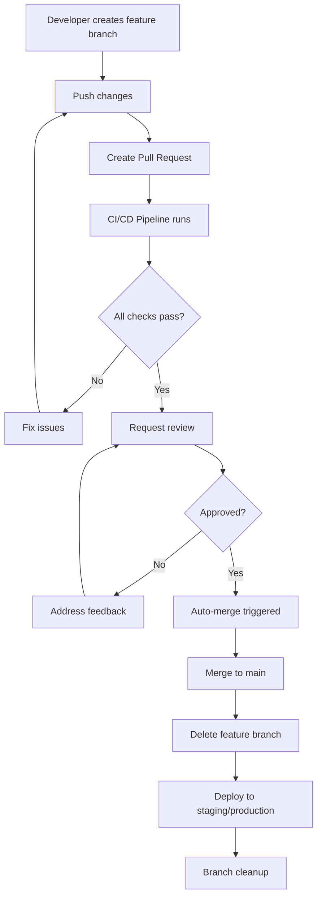

# Git Automations and Codespace Setup

This document describes the automated git workflows and GitHub Codespaces configuration for the LightDom project.

## 🤖 Automated Git Workflows

### 1. Auto-Merge Workflow (`auto-merge.yml`)

Automatically merges feature branches into main when all conditions are met.

**Triggers:**
- Pull requests opened, synchronized, or reopened targeting main
- Manual workflow dispatch with PR number

**Conditions for Auto-Merge:**
- ✅ Branch follows naming convention (`feature/*`, `bugfix/*`, `hotfix/*`)
- ✅ PR has at least 1 approval
- ✅ All CI checks are passing
- ✅ No merge conflicts

**Features:**
- Automatic branch deletion after merge
- Slack notifications for success/failure
- PR comments for failed merge attempts
- Comprehensive logging and status checks

### 2. Branch Cleanup Workflow (`branch-cleanup.yml`)

Automatically cleans up merged branches and stale PRs.

**Triggers:**
- Push to main branch
- Daily schedule (2 AM UTC)
- Manual workflow dispatch

**Actions:**
- Deletes remote branches that have been merged to main
- Cleans up local tracking branches
- Comments on stale PRs (older than 30 days)
- Sends cleanup notifications

### 3. Enhanced CI/CD Pipeline (`ci-cd.yml`)

Comprehensive quality gates and deployment pipeline.

**Quality Gates:**
- Pre-commit: Formatting, linting, type checking, unit tests, security scan
- Pre-merge: Build, integration tests, E2E tests, performance tests, accessibility tests
- Pre-deployment: Load testing, security penetration testing, compliance check

**Deployments:**
- Staging: Automatic deployment from develop branch
- Production: Automatic deployment from main branch
- Health checks and smoke tests after deployment

## 🏗️ GitHub Codespaces Configuration

### DevContainer Setup (`.devcontainer/devcontainer.json`)

**Base Image:** `mcr.microsoft.com/devcontainers/javascript-node:1-18-bullseye`

**Features:**
- Docker-in-Docker support
- Git configuration
- GitHub CLI integration

**VS Code Extensions:**
- TypeScript/JavaScript support
- Tailwind CSS
- Prettier
- ESLint
- Solidity
- Docker
- PostgreSQL
- Git tools

**Port Forwarding:**
- 3000: Frontend (Vite)
- 3001: API Server
- 5432: PostgreSQL
- 8545: Anvil (Local Blockchain)
- 8080: Electron DevTools

### Post-Create Script (`.devcontainer/post-create.sh`)

**System Setup:**
- Updates system packages
- Installs PostgreSQL client, curl, wget, git, build tools
- Installs Foundry for Solidity development
- Installs global npm packages (Hardhat, Truffle, etc.)

**Database Setup:**
- Starts PostgreSQL service
- Creates `dom_space_harvester` database
- Creates `lightdom` user with proper permissions
- Runs database setup script

**Environment Configuration:**
- Creates `.env` file with development settings
- Configures Git with appropriate settings
- Sets up VS Code extensions

**Application Setup:**
- Installs npm dependencies
- Builds the application
- Runs initial tests
- Sets up monitoring (if enabled)

### Post-Start Script (`.devcontainer/post-start.sh`)

**Service Verification:**
- Ensures PostgreSQL is running
- Checks Anvil blockchain status
- Displays service status and access URLs

### Codespace Configuration (`.codespaces/codespace.json`)

Additional Codespace-specific settings and port configurations.

## 🚀 Quick Start Commands

### Development Environment
```bash
# Start full development environment
./start-dev.sh

# Quick start with minimal setup
./quick-start.sh

# Start complete system
npm start

# Start frontend only
npm run dev

# Start API server only
npm run api
```

### Testing
```bash
# Run all tests
npm test

# Run unit tests with coverage
npm run test:unit:coverage

# Run integration tests
npm run test:integration

# Run E2E tests
npm run test:e2e
```

### Code Quality
```bash
# Lint and fix
npm run lint

# Format code
npm run format

# Type check
npm run type-check

# Security scan
npm run security:scan
```

## 🔧 Branch Protection Rules

To enable the auto-merge workflow, configure the following branch protection rules for the main branch:

1. **Require pull request reviews before merging**
   - Required number of reviewers: 1
   - Dismiss stale reviews when new commits are pushed: ✅
   - Require review from code owners: ✅

2. **Require status checks to pass before merging**
   - Require branches to be up to date before merging: ✅
   - Status checks: `pre-commit-gates`, `pre-merge-gates`

3. **Restrict pushes that create files**
   - Restrict pushes to matching branches: ✅

4. **Allow force pushes**
   - Allow force pushes: ❌

5. **Allow deletions**
   - Allow deletions: ❌

## 🔐 Required Secrets

Configure the following secrets in your GitHub repository:

### Required for Auto-Merge
- `GITHUB_TOKEN` (automatically provided)
- `SLACK_WEBHOOK_URL` (optional, for notifications)

### Required for CI/CD
- `SNYK_TOKEN` (for security scanning)
- `SEMGREP_APP_TOKEN` (for SAST)
- `STAGING_URL`, `STAGING_API_KEY` (for staging deployment)
- `PRODUCTION_URL`, `PRODUCTION_API_KEY` (for production deployment)
- `DOCS_DEPLOY_TOKEN` (for documentation deployment)

## 📊 Monitoring and Notifications

### Slack Integration
- Auto-merge success/failure notifications
- Branch cleanup notifications
- CI/CD pipeline status updates

### Health Checks
- Application health endpoint: `http://localhost:3001/health`
- Database connectivity checks
- Blockchain connectivity checks

## 🛠️ Troubleshooting

### Common Issues

1. **Auto-merge not working**
   - Check branch protection rules
   - Verify PR has required approvals
   - Ensure all CI checks are passing
   - Check branch naming convention

2. **Codespace startup issues**
   - Check PostgreSQL service status
   - Verify Anvil blockchain is running
   - Check environment variables
   - Review post-create script logs

3. **CI/CD failures**
   - Check missing npm scripts
   - Verify required secrets are configured
   - Review test coverage requirements
   - Check security scan configurations

### Debug Commands
```bash
# Check service status
pg_isready -h localhost -p 5432
curl -s http://localhost:8545

# Check environment
echo $NODE_ENV
echo $DB_HOST

# Check Git configuration
git config --list
git remote -v
```

## 📝 Best Practices

### Branch Naming
- Use descriptive branch names: `feature/user-authentication`, `bugfix/login-validation`
- Follow the convention: `feature/*`, `bugfix/*`, `hotfix/*`

### Pull Requests
- Write clear, descriptive PR titles and descriptions
- Link to related issues
- Request appropriate reviewers
- Ensure all CI checks pass before requesting review

### Commits
- Use conventional commit format: `type(scope): description`
- Keep commits atomic and focused
- Write clear commit messages

### Development Workflow
1. Create feature branch from main
2. Make changes and commit
3. Push branch and create PR
4. Request review
5. Address feedback
6. Auto-merge when conditions are met
7. Branch cleanup happens automatically

## 🔄 Workflow Diagram



## 📚 Additional Resources

- [GitHub Actions Documentation](https://docs.github.com/en/actions)
- [GitHub Codespaces Documentation](https://docs.github.com/en/codespaces)
- [DevContainer Specification](https://containers.dev/)
- [Conventional Commits](https://www.conventionalcommits.org/)
- [Branch Protection Rules](https://docs.github.com/en/repositories/configuring-branches-and-merges-in-your-repository/defining-the-mergeability-of-pull-requests/about-protected-branches)

---

This setup provides a robust, automated development workflow that ensures code quality, enables rapid development, and maintains a clean repository structure.