# LightDom Space-Bridge Platform - Complete System Architecture

## System Overview
The LightDom Space-Bridge Platform is a comprehensive blockchain-based DOM optimization system that includes web crawling, space mining, metaverse integration, and advanced optimization engines.

## Component Architecture Diagram

```mermaid
graph TB
    %% Main Application Layer
    subgraph "Frontend Application Layer"
        MAIN[main.tsx - App Entry Point]
        NAV[Navigation.tsx - Sidebar Navigation]
        BACK[BackButton.tsx - Navigation Helper]
        
        %% Main Dashboards
        DASH[DiscordStyleDashboard.tsx - Main Dashboard]
        SPACE[SpaceMiningDashboard.tsx - Space Mining UI]
        META[MetaverseMiningDashboard.tsx - Metaverse Mining UI]
        OPT[SpaceOptimizationDashboardMD3.tsx - Optimization UI]
        NODE[AdvancedNodeDashboardMD3.tsx - Node Management UI]
        BLOCK[BlockchainModelStorageDashboard.tsx - Blockchain UI]
        WORK[WorkflowSimulationDashboard.tsx - Workflow UI]
        TEST[TestingDashboard.tsx - Testing UI]
        WALLET[WalletDashboard.tsx - Wallet UI]
        SLOT[LightDomSlotDashboard.tsx - Slot Management UI]
        BRIDGE[BridgeChatPage.tsx - Bridge Communication UI]
        CRAWLER[RealWebCrawlerDashboard.tsx - Web Crawler UI]
    end

    %% Core Engine Layer
    subgraph "Core Engine Layer"
        DOM_ENGINE[DOMOptimizationEngine.ts - DOM Analysis & Optimization]
        SPACE_ENGINE[SpaceMiningEngine.ts - Spatial DOM Mining]
        META_ENGINE[MetaverseMiningEngine.ts - Metaverse Integration]
        OPT_ENGINE[SpaceOptimizationEngine.ts - Space Optimization]
        NODE_ENGINE[AdvancedNodeManager.ts - Node Management]
        BLOCK_ENGINE[BlockchainModelStorage.ts - Blockchain Storage]
        WORK_ENGINE[UserWorkflowSimulator.ts - Workflow Simulation]
        SLOT_ENGINE[LightDomSlotSystem.ts - Slot Management]
        GAME_ENGINE[GamificationEngine.ts - Gamification]
        ALCHEMY_ENGINE[MetaverseAlchemyEngine.ts - Metaverse Alchemy]
    end

    %% Service Layer
    subgraph "Service Layer"
        BLOCKCHAIN_SVC[BlockchainService.ts - Blockchain Operations]
        CRAWLER_SVC[WebCrawlerService.ts - Web Crawling]
        OPTIMIZATION_SVC[OptimizationService.ts - Optimization Services]
        METAVERSE_SVC[MetaverseService.ts - Metaverse Services]
        NODE_SVC[NodeService.ts - Node Services]
        WALLET_SVC[WalletService.ts - Wallet Operations]
        AUTH_SVC[AuthService.ts - Authentication]
        NOTIFICATION_SVC[NotificationService.ts - Notifications]
        ANALYTICS_SVC[AnalyticsService.ts - Analytics]
        STORAGE_SVC[StorageService.ts - Data Storage]
    end

    %% API Layer
    subgraph "API Layer"
        API_SERVER[simple-api-server.js - Main API Server]
        BLOCKCHAIN_API[blockchainApi.ts - Blockchain API]
        SPACE_API[spaceMiningApi.ts - Space Mining API]
        META_API[metaverseMiningApi.ts - Metaverse API]
        OPT_API[optimizationApi.ts - Optimization API]
        NODE_API[advancedNodeApi.ts - Node API]
        WALLET_API[walletApi.ts - Wallet API]
        CRAWLER_API[DOMSpaceHarvesterAPI.ts - Crawler API]
    end

    %% Data Layer
    subgraph "Data Layer"
        POSTGRES[(PostgreSQL Database)]
        REDIS[(Redis Cache)]
        BLOCKCHAIN_DATA[(Blockchain Data)]
        CRAWLER_DATA[(Crawler Data)]
        OPTIMIZATION_DATA[(Optimization Data)]
    end

    %% External Services
    subgraph "External Services"
        WEB_CRAWLER[web-crawler-service.js - Web Crawler]
        PUPPETEER[Puppeteer - Headless Browser]
        CHEERIO[Cheerio - DOM Parser]
        ETHERJS[Ethers.js - Blockchain Interface]
    end

    %% Electron Desktop App
    subgraph "Desktop Application"
        ELECTRON_MAIN[electron/main.cjs - Electron Main Process]
        ELECTRON_PRELOAD[electron/preload.js - Electron Preload]
        ELECTRON_RENDERER[Electron Renderer Process]
    end

    %% Styling System
    subgraph "Styling System"
        INDEX_CSS[index.css - Main Styles]
        DISCORD_CSS[discord-theme.css - Discord Theme]
        TAILWIND[Tailwind CSS - Utility Classes]
        MATERIAL[Material Design 3 - Design System]
    end

    %% Component Connections
    MAIN --> NAV
    MAIN --> BACK
    MAIN --> DASH
    MAIN --> SPACE
    MAIN --> META
    MAIN --> OPT
    MAIN --> NODE
    MAIN --> BLOCK
    MAIN --> WORK
    MAIN --> TEST
    MAIN --> WALLET
    MAIN --> SLOT
    MAIN --> BRIDGE
    MAIN --> CRAWLER

    %% Dashboard to Engine Connections
    SPACE --> SPACE_ENGINE
    META --> META_ENGINE
    OPT --> OPT_ENGINE
    NODE --> NODE_ENGINE
    BLOCK --> BLOCK_ENGINE
    WORK --> WORK_ENGINE
    SLOT --> SLOT_ENGINE
    CRAWLER --> CRAWLER_SVC

    %% Engine to Service Connections
    SPACE_ENGINE --> BLOCKCHAIN_SVC
    META_ENGINE --> METAVERSE_SVC
    OPT_ENGINE --> OPTIMIZATION_SVC
    NODE_ENGINE --> NODE_SVC
    BLOCK_ENGINE --> BLOCKCHAIN_SVC
    WORK_ENGINE --> ANALYTICS_SVC
    SLOT_ENGINE --> STORAGE_SVC

    %% Service to API Connections
    BLOCKCHAIN_SVC --> BLOCKCHAIN_API
    CRAWLER_SVC --> CRAWLER_API
    OPTIMIZATION_SVC --> OPT_API
    METAVERSE_SVC --> META_API
    NODE_SVC --> NODE_API
    WALLET_SVC --> WALLET_API

    %% API to Data Connections
    BLOCKCHAIN_API --> POSTGRES
    BLOCKCHAIN_API --> BLOCKCHAIN_DATA
    CRAWLER_API --> CRAWLER_DATA
    OPT_API --> OPTIMIZATION_DATA
    META_API --> POSTGRES
    NODE_API --> POSTGRES
    WALLET_API --> POSTGRES

    %% External Service Connections
    CRAWLER_SVC --> WEB_CRAWLER
    WEB_CRAWLER --> PUPPETEER
    WEB_CRAWLER --> CHEERIO
    BLOCKCHAIN_SVC --> ETHERJS

    %% Electron Connections
    ELECTRON_MAIN --> ELECTRON_RENDERER
    ELECTRON_MAIN --> API_SERVER
    ELECTRON_RENDERER --> MAIN

    %% Styling Connections
    MAIN --> INDEX_CSS
    INDEX_CSS --> DISCORD_CSS
    INDEX_CSS --> TAILWIND
    INDEX_CSS --> MATERIAL

    %% Data Flow
    API_SERVER --> POSTGRES
    API_SERVER --> REDIS
    API_SERVER --> CRAWLER_DATA
```

## Component Functionality Analysis

### 1. Frontend Application Layer

#### Main Entry Point (main.tsx)
- **Purpose**: Application entry point with routing logic
- **Functionality**: 
  - Manages application state and navigation
  - Implements simple client-side routing
  - Initializes PWA functionality
  - Renders appropriate components based on current path

#### Navigation Components
- **Navigation.tsx**: Collapsible sidebar navigation with Discord-style design
- **BackButton.tsx**: Reusable back button component for page navigation

#### Dashboard Components
1. **DiscordStyleDashboard.tsx**: Main dashboard with Discord-inspired UI
   - Shows system overview and statistics
   - Provides quick access to all features
   - Real-time activity monitoring

2. **SpaceMiningDashboard.tsx**: Space mining operations interface
   - Displays spatial structures and isolated DOMs
   - Shows metaverse bridges and mining statistics
   - Manages space mining operations

3. **MetaverseMiningDashboard.tsx**: Metaverse mining interface
   - Shows algorithm discovery and data mining
   - Displays blockchain upgrades and mining rewards
   - Manages continuous mining operations

4. **SpaceOptimizationDashboardMD3.tsx**: Space optimization interface
   - Shows optimization results and recommendations
   - Displays performance metrics and savings
   - Manages optimization operations

5. **AdvancedNodeDashboardMD3.tsx**: Node management interface
   - Shows node status and performance
   - Manages node operations and scaling
   - Displays node analytics

6. **BlockchainModelStorageDashboard.tsx**: Blockchain storage interface
   - Shows blockchain data and storage metrics
   - Manages blockchain operations
   - Displays storage analytics

7. **WorkflowSimulationDashboard.tsx**: Workflow simulation interface
   - Shows workflow status and progress
   - Manages workflow operations
   - Displays simulation results

8. **TestingDashboard.tsx**: Testing interface
   - Shows test results and coverage
   - Manages test operations
   - Displays testing analytics

9. **WalletDashboard.tsx**: Wallet interface
   - Shows wallet balance and transactions
   - Manages wallet operations
   - Displays wallet analytics

10. **LightDomSlotDashboard.tsx**: Slot management interface
    - Shows slot status and allocation
    - Manages slot operations
    - Displays slot analytics

11. **BridgeChatPage.tsx**: Bridge communication interface
    - Shows bridge status and messages
    - Manages bridge operations
    - Displays communication analytics

12. **RealWebCrawlerDashboard.tsx**: Web crawler interface
    - Shows crawler status and results
    - Manages crawler operations
    - Displays crawling analytics

### 2. Core Engine Layer

#### DOMOptimizationEngine.ts
- **Purpose**: Core DOM analysis and optimization engine
- **Functionality**:
  - Analyzes DOM structure and identifies optimization opportunities
  - Generates optimization recommendations
  - Creates optimization proofs for blockchain storage
  - Manages optimization history and results

#### SpaceMiningEngine.ts
- **Purpose**: Advanced spatial DOM analysis and mining system
- **Functionality**:
  - Mines spatial structures from DOM
  - Isolates Light DOM components
  - Creates metaverse bridges
  - Manages spatial data and coordinates

#### MetaverseMiningEngine.ts
- **Purpose**: Metaverse integration and mining system
- **Functionality**:
  - Discovers algorithms and data patterns
  - Manages continuous mining operations
  - Handles blockchain upgrades
  - Manages mining rewards and tokens

#### SpaceOptimizationEngine.ts
- **Purpose**: Space optimization system
- **Functionality**:
  - Optimizes space usage and allocation
  - Manages optimization algorithms
  - Tracks optimization metrics
  - Handles optimization scheduling

#### AdvancedNodeManager.ts
- **Purpose**: Node management system
- **Functionality**:
  - Manages node lifecycle and operations
  - Handles node scaling and load balancing
  - Monitors node performance
  - Manages node communication

#### BlockchainModelStorage.ts
- **Purpose**: Blockchain storage system
- **Functionality**:
  - Manages blockchain data storage
  - Handles data persistence and retrieval
  - Manages blockchain transactions
  - Handles data synchronization

#### UserWorkflowSimulator.ts
- **Purpose**: Workflow simulation system
- **Functionality**:
  - Simulates user workflows
  - Manages workflow execution
  - Tracks workflow performance
  - Handles workflow optimization

#### LightDomSlotSystem.ts
- **Purpose**: Slot management system
- **Functionality**:
  - Manages Light DOM slots
  - Handles slot allocation and deallocation
  - Tracks slot usage and performance
  - Manages slot optimization

#### GamificationEngine.ts
- **Purpose**: Gamification system
- **Functionality**:
  - Manages gamification elements
  - Handles rewards and achievements
  - Tracks user progress
  - Manages leaderboards

#### MetaverseAlchemyEngine.ts
- **Purpose**: Metaverse alchemy system
- **Functionality**:
  - Manages metaverse transformations
  - Handles alchemy operations
  - Tracks alchemy results
  - Manages alchemy recipes

### 3. Service Layer

#### BlockchainService.ts
- **Purpose**: Blockchain operations service
- **Functionality**:
  - Handles blockchain transactions
  - Manages smart contracts
  - Handles wallet operations
  - Manages blockchain data

#### WebCrawlerService.ts
- **Purpose**: Web crawling service
- **Functionality**:
  - Crawls websites and extracts data
  - Manages crawling queue and scheduling
  - Handles data extraction and processing
  - Manages crawling statistics

#### OptimizationService.ts
- **Purpose**: Optimization services
- **Functionality**:
  - Manages optimization operations
  - Handles optimization algorithms
  - Tracks optimization metrics
  - Manages optimization scheduling

#### MetaverseService.ts
- **Purpose**: Metaverse services
- **Functionality**:
  - Manages metaverse operations
  - Handles metaverse data
  - Manages metaverse bridges
  - Handles metaverse communication

#### NodeService.ts
- **Purpose**: Node services
- **Functionality**:
  - Manages node operations
  - Handles node communication
  - Manages node scaling
  - Handles node monitoring

#### WalletService.ts
- **Purpose**: Wallet operations service
- **Functionality**:
  - Manages wallet operations
  - Handles transactions
  - Manages wallet security
  - Handles wallet synchronization

#### AuthService.ts
- **Purpose**: Authentication service
- **Functionality**:
  - Manages user authentication
  - Handles user sessions
  - Manages user permissions
  - Handles user security

#### NotificationService.ts
- **Purpose**: Notification service
- **Functionality**:
  - Manages notifications
  - Handles notification delivery
  - Manages notification preferences
  - Handles notification history

#### AnalyticsService.ts
- **Purpose**: Analytics service
- **Functionality**:
  - Manages analytics data
  - Handles analytics processing
  - Manages analytics reporting
  - Handles analytics visualization

#### StorageService.ts
- **Purpose**: Data storage service
- **Functionality**:
  - Manages data storage
  - Handles data persistence
  - Manages data retrieval
  - Handles data synchronization

### 4. API Layer

#### simple-api-server.js
- **Purpose**: Main API server
- **Functionality**:
  - Provides REST API endpoints
  - Handles API requests and responses
  - Manages API authentication
  - Handles API rate limiting

#### Specialized API Services
- **blockchainApi.ts**: Blockchain-specific API endpoints
- **spaceMiningApi.ts**: Space mining API endpoints
- **metaverseMiningApi.ts**: Metaverse mining API endpoints
- **optimizationApi.ts**: Optimization API endpoints
- **advancedNodeApi.ts**: Node management API endpoints
- **walletApi.ts**: Wallet API endpoints
- **DOMSpaceHarvesterAPI.ts**: Web crawler API endpoints

### 5. Data Layer

#### PostgreSQL Database
- **Purpose**: Primary data storage
- **Functionality**:
  - Stores application data
  - Manages data relationships
  - Handles data queries
  - Manages data transactions

#### Redis Cache
- **Purpose**: Caching layer
- **Functionality**:
  - Caches frequently accessed data
  - Improves application performance
  - Manages session data
  - Handles real-time data

#### Blockchain Data
- **Purpose**: Blockchain data storage
- **Functionality**:
  - Stores blockchain transactions
  - Manages smart contract data
  - Handles blockchain state
  - Manages blockchain history

#### Crawler Data
- **Purpose**: Web crawler data storage
- **Functionality**:
  - Stores crawled website data
  - Manages crawling statistics
  - Handles crawling queue
  - Manages crawling results

#### Optimization Data
- **Purpose**: Optimization data storage
- **Functionality**:
  - Stores optimization results
  - Manages optimization history
  - Handles optimization metrics
  - Manages optimization proofs

### 6. External Services

#### web-crawler-service.js
- **Purpose**: Web crawling service
- **Functionality**:
  - Crawls websites automatically
  - Extracts data from web pages
  - Manages crawling queue
  - Handles crawling errors

#### Puppeteer
- **Purpose**: Headless browser automation
- **Functionality**:
  - Renders web pages
  - Executes JavaScript
  - Handles dynamic content
  - Manages browser automation

#### Cheerio
- **Purpose**: DOM parsing and manipulation
- **Functionality**:
  - Parses HTML content
  - Extracts data from DOM
  - Manipulates DOM elements
  - Handles DOM queries

#### Ethers.js
- **Purpose**: Blockchain interface
- **Functionality**:
  - Interacts with blockchain
  - Manages smart contracts
  - Handles transactions
  - Manages wallet operations

### 7. Desktop Application

#### Electron Main Process (electron/main.cjs)
- **Purpose**: Electron main process
- **Functionality**:
  - Manages application lifecycle
  - Handles window creation
  - Manages backend services
  - Handles system integration

#### Electron Preload (electron/preload.js)
- **Purpose**: Electron preload script
- **Functionality**:
  - Provides secure communication
  - Exposes APIs to renderer
  - Handles security policies
  - Manages IPC communication

#### Electron Renderer Process
- **Purpose**: Electron renderer process
- **Functionality**:
  - Renders the application UI
  - Handles user interactions
  - Manages application state
  - Handles rendering updates

### 8. Styling System

#### index.css
- **Purpose**: Main stylesheet
- **Functionality**:
  - Imports all style modules
  - Defines global styles
  - Manages CSS variables
  - Handles responsive design

#### discord-theme.css
- **Purpose**: Discord-inspired theme
- **Functionality**:
  - Defines Discord color palette
  - Manages Discord-style components
  - Handles dark theme
  - Manages Discord animations

#### Tailwind CSS
- **Purpose**: Utility-first CSS framework
- **Functionality**:
  - Provides utility classes
  - Manages responsive design
  - Handles component styling
  - Manages layout utilities

#### Material Design 3
- **Purpose**: Material Design system
- **Functionality**:
  - Provides Material Design components
  - Manages design tokens
  - Handles accessibility
  - Manages design consistency

## Data Flow Analysis

### 1. User Interaction Flow
1. User interacts with dashboard components
2. Components call appropriate services
3. Services process requests and call APIs
4. APIs interact with data layer
5. Results flow back through the system
6. UI updates with new data

### 2. Web Crawling Flow
1. Web crawler service starts crawling
2. Puppeteer renders web pages
3. Cheerio extracts data from DOM
4. Data is stored in crawler data storage
5. APIs provide access to crawled data
6. Dashboards display crawling results

### 3. Optimization Flow
1. DOM optimization engine analyzes DOM
2. Optimization recommendations are generated
3. Optimization results are stored
4. Blockchain proofs are created
5. Results are displayed in dashboards
6. Users can apply optimizations

### 4. Blockchain Flow
1. Blockchain service handles transactions
2. Smart contracts are executed
3. Blockchain data is stored
4. APIs provide access to blockchain data
5. Dashboards display blockchain information
6. Users can interact with blockchain

## Current Issues and Recommendations

### 1. Styling Issues
- **Issue**: Mixed styling approaches (Discord theme + Material Design 3 + Tailwind)
- **Recommendation**: Standardize on one design system or create a cohesive hybrid

### 2. Component Organization
- **Issue**: Some components are not properly connected to their services
- **Recommendation**: Ensure all components have proper service connections

### 3. API Integration
- **Issue**: Some components may not be properly integrated with APIs
- **Recommendation**: Verify all API connections and add missing endpoints

### 4. Data Flow
- **Issue**: Some data flows may not be properly implemented
- **Recommendation**: Implement missing data flows and ensure proper error handling

### 5. Performance
- **Issue**: Large number of components may impact performance
- **Recommendation**: Implement lazy loading and code splitting

## Next Steps

1. **Fix Styling System**: Standardize the styling approach
2. **Verify Component Connections**: Ensure all components are properly connected
3. **Implement Missing Functionality**: Add any missing features
4. **Optimize Performance**: Implement performance optimizations
5. **Add Error Handling**: Implement proper error handling throughout the system
6. **Add Testing**: Implement comprehensive testing
7. **Documentation**: Update documentation to reflect current state
