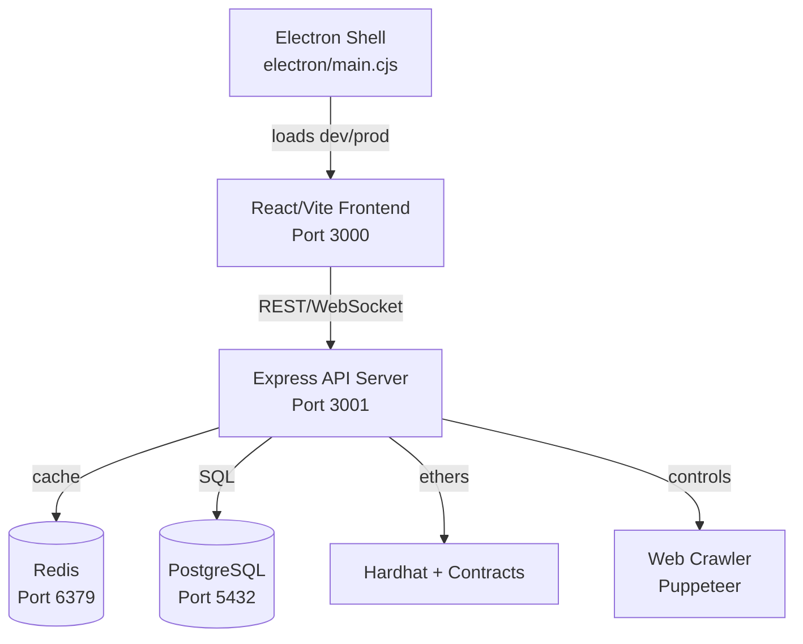

# 🎯 Run This in Cursor Composer to Complete Your App

Since the Cursor Background Agent API requires a GitHub repository (not local files), here's how to complete your app using Cursor Composer instead:

## 📋 Copy This Entire Prompt into Cursor Composer

---

# Senior Staff Engineer - Complete LightDom App to 100%

## Mission
Bring the LightDom Space-Bridge Platform from 70% complete to **100% fully functional** through systematic, iterative improvements.

## System Architecture



## Current State: 70% Complete

### ✅ What Works
- **Frontend**: 15+ React dashboards with Discord-style UI
- **API**: Express server with web crawler (running, real data)
- **Crawler**: Puppeteer integration (286 URLs crawled, 1569 discovered)
- **Blockchain**: Smart contracts written, Hardhat configured
- **Services**: Core engines implemented

### ❌ Critical Issues to Fix

1. **Electron (CRITICAL)**
   - Not installed globally → `npm install -g electron`
   - Port detection fails → Fix `electron/main.cjs`
   - Loads file:// instead of dev server → Fix loading logic
   - Result: Blank/white screen

2. **Database (CRITICAL)**
   - PostgreSQL not running → Need Docker or local install
   - Redis not running → Need Docker or local install
   - No graceful fallback → Add fallback logic

3. **Port Conflicts (WARNING)**
   - Multiple Vite instances (ports 3000-3017)
   - Solution: Kill extras, use single port

4. **Mock Data (WARNING)**
   - Some API endpoints use mocks
   - Solution: Connect real services

## Your Implementation Plan

### Phase 1: Fix Electron & Core (Do First)

**Step 1.1: Install Electron**
```bash
npm install -g electron
```

**Step 1.2: Fix electron/main.cjs port detection**
```javascript
// Find this function and make it robust
async function findDevServer() {
  const ports = [3000, 3001, 3002, 3003, 3004, 3005];
  for (const port of ports) {
    try {
      const res = await fetch(`http://localhost:${port}`);
      if (res.ok) {
        console.log(`Found dev server on port ${port}`);
        return port;
      }
    } catch {}
  }
  console.warn('No dev server found, using production build');
  return null;
}

// Update the loading logic
const devPort = isDev ? await findDevServer() : null;
const loadUrl = devPort 
  ? `http://localhost:${devPort}` 
  : `file://${path.join(__dirname, '../dist/index.html')}`;

console.log(`Loading: ${loadUrl}`);
mainWindow.loadURL(loadUrl);
```

**Step 1.3: Add Docker fallback**
Create `scripts/check-docker.js`:
```javascript
import { exec } from 'child_process';
import { promisify } from 'util';

const execAsync = promisify(exec);

export async function checkDocker() {
  try {
    await execAsync('docker --version');
    const { stdout } = await execAsync('docker ps');
    return stdout.includes('postgres') && stdout.includes('redis');
  } catch {
    console.warn('Docker not available or services not running');
    return false;
  }
}

// Use in-memory fallbacks if Docker unavailable
export function getDatabaseConfig() {
  return {
    useDocker: checkDocker(),
    postgresUrl: process.env.DATABASE_URL || 'postgresql://localhost:5432/lightdom',
    redisUrl: process.env.REDIS_URL || 'redis://localhost:6379'
  };
}
```

### Phase 2: Clean Up Port Conflicts

**Step 2.1: Kill extra Vite processes (Windows)**
```bash
taskkill /F /IM node.exe /FI "WINDOWTITLE eq vite*"
```

**Step 2.2: Start single dev server**
```bash
npm run dev
```

### Phase 3: Connect Real Services

**Step 3.1: Review API endpoints**
Check `simple-api-server.js` vs `api-server-express.js`:
- Ensure real data, not mocks
- Connect BlockchainService properly
- Add database queries

**Step 3.2: Test endpoints**
```bash
curl http://localhost:3001/api/health
curl http://localhost:3001/api/metaverse/mining-data
curl http://localhost:3001/api/crawler/stats
```

### Phase 4: Verify Styles

**Step 4.1: Check imports in src/main.tsx**
```typescript
import './index.css';  // Should include Tailwind
import './discord-theme.css';  // Should include Discord styles
```

**Step 4.2: Verify Tailwind config**
Ensure `tailwind.config.js` includes all source files

### Phase 5: Run Compliance

**Step 5.1: Test the app**
```bash
# Terminal 1: Start API
node simple-api-server.js

# Terminal 2: Start frontend
npm run dev

# Terminal 3: Start Electron
npm run electron:dev
```

**Step 5.2: Run compliance check**
```bash
npm run compliance:check
```

## Success Criteria (100% Done)

STOP when ALL are true:
- ✅ `npm install` completes without errors
- ✅ `npm run electron:dev` launches and loads frontend
- ✅ Frontend renders at http://localhost:3000 with Discord theme visible
- ✅ API server runs at http://localhost:3001 returning real data
- ✅ All dashboards render without blank screens
- ✅ Web crawler processes real websites
- ✅ `npm run compliance:check` exits 0
- ✅ No critical console errors

## Implementation Guidelines

1. **Safe Changes**: Prefer additive edits, avoid deletions
2. **Error Handling**: Wrap risky operations in try-catch
3. **Logging**: Add console.log for debugging
4. **Fallbacks**: Graceful degradation when services unavailable
5. **Windows Compatible**: Test commands work on Windows

## Files to Focus On

Priority order:
1. `electron/main.cjs` - Fix port detection and loading
2. `package.json` - Ensure electron installed
3. `simple-api-server.js` - Verify real data
4. `src/main.tsx` - Check routing and styles
5. `docker-compose.yml` - Database services

## Start Now

**Begin with Phase 1, Step 1.1**: Install Electron and fix the main process. Work systematically through each phase. Test after each change. Report what you've fixed and what's next.

---

## 📊 Use These Resources

- **Full Analysis**: Read `LIGHTDOM_COMPREHENSIVE_ANALYSIS.md` for complete details
- **System Status**: Check `automation-status-report.md` for current state
- **Architecture**: Review `ARCHITECTURE_DIAGRAM.md` for component relationships

---

**Target**: 100% functional LightDom in 1-2 hours
**Approach**: Systematic, phase-by-phase, test-driven
**Success**: Electron launches → All services work → Compliance passes

