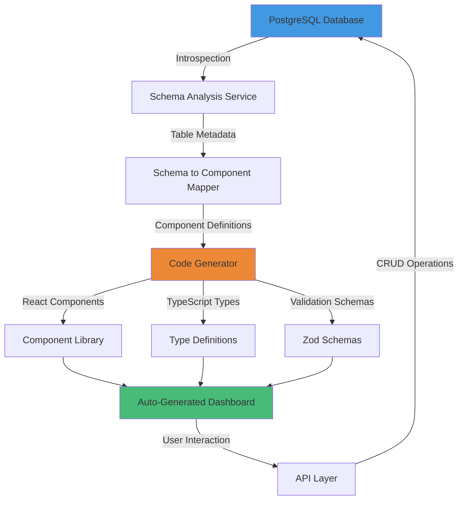
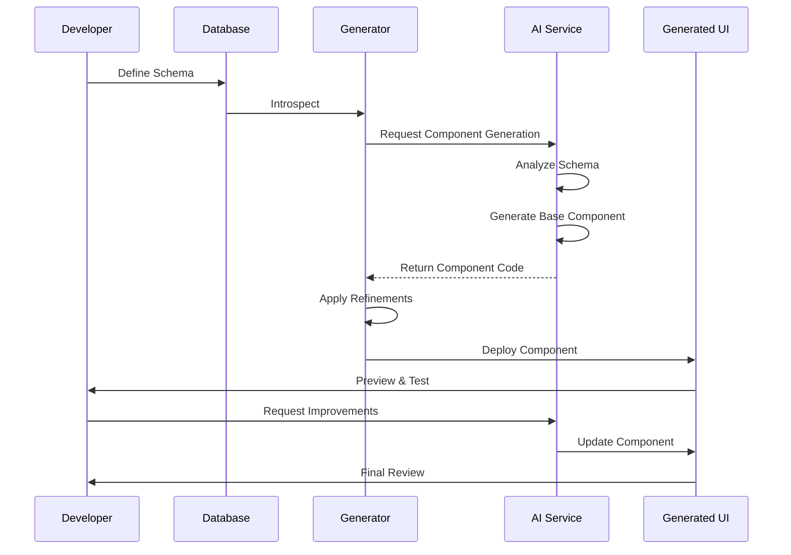
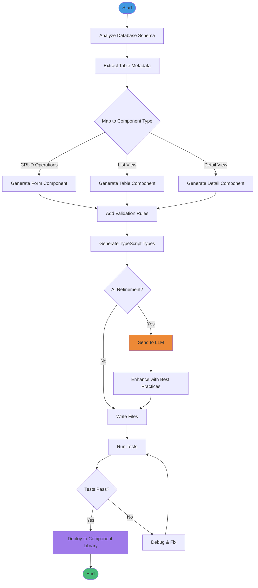

# Schema Implementation Examples for LightDom
## Practical Code Examples and Integration Patterns

**Date:** November 2024  
**Version:** 1.0  

---

## Table of Contents

1. [LightDom Schema Integration](#lightdom-schema-integration)
2. [Practical Component Examples](#practical-component-examples)
3. [Database Schema → UI Pipeline](#database-schema--ui-pipeline)
4. [AI-Powered Schema Tools](#ai-powered-schema-tools)
5. [Visual Workflow Diagrams](#visual-workflow-diagrams)

---

## LightDom Schema Integration

### Current Implementation

LightDom already has excellent schema infrastructure. Let's extend it with practical examples.

#### 1. Schema Linking Service Integration

```typescript
// src/services/schema/EnhancedSchemaService.ts
import { z } from 'zod';

/**
 * Enhanced Schema Service for LightDom
 * Integrates with existing schema-linking-service.js
 */
export class EnhancedSchemaService {
  private baseUrl: string;

  constructor(baseUrl = 'http://localhost:3001') {
    this.baseUrl = baseUrl;
  }

  /**
   * Analyze database and generate React components
   */
  async generateComponentsFromDatabase(feature: string) {
    // 1. Analyze database schema
    const analysis = await fetch(`${this.baseUrl}/api/schema-linking/analyze`);
    const schemaData = await analysis.json();

    // 2. Get feature-specific schema
    const featureResponse = await fetch(
      `${this.baseUrl}/api/schema-linking/features/${feature}`
    );
    const featureSchema = await featureResponse.json();

    // 3. Generate components
    const components = this.schemaToComponents(featureSchema);

    return components;
  }

  /**
   * Convert database schema to React component definitions
   */
  private schemaToComponents(featureSchema: any) {
    const components = [];

    for (const table of featureSchema.tables) {
      // Generate form component
      components.push({
        type: 'form',
        name: `${this.toPascalCase(table.name)}Form`,
        code: this.generateFormComponent(table),
      });

      // Generate table component
      components.push({
        type: 'table',
        name: `${this.toPascalCase(table.name)}Table`,
        code: this.generateTableComponent(table),
      });

      // Generate detail view
      components.push({
        type: 'detail',
        name: `${this.toPascalCase(table.name)}Detail`,
        code: this.generateDetailComponent(table),
      });
    }

    return components;
  }

  /**
   * Generate form component from table schema
   */
  private generateFormComponent(table: any): string {
    const pascalName = this.toPascalCase(table.name);
    const formFields = table.columns
      .filter((col: any) => !col.isPrimaryKey)
      .map((col: any) => this.generateFormField(col))
      .join('\n\n');

    return `
import React from 'react';
import { Form, Button, message } from 'antd';
import { z } from 'zod';

// Validation schema
const ${pascalName}Schema = z.object({
${table.columns.filter((c: any) => !c.isPrimaryKey).map((col: any) => {
  const zodType = this.columnToZodType(col);
  return `  ${col.name}: ${zodType}`;
}).join(',\n')}
});

type ${pascalName}FormData = z.infer<typeof ${pascalName}Schema>;

interface ${pascalName}FormProps {
  initialValues?: Partial<${pascalName}FormData>;
  onSubmit: (values: ${pascalName}FormData) => Promise<void>;
}

export const ${pascalName}Form: React.FC<${pascalName}FormProps> = ({
  initialValues,
  onSubmit
}) => {
  const [form] = Form.useForm<${pascalName}FormData>();
  const [loading, setLoading] = React.useState(false);

  const handleSubmit = async (values: ${pascalName}FormData) => {
    try {
      setLoading(true);
      const validated = ${pascalName}Schema.parse(values);
      await onSubmit(validated);
      message.success('${pascalName} saved successfully');
      form.resetFields();
    } catch (error) {
      message.error('Failed to save ${pascalName}');
      console.error(error);
    } finally {
      setLoading(false);
    }
  };

  return (
    <Form
      form={form}
      layout="vertical"
      initialValues={initialValues}
      onFinish={handleSubmit}
    >
${formFields}

      <Form.Item>
        <Button type="primary" htmlType="submit" loading={loading}>
          Submit
        </Button>
      </Form.Item>
    </Form>
  );
};
`;
  }

  /**
   * Generate table component
   */
  private generateTableComponent(table: any): string {
    const pascalName = this.toPascalCase(table.name);
    
    return `
import React from 'react';
import { Table, Button, Space, Popconfirm } from 'antd';
import { EditOutlined, DeleteOutlined } from '@ant-design/icons';
import type { ColumnsType } from 'antd/es/table';

interface ${pascalName} {
${table.columns.map((col: any) => {
  const tsType = this.columnToTypeScript(col);
  return `  ${col.name}: ${tsType};`;
}).join('\n')}
}

interface ${pascalName}TableProps {
  data: ${pascalName}[];
  loading?: boolean;
  onEdit: (record: ${pascalName}) => void;
  onDelete: (id: string) => Promise<void>;
}

export const ${pascalName}Table: React.FC<${pascalName}TableProps> = ({
  data,
  loading,
  onEdit,
  onDelete
}) => {
  const columns: ColumnsType<${pascalName}> = [
${table.columns.map((col: any) => {
  const humanReadable = this.toHumanReadable(col.name);
  return `    {
      title: '${humanReadable}',
      dataIndex: '${col.name}',
      key: '${col.name}',
      ${col.type.includes('TIMESTAMP') ? "render: (date: Date) => new Date(date).toLocaleString()," : ""}
      ${col.type === 'BOOLEAN' ? "render: (value: boolean) => value ? '✓' : '✗'," : ""}
    }`;
}).join(',\n')},
    {
      title: 'Actions',
      key: 'actions',
      fixed: 'right' as const,
      width: 150,
      render: (_, record) => (
        <Space>
          <Button
            type="link"
            icon={<EditOutlined />}
            onClick={() => onEdit(record)}
          >
            Edit
          </Button>
          <Popconfirm
            title="Are you sure?"
            onConfirm={() => onDelete(record.id)}
          >
            <Button type="link" danger icon={<DeleteOutlined />}>
              Delete
            </Button>
          </Popconfirm>
        </Space>
      ),
    },
  ];

  return (
    <Table
      columns={columns}
      dataSource={data}
      loading={loading}
      rowKey="id"
      pagination={{ pageSize: 20 }}
    />
  );
};
`;
  }

  /**
   * Generate detail view component
   */
  private generateDetailComponent(table: any): string {
    const pascalName = this.toPascalCase(table.name);
    
    return `
import React from 'react';
import { Descriptions, Card, Spin } from 'antd';

interface ${pascalName} {
${table.columns.map((col: any) => {
  const tsType = this.columnToTypeScript(col);
  return `  ${col.name}: ${tsType};`;
}).join('\n')}
}

interface ${pascalName}DetailProps {
  data?: ${pascalName};
  loading?: boolean;
}

export const ${pascalName}Detail: React.FC<${pascalName}DetailProps> = ({
  data,
  loading
}) => {
  if (loading) {
    return <Spin size="large" />;
  }

  if (!data) {
    return <div>No data available</div>;
  }

  return (
    <Card title="${pascalName} Details">
      <Descriptions column={2} bordered>
${table.columns.map((col: any) => {
  const humanReadable = this.toHumanReadable(col.name);
  return `        <Descriptions.Item label="${humanReadable}">
          {${col.type.includes('TIMESTAMP') ? `new Date(data.${col.name}).toLocaleString()` : 
             col.type === 'BOOLEAN' ? `data.${col.name} ? 'Yes' : 'No'` : 
             `data.${col.name}`}}
        </Descriptions.Item>`;
}).join('\n')}
      </Descriptions>
    </Card>
  );
};
`;
  }

  // Helper methods
  private toPascalCase(str: string): string {
    return str
      .split('_')
      .map((word) => word.charAt(0).toUpperCase() + word.slice(1))
      .join('');
  }

  private toHumanReadable(str: string): string {
    return str
      .split('_')
      .map((word) => word.charAt(0).toUpperCase() + word.slice(1))
      .join(' ');
  }

  private columnToZodType(col: any): string {
    const baseType = this.getZodBaseType(col.type);
    let zodType = baseType;

    // Add constraints
    if (col.type === 'VARCHAR' && col.maxLength) {
      zodType += `.max(${col.maxLength})`;
    }
    if (col.type === 'INTEGER') {
      zodType += '.int()';
    }
    if (col.name.includes('email')) {
      zodType = 'z.string().email()';
    }

    // Add optional/required
    if (col.nullable) {
      zodType += '.optional()';
    }

    return zodType;
  }

  private getZodBaseType(dbType: string): string {
    const mapping: Record<string, string> = {
      VARCHAR: 'z.string()',
      TEXT: 'z.string()',
      UUID: 'z.string().uuid()',
      INTEGER: 'z.number()',
      BIGINT: 'z.number()',
      DECIMAL: 'z.number()',
      BOOLEAN: 'z.boolean()',
      TIMESTAMP: 'z.date()',
      JSONB: 'z.any()',
    };
    return mapping[dbType] || 'z.any()';
  }

  private columnToTypeScript(col: any): string {
    const mapping: Record<string, string> = {
      VARCHAR: 'string',
      TEXT: 'string',
      UUID: 'string',
      INTEGER: 'number',
      BIGINT: 'number',
      DECIMAL: 'number',
      BOOLEAN: 'boolean',
      TIMESTAMP: 'Date',
      JSONB: 'any',
    };
    const baseType = mapping[col.type] || 'any';
    return col.nullable ? `${baseType} | null` : baseType;
  }

  private generateFormField(col: any): string {
    const label = this.toHumanReadable(col.name);
    const required = !col.nullable;

    // Import statement for components
    let component = 'Input';
    let imports = [];

    switch (col.type) {
      case 'TEXT':
        component = 'Input.TextArea';
        break;
      case 'INTEGER':
      case 'DECIMAL':
        component = 'InputNumber';
        imports.push('InputNumber');
        break;
      case 'BOOLEAN':
        component = 'Switch';
        imports.push('Switch');
        return `      <Form.Item name="${col.name}" label="${label}" valuePropName="checked">
        <Switch />
      </Form.Item>`;
      case 'TIMESTAMP':
        component = 'DatePicker';
        imports.push('DatePicker');
        return `      <Form.Item name="${col.name}" label="${label}" rules={[{ required: ${required} }]}>
        <DatePicker showTime style={{ width: '100%' }} />
      </Form.Item>`;
      case 'JSONB':
        component = 'Input.TextArea';
        return `      <Form.Item name="${col.name}" label="${label}">
        <Input.TextArea rows={4} placeholder="Enter JSON" />
      </Form.Item>`;
    }

    return `      <Form.Item
        name="${col.name}"
        label="${label}"
        rules={[{ required: ${required}, message: 'Please enter ${label}' }]}
      >
        <${component} placeholder="Enter ${label}" ${
      component === 'InputNumber' ? 'style={{ width: "100%" }}' : ''
    } />
      </Form.Item>`;
  }
}

// Export singleton
export const schemaService = new EnhancedSchemaService();
```

---

## Practical Component Examples

### Example 1: User Management System

Complete implementation using schemas:

```typescript
// schemas/user.schema.ts
import { z } from 'zod';

export const UserSchema = z.object({
  id: z.string().uuid(),
  email: z.string().email(),
  firstName: z.string().min(1).max(50),
  lastName: z.string().min(1).max(50),
  role: z.enum(['admin', 'user', 'moderator']),
  isActive: z.boolean().default(true),
  createdAt: z.date(),
  updatedAt: z.date(),
});

export type User = z.infer<typeof UserSchema>;

export const CreateUserSchema = UserSchema.omit({
  id: true,
  createdAt: true,
  updatedAt: true,
});

export type CreateUserInput = z.infer<typeof CreateUserSchema>;
```

```typescript
// components/UserManagement.tsx
import React, { useState, useEffect } from 'react';
import { Card, Button, Modal, message } from 'antd';
import { PlusOutlined } from '@ant-design/icons';
import { UserForm } from './UserForm';
import { UserTable } from './UserTable';
import type { User, CreateUserInput } from '../schemas/user.schema';

export const UserManagement: React.FC = () => {
  const [users, setUsers] = useState<User[]>([]);
  const [loading, setLoading] = useState(false);
  const [modalVisible, setModalVisible] = useState(false);
  const [editingUser, setEditingUser] = useState<User | undefined>();

  useEffect(() => {
    loadUsers();
  }, []);

  const loadUsers = async () => {
    try {
      setLoading(true);
      const response = await fetch('/api/users');
      const data = await response.json();
      setUsers(data);
    } catch (error) {
      message.error('Failed to load users');
    } finally {
      setLoading(false);
    }
  };

  const handleCreate = async (values: CreateUserInput) => {
    try {
      const response = await fetch('/api/users', {
        method: 'POST',
        headers: { 'Content-Type': 'application/json' },
        body: JSON.stringify(values),
      });
      
      if (!response.ok) throw new Error('Failed to create user');
      
      await loadUsers();
      setModalVisible(false);
      message.success('User created successfully');
    } catch (error) {
      throw error; // Let form handle the error
    }
  };

  const handleEdit = (user: User) => {
    setEditingUser(user);
    setModalVisible(true);
  };

  const handleDelete = async (id: string) => {
    try {
      await fetch(`/api/users/${id}`, { method: 'DELETE' });
      await loadUsers();
      message.success('User deleted successfully');
    } catch (error) {
      message.error('Failed to delete user');
    }
  };

  return (
    <Card
      title="User Management"
      extra={
        <Button
          type="primary"
          icon={<PlusOutlined />}
          onClick={() => {
            setEditingUser(undefined);
            setModalVisible(true);
          }}
        >
          Add User
        </Button>
      }
    >
      <UserTable
        data={users}
        loading={loading}
        onEdit={handleEdit}
        onDelete={handleDelete}
      />

      <Modal
        title={editingUser ? 'Edit User' : 'Create User'}
        open={modalVisible}
        onCancel={() => setModalVisible(false)}
        footer={null}
        width={600}
      >
        <UserForm
          initialValues={editingUser}
          onSubmit={handleCreate}
        />
      </Modal>
    </Card>
  );
};
```

---

## Database Schema → UI Pipeline

### Complete Pipeline Implementation



### Implementation

```typescript
// scripts/generate-components.ts
import { Pool } from 'pg';
import { EnhancedSchemaService } from '../src/services/schema/EnhancedSchemaService';
import fs from 'fs/promises';
import path from 'path';

async function generateComponentsFromDatabase() {
  const pool = new Pool({
    connectionString: process.env.DATABASE_URL,
  });

  try {
    // 1. Introspect database
    console.log('📊 Analyzing database schema...');
    const tables = await introspectDatabase(pool);
    
    console.log(`✅ Found ${tables.length} tables`);

    // 2. Generate components for each table
    const schemaService = new EnhancedSchemaService();
    
    for (const table of tables) {
      console.log(`🔨 Generating components for ${table.name}...`);
      
      const components = await schemaService.generateComponentsFromDatabase(table.name);
      
      // 3. Write files
      const outputDir = path.join(process.cwd(), 'src', 'generated', table.name);
      await fs.mkdir(outputDir, { recursive: true });
      
      for (const component of components) {
        const filePath = path.join(outputDir, `${component.name}.tsx`);
        await fs.writeFile(filePath, component.code);
        console.log(`  ✓ Generated ${component.name}`);
      }
    }
    
    console.log('✅ All components generated successfully!');
  } catch (error) {
    console.error('❌ Error:', error);
    process.exit(1);
  } finally {
    await pool.end();
  }
}

async function introspectDatabase(pool: Pool) {
  const result = await pool.query(`
    SELECT 
      t.table_name,
      json_agg(
        json_build_object(
          'name', c.column_name,
          'type', c.data_type,
          'nullable', c.is_nullable = 'YES',
          'maxLength', c.character_maximum_length,
          'isPrimaryKey', EXISTS(
            SELECT 1 FROM information_schema.table_constraints tc
            JOIN information_schema.key_column_usage kcu
              ON tc.constraint_name = kcu.constraint_name
            WHERE tc.constraint_type = 'PRIMARY KEY'
              AND kcu.column_name = c.column_name
              AND kcu.table_name = t.table_name
          )
        )
        ORDER BY c.ordinal_position
      ) as columns
    FROM information_schema.tables t
    JOIN information_schema.columns c
      ON t.table_name = c.table_name
    WHERE t.table_schema = 'public'
      AND t.table_type = 'BASE TABLE'
    GROUP BY t.table_name
    ORDER BY t.table_name;
  `);

  return result.rows;
}

// Run the generator
if (require.main === module) {
  generateComponentsFromDatabase();
}
```

### Usage

```bash
# Generate all components from database
npm run generate:components

# Output structure:
# src/generated/
# ├── users/
# │   ├── UsersForm.tsx
# │   ├── UsersTable.tsx
# │   └── UsersDetail.tsx
# ├── posts/
# │   ├── PostsForm.tsx
# │   ├── PostsTable.tsx
# │   └── PostsDetail.tsx
# └── comments/
#     ├── CommentsForm.tsx
#     ├── CommentsTable.tsx
#     └── CommentsDetail.tsx
```

---

## AI-Powered Schema Tools

### LLM Integration for Component Refinement

```typescript
// src/services/ai/ComponentRefiner.ts
import { ollamaService } from './OllamaService';

export class ComponentRefiner {
  /**
   * Refine generated component using AI
   */
  async refineComponent(
    componentCode: string,
    requirements: string
  ): Promise<string> {
    const prompt = `
You are an expert React developer. Refine this component based on requirements:

Current Component:
\`\`\`typescript
${componentCode}
\`\`\`

Requirements:
${requirements}

Please provide the improved component code. Maintain:
- Type safety
- Best practices
- Accessibility
- Performance

Improved Component:
`;

    const refinedCode = await ollamaService.generateCode(prompt, 'typescript');
    return refinedCode;
  }

  /**
   * Add accessibility features
   */
  async enhanceAccessibility(componentCode: string): Promise<string> {
    return this.refineComponent(
      componentCode,
      `Add proper ARIA labels, keyboard navigation, and screen reader support`
    );
  }

  /**
   * Optimize performance
   */
  async optimizePerformance(componentCode: string): Promise<string> {
    return this.refineComponent(
      componentCode,
      `Optimize with React.memo, useCallback, useMemo where appropriate. Minimize re-renders.`
    );
  }

  /**
   * Add error handling
   */
  async addErrorHandling(componentCode: string): Promise<string> {
    return this.refineComponent(
      componentCode,
      `Add comprehensive error handling with try-catch, error boundaries, and user-friendly error messages`
    );
  }
}

export const componentRefiner = new ComponentRefiner();
```

---

## Visual Workflow Diagrams

### Schema-Driven Development Workflow



### Component Generation Flow



---

**End of Implementation Examples**

For the complete research document, see [COMPREHENSIVE_SCHEMA_RESEARCH.md](./COMPREHENSIVE_SCHEMA_RESEARCH.md)
