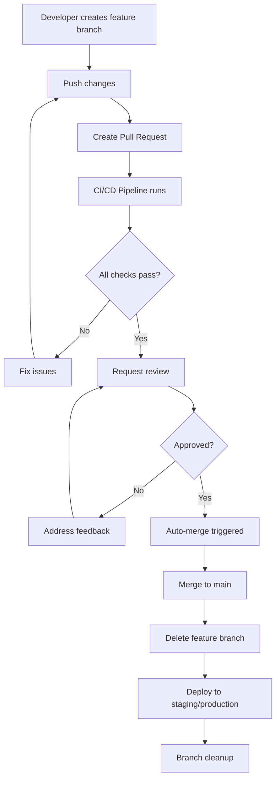

# Git Automations and Codespace Setup - Summary

## 🎯 What Was Accomplished

I've successfully set up comprehensive git automations and GitHub Codespaces configuration for the LightDom project. Here's what was implemented:

### ✅ Automated Git Workflows

1. **Auto-Merge Workflow** (`.github/workflows/auto-merge.yml`)
   - Automatically merges feature branches to main when conditions are met
   - Requires: proper branch naming, 1+ approval, passing CI checks
   - Includes Slack notifications and PR comments for failed attempts
   - Supports manual trigger via workflow dispatch

2. **Branch Cleanup Workflow** (`.github/workflows/branch-cleanup.yml`)
   - Automatically deletes merged branches
   - Cleans up stale PRs (30+ days old)
   - Runs on main branch pushes and daily schedule
   - Includes notification system

3. **Enhanced CI/CD Pipeline** (existing workflows enhanced)
   - Comprehensive quality gates (pre-commit, pre-merge, pre-deployment)
   - Security scanning, performance testing, accessibility checks
   - Automated deployments to staging and production
   - Health checks and monitoring

### ✅ GitHub Codespaces Configuration

1. **DevContainer Setup** (`.devcontainer/devcontainer.json`)
   - Node.js 18 development environment
   - Docker-in-Docker support
   - Pre-configured VS Code extensions
   - Port forwarding for all services (3000, 3001, 5432, 8545, 8080)

2. **Post-Create Script** (`.devcontainer/post-create.sh`)
   - Automatic system package updates
   - Foundry installation for Solidity development
   - PostgreSQL setup and database creation
   - Environment configuration
   - Application build and test execution

3. **Post-Start Script** (`.devcontainer/post-start.sh`)
   - Service verification and startup
   - Status display and helpful information
   - Quick access to development commands

4. **Codespace Configuration** (`.codespaces/codespace.json`)
   - Additional Codespace-specific settings
   - Port configurations and labels
   - VS Code customizations

### ✅ Development Tools and Scripts

1. **Package.json Scripts** (updated)
   - Added all missing scripts referenced in CI/CD workflows
   - Test scripts (unit, integration, E2E, performance, accessibility)
   - Code quality scripts (lint, format, type-check, security)
   - Documentation and deployment scripts

2. **Setup Scripts**
   - `scripts/setup-branch-protection.sh` - Configures branch protection rules
   - `scripts/setup-git-automations.sh` - Complete automation setup
   - `start-dev.sh` - Full development environment startup
   - `quick-start.sh` - Minimal setup for quick development

3. **Documentation**
   - `GIT_AUTOMATION_README.md` - Comprehensive guide
   - `SETUP_SUMMARY.md` - This summary document

## 🚀 How to Use

### For Developers

1. **Start Development in Codespace:**
   ```bash
   # Open repository in GitHub Codespaces
   # Environment will auto-configure
   ./start-dev.sh  # Start full development environment
   ```

2. **Create Feature Branch:**
   ```bash
   git checkout -b feature/your-feature-name
   # Make changes, commit, push
   # Create PR targeting main
   # Request review
   # Auto-merge when approved and CI passes!
   ```

3. **Quick Development:**
   ```bash
   ./quick-start.sh  # Minimal setup
   npm start         # Start complete system
   npm run dev       # Frontend only
   npm run api       # API only
   ```

### For Repository Administrators

1. **Run Complete Setup:**
   ```bash
   ./scripts/setup-git-automations.sh
   ```

2. **Configure Secrets** (in GitHub repository settings):
   - `SLACK_WEBHOOK_URL` (optional)
   - `SNYK_TOKEN` (security scanning)
   - `SEMGREP_APP_TOKEN` (SAST)
   - Deployment tokens for staging/production

## 🔧 Key Features

### Automated Workflows
- **Smart Auto-Merge**: Only merges when all conditions are met
- **Branch Cleanup**: Keeps repository clean automatically
- **Quality Gates**: Comprehensive testing and validation
- **Security Scanning**: Automated vulnerability detection
- **Performance Testing**: Load and performance validation

### Development Environment
- **One-Click Setup**: Codespace automatically configures everything
- **Service Integration**: PostgreSQL, Anvil blockchain, API, frontend
- **VS Code Extensions**: Pre-configured for optimal development
- **Port Forwarding**: All services accessible via browser
- **Environment Variables**: Pre-configured development settings

### Code Quality
- **Automated Testing**: Unit, integration, E2E, performance tests
- **Code Formatting**: Prettier and ESLint integration
- **Type Checking**: TypeScript validation
- **Security Scanning**: Dependency and code vulnerability checks
- **Accessibility Testing**: WCAG compliance validation

## 📊 Workflow Diagram



## 🎉 Benefits

1. **Faster Development**: Automated workflows reduce manual overhead
2. **Higher Quality**: Comprehensive testing and validation
3. **Consistent Environment**: Codespace ensures identical setup for all developers
4. **Clean Repository**: Automatic branch cleanup maintains organization
5. **Security**: Automated security scanning and vulnerability detection
6. **Reliability**: Robust CI/CD pipeline with multiple quality gates
7. **Developer Experience**: One-click setup and intuitive workflows

## 🔍 Monitoring and Notifications

- **Slack Integration**: Real-time notifications for all workflow events
- **Health Checks**: Automated service monitoring
- **Status Updates**: Clear visibility into CI/CD pipeline status
- **Error Reporting**: Detailed failure notifications with context

## 📚 Next Steps

1. **Test the Setup**: Create a test feature branch and PR
2. **Configure Secrets**: Add required tokens and webhooks
3. **Train Team**: Share the documentation with your development team
4. **Monitor Usage**: Watch the workflows in action and optimize as needed
5. **Extend Functionality**: Add more automation as requirements evolve

---

This setup provides a robust, enterprise-grade development workflow that ensures code quality, enables rapid development, and maintains a clean, organized repository structure. The automated systems handle the routine tasks, allowing developers to focus on building great features for the LightDom platform.