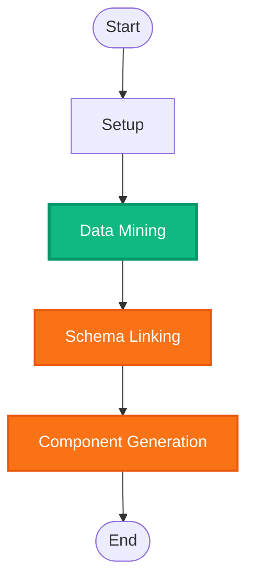
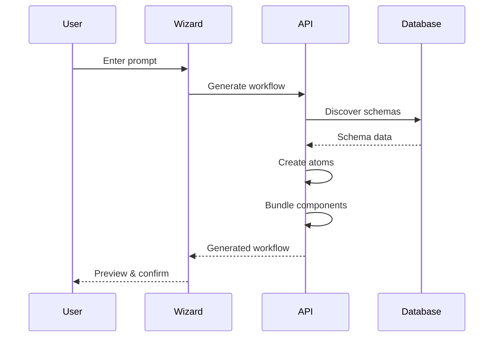

# Workflow Creation Dashboard with Real-Time Mermaid Charts

Complete workflow creation and management system with real-time Mermaid diagram rendering, SVG graphics generation, and highly configurable components.

## Features

### 1. Real-Time Mermaid Workflow Diagrams
- **Live process visualization** with Mermaid flowcharts
- **Status indicators**:
  - 🟢 **Green** = Running (with pulse animation)
  - 🔴 **Red** = Stopped
  - 🟠 **Orange** = Idle
- **Highlights currently executing step** in the workflow
- **Auto-refresh** on status changes
- Interactive node selection

### 2. Workflow Creation Wizard
- **Multi-step wizard** for creating workflows
- **Prompt-based AI generation**:
  - User provides simple text description
  - System automatically generates atoms, components, and dashboards
- **Schema discovery** and relationship mapping
- **Component configuration** with validation
- **Preview before creation**

### 3. Workflow Configuration Panel
- **Settings management** (individual attributes)
- **Setup management** (complete workflows)
- **Atom configuration** (database fields → UI components)
- **Component linking** (schema binding)
- **Validation rules** editor

### 4. Highly Configurable Component System
- **Add components anywhere** with drag & drop
- **Mermaid chart components**:
  - Real-time Flowchart
  - Sequence Diagram
  - State Diagram
- **Extensible framework** - add new component types easily
- **Position configuration** (row/column grid)
- **Validation rules** per component
- **Schema linking** to database fields

### 5. SVG Graphics Generator
- **Generate graphics by prompt** using AI
- **7 graphic types**:
  - Icons
  - Diagrams
  - Charts
  - Flowcharts
  - Infographics
  - Logos
  - Illustrations
- **Schema-linked graphics**:
  - Link SVG to specific components
  - Link to database fields
  - Link to workflow steps
- **Export** to SVG format
- **Graphics library** for reusable elements

## Installation

The dashboard requires the following npm packages (already added to package.json):

```bash
npm install mermaid react-svg d3 @svgdotjs/svg.js
```

## Usage

### Access the Dashboard

Navigate to: `http://localhost:3000/dashboard/workflow-creation`

Or from admin panel: `http://localhost:3000/admin/workflow-creation`

### Create a Workflow

1. **Click "Create Workflow"** button
2. **Enter basic info**:
   - Workflow name
   - Description/prompt
   - Category
3. **Click "Generate Workflow"**:
   - System analyzes prompt
   - Discovers relevant database tables
   - Creates atoms from schema
   - Bundles into components
   - Generates dashboards
4. **Fine-tune configuration** (optional)
5. **Review and create**

### Execute a Workflow

1. **Select workflow** from dropdown
2. **Click "Execute"**
3. **Watch real-time diagram update**:
   - Status changes to 🟢 Running
   - Current step highlights in diagram
   - Progress indicator updates
4. **Workflow completes** or click "Stop"

### Generate SVG Graphics

1. **Navigate to "Graphics Generator" tab**
2. **Select graphic type** (icon, diagram, chart, etc.)
3. **Enter prompt**: "Create a workflow icon with connected nodes"
4. **Click "Generate Graphic"**
5. **Preview and download** SVG
6. **Link to component** (optional):
   - Enter component ID or field name
   - Click "Link to Component"
   - Graphic becomes available for that component

### Configure Components

1. **Navigate to "Components" tab**
2. **Add Mermaid components**:
   - Real-time Flowchart
   - Sequence Diagram
   - State Diagram
3. **Add atoms**:
   - Click "+ Add Atom"
   - Configure field name, type, position
   - Add validation rules
4. **Drag & drop** to reposition
5. **Save configuration**

## API Integration

### Workflow Generation

```javascript
// Generate workflow from prompt
const response = await fetch('/api/workflow-generator/generate', {
  method: 'POST',
  headers: { 'Content-Type': 'application/json' },
  body: JSON.stringify({
    prompt: 'Create user management workflow',
    name: 'user-management'
  })
});

const workflow = await response.json();
// Returns: { atoms, components, dashboards, settings }
```

### Execute Workflow

```javascript
// Execute workflow
const response = await fetch('/api/workflow-generator/execute/user-management', {
  method: 'POST',
  headers: { 'Content-Type': 'application/json' },
  body: JSON.stringify({})
});

const result = await response.json();
```

### Get Workflow Config

```javascript
// Get workflow configuration
const response = await fetch('/api/workflow-generator/config/user-management');
const config = await response.json();
```

## Mermaid Chart Examples

### Flowchart with Status Indicators



### Sequence Diagram



## Component Types

### Mermaid Components

1. **Real-time Flowchart**
   - Shows process flow
   - Updates on state changes
   - Status indicators

2. **Sequence Diagram**
   - Step-by-step execution
   - Timeline view
   - Participant interactions

3. **State Diagram**
   - Workflow states
   - State transitions
   - Current state highlighting

### Standard Components

- Text Input
- Text Area
- Number Input
- Toggle Switch
- Dropdown Select
- Date Picker
- JSON Editor
- Status Indicator

## Schema Linking

### Database → Component Mapping

```javascript
const atomMapping = {
  // Database field → Component type
  'boolean': 'toggle',
  'varchar': 'input',
  'text': 'textarea',
  'integer': 'number',
  'date': 'date',
  'jsonb': 'json-editor',
  'uuid': 'input'
};
```

### Linking Graphics to Components

```javascript
// Link SVG graphic to component
const graphic = {
  id: 'graphic-1',
  svg: '<svg>...</svg>',
  linkedTo: 'user_id' // Links to user_id field
};

// Use in component
<Component icon={getLinkedGraphic('user_id')} />
```

## Extensibility

### Add New Component Type

```javascript
// 1. Define component type
const newComponentType = {
  value: 'custom-chart',
  label: 'Custom Chart',
  icon: <ChartIcon />
};

// 2. Add to component types list
componentTypes.push(newComponentType);

// 3. Implement rendering logic
const renderComponent = (type, props) => {
  if (type === 'custom-chart') {
    return <CustomChart {...props} />;
  }
  // ... other types
};
```

### Add New Graphic Type

```javascript
// Add to graphic types
const graphicTypes = [
  ...existingTypes,
  { value: 'network-diagram', label: 'Network Diagram' }
];

// Implement generation
const generateSVG = (type, prompt) => {
  if (type === 'network-diagram') {
    return generateNetworkDiagram(prompt);
  }
  // ... other types
};
```

## Best Practices

### 1. Workflow Organization
- Use clear, descriptive workflow names
- Group related workflows by category
- Add meaningful prompts for AI generation

### 2. Component Configuration
- Configure validation rules for all inputs
- Use appropriate component types for data types
- Position related components together

### 3. Mermaid Diagrams
- Keep diagrams focused (max 10-15 nodes)
- Use consistent naming for steps
- Add descriptive labels

### 4. SVG Graphics
- Use descriptive prompts for generation
- Link graphics to relevant components
- Organize in graphics library by type

### 5. Schema Linking
- Link all atoms to database fields
- Maintain schema consistency
- Use validation rules from schema constraints

## Troubleshooting

### Mermaid Not Rendering

If Mermaid diagrams don't render:

```html
<!-- Add Mermaid CDN to index.html -->
<script type="module">
  import mermaid from 'https://cdn.jsdelivr.net/npm/mermaid@11/dist/mermaid.esm.min.mjs';
  mermaid.initialize({ startOnLoad: true });
</script>
```

### Workflow Generation Fails

Check:
- Database connection is active
- Schema linking service is running
- Prompt is descriptive enough

### SVG Not Displaying

Check:
- SVG code is valid XML
- No JavaScript in SVG (security restriction)
- Container has sufficient size

## Architecture

```
WorkflowCreationDashboard
├── WorkflowMermaidDiagram (Real-time visualization)
│   ├── Status indicators (green/red/orange)
│   ├── Mermaid rendering
│   └── Interactive controls
├── WorkflowWizard (Multi-step creation)
│   ├── Basic info
│   ├── AI generation
│   ├── Configuration
│   └── Review
├── WorkflowConfigPanel (Settings management)
│   ├── General settings
│   ├── Schema linking
│   └── Validation rules
├── ComponentConfigurator (Extensible components)
│   ├── Mermaid components
│   ├── Standard components
│   └── Drag & drop positioning
└── SVGGraphicsGenerator (Prompt-based graphics)
    ├── AI generation
    ├── Schema linking
    └── Graphics library
```

## npm Scripts

```bash
npm run workflow:create      # Open workflow creation dashboard
npm run workflow:generate    # Generate workflow from prompt
npm run workflow:test        # Test workflow execution
```

## Advanced Features

### 1. Workflow Templates
- Save common workflows as templates
- Reuse across projects
- Share with team

### 2. Component Marketplace
- Browse community components
- Install with one click
- Contribute your own

### 3. Real-time Collaboration
- Multiple users editing same workflow
- Live cursor tracking
- Change history

### 4. Export Formats
- Export workflows to:
  - JSON (configuration)
  - SVG (diagrams)
  - PNG (screenshots)
  - PDF (documentation)

## Next Steps

1. **Create your first workflow** using the wizard
2. **Generate graphics** for your components
3. **Configure Mermaid charts** for visualization
4. **Link schemas** to enable automation
5. **Execute workflows** and monitor with real-time diagrams

For more information, see:
- [Schema Linking Documentation](./SCHEMA_LINKING_README.md)
- [Self-Generating Workflows](./SELF_GENERATING_WORKFLOWS_README.md)
- [Component Architecture](./SCHEMA_LINKING_ARCHITECTURE.md)
