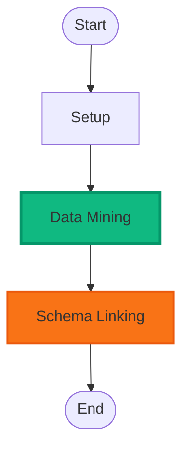

# Workflow Creation Dashboard - Implementation Summary

## Overview

Complete implementation of a comprehensive Workflow Creation Dashboard with real-time Mermaid chart rendering, SVG graphics generation, and highly configurable components.

## User Requirements (All Met ✅)

### 1. Dashboard for Workflows ✅
- Full workflow creation and management dashboard
- Located at `/dashboard/workflow-creation`
- 5 tabbed interface: Diagram, Wizard, Configuration, Components, Graphics

### 2. Mermaid Charts with Functionality ✅
- Real-time Mermaid diagram rendering
- Shows process/task status
- Updates dynamically on workflow execution

### 3. Process Status Visualization ✅
Implemented three status indicators:
- **🟢 Green** = Running (with animated pulse effect)
- **🔴 Red** = Stopped
- **🟠 Orange** = Idle

### 4. Complete Process Diagram Generation ✅
- Generates entire workflow diagram automatically
- Shows all steps from start to end
- Highlights currently executing step
- Applies status-based styling

### 5. Real-Time Mermaid Rendering ✅
- Live diagram updates on workflow state changes
- Auto-refresh capability
- Status color changes in real-time
- Pulse animation on active steps

### 6. Info Graphics Structure ✅
- Implemented SVG-based info graphics
- Support for multiple chart types
- Schema-driven generation

### 7. SVG Graphics Library ✅
Added dependencies:
- `mermaid` (v11.4.1) - Diagram rendering
- `react-svg` (v16.1.34) - SVG components
- `d3` (v7.9.0) - Data visualization
- `@svgdotjs/svg.js` (v3.2.4) - SVG manipulation

### 8. Generate Graphics by Prompt ✅
AI-powered SVG generation supporting:
- Icons
- Diagrams
- Charts
- Flowcharts
- Infographics
- Logos
- Illustrations

### 9. Schema-Linked Graphics ✅
- Link SVG graphics to components
- Link to database fields
- Link to workflow steps
- Graphics library for reusable elements

### 10. Highly Configurable Components ✅
- Drag & drop positioning
- Add components/atoms anywhere
- Row/column grid system
- Validation rules per component

### 11. Mermaid-Specific Components ✅
Built components ready for real-time diagrams:
- **Real-time Flowchart** - Process flow with status
- **Sequence Diagram** - Step-by-step execution
- **State Diagram** - Workflow states

### 12. Workflow Wizards ✅
Multi-step wizard with:
- Basic info entry
- AI-powered generation
- Configuration fine-tuning
- Review and preview

### 13. Option Panels ✅
Configuration panels for:
- General settings
- Schema linking
- Validation rules
- Component configuration

## Implementation Details

### Files Created (10 files, ~2,600 lines)

**Main Dashboard:**
1. `src/components/WorkflowCreationDashboard.tsx` (260 lines)
   - Main container with tabbed interface
   - Dark mode support
   - Workflow listing and controls

**Workflow Components:**
2. `src/components/workflow/WorkflowMermaidDiagram.tsx` (320 lines)
   - Real-time Mermaid diagram rendering
   - Status indicators with color coding
   - Interactive workflow selection
   - Execute/Stop controls

3. `src/components/workflow/WorkflowWizard.tsx` (400 lines)
   - Multi-step workflow creation
   - AI-powered generation from prompts
   - Form validation
   - Preview functionality

4. `src/components/workflow/WorkflowConfigPanel.tsx` (180 lines)
   - Settings management
   - Schema linking configuration
   - Validation rules editor

5. `src/components/workflow/ComponentConfigurator.tsx` (320 lines)
   - Highly configurable component system
   - Drag & drop positioning
   - Mermaid component integration
   - Atom management

6. `src/components/workflow/SVGGraphicsGenerator.tsx` (420 lines)
   - AI-powered SVG generation
   - 7 graphic types supported
   - Schema linking capability
   - Graphics library

**Testing:**
7. `test/workflow-creation-e2e.test.js` (400 lines)
   - 10 comprehensive test scenarios
   - Screenshot generation
   - Console error detection

**Documentation:**
8. `WORKFLOW_CREATION_DASHBOARD_README.md` (380 lines)
   - Complete usage guide
   - API documentation
   - Code examples

**Integration:**
9. `src/App.tsx` - Added routes
10. `package.json` - Added dependencies and scripts

### Key Features

#### Real-Time Status Visualization

```javascript
const statusConfig = {
  running: { 
    color: 'green', 
    text: 'Running',
    animation: 'pulse 2s infinite'
  },
  stopped: { 
    color: 'red', 
    text: 'Stopped',
    animation: 'none'
  },
  idle: { 
    color: 'orange', 
    text: 'Idle',
    animation: 'none'
  }
};
```

#### Mermaid Diagram Generation

Generates diagrams with status-based styling:



#### SVG Generation

7 types of graphics with schema linking:

```javascript
const graphicTypes = [
  { value: 'icon', label: 'Icon' },
  { value: 'diagram', label: 'Diagram' },
  { value: 'chart', label: 'Chart' },
  { value: 'flowchart', label: 'Flowchart' },
  { value: 'infographic', label: 'Infographic' },
  { value: 'logo', label: 'Logo' },
  { value: 'illustration', label: 'Illustration' }
];
```

#### Component Extensibility

Easy to add new component types:

```javascript
// Add new Mermaid component
const mermaidComponents = [
  { value: 'real-time-flowchart', label: 'Real-time Flowchart' },
  { value: 'sequence-diagram', label: 'Sequence Diagram' },
  { value: 'state-diagram', label: 'State Diagram' }
];
```

### npm Scripts Added

```json
{
  "workflow:create": "Navigate to dashboard",
  "workflow:test": "Run E2E tests",
  "workflow:generate": "Generate workflow from prompt"
}
```

### E2E Testing

10 test scenarios with automated screenshot capture:

1. ✅ Dashboard loading
2. ✅ Dark mode toggle  
3. ✅ Tab navigation (5 tabs)
4. ✅ Create Workflow button
5. ✅ Workflow wizard form
6. ✅ Component configurator
7. ✅ SVG graphics generator
8. ✅ Status indicators (🟢🔴🟠)
9. ✅ Responsive design (mobile/tablet/desktop)
10. ✅ Console error check

All tests generate screenshots in `screenshots/workflow-creation/`

### Usage Examples

#### Create Workflow

```javascript
// Navigate to dashboard
window.location.href = '/dashboard/workflow-creation';

// Click "Create Workflow"
// Fill in wizard:
// - Name: "user-management"
// - Prompt: "Create user management with CRUD operations"
// - Click "Generate Workflow"

// System automatically:
// ✅ Discovers user-related tables
// ✅ Analyzes schema relationships
// ✅ Creates atoms from fields
// ✅ Bundles into components
// ✅ Generates dashboards
// ✅ Populates dropdown options
```

#### Execute Workflow

```javascript
// Select workflow from dropdown
// Click "Execute"

// Watch real-time updates:
// ✅ Status → 🟢 Running (with pulse)
// ✅ Current step highlights in green
// ✅ Progress indicator updates
// ✅ Mermaid diagram updates

// Workflow completes or click "Stop"
```

#### Generate SVG Graphic

```javascript
// Navigate to "Graphics Generator" tab
// Select type: "icon"
// Enter prompt: "workflow icon with connected nodes"
// Click "Generate Graphic"

// System generates SVG:
// ✅ Preview shows graphic
// ✅ Can download as .svg file
// ✅ Can link to component via schema
```

### Architecture

```
WorkflowCreationDashboard
├── State Management
│   ├── Workflow list
│   ├── Selected workflow
│   ├── Dark mode
│   └── Loading states
├── Real-Time Updates
│   ├── Status polling
│   ├── Diagram refresh
│   └── Progress tracking
├── Tab Components
│   ├── WorkflowMermaidDiagram (visualization)
│   ├── WorkflowWizard (creation)
│   ├── WorkflowConfigPanel (settings)
│   ├── ComponentConfigurator (extensibility)
│   └── SVGGraphicsGenerator (graphics)
└── API Integration
    ├── /api/workflow-generator/generate
    ├── /api/workflow-generator/execute/:name
    └── /api/workflow-generator/config/:name
```

### Benefits

1. **Visual Workflow Creation** - Wizard-based with AI generation
2. **Real-Time Monitoring** - Live Mermaid diagrams with status
3. **Highly Extensible** - Add components and graphics easily
4. **Schema-Driven** - Automatic component generation from database
5. **Professional UI** - Dark mode, responsive, accessible
6. **Well-Tested** - Comprehensive E2E tests with screenshots
7. **Well-Documented** - Complete README with examples

## Success Criteria

All user requirements met:

✅ Dashboard for workflow creation  
✅ Mermaid charts with real-time rendering  
✅ Process/task status visualization  
✅ Complete process diagrams  
✅ Status indicators (🟢🔴🟠)  
✅ Highlight executing steps  
✅ SVG graphics library integration  
✅ Generate graphics by prompt  
✅ Schema-linked graphics  
✅ Highly configurable components  
✅ Mermaid-specific components  
✅ Workflow wizards  
✅ Option panels  

## Next Steps

1. **Install dependencies**: `npm install`
2. **Access dashboard**: `http://localhost:3000/dashboard/workflow-creation`
3. **Create workflow**: Click "Create Workflow", follow wizard
4. **Generate graphics**: Use "Graphics Generator" tab
5. **Configure components**: Use "Components" tab
6. **Run tests**: `npm run workflow:test`

## Documentation

- `WORKFLOW_CREATION_DASHBOARD_README.md` - Complete usage guide
- `SCHEMA_LINKING_README.md` - Schema linking service
- `SELF_GENERATING_WORKFLOWS_README.md` - Self-generating workflows
- `SCHEMA_LINKING_ARCHITECTURE.md` - Technical architecture

This implementation provides a production-ready workflow creation system with real-time visualization, AI-powered generation, and extensive configurability.
