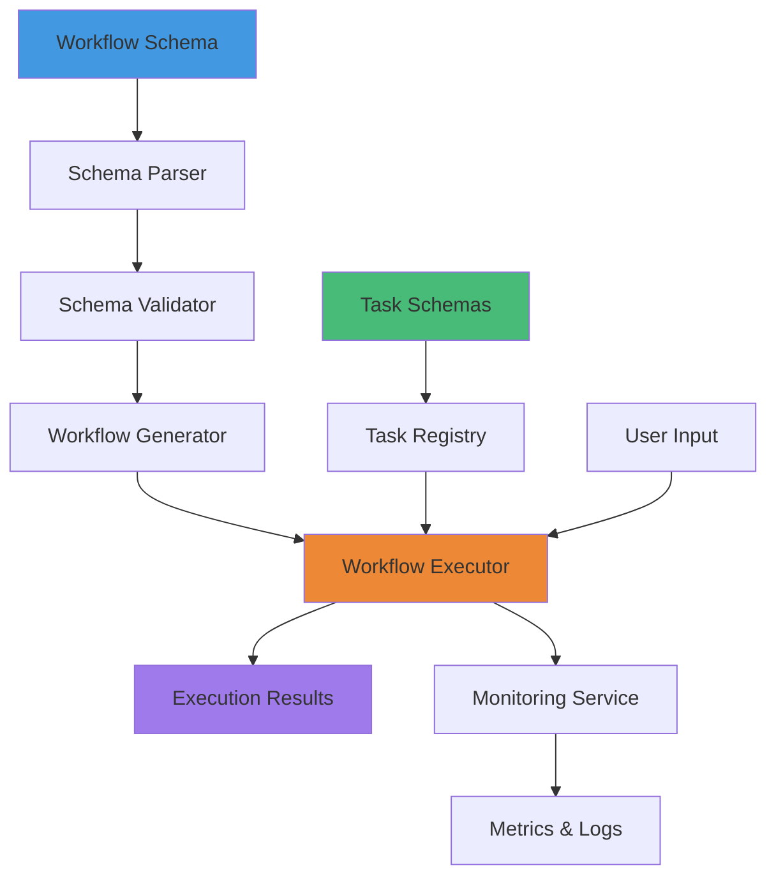
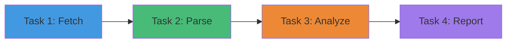
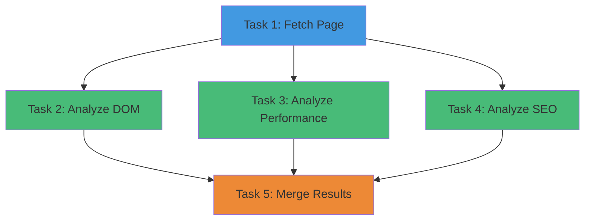
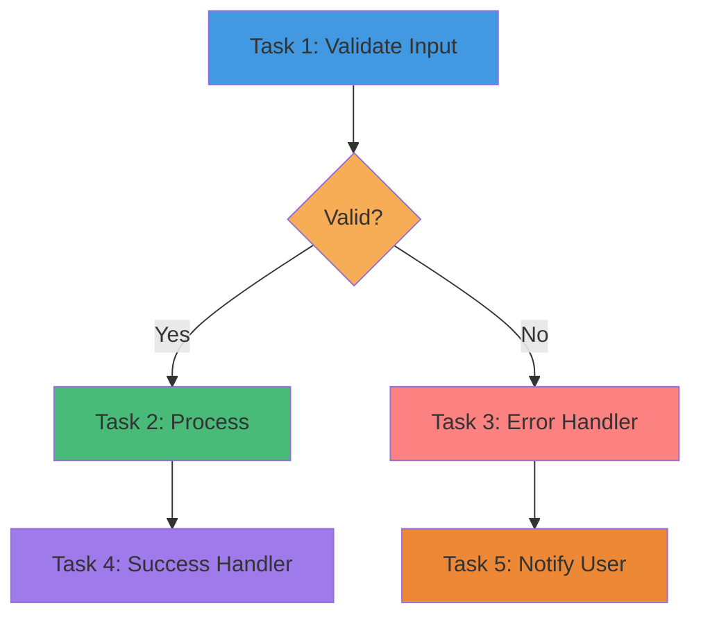
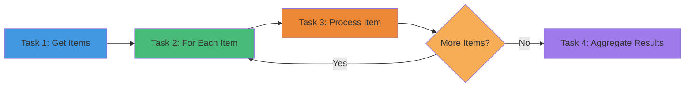

# Schema-Driven Workflow Wizard
## Comprehensive Guide to Building Configurable Workflows with Schemas

**Date:** November 2, 2024  
**Version:** 1.0  
**Related:** ATOMIC_COMPONENT_SCHEMAS.md, COMPREHENSIVE_SCHEMA_RESEARCH.md

---

## Table of Contents

1. [Introduction](#introduction)
2. [Workflow Schema Format](#workflow-schema-format)
3. [Task Schema Definition](#task-schema-definition)
4. [Workflow Patterns & Best Practices](#workflow-patterns--best-practices)
5. [Real-World Workflow Examples](#real-world-workflow-examples)
6. [Integration with LightDom](#integration-with-lightdom)

---

## Introduction

The Schema-Driven Workflow Wizard enables fully customizable workflows where every aspect is defined by schemas. This approach provides:

- **Reusability** - Define once, use everywhere
- **Customization** - Schema-based configuration
- **Type Safety** - Full TypeScript support
- **AI Integration** - Automatic workflow generation
- **Monitoring** - Built-in execution tracking

### Architecture Overview



---

## Workflow Schema Format

### Complete Workflow Schema Example

```json
{
  "@context": "https://schema.lightdom.com/workflow/v1",
  "@type": "Workflow",
  "@id": "lightdom:workflow:dom-optimization",
  "name": "DOM Optimization Workflow",
  "description": "Analyzes and optimizes DOM structure for better performance",
  "version": "1.2.0",
  "category": "optimization",
  "priority": 8,
  
  "trigger": {
    "type": "webhook",
    "config": {
      "path": "/api/workflows/dom-optimization",
      "method": "POST",
      "authentication": "bearer",
      "rateLimit": {
        "max": 100,
        "window": "1h"
      }
    }
  },
  
  "input": {
    "schema": {
      "type": "object",
      "properties": {
        "url": {
          "type": "string",
          "format": "uri",
          "description": "URL to analyze"
        },
        "depth": {
          "type": "number",
          "minimum": 1,
          "maximum": 5,
          "default": 3
        },
        "options": {
          "type": "object",
          "properties": {
            "analyzeImages": { "type": "boolean", "default": true },
            "analyzeScripts": { "type": "boolean", "default": true },
            "analyzeStyles": { "type": "boolean", "default": true }
          }
        }
      },
      "required": ["url"]
    }
  },
  
  "tasks": [
    {
      "$ref": "lightdom:task:fetch-page",
      "config": {
        "timeout": 30000,
        "followRedirects": true
      }
    },
    {
      "$ref": "lightdom:task:analyze-dom",
      "config": {
        "metrics": ["size", "depth", "elements"]
      }
    },
    {
      "$ref": "lightdom:task:analyze-performance",
      "dependsOn": ["lightdom:task:fetch-page"]
    },
    {
      "$ref": "lightdom:task:generate-optimizations",
      "dependsOn": ["lightdom:task:analyze-dom", "lightdom:task:analyze-performance"]
    },
    {
      "$ref": "lightdom:task:create-report",
      "config": {
        "format": "json",
        "includeScreenshots": true
      }
    }
  ],
  
  "errorHandling": {
    "strategy": "retry",
    "maxRetries": 3,
    "retryDelay": 5000,
    "backoffMultiplier": 2,
    "retryableErrors": ["TIMEOUT", "NETWORK_ERROR"],
    "fallbackWorkflow": "lightdom:workflow:basic-dom-analysis"
  },
  
  "monitoring": {
    "enabled": true,
    "logLevel": "info",
    "metrics": ["duration", "success-rate", "error-count", "resource-usage"],
    "alerts": {
      "onFailure": {
        "enabled": true,
        "channels": ["slack", "email"],
        "threshold": 3
      },
      "onSlowExecution": {
        "enabled": true,
        "thresholdMs": 60000,
        "channels": ["slack"]
      }
    }
  },
  
  "caching": {
    "enabled": true,
    "ttl": 3600,
    "key": "workflow:${input.url}:${input.depth}",
    "invalidateOn": ["error", "manual"]
  },
  
  "permissions": {
    "execute": ["admin", "workflow-manager", "analyst"],
    "view": ["*"],
    "edit": ["admin", "workflow-manager"]
  },
  
  "metadata": {
    "author": "lightdom-team",
    "createdAt": "2024-10-15T00:00:00Z",
    "updatedAt": "2024-11-02T00:00:00Z",
    "tags": ["dom", "optimization", "performance", "automation"],
    "documentation": "https://docs.lightdom.com/workflows/dom-optimization",
    "examples": [
      {
        "name": "Basic DOM Analysis",
        "input": {
          "url": "https://example.com",
          "depth": 2
        }
      },
      {
        "name": "Deep Analysis with All Options",
        "input": {
          "url": "https://example.com/complex-page",
          "depth": 5,
          "options": {
            "analyzeImages": true,
            "analyzeScripts": true,
            "analyzeStyles": true
          }
        }
      }
    ]
  }
}
```

---

## Task Schema Definition

### Generic Task Template

```json
{
  "@context": "https://schema.lightdom.com/task/v1",
  "@type": "Task",
  "@id": "lightdom:task:analyze-dom",
  "name": "Analyze DOM Structure",
  "description": "Analyzes DOM structure and provides optimization recommendations",
  "version": "1.0.0",
  "category": "analysis",
  
  "input": {
    "schema": {
      "type": "object",
      "properties": {
        "html": {
          "type": "string",
          "description": "HTML content to analyze"
        },
        "url": {
          "type": "string",
          "format": "uri"
        },
        "metrics": {
          "type": "array",
          "items": {
            "type": "string",
            "enum": ["size", "depth", "elements", "scripts", "styles", "images"]
          },
          "default": ["size", "depth", "elements"]
        }
      },
      "required": ["html"]
    },
    "source": "context.pageData",
    "transform": null
  },
  
  "execution": {
    "type": "function",
    "handler": "analyzeDOMStructure",
    "timeout": 10000,
    "retryPolicy": {
      "enabled": true,
      "maxAttempts": 2,
      "backoff": "exponential",
      "initialDelay": 1000
    },
    "config": {
      "maxElements": 10000,
      "maxDepth": 100
    }
  },
  
  "output": {
    "schema": {
      "type": "object",
      "properties": {
        "metrics": {
          "type": "object",
          "properties": {
            "totalElements": { "type": "number" },
            "maxDepth": { "type": "number" },
            "domSize": { "type": "number" },
            "scripts": { "type": "number" },
            "styles": { "type": "number" },
            "images": { "type": "number" }
          }
        },
        "issues": {
          "type": "array",
          "items": {
            "type": "object",
            "properties": {
              "type": { "type": "string" },
              "severity": { "type": "string", "enum": ["low", "medium", "high", "critical"] },
              "message": { "type": "string" },
              "element": { "type": "string" }
            }
          }
        },
        "recommendations": {
          "type": "array",
          "items": {
            "type": "object",
            "properties": {
              "action": { "type": "string" },
              "priority": { "type": "string" },
              "description": { "type": "string" },
              "estimatedImpact": { "type": "string" }
            }
          }
        }
      }
    },
    "destination": "context.domAnalysis",
    "persist": true,
    "persistLocation": "database.analysis_results"
  },
  
  "conditions": {
    "executeIf": "input.html !== null && input.html.length > 0",
    "skipIf": "context.cached === true",
    "failIf": "!output.metrics"
  },
  
  "dependencies": {
    "tasks": [],
    "services": ["dom-parser"],
    "external": []
  },
  
  "monitoring": {
    "logExecution": true,
    "captureInput": false,
    "captureOutput": true,
    "metrics": {
      "duration": true,
      "errorRate": true,
      "customMetrics": ["elements-analyzed", "issues-found"]
    }
  }
}
```

---

## Workflow Patterns & Best Practices

### Pattern 1: Sequential Processing



**Use when:** Each step depends on the previous one

```json
{
  "tasks": [
    { "$ref": "task:fetch-data" },
    { "$ref": "task:parse-data", "dependsOn": ["task:fetch-data"] },
    { "$ref": "task:analyze-data", "dependsOn": ["task:parse-data"] },
    { "$ref": "task:generate-report", "dependsOn": ["task:analyze-data"] }
  ]
}
```

### Pattern 2: Parallel Processing



**Use when:** Tasks can run independently

```json
{
  "tasks": [
    { "$ref": "task:fetch-page" },
    { 
      "$ref": "task:analyze-dom",
      "dependsOn": ["task:fetch-page"],
      "parallel": true
    },
    { 
      "$ref": "task:analyze-performance",
      "dependsOn": ["task:fetch-page"],
      "parallel": true
    },
    { 
      "$ref": "task:analyze-seo",
      "dependsOn": ["task:fetch-page"],
      "parallel": true
    },
    {
      "$ref": "task:merge-results",
      "dependsOn": ["task:analyze-dom", "task:analyze-performance", "task:analyze-seo"]
    }
  ]
}
```

### Pattern 3: Conditional Branching



**Use when:** Execution path depends on runtime conditions

```json
{
  "tasks": [
    { "$ref": "task:validate-input" },
    {
      "$ref": "task:process-data",
      "conditions": {
        "executeIf": "context.validationResult.isValid === true"
      }
    },
    {
      "$ref": "task:handle-error",
      "conditions": {
        "executeIf": "context.validationResult.isValid === false"
      }
    },
    {
      "$ref": "task:success-handler",
      "dependsOn": ["task:process-data"]
    },
    {
      "$ref": "task:notify-user",
      "dependsOn": ["task:handle-error"]
    }
  ]
}
```

### Pattern 4: Loop/Iteration



**Use when:** Need to process multiple items

```json
{
  "tasks": [
    { "$ref": "task:get-urls" },
    {
      "$ref": "task:process-url",
      "forEach": "context.urls",
      "as": "url",
      "parallel": true,
      "maxConcurrency": 5
    },
    {
      "$ref": "task:aggregate-results",
      "dependsOn": ["task:process-url"]
    }
  ]
}
```

---

## Real-World Workflow Examples

### Example 1: User Onboarding Workflow

```json
{
  "@type": "Workflow",
  "@id": "lightdom:workflow:user-onboarding",
  "name": "User Onboarding Workflow",
  "description": "Complete onboarding process for new users",
  
  "trigger": {
    "type": "webhook",
    "config": {
      "path": "/api/users/register",
      "method": "POST"
    }
  },
  
  "tasks": [
    {
      "@type": "ValidationTask",
      "name": "Validate Registration Data",
      "execution": {
        "type": "function",
        "handler": "validateUserRegistration"
      },
      "input": {
        "schema": {
          "type": "object",
          "properties": {
            "email": { "type": "string", "format": "email" },
            "password": { "type": "string", "minLength": 8 },
            "name": { "type": "string", "minLength": 2 }
          },
          "required": ["email", "password", "name"]
        }
      }
    },
    {
      "@type": "DatabaseTask",
      "name": "Create User Account",
      "execution": {
        "type": "database",
        "operation": "insert",
        "table": "users",
        "data": {
          "email": "${input.email}",
          "password_hash": "${crypto.hash(input.password)}",
          "name": "${input.name}",
          "created_at": "${Date.now()}",
          "email_verified": false
        },
        "returning": "*"
      }
    },
    {
      "@type": "APICallTask",
      "name": "Send Verification Email",
      "execution": {
        "type": "api",
        "method": "POST",
        "url": "https://api.sendgrid.com/v3/mail/send",
        "headers": {
          "Authorization": "Bearer ${env.SENDGRID_API_KEY}"
        },
        "body": {
          "to": "${input.email}",
          "template_id": "user-verification",
          "dynamic_data": {
            "name": "${input.name}",
            "verification_link": "${env.APP_URL}/verify/${context.user.verification_token}"
          }
        }
      }
    },
    {
      "@type": "DatabaseTask",
      "name": "Assign Default Role",
      "execution": {
        "type": "database",
        "operation": "insert",
        "table": "user_roles",
        "data": {
          "user_id": "${context.user.id}",
          "role": "user",
          "assigned_at": "${Date.now()}"
        }
      }
    },
    {
      "@type": "APICallTask",
      "name": "Create User Profile",
      "execution": {
        "type": "api",
        "method": "POST",
        "url": "${env.API_URL}/api/profiles",
        "body": {
          "user_id": "${context.user.id}",
          "display_name": "${input.name}",
          "avatar": "default.png"
        }
      }
    },
    {
      "@type": "AITask",
      "name": "Generate Welcome Message",
      "execution": {
        "type": "ai",
        "model": "gpt-4",
        "prompt": "Generate a personalized welcome message for ${input.name}",
        "temperature": 0.7
      }
    },
    {
      "@type": "APICallTask",
      "name": "Send Welcome Notification",
      "execution": {
        "type": "api",
        "method": "POST",
        "url": "${env.API_URL}/api/notifications",
        "body": {
          "user_id": "${context.user.id}",
          "type": "welcome",
          "message": "${context.welcomeMessage}",
          "channels": ["in-app", "email"]
        }
      }
    }
  ],
  
  "errorHandling": {
    "strategy": "rollback",
    "rollbackTasks": [
      {
        "if": "task:create-user-account.failed",
        "action": "none"
      },
      {
        "if": "task:send-verification-email.failed",
        "action": "delete-user",
        "params": { "user_id": "${context.user.id}" }
      }
    ]
  }
}
```

### Example 2: E-commerce Order Processing

```json
{
  "@type": "Workflow",
  "@id": "lightdom:workflow:order-processing",
  "name": "E-commerce Order Processing",
  "description": "Complete order fulfillment workflow",
  
  "trigger": {
    "type": "event",
    "config": {
      "event": "order.created",
      "source": "order-service"
    }
  },
  
  "tasks": [
    {
      "name": "Validate Order",
      "execution": { "type": "function", "handler": "validateOrder" }
    },
    {
      "name": "Check Inventory",
      "execution": {
        "type": "api",
        "method": "GET",
        "url": "${env.INVENTORY_SERVICE}/api/check",
        "params": { "items": "${input.order.items}" }
      }
    },
    {
      "name": "Reserve Inventory",
      "conditions": { "executeIf": "context.inventoryCheck.available === true" },
      "execution": {
        "type": "api",
        "method": "POST",
        "url": "${env.INVENTORY_SERVICE}/api/reserve",
        "body": {
          "order_id": "${input.order.id}",
          "items": "${input.order.items}"
        }
      }
    },
    {
      "name": "Process Payment",
      "execution": {
        "type": "api",
        "method": "POST",
        "url": "${env.PAYMENT_SERVICE}/api/charge",
        "body": {
          "amount": "${input.order.total}",
          "currency": "USD",
          "source": "${input.order.payment_method}"
        }
      }
    },
    {
      "name": "Create Shipment",
      "dependsOn": ["task:process-payment"],
      "execution": {
        "type": "api",
        "method": "POST",
        "url": "${env.SHIPPING_SERVICE}/api/shipments",
        "body": {
          "order_id": "${input.order.id}",
          "address": "${input.order.shipping_address}",
          "items": "${input.order.items}"
        }
      }
    },
    {
      "name": "Update Order Status",
      "execution": {
        "type": "database",
        "operation": "update",
        "table": "orders",
        "data": { "status": "processing" },
        "where": { "id": "${input.order.id}" }
      }
    },
    {
      "name": "Send Confirmation Email",
      "parallel": true,
      "execution": {
        "type": "api",
        "method": "POST",
        "url": "${env.EMAIL_SERVICE}/api/send",
        "body": {
          "to": "${input.order.customer.email}",
          "template": "order-confirmation",
          "data": {
            "order_number": "${input.order.number}",
            "items": "${input.order.items}",
            "total": "${input.order.total}",
            "shipping": "${context.shipment}"
          }
        }
      }
    }
  ],
  
  "errorHandling": {
    "strategy": "rollback",
    "rollbackTasks": [
      {
        "if": "task:process-payment.failed",
        "action": "release-inventory",
        "handler": "releaseInventoryReservation"
      },
      {
        "if": "task:create-shipment.failed",
        "action": "refund-payment",
        "handler": "refundCustomer"
      }
    ]
  }
}
```

### Example 3: Content Publishing Workflow

```json
{
  "@type": "Workflow",
  "@id": "lightdom:workflow:content-publishing",
  "name": "Content Publishing Workflow",
  "description": "Automated content review and publishing",
  
  "tasks": [
    {
      "name": "AI Content Review",
      "execution": {
        "type": "ai",
        "model": "gpt-4",
        "prompt": "Review this content for quality, grammar, and SEO:\n\n${input.content}\n\nProvide a score (1-10) and suggestions."
      }
    },
    {
      "name": "Check Plagiarism",
      "parallel": true,
      "execution": {
        "type": "api",
        "method": "POST",
        "url": "${env.PLAGIARISM_API}/check",
        "body": { "text": "${input.content}" }
      }
    },
    {
      "name": "Generate SEO Meta",
      "parallel": true,
      "execution": {
        "type": "ai",
        "model": "gpt-4",
        "prompt": "Generate SEO-optimized title and meta description for:\n\n${input.content}"
      }
    },
    {
      "name": "Optimize Images",
      "forEach": "${input.images}",
      "as": "image",
      "execution": {
        "type": "api",
        "method": "POST",
        "url": "${env.IMAGE_SERVICE}/optimize",
        "body": {
          "url": "${image.url}",
          "format": "webp",
          "quality": 85
        }
      }
    },
    {
      "name": "Publish to CMS",
      "conditions": {
        "executeIf": "context.contentReview.score >= 7 && context.plagiarismCheck.score < 10"
      },
      "execution": {
        "type": "database",
        "operation": "insert",
        "table": "posts",
        "data": {
          "title": "${context.seoMeta.title}",
          "content": "${input.content}",
          "meta_description": "${context.seoMeta.description}",
          "images": "${context.optimizedImages}",
          "status": "published",
          "published_at": "${Date.now()}"
        }
      }
    },
    {
      "name": "Generate Social Media Posts",
      "execution": {
        "type": "ai",
        "model": "gpt-4",
        "prompt": "Create 3 social media posts (Twitter, LinkedIn, Facebook) promoting:\n\nTitle: ${context.seoMeta.title}\nDescription: ${context.seoMeta.description}"
      }
    },
    {
      "name": "Schedule Social Posts",
      "forEach": "${context.socialPosts}",
      "as": "post",
      "execution": {
        "type": "api",
        "method": "POST",
        "url": "${env.SOCIAL_SERVICE}/schedule",
        "body": {
          "platform": "${post.platform}",
          "content": "${post.content}",
          "scheduled_for": "${Date.now() + 3600000}"
        }
      }
    }
  ]
}
```

---

## Integration with LightDom

### LightDom-Specific Workflow Schema

```json
{
  "@type": "Workflow",
  "@id": "lightdom:workflow:component-generation",
  "name": "Automated Component Generation",
  "description": "Generate React components from database schema",
  
  "tasks": [
    {
      "name": "Analyze Database Schema",
      "execution": {
        "type": "function",
        "handler": "analyzeDatabaseSchema",
        "config": {
          "tables": "${input.tables}",
          "includeRelationships": true
        }
      }
    },
    {
      "name": "Generate Atomic Components",
      "forEach": "${context.schema.tables}",
      "as": "table",
      "execution": {
        "type": "function",
        "handler": "generateAtomicComponents",
        "config": {
          "table": "${table}",
          "outputDir": "./src/components/atoms/${table.name}"
        }
      }
    },
    {
      "name": "Generate Zod Schemas",
      "forEach": "${context.schema.tables}",
      "as": "table",
      "execution": {
        "type": "function",
        "handler": "generateZodSchema",
        "config": {
          "table": "${table}",
          "outputFile": "./src/schemas/${table.name}.schema.ts"
        }
      }
    },
    {
      "name": "Generate TypeScript Types",
      "forEach": "${context.schema.tables}",
      "as": "table",
      "execution": {
        "type": "function",
        "handler": "generateTypeScriptTypes",
        "config": {
          "table": "${table}",
          "outputFile": "./src/types/${table.name}.types.ts"
        }
      }
    },
    {
      "name": "Generate CRUD Components",
      "forEach": "${context.schema.tables}",
      "as": "table",
      "parallel": true,
      "execution": {
        "type": "function",
        "handler": "generateCRUDComponents",
        "config": {
          "table": "${table}",
          "components": ["Form", "Table", "Detail"],
          "outputDir": "./src/components/${table.name}"
        }
      }
    },
    {
      "name": "AI Code Refinement",
      "execution": {
        "type": "ai",
        "model": "codellama",
        "prompt": "Review and optimize the generated React components:\n\n${context.generatedComponents}\n\nSuggestions for improvement:"
      }
    },
    {
      "name": "Run Type Check",
      "execution": {
        "type": "function",
        "handler": "runTypeCheck",
        "config": {
          "strict": true
        }
      }
    },
    {
      "name": "Run Linter",
      "execution": {
        "type": "function",
        "handler": "runLinter",
        "config": {
          "fix": true
        }
      }
    },
    {
      "name": "Generate Tests",
      "forEach": "${context.generatedComponents}",
      "as": "component",
      "execution": {
        "type": "ai",
        "model": "gpt-4",
        "prompt": "Generate comprehensive Jest tests for:\n\n${component.code}"
      }
    },
    {
      "name": "Create Documentation",
      "execution": {
        "type": "function",
        "handler": "generateDocs",
        "config": {
          "components": "${context.generatedComponents}",
          "format": "markdown",
          "outputFile": "./docs/GENERATED_COMPONENTS.md"
        }
      }
    }
  ]
}
```

---

**Next Steps:**
1. Implement WorkflowWizard service
2. Create workflow schema validator
3. Build workflow execution engine
4. Add monitoring and logging
5. Create UI for workflow management

**Related Documentation:**
- [ATOMIC_COMPONENT_SCHEMAS.md](./ATOMIC_COMPONENT_SCHEMAS.md)
- [COMPREHENSIVE_SCHEMA_RESEARCH.md](./COMPREHENSIVE_SCHEMA_RESEARCH.md)
- [SCHEMA_IMPLEMENTATION_EXAMPLES.md](./SCHEMA_IMPLEMENTATION_EXAMPLES.md)

---

**Version:** 1.0  
**Last Updated:** November 2, 2024  
**Maintained by:** LightDom Research Team
