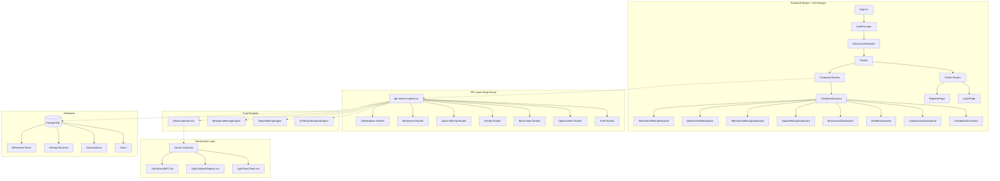
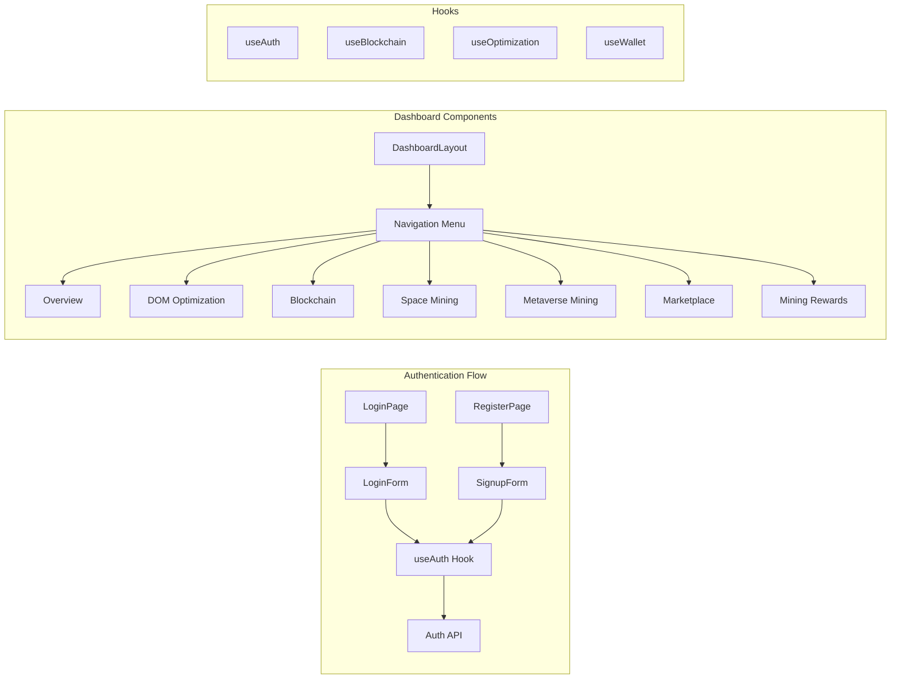
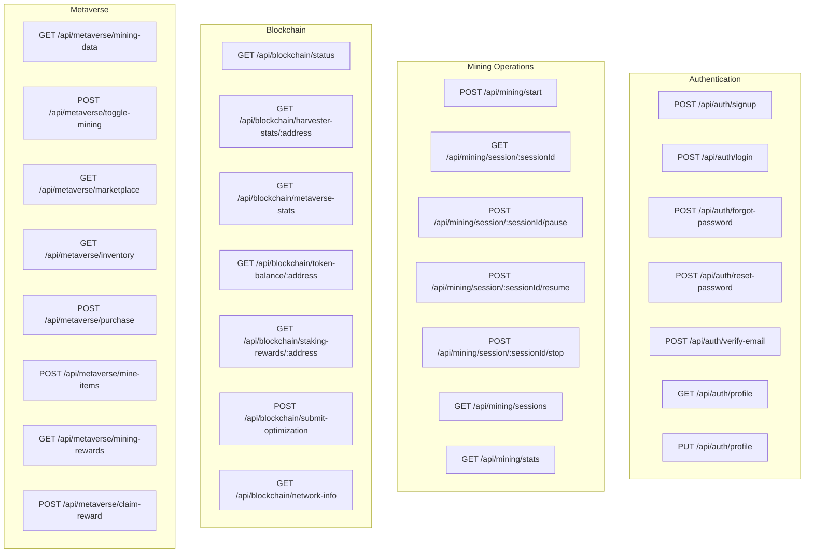
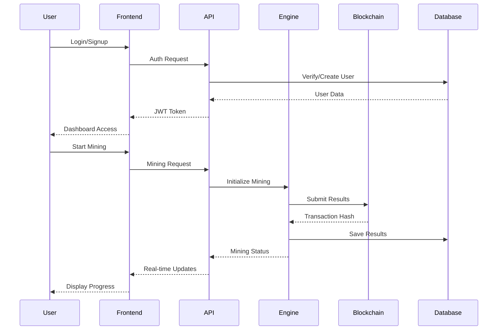
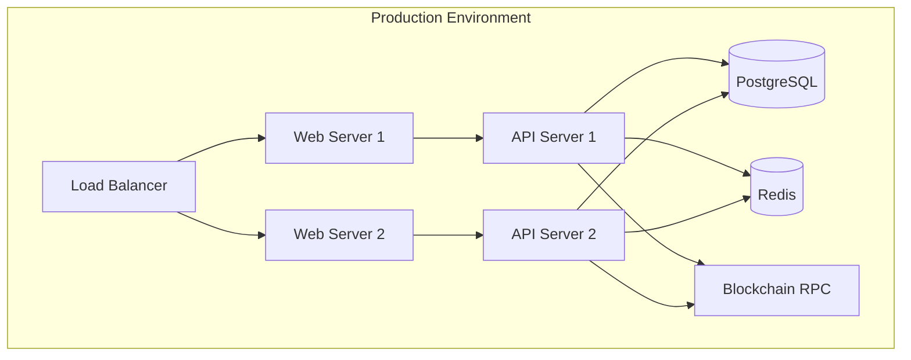

# LightDom Architecture Diagram

## System Overview



## Component Relationships

### Frontend Components



### API Endpoints Structure



## Data Flow



## Technology Stack

### Frontend
- **Framework**: React 18
- **UI Library**: Ant Design
- **State Management**: React Context API
- **Routing**: React Router v6
- **Build Tool**: Vite
- **Language**: TypeScript

### Backend
- **Runtime**: Node.js
- **Framework**: Express.js
- **Database**: PostgreSQL
- **Real-time**: Socket.IO
- **Authentication**: JWT

### Blockchain
- **Network**: Ethereum-compatible
- **Smart Contracts**: Solidity 0.8.20
- **Development**: Hardhat
- **Libraries**: OpenZeppelin

### Infrastructure
- **Container**: Docker
- **Monitoring**: Prometheus/Grafana
- **Logging**: Winston
- **Testing**: Jest/Vitest

## Key Features

1. **DOM Optimization**
   - Spatial analysis
   - Light DOM isolation
   - Performance metrics

2. **Blockchain Integration**
   - Token rewards (LDOM)
   - Staking system
   - Smart contracts

3. **Metaverse Mining**
   - Algorithm discovery
   - Item generation
   - Marketplace trading

4. **Space Mining**
   - 3D DOM structures
   - Metaverse bridges
   - Spatial optimization

## Security Measures

- JWT authentication
- Protected routes
- Input validation
- SQL injection prevention
- XSS protection
- CORS configuration
- Rate limiting
- Secure headers

## Performance Optimizations

- Lazy loading
- Code splitting
- Caching strategies
- Database indexing
- Connection pooling
- Real-time updates
- Optimized queries

## Deployment Architecture



## File Structure

```
LightDom/
├── src/
│   ├── components/
│   │   ├── auth/
│   │   ├── dashboard/
│   │   └── ...
│   ├── hooks/
│   ├── services/
│   ├── api/
│   ├── core/
│   └── App.tsx
├── contracts/
├── database/
├── scripts/
├── public/
└── api-server-express.js
```

This architecture provides a scalable, secure, and performant foundation for the LightDom platform.

