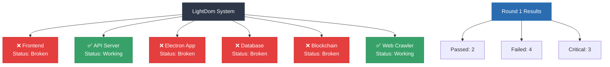

# LightDom System Fix Round 1

## Current System Status

### Mermaid System Diagram:

## Critical Issues Found:
1. Electron not working - not installed globally
2. Using fake API server - simple-api-server.js instead of real one
3. Multiple Vite instances causing port conflicts

## Working Components:
✅ Web Crawler
✅ API Server

## Broken Components:
❌ Frontend
❌ Electron
❌ Database
❌ Blockchain

## Fix Priority:
1. **CRITICAL ISSUES** (3): These break the entire system
2. **FAILED COMPONENTS** (4): These need immediate attention
3. **WORKING COMPONENTS** (2): Keep these stable

## Your Task:
Fix the critical issues and broken components. Focus on:
- Making Electron work (install electron globally if needed)
- Replacing fake API server with real functionality
- Ensuring database connectivity
- Making blockchain integration real
- Fixing frontend accessibility issues

## Constraints:
- Don't break working components
- Test each fix before moving to the next
- Use real data, not mock responses
- Ensure all services can start and connect

## Expected Outcome:
After fixes, run `npm run compliance:check` and see improved results.