# LightDom System Fix Round 5

## Current System Status

### Mermaid System Diagram:

```mermaid

graph TD
    A[LightDom System] --> B[Frontend]
    A --> C[API Server]
    A --> D[Electron App]
    A --> E[Database]
    A --> F[Blockchain]
    A --> G[Web Crawler]
    
    B["⚠️ Frontend<br/>Status: Unknown"]
    C["⚠️ API Server<br/>Status: Unknown"]
    D["⚠️ Electron App<br/>Status: Unknown"]
    E["⚠️ Database<br/>Status: Unknown"]
    F["⚠️ Blockchain<br/>Status: Unknown"]
    G["⚠️ Web Crawler<br/>Status: Unknown"]
    
    H[Round 5 Results] --> I[Passed: 4]
    H --> J[Failed: 2]
    H --> K[Critical: 2]
    
    style A fill:#2d3748,stroke:#4a5568,color:#fff
    style H fill:#2b6cb0,stroke:#3182ce,color:#fff
    
    style X fill:#38a169,stroke:#2f855a,color:#fff
    style X fill:#38a169,stroke:#2f855a,color:#fff
    style X fill:#38a169,stroke:#2f855a,color:#fff
    style X fill:#38a169,stroke:#2f855a,color:#fff
    style X fill:#e53e3e,stroke:#c53030,color:#fff
    style X fill:#e53e3e,stroke:#c53030,color:#fff
    style X fill:#e53e3e,stroke:#c53030,color:#fff
    style X fill:#e53e3e,stroke:#c53030,color:#fff

```

## Critical Issues Found:
1. 🚨    API server using mock/fake data
2. 1

## Working Components:
✅ Testing Electron functionality...
✅ Testing API server...
✅ Testing API server...
✅ Testing frontend...

## Broken Components:
❌ Testing for mock data usage...
❌ Testing for mock data usage...
❌ Testing for mock data usage...
❌ Testing for mock data usage...

## Fix Priority:
1. **CRITICAL ISSUES** (2): These break the entire system
2. **FAILED COMPONENTS** (2): These need immediate attention
3. **WORKING COMPONENTS** (4): Keep these stable

## Your Task:
Fix the critical issues and broken components. Focus on:
- Making Electron work (install electron globally if needed)
- Replacing fake API server with real functionality
- Ensuring database connectivity
- Making blockchain integration real
- Fixing frontend accessibility issues

## Constraints:
- Don't break working components
- Test each fix before moving to the next
- Use real data, not mock responses
- Ensure all services can start and connect

## Expected Outcome:
After fixes, run `npm run compliance:check` and see improved results.