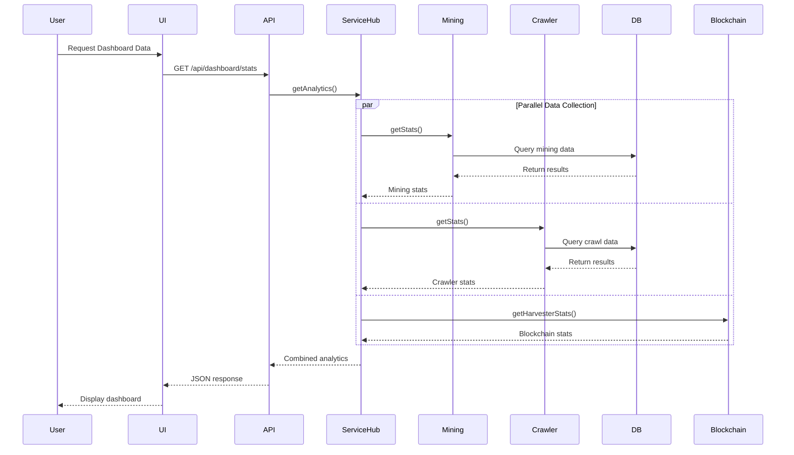
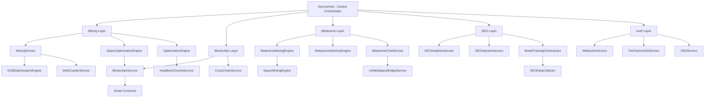
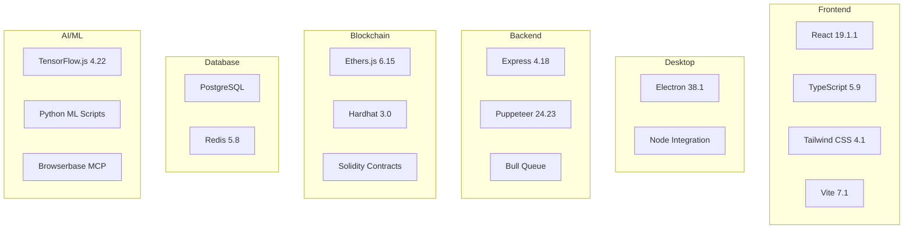
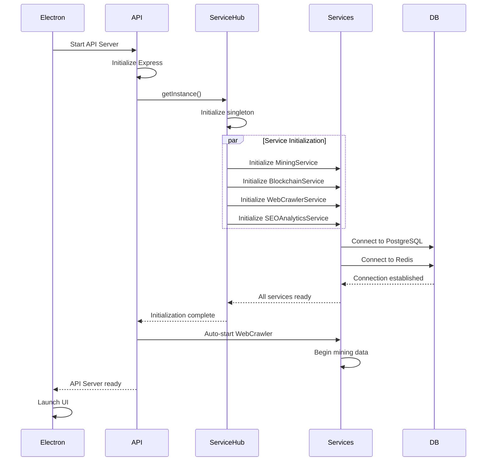
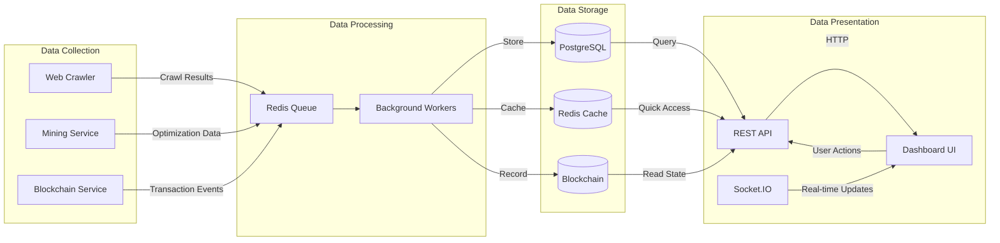

# LightDom Complete System Architecture

## System Overview Diagram

```mermaid
graph TB
    subgraph "Frontend Layer"
        UI[React UI/Dashboard]
        Pages[Pages: Dashboard, Files, Mining, Contracts]
    end

    subgraph "Electron Layer"
        Electron[Electron Main Process]
        IPC[IPC Handlers]
    end

    subgraph "API Gateway"
        Express[Express API Server]
        Routes[API Routes Router]
    end

    subgraph "Service Hub - Central Orchestrator"
        ServiceHub[ServiceHub Singleton]
    end

    subgraph "Core Mining & Optimization Services"
        Mining[MiningService]
        SpaceOpt[SpaceOptimizationEngine]
        DOMOpt[DOMOptimizationEngine]
        SpaceMining[SpaceMiningEngine]
        OptEngine[OptimizationEngine]
    end

    subgraph "Web Crawling Services"
        Crawler[EnhancedWebCrawlerService]
        HeadlessChrome[HeadlessChromeService]
        WebCrawler[WebCrawlerService]
        Browserbase[BrowserbaseService]
    end

    subgraph "Blockchain Services"
        BlockchainSvc[BlockchainService]
        CrossChain[CrossChainService]
        SpaceBridge[SpaceBridgeService]
    end

    subgraph "Metaverse Services"
        MetaMining[MetaverseMiningEngine]
        MetaAlchemy[MetaverseAlchemyEngine]
        MetaChat[MetaverseChatService]
        MetaAnim[MetaverseAnimationService]
        UnifiedBridge[UnifiedSpaceBridgeService]
    end

    subgraph "SEO Services"
        SEOAnalytics[SEOAnalyticsService]
        SEOInjection[SEOInjectionService]
        SEOTraining[SEOTrainingPipelineService]
        ModelTraining[ModelTrainingOrchestrator]
        SEODataCollector[SEODataCollector]
    end

    subgraph "Authentication & Security"
        WebAuthn[WebAuthnService]
        TwoFactor[TwoFactorAuthService]
        SSO[SSOService]
        PasswordMgr[PasswordManagerService]
    end

    subgraph "Payment & Economy"
        Payment[PaymentService]
        Economy[LDOMEconomyService]
        Wallet[WalletService]
    end

    subgraph "Data & Storage Layer"
        DB[(PostgreSQL)]
        Redis[(Redis Cache & Queue)]
        Blockchain[(Blockchain Network)]
        IPFS[(IPFS Storage)]
    end

    subgraph "Background Services"
        TaskMgr[TaskManager]
        AutoOrch[AutomationOrchestrator]
        Monitor[MonitoringService]
        BackgroundWorker[BackgroundWorkerService]
        Gamification[GamificationEngine]
    end

    subgraph "Database Services"
        CrawlerDB[CrawlerDatabaseService]
        CrawlerPersist[CrawlerPersistenceService]
        DBIntegration[DatabaseIntegration]
    end

    %% Frontend to Electron
    UI --> Electron
    Pages --> UI

    %% Electron to API
    Electron --> IPC
    IPC --> Express

    %% API to ServiceHub
    Express --> Routes
    Routes --> ServiceHub

    %% ServiceHub to Core Services
    ServiceHub --> Mining
    ServiceHub --> SpaceOpt
    ServiceHub --> BlockchainSvc
    ServiceHub --> Payment
    ServiceHub --> Gamification
    ServiceHub --> WebAuthn
    ServiceHub --> TwoFactor
    ServiceHub --> SSO
    ServiceHub --> Monitor

    %% Mining Services Integration
    Mining --> DOMOpt
    Mining --> SpaceOpt
    Mining --> OptEngine
    SpaceMining --> SpaceOpt
    SpaceMining --> MetaMining

    %% Crawler Integration
    Crawler --> HeadlessChrome
    WebCrawler --> HeadlessChrome
    OptEngine --> HeadlessChrome
    OptEngine --> WebCrawler

    %% SEO Integration
    SEOAnalytics --> SEODataCollector
    SEOTraining --> ModelTraining
    ModelTraining --> SEODataCollector
    SEOInjection --> Redis

    %% Metaverse Integration
    MetaMining --> SpaceMining
    MetaChat --> CrawlerPersist
    MetaChat --> UnifiedBridge
    UnifiedBridge --> Economy

    %% Blockchain Integration
    BlockchainSvc --> Blockchain
    CrossChain --> Blockchain
    SpaceBridge --> Blockchain
    SpaceOpt --> BlockchainSvc

    %% Database Integration
    CrawlerDB --> DB
    CrawlerPersist --> DB
    DBIntegration --> DB
    Crawler --> CrawlerDB
    Mining --> CrawlerDB
    SEODataCollector --> DB

    %% Queue Integration
    OptEngine --> Redis
    WebCrawler --> Redis
    TaskMgr --> Redis

    %% Automation
    AutoOrch --> TaskMgr
    TaskMgr --> HeadlessChrome

    %% Payment Integration
    Payment --> Economy
    Economy --> Wallet
    Wallet --> BlockchainSvc

    %% Storage
    ModelTraining --> IPFS
    BlockchainSvc --> IPFS

    style ServiceHub fill:#f9f,stroke:#333,stroke-width:4px
    style UI fill:#bbf,stroke:#333,stroke-width:2px
    style Express fill:#bfb,stroke:#333,stroke-width:2px
    style DB fill:#fbb,stroke:#333,stroke-width:2px
    style Blockchain fill:#fbf,stroke:#333,stroke-width:2px
```



## Data Flow Architecture



## Service Integration Map

```mermaid
graph LR
    subgraph "API Endpoints"
        A1[/api/mining/*]
        A2[/api/optimization/*]
        A3[/api/crawler/*]
        A4[/api/blockchain/*]
        A5[/api/metaverse/*]
        A6[/api/seo/*]
        A7[/api/wallet/*]
    end

    subgraph "Services"
        S1[MiningService]
        S2[OptimizationEngine]
        S3[WebCrawlerService]
        S4[BlockchainService]
        S5[MetaverseMiningEngine]
        S6[SEOAnalyticsService]
        S7[WalletService]
    end

    subgraph "Data Sources"
        D1[(crawled_sites)]
        D2[(dom_optimizations)]
        D3[(seo_training_data)]
        D4[(space_bridges)]
        D5[(metaverse tables)]
        D6[Blockchain]
    end

    A1 --> S1
    A2 --> S2
    A3 --> S3
    A4 --> S4
    A5 --> S5
    A6 --> S6
    A7 --> S7

    S1 --> D1
    S1 --> D2
    S2 --> D2
    S3 --> D1
    S3 --> D3
    S4 --> D6
    S5 --> D4
    S5 --> D5
    S6 --> D3
    S7 --> D6
```

## Component Dependency Tree



## Technology Stack



## System Initialization Flow



## Real-Time Data Flow



---

## Key Integration Points

### 1. ServiceHub Integration
**File**: `/src/services/ServiceHub.ts`
- Central orchestrator for all services
- Provides unified interface
- Manages service lifecycle
- Coordinates cross-service operations

### 2. API Gateway
**File**: `/src/api/routes.ts`
- All endpoints route through Express
- Connects API routes to services
- Handles authentication
- Manages request/response flow

### 3. Database Integration
**Files**:
- `/src/services/CrawlerDatabaseService.ts`
- `/src/services/DatabaseIntegration.js`
- Abstracts database operations
- Provides connection pooling
- Manages transactions

### 4. Blockchain Integration
**File**: `/src/services/api/BlockchainService.ts`
- Connects to EVM-compatible chains
- Manages smart contracts
- Records proofs on-chain
- Distributes rewards

### 5. Real-Time Updates
**File**: `/src/services/UnifiedSpaceBridgeService.ts`
- Socket.IO for real-time data
- Event-driven architecture
- Live dashboard updates

---

## Next Steps

This architecture map will guide our systematic integration of all services to the dashboard with real data.
