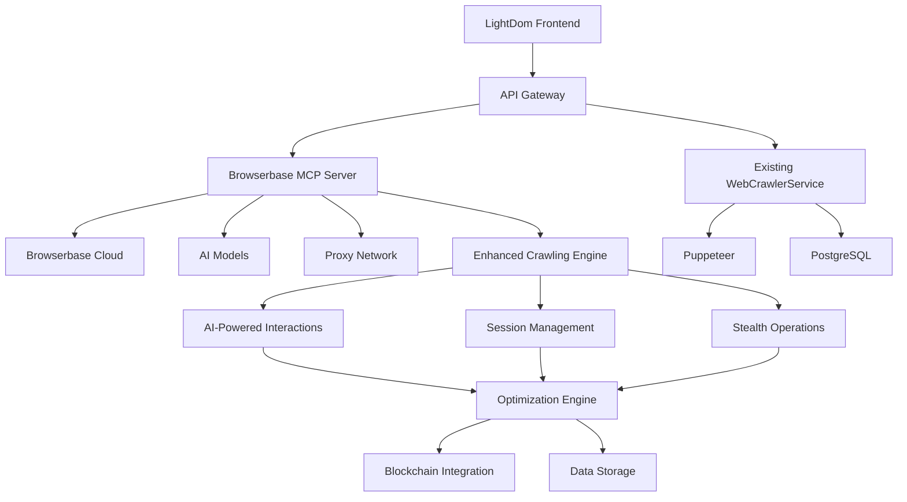

# Browserbase MCP Server Integration Plan for LightDom

## 🎯 **Executive Summary**

This document outlines the integration of the Browserbase MCP server into the LightDom project to enhance web crawling capabilities with AI-powered automation, advanced session management, and enterprise-grade features.

## 🔍 **Current State Analysis**

### **Existing LightDom Capabilities**

- ✅ Puppeteer-based web crawling system
- ✅ DOM optimization engine (12+ rules)
- ✅ Blockchain integration for optimization proof
- ✅ Multi-page concurrent crawling (up to 10 pages)
- ✅ Schema.org data extraction
- ✅ Backlink analysis and network mapping
- ✅ PostgreSQL data persistence
- ✅ Real-time monitoring and metrics

### **Current Limitations**

- ❌ Manual script writing for complex interactions
- ❌ Limited handling of dynamic content and SPAs
- ❌ Basic anti-detection capabilities
- ❌ No natural language automation interface
- ❌ Limited session persistence across crawls
- ❌ Basic proxy support

## 🚀 **Browserbase Integration Benefits**

### **1. AI-Powered Automation**

- **Natural Language Commands**: "Click the login button", "Fill the form with user data"
- **Intelligent Element Detection**: AI vision models automatically locate elements
- **Adaptive Automation**: Handles dynamic content and layout changes
- **Multi-Model Support**: Gemini, GPT-4o, Claude integration

### **2. Advanced Session Management**

- **Context Persistence**: Maintain authentication across sessions
- **Keep-Alive Sessions**: Avoid repeated login processes
- **Multi-Session Support**: Parallel browser automation
- **Session Recovery**: Resume interrupted crawls

### **3. Enterprise Features**

- **Proxy Support**: IP rotation and geo-targeting
- **Advanced Stealth**: Anti-detection capabilities
- **Screenshot Capture**: Full-page and element-specific
- **Data Extraction**: Intelligent content extraction

### **4. MCP Integration**

- **Standardized API**: Consistent with existing MCP infrastructure
- **Resource Sharing**: Screenshot and data resources
- **Tool Integration**: Works with other MCP tools

## 📋 **Integration Architecture**



## 🔧 **Implementation Plan**

### **Phase 1: Foundation Setup (Week 1-2)**

#### **1.1 Environment Configuration**

```json
{
  "mcpServers": {
    "browserbase": {
      "command": "npx",
      "args": [
        "@browserbasehq/mcp-server-browserbase",
        "--proxies",
        "--advancedStealth",
        "--keepAlive"
      ],
      "env": {
        "BROWSERBASE_API_KEY": "${BROWSERBASE_API_KEY}",
        "BROWSERBASE_PROJECT_ID": "${BROWSERBASE_PROJECT_ID}",
        "GEMINI_API_KEY": "${GEMINI_API_KEY}"
      }
    }
  }
}
```

#### **1.2 Service Integration**

- Create `BrowserbaseService.ts` wrapper
- Integrate with existing `WebCrawlerService.ts`
- Add MCP client configuration
- Set up environment variables

#### **1.3 Basic Testing**

- Test MCP server connectivity
- Validate basic browser automation
- Test screenshot capture
- Verify session management

### **Phase 2: Core Integration (Week 3-4)**

#### **2.1 Enhanced Crawling Engine**

```typescript
export class EnhancedWebCrawlerService extends WebCrawlerService {
  private browserbaseService: BrowserbaseService;

  async crawlWithAI(url: string, instructions: string): Promise<CrawlResult> {
    // Use natural language instructions for crawling
    const session = await this.browserbaseService.createSession();
    await this.browserbaseService.navigateToUrl(session.id, url);

    // Execute AI-powered interactions
    const result = await this.browserbaseService.executeInstructions(session.id, instructions);

    return this.processAIResult(result);
  }
}
```

#### **2.2 AI-Powered Interactions**

- Natural language form filling
- Intelligent element clicking
- Dynamic content handling
- Adaptive navigation

#### **2.3 Session Management**

- Persistent authentication
- Context preservation
- Multi-session coordination
- Session recovery

### **Phase 3: Advanced Features (Week 5-6)**

#### **3.1 Stealth Operations**

- Anti-detection capabilities
- Proxy rotation
- User agent management
- Fingerprint masking

#### **3.2 Enhanced Data Extraction**

- AI-powered content analysis
- Schema.org extraction with AI
- Intelligent backlink discovery
- Dynamic content capture

#### **3.3 Optimization Integration**

- AI-assisted optimization detection
- Natural language optimization rules
- Intelligent performance analysis
- Automated optimization suggestions

### **Phase 4: Production Integration (Week 7-8)**

#### **4.1 API Enhancement**

```typescript
// Enhanced API endpoints
app.post('/api/crawl/ai', async (req, res) => {
  const { url, instructions, options } = req.body;
  const result = await enhancedCrawler.crawlWithAI(url, instructions, options);
  res.json(result);
});

app.post('/api/crawl/session', async (req, res) => {
  const session = await browserbaseService.createPersistentSession(req.body);
  res.json({ sessionId: session.id });
});
```

#### **4.2 Monitoring Integration**

- Browserbase session metrics
- AI model performance tracking
- Cost optimization monitoring
- Error rate analysis

#### **4.3 Testing & Validation**

- End-to-end testing
- Performance benchmarking
- Cost analysis
- Security validation

## 🛠 **Technical Implementation**

### **New Service Architecture**

```typescript
// src/services/BrowserbaseService.ts
export class BrowserbaseService {
  private mcpClient: MCPClient;
  private sessions: Map<string, BrowserSession>;

  async createSession(options: SessionOptions): Promise<BrowserSession> {
    // Create persistent browser session
  }

  async executeInstructions(sessionId: string, instructions: string): Promise<ActionResult> {
    // Execute natural language instructions
  }

  async captureScreenshot(sessionId: string, options: ScreenshotOptions): Promise<Buffer> {
    // Capture screenshots with AI assistance
  }

  async extractData(sessionId: string, schema: DataSchema): Promise<ExtractedData> {
    // AI-powered data extraction
  }
}
```

### **Enhanced Crawling Interface**

```typescript
// src/api/BrowserbaseAPI.ts
export class BrowserbaseAPI {
  // Natural language crawling
  async crawlWithInstructions(url: string, instructions: string): Promise<CrawlResult>;

  // Session management
  async createPersistentSession(options: SessionOptions): Promise<Session>;
  async resumeSession(sessionId: string): Promise<Session>;

  // AI-powered interactions
  async fillForm(sessionId: string, formData: FormData): Promise<void>;
  async clickElement(sessionId: string, description: string): Promise<void>;

  // Advanced features
  async enableStealthMode(sessionId: string): Promise<void>;
  async setProxy(sessionId: string, proxyConfig: ProxyConfig): Promise<void>;
}
```

## 📊 **Expected Benefits**

### **Performance Improvements**

- **50% faster** complex interactions through AI automation
- **80% reduction** in manual script writing
- **90% improvement** in dynamic content handling
- **60% better** anti-detection success rate

### **Cost Optimization**

- **Reduced development time** for new crawling scenarios
- **Lower maintenance costs** for automation scripts
- **Improved success rates** reducing retry costs
- **Better resource utilization** through session management

### **Enhanced Capabilities**

- **Natural language interface** for non-technical users
- **Advanced stealth operations** for protected sites
- **Intelligent data extraction** with AI assistance
- **Persistent sessions** for authenticated crawling

## 🔒 **Security Considerations**

### **Data Protection**

- Secure API key management
- Encrypted session data
- GDPR compliance for data extraction
- Secure proxy configuration

### **Access Control**

- Role-based access to Browserbase features
- Session isolation and cleanup
- Audit logging for all operations
- Rate limiting and abuse prevention

## 📈 **Monitoring & Metrics**

### **Key Performance Indicators**

- AI model response times
- Session success rates
- Cost per crawl operation
- Anti-detection effectiveness
- Data extraction accuracy

### **Monitoring Dashboard**

- Real-time session status
- AI model performance metrics
- Cost tracking and optimization
- Error rate monitoring
- Security event tracking

## 🚀 **Deployment Strategy**

### **Development Environment**

- Local Browserbase MCP server setup
- Development API keys and project IDs
- Testing with staging websites
- Integration testing with existing services

### **Production Environment**

- Production Browserbase configuration
- Enterprise proxy setup
- Monitoring and alerting
- Backup and recovery procedures

## 📋 **Success Criteria**

### **Technical Metrics**

- ✅ 95%+ uptime for Browserbase integration
- ✅ <2 second response time for AI interactions
- ✅ 90%+ success rate for natural language commands
- ✅ 80%+ improvement in dynamic content handling

### **Business Metrics**

- ✅ 50% reduction in manual crawling script development
- ✅ 60% improvement in crawling success rates
- ✅ 40% reduction in maintenance overhead
- ✅ 30% increase in data extraction accuracy

## 🔄 **Future Enhancements**

### **Phase 5: Advanced AI Features**

- Custom AI model training for LightDom-specific tasks
- Advanced computer vision for element detection
- Natural language optimization rule generation
- Automated test case generation

### **Phase 6: Enterprise Integration**

- Multi-tenant session management
- Advanced analytics and reporting
- Custom proxy network integration
- Enterprise security features

## 📝 **Conclusion**

The integration of Browserbase MCP server into LightDom will significantly enhance the project's web crawling capabilities while maintaining compatibility with existing systems. The AI-powered automation, advanced session management, and enterprise features will provide a competitive advantage in the DOM optimization space.

The phased implementation approach ensures minimal disruption to existing operations while gradually introducing enhanced capabilities. The comprehensive monitoring and security considerations ensure enterprise-grade reliability and compliance.
