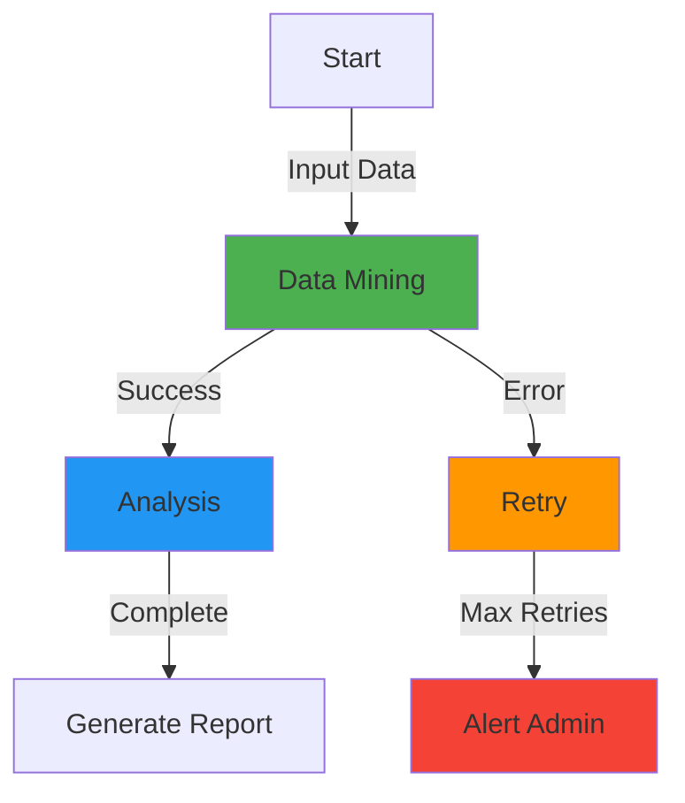

# Design System UX Research - IDE-Styled Applications

## Executive Summary

This document consolidates research on modern IDE-styled applications and their design patterns, focusing on VSCode, Electron, Cursor, Claude, GitHub Copilot, and Cline. The goal is to extract best practices for creating intuitive, workflow-focused interfaces that feel like working in a professional development environment.

## Table of Contents

1. [IDE Design Patterns](#ide-design-patterns)
2. [Motion and Animation](#motion-and-animation)
3. [Sound Design](#sound-design)
4. [Data Visualization](#data-visualization)
5. [Workflow UI Patterns](#workflow-ui-patterns)
6. [Component Architecture](#component-architecture)
7. [Implementation Guidelines](#implementation-guidelines)

---

## IDE Design Patterns

### VSCode Design Philosophy

**Core Principles:**
- **Command Palette First**: Quick access to all functionality (Cmd/Ctrl+Shift+P)
- **Minimalist Interface**: Hide complexity until needed
- **Contextual Actions**: Show relevant options based on current context
- **Keyboard-Centric**: Every action should have a keyboard shortcut
- **Progressive Disclosure**: Advanced features hidden in menus/settings

**Key UI Patterns:**

1. **Activity Bar (Left Sidebar)**
   - Primary navigation icons (Explorer, Search, Source Control, Debug, Extensions)
   - Always visible, single-click to toggle panels
   - Active indicator (highlight/underline)
   - Icon-only by default, tooltip on hover

2. **Panel System**
   - Bottom panels for terminal, problems, output, debug console
   - Tabbed interface for multiple tools
   - Collapsible with keyboard shortcut (Cmd/Ctrl+J)
   - Drag-to-reorder tabs
   - Split view support

3. **Status Bar**
   - Bottom bar with contextual information
   - Left side: file info, git branch, errors/warnings
   - Right side: language mode, encoding, line endings
   - Clickable items open relevant panels/menus

4. **Command Palette**
   - Fuzzy search across all commands
   - Recent commands prioritized
   - Keyboard shortcuts displayed
   - Context-aware filtering

5. **Side Panel**
   - File explorer, search results, source control, extensions
   - Tree view with expandable items
   - Context menus on right-click
   - Drag-and-drop support

**Color System:**
- Dark theme by default (easier on eyes for extended use)
- Syntax highlighting with semantic colors
- Subtle borders (1px, low opacity)
- Accent color for active items
- Status colors: blue (info), yellow (warning), red (error), green (success)

**Typography:**
- Monospace font for code (Consolas, Monaco, 'Courier New')
- Sans-serif for UI (Segoe UI, -apple-system, BlinkMacSystemFont)
- Font sizes: 13px (default), 11px (small UI), 20px+ (headings)
- Line height: 1.4-1.6 for readability

### Electron App Patterns

**Window Management:**
- Native window controls (minimize, maximize, close)
- Frameless windows with custom title bar
- Multi-window support with IPC communication
- Window state persistence (size, position)

**Menu Structure:**
- Native application menu (File, Edit, View, Help)
- Context menus on right-click
- Keyboard shortcuts in menu labels
- Dynamic menu items based on state

**Performance Patterns:**
- Lazy loading of heavy components
- Virtual scrolling for long lists
- Web workers for CPU-intensive tasks
- Efficient IPC between main and renderer

### Cursor IDE Patterns

**AI Integration:**
- Inline code suggestions with ghost text
- Chat panel for conversations
- Command detection in natural language
- Context-aware completions

**UI Innovations:**
- Floating chat interface (Cmd+L)
- Diff view for AI suggestions
- Accept/reject controls for changes
- Multi-file editing awareness

### Claude App Patterns

**Conversation Interface:**
- Full-width prompt input at bottom
- Expandable textarea (auto-grows with content)
- Send button + keyboard shortcut (Cmd/Ctrl+Enter)
- Artifact panel for generated code/documents
- Clean, distraction-free reading

**Prompt Box Design:**
- Large, welcoming input area
- Placeholder text with example prompts
- Attachment support (files, images)
- Token counter/usage indicator
- Model selector dropdown

**Options Below Prompt:**
- Model selection (GPT-4, Claude-3, etc.)
- Temperature/creativity slider
- Context length indicator
- Clear conversation button

**Message Display:**
- Alternating user/assistant messages
- Markdown rendering with syntax highlighting
- Code blocks with copy button
- Collapsible long responses
- Regenerate button for last response

### GitHub Copilot Patterns

**Inline Suggestions:**
- Ghost text inline with cursor
- Tab to accept, Esc to dismiss
- Multiple suggestion navigation (Alt+])
- Partial acceptance (word-by-word)

**Panel Integration:**
- Dedicated Copilot chat panel
- Slash commands (/explain, /fix, /tests)
- File context awareness
- Symbol references in chat

---

## Motion and Animation

### When to Use Motion

**Enhance Understanding:**
- State changes (loading → loaded)
- Element relationships (drag-and-drop, reordering)
- Spatial awareness (where did that panel go?)
- Feedback for actions (button clicked, file saved)

**When NOT to Use:**
- Initial page load (can feel sluggish)
- Rapid repeated actions (autocomplete)
- Critical error messages (need immediate attention)
- Accessibility concerns (respect prefers-reduced-motion)

### Animation Principles

**Duration Guidelines:**
```
Micro-interactions: 100-200ms (hover, focus)
State transitions: 200-300ms (expand/collapse)
Page transitions: 300-500ms (navigation)
Complex animations: 500-800ms (multi-step)
```

**Easing Functions:**
- `ease-out`: Quick start, slow end (entering elements)
- `ease-in`: Slow start, quick end (exiting elements)
- `ease-in-out`: Smooth both ends (state changes)
- `cubic-bezier(0.4, 0.0, 0.2, 1)`: Material Design standard

**Common Patterns:**

1. **Expand/Collapse**
   ```css
   transition: height 200ms ease-out, opacity 200ms ease-out;
   ```

2. **Fade In/Out**
   ```css
   transition: opacity 150ms ease-in-out;
   ```

3. **Slide In**
   ```css
   transform: translateX(-100%);
   transition: transform 300ms cubic-bezier(0.4, 0.0, 0.2, 1);
   ```

4. **Scale/Grow**
   ```css
   transform: scale(0.95);
   transition: transform 200ms ease-out;
   ```

5. **Loading Spinner**
   ```css
   animation: spin 1s linear infinite;
   @keyframes spin {
     from { transform: rotate(0deg); }
     to { transform: rotate(360deg); }
   }
   ```

### Motion for Workflow UI

**Task Progress:**
- Smooth progress bar fill
- Step completion checkmarks
- Pulsing indicators for active tasks
- Subtle bounce when task completes

**Panel Transitions:**
- Slide in from right for new panels
- Fade + slide for overlay modals
- Accordion smooth expand/collapse
- Tab switching with fade crossover

**Interactive Diagrams:**
- Hover to highlight connections
- Click to focus/zoom
- Smooth panning and zooming
- Node addition with scale-in

**Status Changes:**
- Color transition for status badges
- Icon swap with fade through
- Border pulse for errors
- Gentle shake for validation errors

---

## Sound Design

### When to Use Sound

**Appropriate Use Cases:**
- Task completion (workflow finished)
- Error/warning notifications
- Incoming messages/notifications
- Successful actions (file saved, build passed)

**When NOT to Use:**
- Every button click (too annoying)
- Continuous processes (mining, loading)
- Default state (should be opt-in)
- Without visual alternative

### Sound Types

**Success Sounds:**
- Short, bright, ascending tone
- Duration: 100-300ms
- Examples: chime, ding, pop

**Error Sounds:**
- Sharp, attention-grabbing
- Duration: 200-400ms
- Examples: buzz, thud, alert

**Notification Sounds:**
- Gentle, non-intrusive
- Duration: 150-300ms
- Examples: whistle, tap, pulse

**Best Practices:**
- Keep volume moderate (50-70% max)
- Provide mute option
- Respect system sound settings
- Use `.ogg` or `.mp3` format
- Preload sounds for instant playback

### Implementation

```typescript
// Sound utility class
class SoundManager {
  private sounds: Map<string, HTMLAudioElement> = new Map();
  private enabled: boolean = true;

  preload(name: string, path: string) {
    const audio = new Audio(path);
    audio.preload = 'auto';
    this.sounds.set(name, audio);
  }

  play(name: string, volume = 0.5) {
    if (!this.enabled) return;
    
    const audio = this.sounds.get(name);
    if (audio) {
      audio.volume = volume;
      audio.currentTime = 0;
      audio.play().catch(() => {
        // User hasn't interacted yet, ignore
      });
    }
  }

  toggle() {
    this.enabled = !this.enabled;
  }
}

// Usage
const sounds = new SoundManager();
sounds.preload('success', '/sounds/success.mp3');
sounds.preload('error', '/sounds/error.mp3');
sounds.play('success');
```

---

## Data Visualization

### Chart Types and Use Cases

**Workflow Metrics:**

1. **Progress Indicators**
   - Linear progress bars for single tasks
   - Circular progress for overall completion
   - Step indicators for multi-stage workflows
   - Timeline for historical progress

2. **Status Dashboards**
   - Stat cards with large numbers
   - Trend indicators (↑ ↓ arrows)
   - Sparklines for quick trends
   - Donut charts for proportions

3. **Performance Metrics**
   - Line charts for time series
   - Bar charts for comparisons
   - Heatmaps for patterns
   - Scatter plots for correlations

4. **Network Diagrams**
   - Workflow dependency graphs
   - Component relationship maps
   - Schema linking visualizations
   - Architecture diagrams

### Chart Libraries Research

**Recommended Stack:**

1. **Mermaid.js** (Already in project)
   - Flowcharts, sequence diagrams, Gantt charts
   - Markdown-like syntax
   - Great for workflow diagrams
   - Real-time rendering

2. **D3.js** (Already in project)
   - Full control over visualizations
   - Custom, complex charts
   - Interactive diagrams
   - Performance at scale

3. **Ant Design Charts** (Already in project)
   - Pre-built business charts
   - Consistent with Ant Design
   - Easy integration
   - Good defaults

**Chart Best Practices:**

- **Simplicity**: Remove unnecessary elements (gridlines, borders)
- **Color**: Use color purposefully (status, categories, not decoration)
- **Labels**: Direct labeling over legends when possible
- **Interaction**: Hover for details, click to filter/drill-down
- **Responsive**: Scale gracefully on all screen sizes
- **Accessibility**: Provide text alternatives, keyboard navigation

### Real-time Data Display

**Live Indicators:**
- Pulsing dot for active/running
- Animated progress bars
- Auto-updating timestamps
- WebSocket for live updates

**Update Patterns:**
```typescript
// Smooth data transitions
const updateChart = (newData) => {
  chart
    .data(newData)
    .transition()
    .duration(500)
    .ease(d3.easeLinear)
    .attr('y', d => yScale(d.value));
};
```

---

## Workflow UI Patterns

### Workflow List Panel

**Layout Structure:**
```
┌─────────────────────────────────────┐
│ Workflows              [+ Add New]  │
├─────────────────────────────────────┤
│ ┌─ Data Mining Workflow           │
│ │  ● Running - Step 3/5            │
│ │  [⏸] [⏹] [⚙]                    │
│ └─────────────────────────────────┐│
│ ┌─ SEO Analysis                   ││
│ │  ⏸ Paused - Step 2/4            ││
│ │  [▶] [⏹] [⚙]                    ││
│ └─────────────────────────────────┘│
│ ┌─ Content Generator               │
│ │  ■ Stopped                       │
│ │  [▶] [🗑] [⚙]                    │
│ └──────────────────────────────────│
└─────────────────────────────────────┘
```

**Key Components:**
- Collapsible workflow items
- Status indicator (●=running, ⏸=paused, ■=stopped)
- Progress display (current step / total steps)
- Quick actions (play, pause, stop, delete, settings)
- Gear icon for edit in left corner
- Bottom accordion for quick data

### Workflow Wizard Pattern

**Multi-Step Flow:**

**Step 1: Selection**
```
┌─────────────────────────────────────────┐
│ Create New Workflow                     │
├─────────────────────────────────────────┤
│                                         │
│ Select workflow components:             │
│                                         │
│ ☑ Data Mining                           │
│ ☐ SEO Analysis                          │
│ ☑ Content Generation                    │
│ ☐ Link Building                         │
│ ☐ Performance Monitoring                │
│                                         │
│            [Cancel]  [Next →]           │
└─────────────────────────────────────────┘
```

**Step 2: Prompt Input**
```
┌─────────────────────────────────────────┐
│ Configure Workflow                      │
├─────────────────────────────────────────┤
│                                         │
│ Describe your workflow:                 │
│ ┌─────────────────────────────────────┐ │
│ │ I want to mine data from tech blogs ││
│ │ and analyze their SEO strategies... ││
│ │                                     ││
│ │                                     ││
│ └─────────────────────────────────────┘ │
│                                         │
│ [← Back]              [Generate →]      │
└─────────────────────────────────────────┘
```

**Step 3: Diagram Review**
```
┌─────────────────────────────────────────┐
│ Workflow Preview                        │
├─────────────────────────────────────────┤
│                                         │
│      [Mermaid Diagram Here]             │
│                                         │
│   Start → Mine Data → Analyze SEO       │
│              ↓                          │
│          Generate Report                │
│                                         │
│ [← Back]              [Start Workflow]  │
└─────────────────────────────────────────┘
```

### Bottom Accordion Panel

**Collapsed State:**
```
┌─────────────────────────────────────────┐
│ ▼ Quick Stats                           │
└─────────────────────────────────────────┘
```

**Expanded State:**
```
┌─────────────────────────────────────────┐
│ ▲ Quick Stats                           │
├─────────────────────────────────────────┤
│ Last Run: 2 hours ago                   │
│ Success Rate: 94%                       │
│ Avg Duration: 15 min                    │
│ Total Executions: 127                   │
└─────────────────────────────────────────┘
```

### Interactive Workflow Diagram

**Features:**
- Click nodes to configure
- Hover to see details
- Drag to rearrange (if supported)
- Zoom in/out controls
- Real-time status updates
- Error highlighting

**Mermaid Example:**


---

## Component Architecture

### Atomic Design Methodology

**Hierarchy:**

1. **Atoms** (Basic building blocks)
   - Button, Input, Icon, Badge, Avatar
   - Minimal, single-purpose components
   - Highly reusable

2. **Molecules** (Simple combinations)
   - SearchBar (Input + Button + Icon)
   - StatCard (Icon + Title + Value + Trend)
   - FormField (Label + Input + ErrorMessage)

3. **Organisms** (Complex components)
   - WorkflowPanel (List + Actions + Status)
   - Wizard (Steps + Forms + Navigation)
   - Dashboard (Multiple cards + charts)

4. **Templates** (Page layouts)
   - DashboardShell (Sidebar + Header + Content)
   - WizardLayout (Progress + Steps + Actions)

5. **Pages** (Final instances)
   - WorkflowDashboard
   - ComponentBundler
   - SchemaEditor

### Component State Management

**Not Implemented State:**
```typescript
interface ComponentState {
  isImplemented: boolean;
  mockDataEnabled?: boolean;
  disabledReason?: string;
}

// Usage in component
<Button 
  disabled={!isImplemented}
  className={cn({ 'opacity-50 cursor-not-allowed': !isImplemented })}
  title={!isImplemented ? disabledReason : undefined}
>
  Schedule Workflow
</Button>
```

**Visual Indicators:**
- Grey out entire component
- Show "Not Implemented" badge
- Disable interactions
- Show tooltip on hover

### Reusable Pattern: Linked Schemas

**Schema-Driven Components:**
```typescript
interface ComponentSchema {
  id: string;
  type: 'workflow' | 'dashboard' | 'form';
  config: {
    dataSources: SchemaLink[];
    fields: FieldSchema[];
    actions: ActionSchema[];
  };
  linkedSchemas: string[];
}

interface SchemaLink {
  schemaId: string;
  relationship: 'one-to-one' | 'one-to-many' | 'many-to-many';
  joinField?: string;
}
```

**Benefits:**
- Generate components from schema
- Automatic data binding
- Validation built-in
- Consistent structure
- Easy to persist and version

---

## Implementation Guidelines

### Design System Principles

1. **Consistency**
   - Same patterns for same interactions
   - Unified color scheme
   - Consistent spacing (8px grid)
   - Standardized component sizes

2. **Clarity**
   - Clear labels and descriptions
   - Obvious interactive elements
   - Visual hierarchy (size, color, position)
   - Contextual help available

3. **Efficiency**
   - Keyboard shortcuts for common actions
   - Quick access to frequently used features
   - Minimal clicks to complete tasks
   - Smart defaults

4. **Feedback**
   - Immediate response to actions
   - Clear loading states
   - Success/error messages
   - Progress indicators

5. **Flexibility**
   - Customizable layouts
   - Theme options (dark/light)
   - Configurable shortcuts
   - Plugin/extension support

### Component Checklist

For each new component:

- [ ] TypeScript types defined
- [ ] Accessibility (ARIA labels, keyboard nav)
- [ ] Responsive design (mobile, tablet, desktop)
- [ ] Dark mode support
- [ ] Loading states
- [ ] Error states
- [ ] Empty states
- [ ] Documentation with examples
- [ ] Storybook story (if applicable)
- [ ] Unit tests

### Workflow Dashboard Specifics

**Must Have:**
- Panel list of workflows with status
- Add workflow button → wizard
- Start/stop/pause/delete controls
- Edit button (gear icon)
- Quick stats accordion
- Real-time status updates

**Wizard Steps:**
1. Select workflow parts (checkboxes)
2. Enter prompt (Claude-style input)
3. Review generated config/diagram
4. Start or continue editing

**Data to Display:**
- Workflow name and description
- Current status (running, paused, stopped)
- Progress (step X of Y)
- Last run time
- Success rate
- Average duration
- Error count
- Next scheduled run (if scheduled)

### Schema Editor Requirements

**Features:**
- View/edit any field
- JSON syntax highlighting
- Auto-complete for field names
- Validation on change
- Auto-fix malformed JSON
- Undo/redo support
- Save/cancel actions

**Validation:**
- JSON syntax check
- Schema type validation
- Required field check
- Data type validation
- Relationship integrity

---

## Research References

### VSCode
- Architecture: https://github.com/microsoft/vscode
- Extension API: https://code.visualstudio.com/api
- UI Guidelines: Built-in theme definitions

### Electron
- Documentation: https://www.electronjs.org/docs
- Best Practices: https://www.electronjs.org/docs/tutorial/security
- Sample Apps: https://github.com/electron/electron-quick-start

### Cursor
- Design patterns observed from application usage
- AI integration patterns
- Chat interface design

### Claude
- Conversation interface design
- Prompt input patterns
- Artifact generation UI

### GitHub Copilot
- Inline suggestion patterns
- Chat panel integration
- Slash command system

### Cline
- VSCode extension patterns
- Task automation UI
- Agent interaction patterns

---

## Linked Schema References

All research findings are stored with linked schema metadata:

```json
{
  "researchId": "design-system-ux-research",
  "type": "research-document",
  "linkedSchemas": [
    "component-architecture",
    "workflow-patterns",
    "animation-guidelines",
    "sound-design",
    "chart-specifications"
  ],
  "version": "1.0.0",
  "lastUpdated": "2025-11-02"
}
```

This allows querying relationships:
- Find all components using this research
- Track which patterns are implemented
- Link to implementation examples
- Version control for research

---

**Document Status:** Initial comprehensive research  
**Last Updated:** 2025-11-02  
**Next Review:** When implementing specific patterns  
**Contributors:** AI Research Assistant
