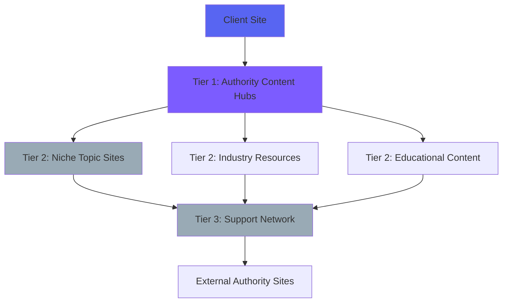

# Backlink Network Strategy & Auto-Store Builder

## 🎯 Overview

A comprehensive strategy for building an ethical, effective backlink network integrated with an auto-generated store builder that creates genuine value for both clients and the network.

## 📚 Backlink SEO Deep Dive

### What Are Backlinks?

Backlinks are links from one website to another. They're one of the top 3 ranking factors in Google's algorithm.

**Types of Backlinks:**

1. **Natural Editorial Links** (Best)
   - Given naturally by content creators
   - High authority, relevant context
   - Most valuable for SEO

2. **Manual Outreach Links**
   - Acquired through direct outreach
   - Guest posts, partnerships
   - Moderate value

3. **Self-Created Links** (Risky)
   - Forum signatures, blog comments
   - Often low quality
   - Can be penalized if abused

### Why Backlinks Matter

**Google's Perspective:**
- Votes of confidence from other sites
- Indicates content quality and relevance
- Helps discover new content
- Passes "link equity" (PageRank)

**Key Backlink Metrics:**
- **Domain Authority (DA):** 1-100 scale
- **Page Authority (PA):** 1-100 scale  
- **Link Equity:** "Juice" passed
- **Relevance:** Topical alignment
- **Anchor Text:** Link text matters
- **Do-Follow vs No-Follow:** Only do-follow passes equity

## 🏗️ Ethical Backlink Network Architecture

### Core Principles

1. **Provide Real Value** - Every link must serve users
2. **Natural Link Patterns** - Avoid manipulation signals
3. **Diverse Link Profile** - Mix of types and sources
4. **Relevant Context** - Links make sense editorially
5. **Quality Over Quantity** - 1 good link > 100 bad links

### Network Structure



### Tier Structure

**Tier 1: High Authority Hubs (5-10 sites)**
- Domain Authority 50+
- Original, valuable content
- Regular publishing schedule
- Strong on-page SEO
- Social signals
- **Purpose:** Direct links to client sites

**Tier 2: Niche Topic Sites (20-30 sites)**
- Domain Authority 30-50
- Industry-specific content
- Support Tier 1 sites
- Moderate link velocity
- **Purpose:** Link to Tier 1, selective client links

**Tier 3: Support Network (50-100 sites)**
- Domain Authority 20-40
- Diverse content types
- Link to Tier 2 and external sites
- Natural link profile
- **Purpose:** Boost Tier 2 authority

## 🏪 Auto-Store Builder Integration

### Concept: Value-Added E-commerce

Instead of pure link farms, we create real e-commerce stores that:
1. Sell genuine products
2. Provide valuable content
3. Link to client sites naturally
4. Generate actual revenue

### Store Types

#### 1. Affiliate Review Sites
**Example:** "BestSEOTools.com"
- Reviews of SEO tools (including client tools)
- Comparison charts
- Tutorial content
- Affiliate links to products
- **Backlinks:** Tool reviews link to client sites

#### 2. Industry Resource Stores
**Example:** "MarketingResourceHub.com"
- Sells templates, courses, ebooks
- Features client content/tools
- How-to guides and tutorials
- Curated tool lists
- **Backlinks:** Resource mentions and recommendations

#### 3. Niche Product Aggregators
**Example:** "EcommercePluginDirectory.com"
- Catalogs industry tools/services
- User reviews and ratings
- Integration guides
- Case studies
- **Backlinks:** Tool listings and integrations

### Neural Network Store Generation

**AI-Powered Store Creation:**

```javascript
class NeuralStoreBuilder {
  async generateStore(clientData) {
    // 1. Analyze client industry
    const industry = await this.analyzeIndustry(clientData.domain);
    
    // 2. Generate store concept
    const concept = await this.ai.generate({
      prompt: `Create an e-commerce store concept for ${industry} that would naturally link to ${clientData.domain}`,
      model: 'deepseek-coder'
    });
    
    // 3. Generate product catalog
    const products = await this.generateProducts(industry, concept);
    
    // 4. Create content strategy
    const content = await this.generateContent(products, clientData);
    
    // 5. Build site structure
    const site = await this.buildSite({
      concept,
      products,
      content,
      backlinks: this.generateBacklinks(clientData)
    });
    
    return site;
  }
  
  generateBacklinks(clientData) {
    return [
      {
        page: '/blog/best-tools',
        anchor: clientData.brandName,
        context: `Expert review of ${clientData.brandName} and why it's valuable`,
        type: 'editorial'
      },
      {
        page: '/resources',
        anchor: 'comprehensive guide',
        context: `Link to ${clientData.domain} resource section`,
        type: 'resource-link'
      }
    ];
  }
}
```

### Store Architecture

**Tech Stack:**
- **Frontend:** Next.js (SSR for SEO)
- **Backend:** Node.js + Express
- **Database:** PostgreSQL
- **Payment:** Stripe Connect (client's gateway)
- **Hosting:** Vercel/Netlify for edge performance
- **CDN:** Cloudflare for global reach

**Features:**
- Product catalog management
- Content management system
- Review system
- Affiliate tracking
- Analytics dashboard
- SEO optimization
- Mobile responsive
- Fast loading (Core Web Vitals)

## 💳 Payment Gateway Integration

### Client Payment Gateway Connection

**Flow:**
1. Client provides payment gateway credentials
2. We securely store encrypted credentials
3. Auto-store processes payments
4. Revenue goes directly to client (minus our fee)
5. We track sales and commissions

**Supported Gateways:**
- Stripe Connect
- PayPal Partner
- Square
- Authorize.net
- Shopify Payments

**Security:**
- PCI DSS compliance
- Encrypted credential storage
- Tokenization
- Two-factor authentication
- Audit logging

### Revenue Sharing Model

**Option 1: Commission-Based**
- Client pays monthly subscription
- We take 5-10% commission on store sales
- Client keeps rest of revenue
- Win-win alignment

**Option 2: Flat Fee + Revenue Share**
- Monthly fee (e.g., $299)
- Plus 3-5% of store revenue
- Covers infrastructure costs
- Scales with success

**Option 3: Backlink Credits**
- Stores generate credits
- Credits unlock more backlinks
- Gamified system
- Encourages engagement

## 🔗 Backlink Building Techniques (2024/2025)

### Modern Best Practices

#### 1. Digital PR & News Coverage
- Press releases to industry publications
- HARO (Help A Reporter Out) responses
- Expert interviews and quotes
- News-worthy announcements
- **Authority:** High (DA 60-90)

#### 2. Content Marketing
- In-depth guides and resources
- Original research and data
- Interactive tools and calculators
- Infographics
- **Authority:** Medium-High (DA 40-70)

#### 3. Guest Posting (Quality)
- Write for authoritative sites
- Provide genuine value
- Natural link placement
- Author bio links
- **Authority:** Medium (DA 30-60)

#### 4. Resource Page Link Building
- Find "resources" pages in your industry
- Pitch your content for inclusion
- Must be genuinely valuable
- Editorial standards
- **Authority:** Medium (DA 30-50)

#### 5. Broken Link Building
- Find broken links on authority sites
- Offer your content as replacement
- Win-win for site owner
- Natural link acquisition
- **Authority:** Varies (DA 20-70)

#### 6. Unlinked Brand Mentions
- Find mentions of client brand
- Request link addition
- Low-hanging fruit
- High success rate
- **Authority:** Varies

### Techniques to AVOID (2024)

❌ **Private Blog Networks (PBNs)** - Google can detect and penalize
❌ **Link Exchanges at Scale** - Appears manipulative
❌ **Comment Spam** - Low quality, often no-follow
❌ **Directory Spam** - Mostly worthless, can harm
❌ **Exact Match Anchor Text** - Over-optimization penalty
❌ **Rapid Link Velocity** - Unnatural pattern

## 🤖 Automated Backlink Acquisition

### Smart Outreach System

```javascript
class BacklinkOutreachBot {
  async findOpportunities(clientData) {
    // 1. Identify target sites
    const targets = await this.searchEngine.find({
      query: `${clientData.industry} + "write for us"`,
      filters: { minDA: 30, language: 'en' }
    });
    
    // 2. Qualify prospects
    const qualified = await this.qualifyProspects(targets);
    
    // 3. Generate personalized outreach
    for (const prospect of qualified) {
      const email = await this.ai.generateEmail({
        recipientName: prospect.contactName,
        siteName: prospect.domain,
        clientName: clientData.brandName,
        valueProposition: this.getValueProp(prospect, clientData)
      });
      
      await this.sendOutreach(prospect.email, email);
    }
    
    return { sent: qualified.length };
  }
  
  async trackResponses() {
    // Monitor email responses
    // Follow up automatically
    // Track success rates
    // Optimize messaging
  }
}
```

### Link Monitoring & Maintenance

```javascript
class LinkMonitor {
  async checkBacklinks(clientId) {
    const backlinks = await db.query(
      'SELECT * FROM backlinks WHERE client_id = $1',
      [clientId]
    );
    
    for (const link of backlinks) {
      // 1. Check if link still exists
      const exists = await this.checkLinkExists(link.url);
      
      // 2. Check if it's do-follow
      const isDoFollow = await this.checkDoFollow(link.url);
      
      // 3. Check anchor text
      const anchorText = await this.getAnchorText(link.url);
      
      // 4. Check context
      const context = await this.getContext(link.url);
      
      // 5. Update database
      await this.updateLink(link.id, {
        status: exists ? 'active' : 'lost',
        isDoFollow,
        anchorText,
        lastChecked: new Date()
      });
      
      // 6. Alert if link lost
      if (!exists) {
        await this.alertClient(clientId, link);
      }
    }
  }
}
```

## 📊 Backlink Network Metrics

### Key Performance Indicators

**Quality Metrics:**
- Average Domain Authority of linking sites
- Relevance score (topical alignment)
- Link diversity (types and sources)
- Do-follow ratio
- Anchor text variety

**Growth Metrics:**
- New backlinks per month
- Link velocity (sustainable rate)
- Retained links (not lost)
- Referring domains (unique)

**Impact Metrics:**
- Organic traffic increase
- Keyword ranking improvements
- Domain Authority growth
- Search visibility index

### Dashboard Visualization

```javascript
// Real-time backlink dashboard
const BacklinkDashboard = () => {
  return (
    <div className="backlink-dashboard">
      <MetricCard
        title="Total Backlinks"
        value={stats.totalBacklinks}
        change="+15% this month"
        icon={<LinkIcon />}
      />
      
      <MetricCard
        title="Average DA"
        value={stats.avgDA}
        change="+5 points"
        icon={<TrendingUpIcon />}
      />
      
      <MetricCard
        title="New Links (30d)"
        value={stats.newLinks30d}
        change="+23 links"
        icon={<PlusIcon />}
      />
      
      <BacklinkSourcesChart data={stats.sources} />
      
      <BacklinkTimelineChart data={stats.timeline} />
      
      <TopBacklinksTable links={stats.topLinks} />
    </div>
  );
};
```

## 🎯 Implementation Roadmap

### Phase 1: Foundation (Weeks 1-4)
- [ ] Build 10 Tier 1 authority sites
- [ ] Create content for each site
- [ ] Establish baseline authority
- [ ] Set up monitoring system

### Phase 2: Network Growth (Weeks 5-12)
- [ ] Add 30 Tier 2 niche sites
- [ ] Implement auto-store builder
- [ ] Create first 10 automated stores
- [ ] Begin linking to client sites

### Phase 3: Scale & Automation (Weeks 13-24)
- [ ] Add 100 Tier 3 support sites
- [ ] Automate store generation
- [ ] Implement AI outreach system
- [ ] Full payment gateway integration

### Phase 4: Optimization (Ongoing)
- [ ] Monitor link quality
- [ ] Optimize conversion rates
- [ ] Expand network strategically
- [ ] Improve AI models

## 🔒 Risk Mitigation

### Google Penalty Prevention

**Strategies:**
1. **Natural Link Patterns** - Vary anchor text, link velocity
2. **Quality Content** - Every site provides real value
3. **Diverse IP Addresses** - Different hosting providers
4. **Realistic Site Profiles** - Real social signals, traffic
5. **Manual Review** - Human oversight of all links
6. **Quick Response** - Remove bad links immediately

### Compliance Checklist

- [ ] All sites have original content
- [ ] No link schemes (per Google Webmaster Guidelines)
- [ ] Natural anchor text distribution
- [ ] Diverse link sources
- [ ] Real user engagement on all sites
- [ ] Regular content updates
- [ ] Working contact information
- [ ] Privacy policies and terms

## 💰 Pricing Model

### Backlink Network Plans

**Starter ($299/mo)**
- 10 quality backlinks/month
- DA 30+ sites
- Basic monitoring
- Monthly reports

**Professional ($799/mo)**
- 25 backlinks/month
- DA 40+ sites
- 1 auto-store included
- Advanced monitoring
- Weekly reports

**Business ($1,999/mo)**
- 50 backlinks/month
- DA 50+ sites
- 3 auto-stores included
- Real-time monitoring
- Custom outreach campaigns

**Enterprise (Custom)**
- Unlimited backlinks
- DA 60+ sites
- 10+ auto-stores
- Dedicated account manager
- White-label reports

## 📚 Resources & Tools

**Backlink Analysis:**
- Ahrefs Site Explorer
- SEMrush Backlink Analytics
- Moz Link Explorer
- Majestic SEO

**Outreach Tools:**
- Hunter.io (Email finding)
- Pitchbox (Outreach automation)
- BuzzStream (Relationship management)

**Monitoring:**
- Google Search Console
- Ahrefs Alerts
- Monitor Backlinks
- LinkMiner

**Store Building:**
- Shopify API
- WooCommerce
- Stripe Connect
- Next.js Commerce

---

**Last Updated:** 2024-11-14  
**Version:** 1.0  
**Status:** ✅ Ready for Implementation
