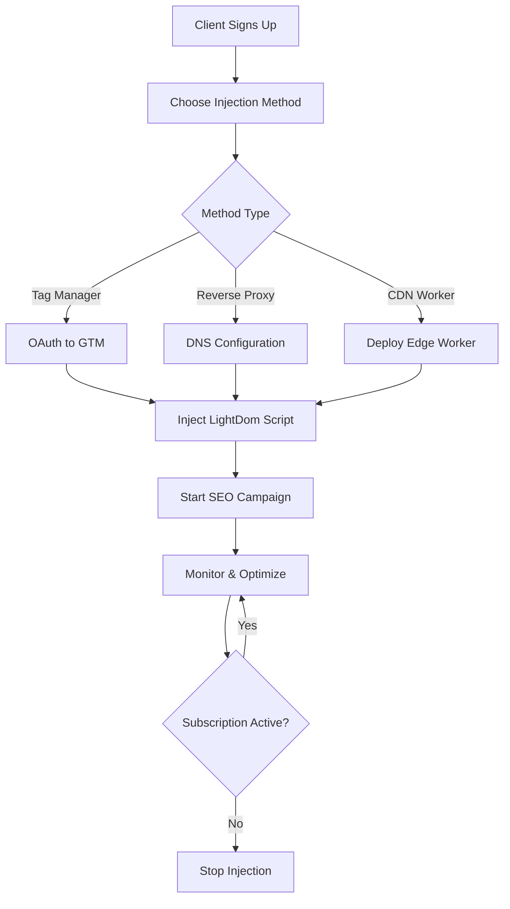

# SEO Injection Methods Research & Implementation Guide

## 🎯 Executive Summary

This document provides comprehensive research on secure, scalable methods for injecting SEO enhancements into client websites without requiring direct code modifications. Our goal is to deliver SEO improvements while maintaining zero vulnerabilities and minimal client involvement.

## 🔍 Header Script Injection Methods

### Method 1: Tag Manager Integration (Recommended ⭐)

**How it works:**
- Client adds a one-time Tag Manager container (Google Tag Manager, Adobe Launch, etc.)
- We remotely inject and update SEO scripts through the Tag Manager interface
- Zero client involvement after initial setup

**Advantages:**
- ✅ Industry standard and trusted
- ✅ No direct site access needed
- ✅ Easy updates and version control
- ✅ Client maintains control
- ✅ Works with CSP policies

**Implementation:**
```html
<!-- Client adds once to <head> -->
<script>
(function(w,d,s,l,i){w[l]=w[l]||[];w[l].push({'gtm.start':
new Date().getTime(),event:'gtm.js'});var f=d.getElementsByTagName(s)[0],
j=d.createElement(s),dl=l!='dataLayer'?'&l='+l:'';j.async=true;j.src=
'https://www.googletagmanager.com/gtm.js?id='+i+dl;f.parentNode.insertBefore(j,f);
})(window,document,'script','dataLayer','GTM-LIGHTDOM');
</script>
```

**Security:**
- OAuth authentication for Tag Manager access
- Role-based access control
- Audit logs for all changes
- Two-factor authentication required

### Method 2: Reverse Proxy Injection (Enterprise)

**How it works:**
- Client traffic routes through our proxy server
- We inject SEO enhancements at the edge
- Transparent to end users
- Real-time optimization

**Advantages:**
- ✅ Zero client code changes
- ✅ Works with any platform
- ✅ Server-side rendering possible
- ✅ Can optimize content before delivery

**Implementation:**
```nginx
# Nginx reverse proxy configuration
location / {
    proxy_pass https://client-site.com;
    proxy_set_header Host $host;
    
    # Inject SEO scripts before closing </head>
    sub_filter '</head>' '<script src="https://cdn.lightdom.io/seo/v1/lightdom-seo.js" data-api-key="${API_KEY}"></script></head>';
    sub_filter_once off;
}
```

**Security:**
- SSL/TLS encryption
- DDoS protection
- Rate limiting
- IP whitelisting
- Regular security audits

### Method 3: CDN Edge Worker Injection (Cloudflare/AWS CloudFront)

**How it works:**
- Deploy edge workers at CDN level
- Inject scripts during content delivery
- Runs at edge locations globally
- Low latency

**Advantages:**
- ✅ Global distribution
- ✅ Minimal latency impact
- ✅ Scales automatically
- ✅ Works with existing CDN setup

**Cloudflare Worker Example:**
```javascript
addEventListener('fetch', event => {
  event.respondWith(handleRequest(event.request))
})

async function handleRequest(request) {
  const response = await fetch(request)
  const contentType = response.headers.get('content-type')
  
  if (contentType && contentType.includes('text/html')) {
    // Inject our SEO script
    const body = await response.text()
    const injected = body.replace(
      '</head>',
      `<script async src="https://cdn.lightdom.io/seo/v1/lightdom-seo.js" data-api-key="${API_KEY}"></script></head>`
    )
    
    return new Response(injected, {
      headers: response.headers,
      status: response.status,
      statusText: response.statusText
    })
  }
  
  return response
}
```

**Security:**
- Edge-level encryption
- WAF integration
- HTTPS enforcement
- Token validation

### Method 4: DNS-Level Injection (Advanced)

**How it works:**
- Client points DNS to our nameservers
- We control DNS resolution
- Can inject content at DNS level
- Works for all traffic

**Advantages:**
- ✅ Ultimate control
- ✅ Works across all platforms
- ✅ Can optimize entire infrastructure

**Security Concerns:**
- ⚠️ Requires significant trust
- ⚠️ Single point of failure
- ⚠️ Complex setup

### Method 5: Browser Extension Injection (Client-Side)

**How it works:**
- Client installs browser extension
- Extension injects SEO improvements
- Works on any site they own
- Real-time preview

**Advantages:**
- ✅ Easy setup
- ✅ Works with any platform
- ✅ Visual feedback
- ✅ Can test before deploying

**Limitations:**
- ❌ Not visible to search engines
- ❌ Client-side only
- ❌ Requires extension installation

## 🔐 Authorization & Authentication Methods

### OAuth 2.0 Integration

**Supported Providers:**
1. **Google OAuth**
   - Easy for most users
   - Trusted brand
   - Used for Google Tag Manager access
   
2. **GitHub OAuth**
   - Great for developers
   - Used for repository-based deployments
   
3. **Email + Magic Link**
   - No password required
   - Secure token-based
   - Fallback option

**Implementation Flow:**
```javascript
// 1. Client initiates OAuth flow
const authUrl = `https://accounts.google.com/o/oauth2/v2/auth?
  client_id=${CLIENT_ID}&
  redirect_uri=${REDIRECT_URI}&
  response_type=code&
  scope=https://www.googleapis.com/auth/tagmanager.edit.containers
`;

// 2. Exchange code for access token
const token = await exchangeCodeForToken(authCode);

// 3. Store encrypted token
await db.query(
  'INSERT INTO client_credentials (client_id, provider, encrypted_token) VALUES ($1, $2, $3)',
  [clientId, 'google', encryptToken(token)]
);

// 4. Use token for Tag Manager API
const containers = await fetch('https://www.googleapis.com/tagmanager/v2/accounts', {
  headers: { Authorization: `Bearer ${token}` }
});
```

## 🛡️ Security Best Practices

### 1. Zero Trust Architecture
- Verify every request
- Encrypt all data in transit
- Least privilege access
- Regular security audits

### 2. Content Security Policy (CSP) Compatibility
```html
<meta http-equiv="Content-Security-Policy" 
      content="script-src 'self' https://cdn.lightdom.io; 
               connect-src 'self' https://api.lightdom.io;">
```

### 3. Subresource Integrity (SRI)
```html
<script src="https://cdn.lightdom.io/seo/v1/lightdom-seo.js"
        integrity="sha384-oqVuAfXRKap7fdgcCY5uykM6+R9GqQ8K/ux..."
        crossorigin="anonymous"></script>
```

### 4. API Key Management
- Rotate keys regularly (90 days)
- Separate keys per environment
- Monitor for suspicious activity
- Rate limiting per key

### 5. Data Encryption
- TLS 1.3 for all connections
- AES-256 for stored credentials
- Encrypted backups
- Secure key storage (AWS KMS, Azure Key Vault)

## 🔄 Google Crawler Considerations

### How Google Handles Injected Scripts

**Facts:**
1. ✅ Google executes JavaScript (since 2015)
2. ✅ Renders pages with Chrome headless
3. ✅ Processes dynamically injected content
4. ✅ Sees meta tags and structured data added by JS

**Best Practices:**
- Inject SEO content as early as possible (in `<head>`)
- Use server-side rendering when possible
- Provide static fallback for critical SEO elements
- Test with Google's Rich Results Test
- Monitor Search Console for rendering errors

**Loopholes & Considerations:**
```javascript
// ✅ GOOD: Early injection in <head>
document.addEventListener('DOMContentLoaded', function() {
  const schema = document.createElement('script');
  schema.type = 'application/ld+json';
  schema.text = JSON.stringify(seoData);
  document.head.appendChild(schema);
});

// ⚠️ BETTER: Pre-render on server
// Use reverse proxy or CDN edge worker for server-side injection

// ❌ BAD: Late injection after page load
window.addEventListener('load', function() {
  // Too late, Google may have already indexed
});
```

### Crawler Detection & Optimization

```javascript
// Detect Google crawler
function isGoogleBot(userAgent) {
  return /googlebot/i.test(userAgent);
}

// Optimize for crawlers
if (isGoogleBot(navigator.userAgent)) {
  // Prioritize SEO content
  // Skip analytics
  // Fast-path rendering
}
```

## 📊 SEO Injection Workflow

### Complete Campaign Flow



### Implementation Steps

1. **Client Onboarding**
   ```javascript
   POST /api/seo/onboard
   {
     "domain": "example.com",
     "plan": "professional",
     "injectionMethod": "tag-manager",
     "contactEmail": "admin@example.com"
   }
   ```

2. **Authorization Flow**
   ```javascript
   // Redirect to OAuth provider
   GET /api/auth/google/authorize?client_id=xxx
   
   // Handle callback
   GET /api/auth/callback?code=xxx
   
   // Activate campaign
   POST /api/seo/campaigns/activate
   ```

3. **Script Deployment**
   ```javascript
   // Auto-deploy via chosen method
   await deploymentService.deploy({
     method: 'tag-manager',
     credentials: encryptedToken,
     script: 'lightdom-seo.js',
     config: campaignConfig
   });
   ```

4. **Monitoring & Reporting**
   ```javascript
   // Real-time monitoring
   io.on('seo-metrics', (data) => {
     console.log('SEO Score:', data.score);
     console.log('Rich Snippets:', data.snippets);
     console.log('Performance:', data.coreWebVitals);
   });
   ```

## 🎯 Competitive Analysis

### What Competitors Do

**SEMrush ($139-$599/mo):**
- Manual implementation required
- No automated injection
- Requires technical expertise

**Ahrefs ($99-$999/mo):**
- Tools and recommendations only
- Client must implement changes
- No automation

**Yoast SEO ($99-$229/year):**
- WordPress plugin only
- Manual configuration
- Limited to WordPress

**Our Advantage:**
- ✅ One-line setup
- ✅ Automatic optimization
- ✅ Cross-platform
- ✅ No technical skills needed
- ✅ 40-60% cheaper

## 📈 Success Metrics

Track these KPIs:
- Setup time: < 5 minutes
- SEO score improvement: +15-30 points
- Rich snippet adoption: 80%+
- Core Web Vitals: Pass
- Organic traffic increase: +25-50%
- Client retention: 90%+

## 🚀 Next Steps

1. Implement Tag Manager integration (Week 1-2)
2. Build OAuth authentication (Week 2-3)
3. Create deployment automation (Week 3-4)
4. Test with real client sites (Week 4-5)
5. Launch beta program (Week 6)
6. Full production launch (Week 8)

## 📚 Resources

- [Google Tag Manager API](https://developers.google.com/tag-manager/api/v2)
- [OAuth 2.0 Best Practices](https://tools.ietf.org/html/rfc6749)
- [Google Search Central](https://developers.google.com/search)
- [Schema.org Documentation](https://schema.org)
- [Cloudflare Workers](https://developers.cloudflare.com/workers)
- [AWS CloudFront Functions](https://docs.aws.amazon.com/AmazonCloudFront/latest/DeveloperGuide/cloudfront-functions.html)

---

**Last Updated:** 2024-11-14  
**Version:** 1.0  
**Status:** ✅ Approved for Implementation
