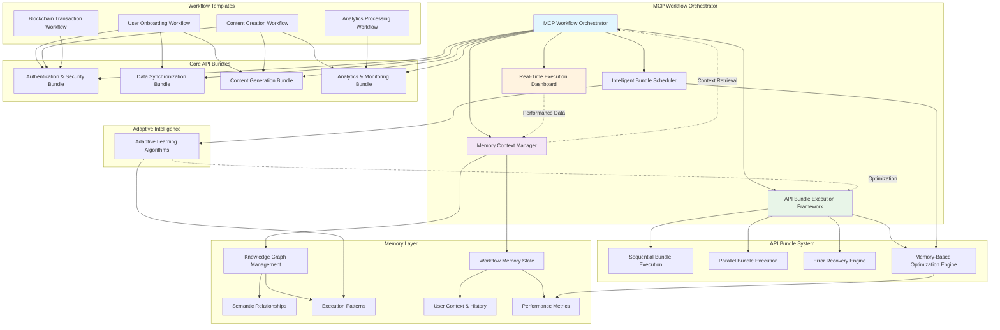
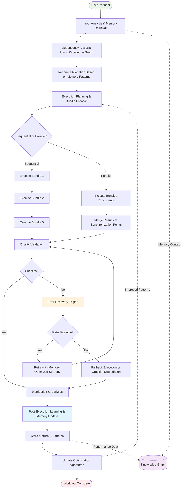
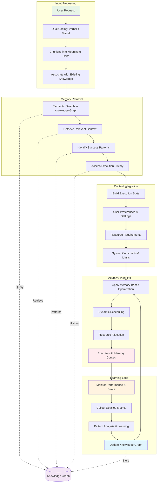
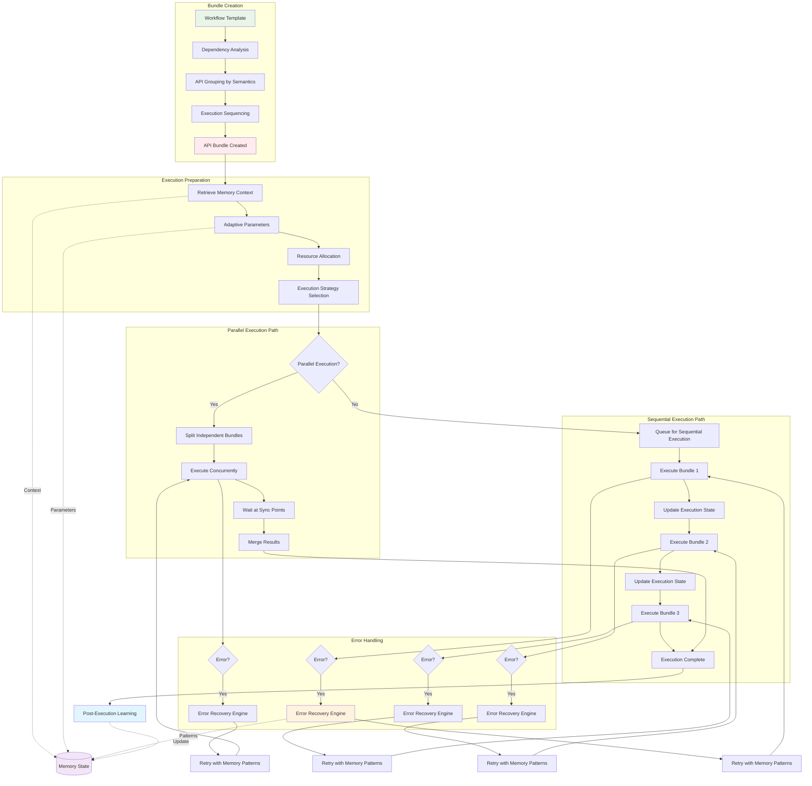
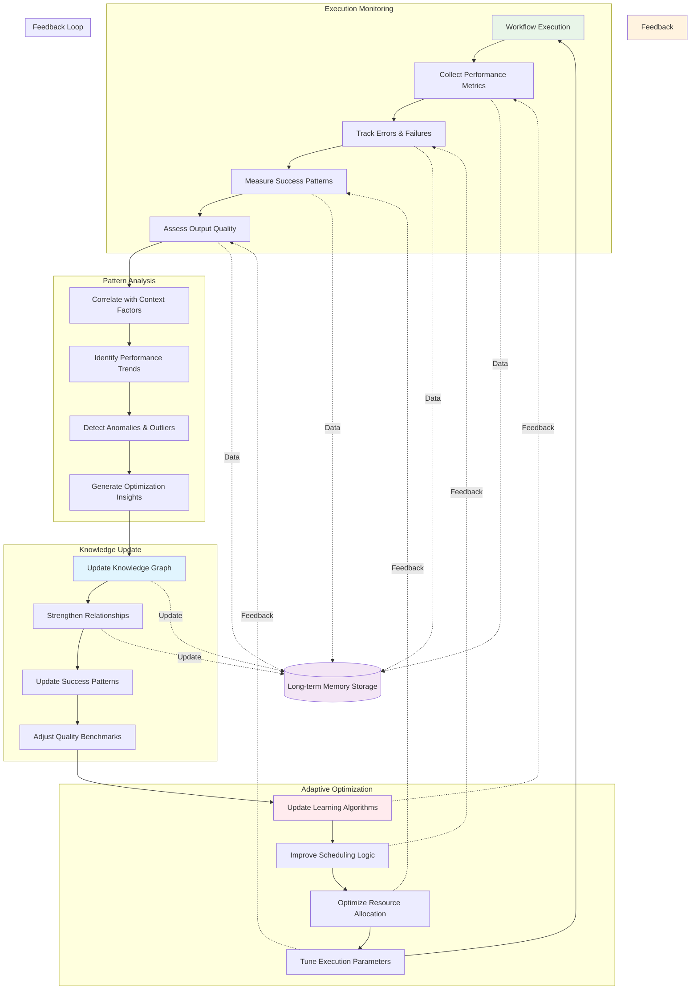

# Memory Workflow MCP Server Process Simulation

## Complete Memory-Driven API Workflow Orchestration System

This document provides a detailed Mermaid chart simulation of the Memory Workflow MCP Server system, showing how memory-driven intelligence orchestrates complex API workflows with adaptive learning and optimization.

## 1. System Architecture Overview

## 2. Complete Workflow Execution Flow

## 3. Memory Context Processing Flow

## 4. API Bundle Execution Detail

## 5. Learning and Adaptation Cycle

## Key Process Flows Explained

### **Memory-Driven Decision Making**
1. **Input Processing**: User requests are encoded using dual coding (verbal + visual) and chunked into meaningful units
2. **Context Retrieval**: Semantic search identifies relevant patterns, preferences, and historical performance
3. **State Building**: Execution state integrates user context, resource requirements, and system constraints
4. **Adaptive Planning**: Memory-based optimization determines scheduling, allocation, and execution strategies

### **API Bundle Orchestration**
1. **Bundle Creation**: Templates are analyzed for dependencies, grouped semantically, and sequenced optimally
2. **Execution Strategy**: Parallel vs sequential execution based on independence and synchronization requirements
3. **Error Resilience**: Memory patterns provide intelligent retry strategies and fallback options
4. **Quality Assurance**: Memory-stored benchmarks validate outputs and trigger corrections

### **Continuous Learning**
1. **Performance Monitoring**: Detailed metrics collection during execution phases
2. **Pattern Analysis**: Correlation analysis identifies trends and optimization opportunities
3. **Knowledge Updates**: Graph relationships strengthened based on success patterns
4. **Adaptive Optimization**: Algorithms, scheduling, and parameters continuously improved

### **Real-Time Adaptation**
- **Context Awareness**: Behavior adapts based on user preferences and system conditions
- **Performance Optimization**: Resource allocation and execution strategies dynamically adjusted
- **Error Prevention**: Memory patterns anticipate and prevent common failure modes
- **Quality Enhancement**: Outputs improved through iterative feedback loops

This comprehensive simulation demonstrates how the Memory Workflow MCP Server creates intelligent, self-optimizing API orchestration that combines cognitive science principles with practical workflow management for unprecedented automation capabilities.
