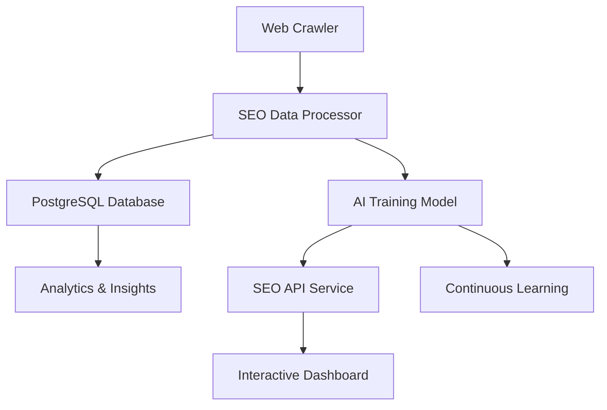

# SEO Data Pipeline & AI Model

A comprehensive AI-powered SEO data pipeline that transforms mined website data into actionable insights and continuously enhances website performance through machine learning.

## 🚀 Features

### Core Components
- **SEO Data Processor**: Transforms raw optimization data into structured SEO insights
- **AI Training Model**: Neural network for continuous performance enhancement
- **SEO API Service**: RESTful API for website analysis and recommendations
- **Interactive Dashboard**: Real-time visualization and management interface
- **Database Schema**: Extended PostgreSQL schema for SEO data storage

### Key Capabilities
- **Real-time SEO Analysis**: Core Web Vitals, content metrics, technical SEO
- **AI-Powered Recommendations**: Machine learning-driven optimization suggestions
- **Score Prediction**: Predict SEO improvements before implementation
- **Domain Comparison**: Competitive analysis and benchmarking
- **Trend Analysis**: Historical performance tracking and insights
- **Continuous Learning**: Self-improving AI model with new data

## 📋 Prerequisites

- Node.js 18+ 
- PostgreSQL 12+
- Python 3.8+ (for TensorFlow.js)
- 4GB+ RAM (for AI model training)

## 🛠️ Installation

1. **Clone the repository**
```bash
git clone https://github.com/lightdom/seo-pipeline.git
cd seo-pipeline
```

2. **Install dependencies**
```bash
npm install
```

3. **Set up the database**
```bash
# Create database
createdb dom_space_harvester

# Run schema setup
npm run setup-db
```

4. **Configure environment variables**
```bash
cp .env.example .env
# Edit .env with your database credentials
```

## 🚀 Quick Start

1. **Start the SEO API service**
```bash
npm start
```

2. **Open the dashboard**
```bash
npm run dashboard
```

3. **Run integration tests**
```bash
npm test
```

## 📊 Architecture



### Data Flow
1. **Data Ingestion**: Web crawler mines website data
2. **Processing**: SEO processor extracts metrics and generates insights
3. **Storage**: Data stored in PostgreSQL with optimized schema
4. **AI Training**: Model learns from historical data
5. **API Service**: RESTful endpoints for analysis and recommendations
6. **Dashboard**: Real-time visualization and management

## 🔧 Configuration

### Environment Variables
```bash
# Database Configuration
DB_HOST=localhost
DB_PORT=5432
DB_NAME=dom_space_harvester
DB_USER=postgres
DB_PASSWORD=your_password

# API Configuration
SEO_API_PORT=3002
API_KEY_SECRET=your_secret_key

# AI Model Configuration
MODEL_PATH=./models/seo-model
TRAINING_BATCH_SIZE=32
TRAINING_EPOCHS=100
```

### API Keys
Generate API keys for accessing the SEO service:
```sql
INSERT INTO api_keys (key_hash, owner_email, requests_limit) 
VALUES ('your_hashed_key', 'user@example.com', 1000);
```

## 📚 API Documentation

### Core Endpoints

#### SEO Analysis
```bash
POST /api/seo/analyze
{
  "url": "https://example.com",
  "includeAIRecommendations": true
}
```

#### Domain Overview
```bash
GET /api/seo/domain/example.com?includePages=true&limit=10
```

#### AI Recommendations
```bash
POST /api/seo/recommendations
{
  "url": "https://example.com",
  "category": "performance",
  "limit": 10
}
```

#### Score Prediction
```bash
POST /api/seo/predict
{
  "url": "https://example.com",
  "optimizations": {
    "performance": {"lcp": 2000, "fid": 80},
    "content": {"titleLength": 50}
  }
}
```

#### Domain Comparison
```bash
POST /api/seo/compare-domains
{
  "domains": ["example.com", "competitor.com"],
  "limit": 10
}
```

#### SEO Trends
```bash
GET /api/seo/trends/example.com?days=30
```

### Authentication
All API requests require an API key:
```bash
curl -H "x-api-key: your_api_key" \
     -H "Content-Type: application/json" \
     -d '{"url":"https://example.com"}' \
     http://localhost:3002/api/seo/analyze
```

## 🤖 AI Model

### Features
- **Neural Network**: Deep learning model for SEO score prediction
- **Feature Engineering**: 16+ optimized features from website data
- **Continuous Learning**: Self-improving with new data
- **Recommendation Engine**: AI-powered optimization suggestions

### Training
```bash
# Train the model
npm run train-model

# Check model status
curl -H "x-api-key: your_api_key" \
     http://localhost:3002/api/seo/model-status
```

### Model Architecture
- **Input Layer**: 16 normalized features
- **Hidden Layers**: 128 → 64 → 32 neurons with dropout
- **Output Layer**: Single neuron (0-100 SEO score)
- **Optimizer**: Adam with L2 regularization

## 📈 Dashboard

The interactive dashboard provides:
- **Real-time Analysis**: Live SEO scoring and recommendations
- **Visual Charts**: Performance trends and comparisons
- **AI Insights**: Machine learning recommendations
- **Domain Management**: Multi-domain analysis and comparison

Access at: `http://localhost:3002/seo-dashboard.html`

## 🧪 Testing

### Integration Tests
```bash
npm test
```

### Test Coverage
- Database connectivity and schema
- SEO data processing pipeline
- AI model training and prediction
- API endpoint functionality
- End-to-end workflows

### Test Results
The test suite validates:
- ✅ Data processing accuracy
- ✅ AI model performance
- ✅ API response times
- ✅ Database integrity
- ✅ End-to-end workflows

## 📊 Database Schema

### Core Tables
- `seo_analysis`: Individual page SEO metrics
- `domain_seo_metrics`: Domain-level aggregations
- `seo_insights`: AI training data
- `seo_recommendations`: Optimization suggestions
- `ai_predictions`: Model predictions
- `seo_trends`: Historical performance data

### Views
- `seo_analysis_summary`: Aggregated analysis data
- `domain_seo_leaderboard`: Domain rankings
- `api_usage_summary`: API usage statistics

## 🔄 Continuous Learning

The AI model continuously improves through:
1. **Data Collection**: New website analyses
2. **Model Retraining**: Periodic model updates
3. **Performance Monitoring**: Accuracy tracking
4. **Recommendation Refinement**: Better optimization suggestions

## 🚀 Deployment

### Production Setup
1. **Database**: Use managed PostgreSQL service
2. **API Server**: Deploy with PM2 or Docker
3. **Monitoring**: Set up health checks and alerts
4. **Scaling**: Use load balancers for high traffic

### Docker Deployment
```bash
# Build image
docker build -t seo-pipeline .

# Run container
docker run -p 3002:3002 \
  -e DB_HOST=your_db_host \
  -e DB_PASSWORD=your_password \
  seo-pipeline
```

## 📝 Contributing

1. Fork the repository
2. Create a feature branch
3. Make your changes
4. Add tests for new functionality
5. Submit a pull request

## 📄 License

MIT License - see [LICENSE](LICENSE) file for details.

## 🆘 Support

- **Documentation**: [Wiki](https://github.com/lightdom/seo-pipeline/wiki)
- **Issues**: [GitHub Issues](https://github.com/lightdom/seo-pipeline/issues)
- **Discussions**: [GitHub Discussions](https://github.com/lightdom/seo-pipeline/discussions)

## 🎯 Roadmap

- [ ] Advanced ML models (BERT, GPT integration)
- [ ] Real-time monitoring and alerting
- [ ] Multi-language support
- [ ] Mobile app development
- [ ] Enterprise features (SSO, RBAC)
- [ ] Performance optimization tools
- [ ] Competitive intelligence features

---

**Built with ❤️ by the LightDom Enterprise team**