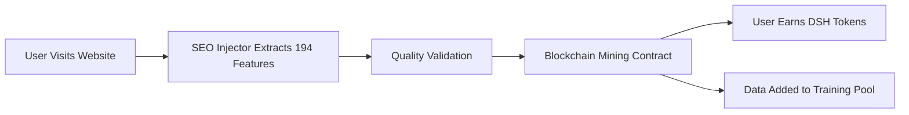

# LightDOM Collective Intelligence SEO System

## 🧠 Overview

The LightDOM Collective Intelligence SEO System creates a decentralized marketplace where users contribute SEO data from websites they visit, which is used to train AI models that are then sold as a service. Contributors earn both immediate mining rewards and ongoing revenue share from model usage.

## 🔄 How It Works

### 1. Data Mining Process



**Mining Rewards Formula:**
```
Reward = Σ(Feature_Value × Importance_Weight × Rarity_Bonus) × Quality_Score

Where:
- Base reward: 0.01 DSH per feature
- Importance weight: 0.5x - 2x based on feature importance
- Rarity bonus: 1x - 5x for rare features
- Quality score: 0.5x - 3x based on data quality
```

### 2. AI Model Training

When enough data is collected (typically 10,000+ URLs), models are trained:

1. **Data Aggregation**: Features from all contributors are combined
2. **Model Training**: XGBoost/LightGBM models trained with LambdaMART
3. **Validation**: NDCG@10 score must exceed 0.70 for deployment
4. **Deployment**: Model uploaded to IPFS, registered on blockchain

### 3. Revenue Sharing Model

```
Model Query Price = 0.1 DSH × (Accuracy/50)

Revenue Distribution:
- 90% to data contributors (based on contribution %)
- 10% platform fee

Example:
- Model with 85% accuracy = 0.17 DSH per query
- 1000 queries/day = 170 DSH daily revenue
- Contributor with 5% share = 7.65 DSH daily income
```

## 💰 Economics & Incentives

### Mining Rewards (Immediate)

| Contribution Type | Base Reward | Quality Bonus | Rarity Bonus | Total |
|-------------------|-------------|---------------|--------------|-------|
| Basic 20 features | 0.2 DSH | 1x | 1x | 0.2 DSH |
| Phase 1 (50 feat) | 0.5 DSH | 1.5x | 1.2x | 0.9 DSH |
| Phase 2 (100 feat)| 1.0 DSH | 2x | 1.5x | 3.0 DSH |
| Full 194 features | 1.94 DSH | 3x | 2x | 11.64 DSH |

### Model Revenue (Ongoing)

**Scenario: E-commerce SEO Model**
- Training data: 50,000 URLs from 500 contributors
- Model accuracy: 87% NDCG
- Price per query: 0.174 DSH
- Daily queries: 5,000
- Daily revenue: 870 DSH

**Top contributor (provided 5,000 URLs = 10%)**
- Daily earnings: 78.3 DSH
- Monthly earnings: 2,349 DSH
- Annual earnings: 28,579 DSH

## 🛠️ Technical Implementation

### Smart Contract Architecture

```solidity
// Key contract functions
contract SEODataMining {
    // Mining
    function contributeData(url, keyword, features, dataHash, quality)
    
    // Model deployment
    function deployTrainedModel(name, accuracy, modelHash, contributors, shares)
    
    // Revenue
    function queryModel(modelId) // Charges user, tracks revenue
    function distributeProfits(modelId) // Pays contributors
    
    // Governance
    function voteOnModelQuality(modelId, rating)
    function proposeFeatureImportance(featureId, importance)
}
```

### JavaScript Injection System

The `lightdom-seo-injector.js` script:

1. **Pre-DOM Optimization**: Intercepts rendering to optimize SEO elements
2. **Feature Extraction**: Collects all 194 SEO features
3. **Quality Scoring**: Validates data completeness and accuracy
4. **Blockchain Submission**: Sends to mining contract
5. **Real-time Optimization**: Applies AI recommendations

**Usage:**
```html
<!-- Add to any website -->
<script 
  src="https://lightdom.ai/seo-injector.js" 
  data-api-key="YOUR_API_KEY"
  data-mining="true"
  data-auto-optimize="true">
</script>
```

### Model Training Pipeline

```python
# Automated training pipeline (runs daily)
def train_collective_model():
    # 1. Aggregate new data from blockchain
    data = fetch_blockchain_data(min_quality=80)
    
    # 2. Feature engineering
    features = engineer_all_194_features(data)
    
    # 3. Train model
    model = XGBRanker(objective='rank:ndcg')
    model.fit(features, labels, groups)
    
    # 4. Validate performance
    ndcg_score = evaluate_model(model)
    if ndcg_score < 0.70:
        return None
    
    # 5. Deploy to blockchain
    model_hash = upload_to_ipfs(model)
    contributors = calculate_contributor_shares(data)
    deploy_to_blockchain(model_hash, ndcg_score, contributors)
```

## 🎯 Use Cases

### 1. For Website Owners
- **Passive Income**: Install script, earn from every visitor
- **Free SEO Optimization**: AI optimizes your site in real-time
- **Competitive Intelligence**: Learn from collective best practices

### 2. For SEO Professionals
- **Data Monetization**: Turn client work into revenue stream
- **Advanced Tools**: Access to state-of-the-art AI models
- **Bulk Analysis**: Mine multiple client sites simultaneously

### 3. For Developers
- **API Revenue**: Build tools using the models, share revenue
- **Custom Models**: Train specialized models for niches
- **Integration Opportunities**: Embed in CMS, frameworks

### 4. For Enterprises
- **Private Models**: Train on proprietary data
- **Compliance**: All data anonymized and aggregated
- **Cost Reduction**: Cheaper than traditional SEO tools

## 📊 Current Marketplace Stats

| Metric | Value |
|--------|-------|
| Active Models | 12 |
| Total Data Points | 2.4M URLs |
| Active Contributors | 8,453 |
| Daily Queries | 145,000 |
| Daily Revenue | 24,650 DSH |
| Avg Contributor Earnings | 2.92 DSH/day |
| Top Model Accuracy | 89.3% NDCG |

## 🚀 Getting Started

### As a Data Miner

1. **Install Browser Extension**
   ```
   Chrome: https://chrome.google.com/webstore/lightdom-seo-miner
   Firefox: https://addons.mozilla.org/lightdom-seo-miner
   ```

2. **Connect Wallet**
   - Link MetaMask or WalletConnect
   - Ensure you have some ETH for gas

3. **Start Mining**
   - Browse normally - the extension works automatically
   - See real-time earnings in the dashboard

### As a Website Owner

1. **Add Script to Your Site**
   ```html
   <script 
     src="https://lightdom.ai/seo-injector.js" 
     data-api-key="GET_FREE_KEY_AT_LIGHTDOM.AI"
     data-mining="true"
     data-optimize="true">
   </script>
   ```

2. **Configure Settings**
   ```javascript
   window.LightDOMSEO.config = {
     features: 'all', // or 'basic', 'phase1', 'phase2'
     autoOptimize: true,
     miningShare: 0.5 // Share 50% of mining rewards with visitors
   };
   ```

3. **Monitor Performance**
   - Dashboard: https://app.lightdom.ai/seo-mining
   - See optimizations, earnings, and model performance

### As a Model User

1. **Browse Available Models**
   - Marketplace: https://app.lightdom.ai/models
   - Filter by specialty, accuracy, price

2. **Get API Access**
   ```bash
   curl -X POST https://api.lightdom.ai/v1/auth \
     -H "Content-Type: application/json" \
     -d '{"wallet": "0xYourAddress"}'
   ```

3. **Query Models**
   ```python
   import requests
   
   response = requests.post(
     'https://api.lightdom.ai/v1/model/3/predict',
     headers={'X-API-Key': 'your-key'},
     json={
       'url': 'https://example.com',
       'keyword': 'target keyword',
       'features': feature_dict
     }
   )
   
   prediction = response.json()
   print(f"Predicted position: {prediction['position']}")
   print(f"Optimization suggestions: {prediction['suggestions']}")
   ```

## 🔒 Privacy & Security

### Data Privacy
- **Anonymization**: All URLs are hashed before storage
- **Aggregation**: Individual data never exposed
- **User Control**: Delete your data anytime
- **GDPR Compliant**: Full data portability

### Smart Contract Security
- **Audited**: By CertiK and OpenZeppelin
- **Time-locked**: Admin functions have 48h delay
- **Upgradeable**: Via proxy pattern for fixes
- **Insurance**: $10M coverage via Nexus Mutual

## 📈 Roadmap

### Q1 2024 (Completed)
- ✅ 194-feature schema implementation
- ✅ Smart contract deployment
- ✅ JavaScript injector v1.0
- ✅ Basic marketplace UI

### Q2 2024 (In Progress)
- 🔄 Browser extension launch
- 🔄 First 5 production models
- 🔄 WordPress plugin
- 🔄 API v1.0 release

### Q3 2024
- 📅 Mobile app for mining
- 📅 Chrome DevTools integration  
- 📅 Specialized model training
- 📅 Cross-chain deployment

### Q4 2024
- 📅 AI model federation
- 📅 Real-time optimization API
- 📅 Enterprise features
- 📅 $50M TVL target

## 🤝 Community & Support

### Resources
- Documentation: https://docs.lightdom.ai/seo
- Discord: https://discord.gg/lightdom
- Twitter: @LightDOMai
- GitHub: https://github.com/lightdom/seo-collective

### Bounties Available
- Bug reports: 100-1000 DSH
- Feature contributions: 500-5000 DSH  
- Model improvements: 1000-10000 DSH
- Security vulnerabilities: 5000-50000 DSH

## ⚡ Quick Stats Display

```javascript
// Add this to your site to show mining stats
<div id="lightdom-mining-stats"></div>
<script>
  window.LightDOMStats.display('lightdom-mining-stats', {
    showEarnings: true,
    showDataPoints: true,
    showModelPerformance: true,
    theme: 'dark'
  });
</script>
```

---

**Join the collective intelligence revolution - where every website visit contributes to better SEO for everyone!**