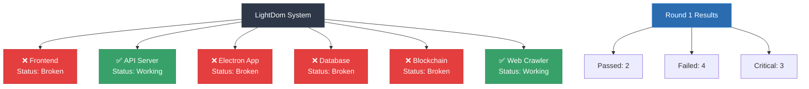

# System Status - Round 1

## Mermaid Chart


## Compliance Results
```
🚀 LightDom Functionality Test
==============================
Testing actual functionality, not just code structure...

✅ Testing Electron functionality...
  🚨 CRITICAL: Electron not working
✅ Testing API server...
  🚨 CRITICAL: Using fake API server
✅ Testing frontend...
  🚨 CRITICAL: Frontend not accessible
✅ Testing for mock data usage...
  🚨 CRITICAL: API server using mock/fake data

📊 FUNCTIONALITY TEST REPORT
============================
📈 Total Checks: 4
✅ Passed: 1
❌ Failed: 0
🚨 CRITICAL: 3
📊 Success Rate: 25.0%

🚨 CRITICAL ISSUES FOUND:
   1. Electron not installed or not in PATH
   2. Using mock API server instead of real one
   3. API server returns fake data - no real functionality

❌ PROJECT STATUS: NOT WORKING - CRITICAL ISSUES
   The application has critical functionality issues.
```

## Critical Issues
1. Electron not working - not installed globally
2. Using fake API server - simple-api-server.js instead of real one
3. Multiple Vite instances causing port conflicts

## Working Components
✅ Web Crawler
✅ API Server

## Broken Components
❌ Frontend
❌ Electron
❌ Database
❌ Blockchain