# System Status - Round 4

## Mermaid Chart

```mermaid

graph TD
    A[LightDom System] --> B[Frontend]
    A --> C[API Server]
    A --> D[Electron App]
    A --> E[Database]
    A --> F[Blockchain]
    A --> G[Web Crawler]
    
    B["⚠️ Frontend<br/>Status: Unknown"]
    C["⚠️ API Server<br/>Status: Unknown"]
    D["⚠️ Electron App<br/>Status: Unknown"]
    E["⚠️ Database<br/>Status: Unknown"]
    F["⚠️ Blockchain<br/>Status: Unknown"]
    G["⚠️ Web Crawler<br/>Status: Unknown"]
    
    H[Round 4 Results] --> I[Passed: 4]
    H --> J[Failed: 2]
    H --> K[Critical: 2]
    
    style A fill:#2d3748,stroke:#4a5568,color:#fff
    style H fill:#2b6cb0,stroke:#3182ce,color:#fff
    
    style X fill:#38a169,stroke:#2f855a,color:#fff
    style X fill:#38a169,stroke:#2f855a,color:#fff
    style X fill:#38a169,stroke:#2f855a,color:#fff
    style X fill:#38a169,stroke:#2f855a,color:#fff
    style X fill:#e53e3e,stroke:#c53030,color:#fff
    style X fill:#e53e3e,stroke:#c53030,color:#fff
    style X fill:#e53e3e,stroke:#c53030,color:#fff
    style X fill:#e53e3e,stroke:#c53030,color:#fff

```


## Compliance Results
```

> lightdom-space-bridge-platform@1.0.0 compliance:check
> node scripts/functionality-test.js

🚀 LightDom Functionality Test
==============================
Testing actual functionality, not just code structure...

✅ Testing Electron functionality...
🎉   ✓ Electron installed: v38.1.2
✅ Testing API server...
🎉   ✓ Using real API server
🎉   ✓ API server can start
✅ Testing frontend...
🎉   ✓ Frontend is accessible
✅ Testing for mock data usage...
🚨   🚨 CRITICAL: API server using mock/fake data

==================================================
📊 FUNCTIONALITY TEST REPORT
==================================================
📈 Total Checks: 5
✅ Passed: 4
❌ Failed: 0
🚨 CRITICAL: 1
📊 Success Rate: 80.0%

🚨 CRITICAL ISSUES FOUND:
   1. API server returns fake data - no real functionality

❌ PROJECT STATUS: NOT WORKING - CRITICAL ISSUES
   The application has critical functionality issues.

==================================================

```

## Critical Issues
1. 🚨    API server using mock/fake data
2. 1

## Working Components
✅ Testing Electron functionality...
✅ Testing API server...
✅ Testing API server...
✅ Testing frontend...

## Broken Components
❌ Testing for mock data usage...
❌ Testing for mock data usage...
❌ Testing for mock data usage...
❌ Testing for mock data usage...
